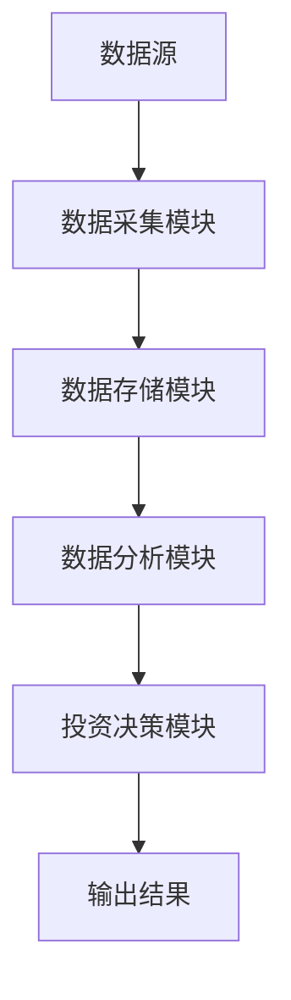
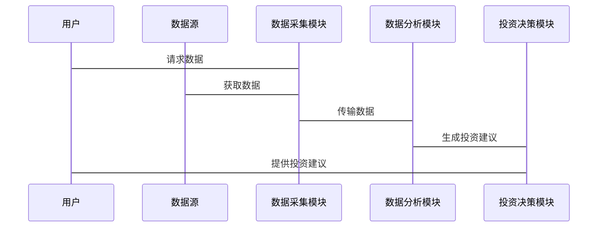

                 


# 费雪的创新企业投资策略

> 关键词：费雪投资策略，创新企业，成长股投资，基本面分析，数学模型

> 摘要：本文深入探讨了费雪的创新企业投资策略，分析了其核心概念、数学模型、系统架构以及实际应用案例。通过详细阐述其理论基础和实践方法，为投资者提供了科学的投资指导。

---

# 第1章: 费雪投资策略的背景与核心概念

## 1.1 费雪投资策略的背景

### 1.1.1 投资领域的现状与挑战

现代投资领域竞争激烈，投资者面临信息过载和市场波动的双重挑战。传统的投资策略往往依赖于市场趋势或短期波动，难以在长期投资中实现稳定收益。在这种背景下，费雪提出了以企业基本面分析为核心的成长股投资策略。

### 1.1.2 费雪投资策略的提出背景

菲利普·费雪（Philip Fisher）是20世纪的投资大师，他提出了“成长股”概念，强调投资于具有持续增长潜力的企业。他的策略在当时传统投资方法的基础上，引入了对企业内在价值和成长性的深入分析。

### 1.1.3 费雪投资策略的核心目标

费雪策略的核心目标是通过识别具有高成长潜力的企业，实现长期稳定的收益。这种方法注重企业的基本面分析，而非市场的短期波动，旨在帮助投资者在长期投资中获得超额回报。

### 1.1.4 费雪策略的边界和外延

费雪策略主要适用于成长型企业，尤其是科技和新兴行业。然而，该策略不适用于周期性企业和夕阳行业，因为这些行业的增长潜力有限，难以通过基本面分析获得稳定收益。

## 1.2 费雪投资策略的核心概念

### 1.2.1 创新企业的定义与特征

创新企业是指那些能够持续推出新产品、服务或商业模式，并在市场中保持竞争优势的企业。其核心特征包括高成长率、创新能力和市场领导地位。

### 1.2.2 费雪策略的基本原理

费雪策略基于以下假设：企业的长期增长潜力是其内在价值的核心驱动因素。通过深入分析企业的财务数据、行业地位和管理团队，投资者可以识别出具有高成长潜力的企业。

### 1.2.3 费雪策略与传统投资策略的区别

传统的价值投资策略关注于低估值股票，而费雪策略则关注于高成长潜力的股票。费雪策略强调企业的基本面分析，而不仅仅是价格评估。

## 1.3 费雪策略的核心要素

### 1.3.1 企业基本面分析

基本面分析包括对企业财务状况、盈利能力、成长能力和行业地位的全面评估。重点指标包括净利润、毛利率、ROE和收入增长率等。

### 1.3.2 企业成长性评估

成长性评估基于企业的历史增长数据和未来增长潜力。高成长性企业通常具有稳定的收入增长率和较高的ROE。

### 1.3.3 投资风险控制

费雪策略通过分散投资和长期持有来控制风险。同时，定期评估企业的基本面变化，确保投资组合的健康。

---

# 第2章: 费雪投资策略的数学模型

## 2.1 费雪策略的基本公式

### 2.1.1 企业价值评估公式

$$企业价值 = 企业收益 \times 市盈率$$

企业收益和市盈率的合理匹配是评估企业价值的关键。高成长企业通常具有较高的市盈率，但需要确保收益的持续增长。

### 2.1.2 企业成长性评估公式

$$成长率 = \frac{收入增长率 + 利润增长率}{2}$$

成长率是衡量企业增长潜力的重要指标。高成长率通常意味着企业具有更大的投资价值。

## 2.2 费雪策略的核心算法

### 2.2.1 收益率计算

$$收益率 = \frac{投资收益}{初始投资} \times 100\%$$

收益率是评估投资回报的重要指标。费雪策略通过长期持有高成长企业，实现稳定的收益增长。

### 2.2.2 风险评估模型

$$风险系数 = \frac{波动率}{平均收益率}$$

风险系数反映了投资的波动性与预期收益的匹配程度。费雪策略通过分散投资和长期持有，降低投资风险。

## 2.3 费雪策略的优化与改进

### 2.3.1 动态调整模型

通过定期评估企业的基本面变化，动态调整投资组合。例如，当企业的收入增长率显著下降时，及时减少对该企业的投资。

### 2.3.2 风险控制算法

结合市场整体波动和企业特定风险，制定动态风险控制策略。例如，在市场下跌时，增加防御性股票的投资比例。

---

# 第3章: 费雪投资策略的系统架构与实现

## 3.1 系统功能模块划分

### 3.1.1 数据采集模块

负责收集企业的财务数据、行业数据和市场数据。数据来源包括公司财报、行业报告和市场指数。

### 3.1.2 数据分析模块

对收集的数据进行清洗、整理和分析。包括计算财务比率、评估成长性和风险系数。

### 3.1.3 投资决策模块

根据分析结果，生成投资建议。例如，识别具有高成长潜力的企业，并推荐买入或卖出决策。

## 3.2 系统架构设计

### 3.2.1 分层架构图



分层架构图展示了系统的整体结构，从数据采集到输出结果的流程。

### 3.2.2 系统交互流程图



系统交互流程图展示了用户与系统之间的数据流动和交互过程。

## 3.3 系统接口设计

### 3.3.1 数据接口规范

定义数据接口的输入和输出格式，确保数据的准确传递。例如，使用JSON格式存储企业的财务数据。

### 3.3.2 投资决策接口

定义投资决策模块的输入参数和输出结果。例如，接收企业的财务数据并返回投资建议。

## 3.4 系统实现代码

### 3.4.1 数据采集模块

```python
import requests

def fetch_data(company):
    url = f"https://api.example.com/financial_data/{company}"
    response = requests.get(url)
    return response.json()
```

### 3.4.2 数据分析模块

```python
def calculate_growth_rate(revenue_growth, profit_growth):
    return (revenue_growth + profit_growth) / 2
```

### 3.4.3 投资决策模块

```python
def investment_recommendation(growth_rate, risk_coefficient):
    if growth_rate > 15 and risk_coefficient < 1.2:
        return "买入"
    else:
        return "观望"
```

---

# 第4章: 费雪投资策略的项目实战

## 4.1 项目背景介绍

选择一个具体的行业，例如科技行业，分析其中的创新企业。以苹果公司为例，展示如何应用费雪策略进行投资分析。

## 4.2 项目实现细节

### 4.2.1 环境安装

安装必要的数据获取工具和分析工具，例如Python和Pandas库。

### 4.2.2 代码实现

编写代码以获取企业的财务数据并进行分析。例如，使用Python的requests库获取数据，并使用Pandas进行数据分析。

### 4.2.3 实际案例分析

分析苹果公司的财务数据，计算其成长率和风险系数，根据结果提供投资建议。

## 4.3 项目小结

通过实际案例分析，验证费雪策略的有效性，并总结在实际应用中的注意事项和优化方向。

---

# 第5章: 费雪投资策略的最佳实践与注意事项

## 5.1 小结

费雪策略通过深入分析企业的基本面和成长性，帮助投资者识别高成长潜力的企业。其核心在于长期投资和价值创造。

## 5.2 注意事项

- **数据质量**：确保数据的准确性和完整性。
- **行业选择**：不同行业具有不同的增长潜力，需谨慎选择。
- **市场波动**：短期市场波动可能影响投资结果，需保持耐心。

## 5.3 拓展阅读

推荐相关书籍和文章，帮助读者深入理解费雪策略及其应用。

---

# 附录: 费雪投资策略的进一步探讨

## 附录A: 费雪策略的数学模型扩展

详细探讨数学模型的扩展应用，例如引入更多财务指标和市场因素。

## 附录B: 费雪策略的系统优化

提出系统架构的优化建议，例如引入机器学习算法进行预测分析。

## 附录C: 费雪策略的案例库

收集更多的实际案例，分析不同企业的投资价值，验证费雪策略的有效性。

---

通过以上目录和内容安排，本文系统地介绍了费雪的创新企业投资策略，从理论基础到实际应用，为投资者提供了全面的指导和实践参考。

