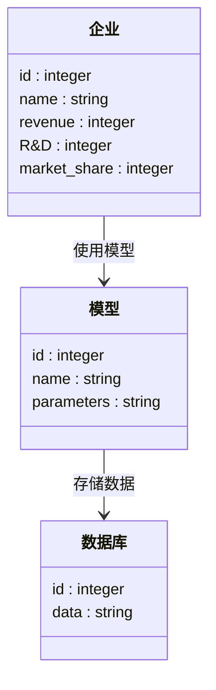
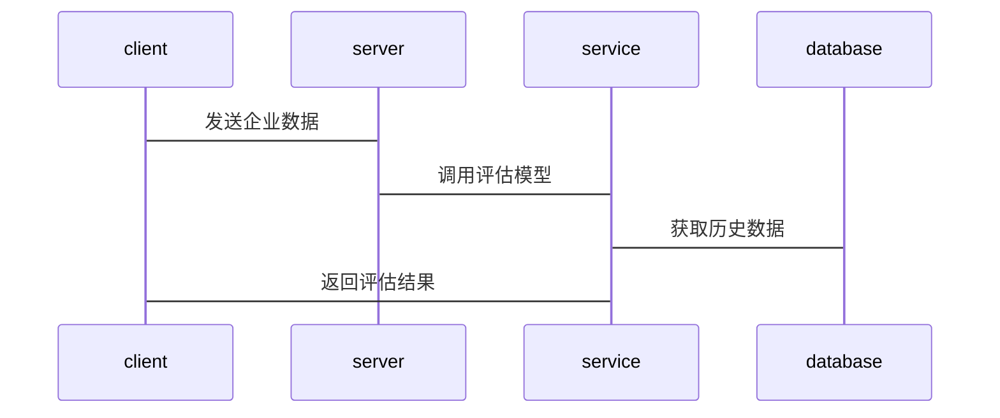

                 


# 费雪的创新企业评估：技术革新时代的投资机会

## 关键词：创新企业评估，费雪投资理论，技术革新，企业估值，成长股投资

## 摘要：  
本文深入探讨了费雪的创新企业评估方法在技术革新时代的应用，结合现代技术对企业价值的影响，分析了创新企业的核心特征和评估指标。通过构建数学模型和算法，提出了创新企业评估的系统化方法，并通过实际案例展示了如何在技术驱动的市场中识别和投资具有持续创新能力的企业。本文旨在为投资者提供一套科学的评估体系，帮助他们在技术革新时代抓住投资机会。

---

# 第1章: 费雪投资理念概述

## 1.1 费雪投资理论的核心思想

### 1.1.1 费雪的成长股投资策略  
费雪是成长股投资的鼻祖，他认为企业应具备持续的盈利能力、稳定的增长率和高效的管理团队。他强调投资于具有强大护城河和持续创新能力的企业，而非仅仅关注短期的市场波动。

### 1.1.2 费雪的企业估值方法  
费雪提出了“合理价格”的概念，认为企业估值应基于其未来现金流的折现值。他强调企业未来的盈利能力是估值的核心，而非仅仅关注当前的账面价值。

### 1.1.3 费雪投资理念的现代意义  
在技术革新的背景下，费雪的理论依然具有重要价值。企业创新能力的评估成为投资决策的关键，而技术驱动的市场变化进一步强化了持续增长的重要性。

## 1.2 技术革新对企业价值的影响

### 1.2.1 技术革新的定义与特征  
技术革新是指在现有技术基础上的改进和创新，能够显著提高生产效率、降低生产成本或创造新的市场需求。其特征包括创新性、可扩展性和高回报潜力。

### 1.2.2 技术革新对企业竞争力的影响  
技术革新能够提升企业的市场地位，增强产品竞争力，并降低生产成本。例如，人工智能技术的应用可以显著提高企业的运营效率和客户体验。

### 1.2.3 技术革新对企业估值的重塑  
技术革新使得企业的未来现金流更具增长潜力，从而提高了企业的估值。例如，一家在人工智能领域具有领先地位的企业，其估值可能远高于传统企业。

## 1.3 创新企业在现代经济中的地位

### 1.3.1 创新企业的定义与特征  
创新企业是指在技术研发、产品设计或商业模式上具有持续创新能力的企业。其特征包括高研发投入、快速的产品迭代和强大的市场适应能力。

### 1.3.2 创新企业与传统企业的对比  
与传统企业相比，创新企业更注重技术研发和产品创新，具有更强的市场竞争力和增长潜力。例如，苹果公司通过持续的技术创新，成为全球最有价值的企业之一。

### 1.3.3 创新企业对经济发展的推动作用  
创新企业是经济增长的主要驱动力，它们通过技术创新和产品创新推动产业升级，创造就业机会，并提升国家竞争力。

## 1.4 本章小结  
本章介绍了费雪的投资理论及其在技术革新背景下的应用，分析了技术革新对企业价值的影响，并探讨了创新企业在现代经济中的地位。这些内容为后续章节的深入分析奠定了基础。

---

# 第2章: 费雪创新企业评估的核心概念

## 2.1 创新企业评估的背景与问题背景

### 2.1.1 创新企业评估的必要性  
随着技术的飞速发展，企业的创新能力成为其核心竞争力。投资者需要准确评估企业的创新潜力，以做出明智的投资决策。

### 2.1.2 技术革新对企业评估的挑战  
技术革新带来了市场的不确定性和竞争的加剧，使得企业评估变得更加复杂。例如，新兴技术的出现可能迅速改变行业的竞争格局。

### 2.1.3 创新企业评估的核心问题  
如何量化企业的创新潜力？如何预测技术革新对企业未来业绩的影响？这些问题成为投资者关注的焦点。

## 2.2 创新企业评估的核心概念与联系

### 2.2.1 创新企业的核心要素  
创新企业的核心要素包括技术实力、研发能力、市场适应能力和管理团队。例如，苹果公司的技术创新能力和强大的管理团队使其成为创新企业的典范。

### 2.2.2 技术革新与企业竞争力的关系  
技术革新是企业竞争力的核心驱动力。例如，人工智能技术的应用可以显著提高企业的生产效率和产品创新能力。

### 2.2.3 创新企业评估的边界与外延  
创新企业评估的边界包括企业的技术实力、研发能力、市场适应能力和管理团队。外延则涉及技术革新对企业未来业绩的影响。

## 2.3 创新企业评估的属性特征对比

### 2.3.1 企业创新能力的衡量维度  
创新能力的衡量维度包括技术创新能力、产品创新能力、商业模式创新能力和管理创新能力。例如，特斯拉在技术创新和产品创新能力方面表现出色。

### 2.3.2 不同创新模式的对比分析  
不同创新模式的对比分析包括技术创新模式、产品创新模式和商业模式创新模式。例如，苹果公司采用的是技术创新和产品创新相结合的模式。

### 2.3.3 创新企业与非创新企业的对比表格  
以下是对创新企业和非创新企业的对比表格：

| **指标**       | **创新企业**          | **非创新企业**          |
|----------------|-----------------------|-------------------------|
| 技术实力       | 强                   | 弱                     |
| 研发投入       | 高                   | 低                     |
| 市场适应能力   | 强                   | 弱                     |
| 管理团队       | 高素质               | 一般                   |

## 2.4 创新企业评估的ER实体关系图

```mermaid
erDiagram
    customer[客户] {
        id : integer
        name : string
        address : string
    }
    product[产品] {
        id : integer
        name : string
        price : integer
    }
    order[订单] {
        id : integer
        order_date : date
        total : integer
    }
    customer -- order : 下订单
    product -- order : 订单包含产品
```

该ER实体关系图展示了创新企业评估中的客户、产品和订单之间的关系。客户下单后，订单包含具体的产品。这种关系帮助企业更好地理解市场需求和产品创新的方向。

## 2.5 本章小结  
本章详细分析了创新企业评估的核心概念，包括创新企业的定义、特征、评估维度以及与非创新企业的对比。通过ER实体关系图，进一步明确了企业的关键要素及其关系。

---

# 第3章: 创新企业评估的算法原理

## 3.1 创新企业评估的数学模型

### 3.1.1 费雪模型的数学公式  
费雪模型主要用于评估企业的未来现金流。其公式为：

$$
\text{企业价值} = \frac{\text{年收益}}{r - g}
$$

其中，r是资本成本，g是收益增长率。

### 3.1.2 技术创新对企业价值的影响公式  
技术创新可以提高企业的收益增长率，从而增加企业价值。例如，假设一家企业的年收益为100万元，资本成本为10%，技术创新使得收益增长率为5%，则企业价值为：

$$
\text{企业价值} = \frac{1,000,000}{0.10 - 0.05} = 20,000,000
$$

### 3.1.3 创新企业评估的综合模型  
综合模型结合了技术创新和企业基本面因素。其公式为：

$$
\text{综合价值} = \text{企业价值} + \text{创新潜力价值}
$$

其中，创新潜力价值基于企业的技术实力、研发投入和市场适应能力。

## 3.2 创新企业评估的算法流程

### 3.2.1 数据收集与预处理  
数据收集包括企业的财务数据、研发投入数据和市场数据。预处理包括数据清洗和标准化。

### 3.2.2 模型训练与参数优化  
使用历史数据训练模型，优化参数以提高预测精度。例如，使用回归分析预测企业的收益增长率。

### 3.2.3 结果分析与评估  
通过交叉验证评估模型的准确性和稳定性。例如，使用ROC曲线评估分类模型的性能。

## 3.3 创新企业评估的算法实现

### 3.3.1 算法实现的代码框架  
```python
import numpy as np
import pandas as pd
from sklearn.linear_model import LinearRegression
from sklearn.metrics import mean_squared_error

# 数据预处理
data = pd.read_csv('enterprise_data.csv')
X = data[['revenue', 'R&D', 'market_share']]
y = data['growth_rate']

# 模型训练
model = LinearRegression()
model.fit(X, y)

# 模型预测
y_pred = model.predict(X)
print('均方误差:', mean_squared_error(y, y_pred))
```

### 3.3.2 关键算法步骤的详细说明  
1. 数据预处理：清洗和标准化数据。  
2. 模型训练：使用线性回归模型预测收益增长率。  
3. 模型预测：基于模型预测企业的收益增长率。  
4. 结果评估：计算均方误差，评估模型的预测精度。

### 3.3.3 算法实现的注意事项  
- 数据质量：确保数据的准确性和完整性。  
- 模型选择：根据实际情况选择合适的模型。  
- 参数优化：通过交叉验证优化模型参数。  

## 3.4 本章小结  
本章介绍了创新企业评估的数学模型和算法流程，详细讲解了模型的实现步骤和注意事项。通过代码示例，展示了如何利用数据驱动的方法评估企业的创新潜力。

---

# 第4章: 创新企业评估的系统分析与架构设计

## 4.1 问题场景介绍

### 4.1.1 技术革新对企业评估的影响  
技术革新使得企业评估更加复杂，需要考虑更多的因素，例如企业的技术创新能力和市场适应能力。

### 4.1.2 项目介绍  
本章将介绍一个创新企业评估系统的开发，旨在帮助投资者评估企业的创新潜力。

## 4.2 系统功能设计

### 4.2.1 领域模型mermaid类图  


该类图展示了企业的属性、模型的参数和数据库的关系。

### 4.2.2 系统架构设计mermaid架构图  
```mermaid
archiecture
    client -- HTTP -- server
    server -- REST API -- service
    service -- database
```

该架构图展示了系统的客户端、服务器、服务和数据库之间的关系。

### 4.2.3 系统接口设计  
系统接口包括数据输入接口、模型调用接口和结果输出接口。例如，投资者可以通过API调用模型，获取企业的创新潜力评估结果。

### 4.2.4 系统交互mermaid序列图  


该序列图展示了系统交互的流程，包括数据传输、模型调用和结果返回。

## 4.3 本章小结  
本章通过系统设计和架构图，展示了创新企业评估系统的实现方案。通过类图、架构图和序列图，明确了系统的功能和交互流程。

---

# 第5章: 创新企业评估的项目实战

## 5.1 环境安装

### 5.1.1 系统环境要求  
- 操作系统：Windows 10或更高版本，或macOS 10.15或更高版本。  
- Python版本：Python 3.6或更高版本。  
- 额外依赖：安装numpy、pandas和scikit-learn库。

### 5.1.2 安装依赖  
运行以下命令安装所需依赖：

```bash
pip install numpy pandas scikit-learn
```

## 5.2 系统核心实现源代码

### 5.2.1 数据预处理代码  
```python
import pandas as pd
import numpy as np

# 读取数据
data = pd.read_csv('enterprise_data.csv')

# 数据清洗
data.dropna(inplace=True)

# 数据标准化
from sklearn.preprocessing import StandardScaler
scaler = StandardScaler()
scaled_data = scaler.fit_transform(data[['revenue', 'R&D', 'market_share']])
```

### 5.2.2 模型训练代码  
```python
from sklearn.linear_model import LinearRegression
from sklearn.metrics import mean_squared_error

# 训练模型
model = LinearRegression()
model.fit(scaled_data, data['growth_rate'])

# 预测结果
y_pred = model.predict(scaled_data)
print('均方误差:', mean_squared_error(data['growth_rate'], y_pred))
```

### 5.2.3 系统实现注意事项  
- 数据清洗：确保数据的准确性和完整性。  
- 模型选择：根据数据特征选择合适的模型。  
- 参数优化：通过交叉验证优化模型参数。

## 5.3 代码应用解读与分析

### 5.3.1 代码功能解读  
上述代码展示了如何利用机器学习模型评估企业的创新潜力。首先，数据预处理包括清洗和标准化；然后，训练模型并预测收益增长率；最后，评估模型的预测精度。

### 5.3.2 代码实现细节  
- 数据清洗：删除缺失值。  
- 数据标准化：对特征进行标准化处理。  
- 模型训练：使用线性回归模型。  
- 模型评估：计算均方误差。

## 5.4 实际案例分析

### 5.4.1 案例背景  
假设我们有一家科技公司，其年收入为1000万元，研发投入为200万元，市场占有率为10%。我们需要评估其收益增长率。

### 5.4.2 数据输入与模型调用  
```python
# 输入数据
input_data = np.array([[1000, 200, 10]])

# 标准化处理
input_scaled = scaler.transform(input_data)

# 预测收益增长率
predicted_growth = model.predict(input_scaled)
print('预测的收益增长率:', predicted_growth[0])
```

### 5.4.3 结果分析  
假设模型预测的收益增长率为15%，则企业的收益增长潜力较高，具有较大的投资价值。

## 5.5 项目小结  
本章通过实际案例分析，展示了如何利用机器学习模型评估企业的创新潜力。通过代码实现，帮助投资者做出更科学的投资决策。

---

# 第6章: 总结与展望

## 6.1 本章小结  
本文详细探讨了费雪的创新企业评估方法在技术革新时代的应用，结合现代技术对企业价值的影响，分析了创新企业的核心特征和评估指标。通过构建数学模型和算法，提出了创新企业评估的系统化方法，并通过实际案例展示了如何在技术驱动的市场中识别和投资具有持续创新能力的企业。

## 6.2 未来展望  
随着技术的不断进步，创新企业评估将更加依赖于数据驱动的方法。未来的研究方向包括：  
1. 开发更复杂的模型，考虑更多的创新因素。  
2. 推动创新企业评估的标准化，建立统一的评估体系。  
3. 结合人工智能技术，进一步提高评估的准确性和效率。  

## 6.3 最佳实践 Tips  
- 投资者应关注企业的技术创新能力和市场适应能力。  
- 在技术革新时代，持续创新能力是企业价值的核心驱动力。  
- 投资者应保持对市场的敏感性，及时调整投资策略。  

## 6.4 结语  
费雪的创新企业评估方法为投资者提供了科学的指导。在技术革新时代，创新企业将继续成为经济增长的主要驱动力。通过本文的分析，投资者可以更好地识别具有持续创新能力的企业，抓住投资机会。

---

# 关键词索引  
- 创新企业评估  
- 费雪投资理论  
- 技术革新  
- 企业估值  
- 成长股投资  

---

通过以上章节的详细分析，我们全面探讨了费雪的创新企业评估方法在技术革新时代的应用，为投资者提供了科学的指导和实践案例。希望本文能为读者在技术驱动的市场中识别和投资具有持续创新能力的企业提供有价值的参考。

