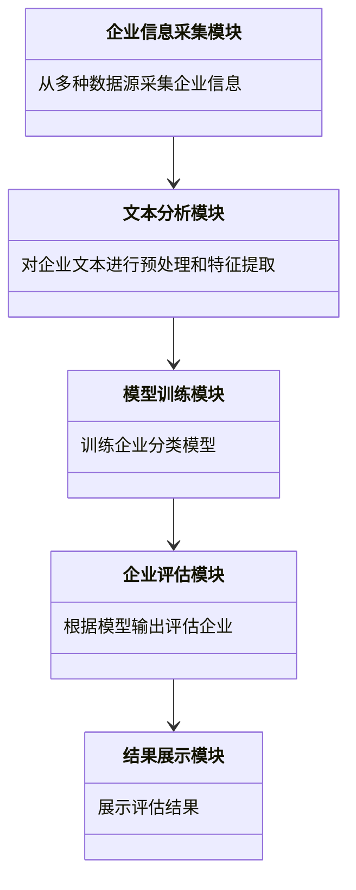
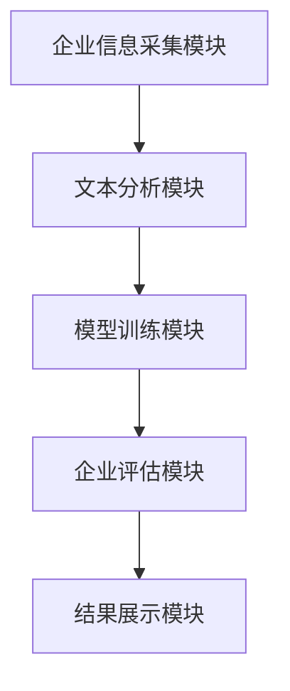
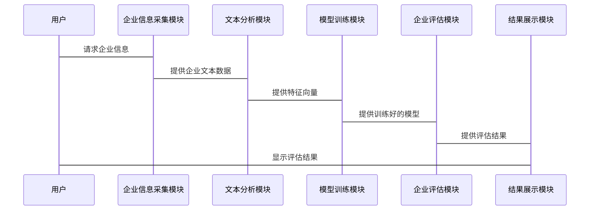

                 


```markdown
# 费雪的创新企业识别：人工智能时代的新标准

> 关键词：费雪投资理念、创新企业识别、人工智能、自然语言处理、机器学习、深度学习、企业评估标准

> 摘要：本文探讨了费雪的投资理念在现代企业识别中的应用，特别是在人工智能时代的背景下。通过分析创新企业的核心特征和评估标准，结合自然语言处理和机器学习等技术，提出了基于人工智能的创新企业识别新标准。文章详细介绍了相关的数学模型、算法原理和系统架构设计，并通过实际案例展示了如何在企业识别中应用这些技术。

---

## 第一部分: 费雪的创新企业识别背景与概述

### 第1章: 费雪投资理念与创新企业识别

#### 1.1 费雪投资理念的核心思想

##### 1.1.1 费雪的成长股投资理论
费雪的成长股投资理论强调选择具有持续增长潜力的企业，重点关注企业的盈利能力和成长性。他认为，投资的成功在于找到那些能够不断自我改造和创新的企业。

##### 1.1.2 费雪对企业基本面的重视
费雪认为，企业的基本面是决定其长期价值的关键因素。他提出了“护城河”概念，认为具有强大竞争优势的企业能够在市场中长期保持领先地位。

##### 1.1.3 费雪投资理念的现代意义
在人工智能时代，费雪的投资理念需要结合现代技术手段进行创新。通过大数据和机器学习技术，可以更精准地识别具有成长潜力的企业。

#### 1.2 人工智能在企业识别中的应用

##### 1.2.1 人工智能技术的现状
人工智能技术的发展为企业识别提供了新的工具和方法。通过自然语言处理、机器学习和深度学习等技术，可以自动化地从海量数据中提取有用信息。

##### 1.2.2 人工智能在企业识别中的潜力
人工智能可以帮助投资者更高效地筛选企业，发现潜在的成长股。通过分析企业的文本信息、财务数据和市场表现，可以更准确地评估企业的成长潜力。

##### 1.2.3 费雪理念与人工智能的结合
结合费雪的成长股投资理念和人工智能技术，可以构建一个智能化的企业识别系统，帮助投资者快速找到具有成长潜力的创新企业。

### 第2章: 创新企业的核心特征与评估标准

#### 2.1 创新企业的定义与分类

##### 2.1.1 创新企业的定义
创新企业是指那些在技术、产品、市场或商业模式等方面具有创新能力的企业。这些企业能够通过持续创新保持竞争优势。

##### 2.1.2 创新企业的分类
创新企业可以分为技术驱动型、市场驱动型和商业模式驱动型。不同类型的企业创新特征不同，评估标准也有所差异。

##### 2.1.3 不同行业创新企业的特点
在不同行业中，创新企业的表现有所不同。例如，科技行业注重技术创新，而消费品行业则更关注产品设计和用户体验。

#### 2.2 创新企业的核心特征

##### 2.2.1 技术创新
技术创新是创新企业的核心特征之一。企业需要不断推出新技术或改进现有技术，以保持竞争优势。

##### 2.2.2 商业模式创新
商业模式的创新可以帮助企业以更低的成本或更高的效率满足市场需求，从而在竞争中占据优势。

##### 2.2.3 市场领导地位
市场领导地位是创新企业的另一个重要特征。具有市场领导地位的企业通常能够影响市场趋势，引领行业发展。

#### 2.3 费雪评估标准的现代扩展

##### 2.3.1 费雪的原始评估标准
费雪的原始评估标准包括企业的盈利能力、成长性和竞争优势等方面。这些标准为企业识别提供了基本框架。

##### 2.3.2 现代评估标准的改进
在人工智能时代，现代评估标准需要结合新的技术手段进行改进。例如，通过自然语言处理技术分析企业的文本信息，可以更准确地评估企业的创新潜力。

##### 2.3.3 标准的动态调整
随着市场的变化和技术的进步，创新企业的评估标准也需要不断调整和优化。动态调整的标准能够更好地适应市场环境的变化。

### 第3章: 人工智能技术在企业识别中的应用

#### 3.1 自然语言处理（NLP）在企业分析中的应用

##### 3.1.1 文本数据的提取与处理
通过自然语言处理技术，可以从企业的财务报告、新闻报道和社交媒体等文本数据中提取有用信息。

##### 3.1.2 企业信息的自动分类
自然语言处理技术可以自动对企业信息进行分类，例如将企业的新闻分为正面、负面或中性。

##### 3.1.3 文本情感分析在企业评价中的应用
通过情感分析技术，可以评估市场对企业的整体看法，从而帮助企业识别潜在的风险和机会。

#### 3.2 机器学习在企业识别中的应用

##### 3.2.1 监督学习在企业分类中的应用
监督学习可以通过对企业历史数据的分析，训练出一个分类模型，用于识别具有成长潜力的企业。

##### 3.2.2 无监督学习在企业数据挖掘中的应用
无监督学习可以发现数据中的隐藏模式，例如通过聚类分析将企业分为不同的类别。

##### 3.2.3 强化学习在企业决策中的应用
强化学习可以通过模拟市场环境，帮助企业做出更优的决策，例如选择最佳的投资时机。

#### 3.3 深度学习技术在企业识别中的创新

##### 3.3.1 图神经网络在企业关系分析中的应用
图神经网络可以分析企业之间的关系，例如供应链、合作伙伴关系等，从而帮助企业识别潜在的风险和机会。

##### 3.3.2 大模型在企业信息处理中的优势
大模型具有强大的语义理解能力，可以更准确地分析企业的文本信息，例如财务报告和新闻报道。

##### 3.3.3 深度学习模型的可解释性问题
深度学习模型的可解释性是一个挑战。为了提高模型的透明度，可以通过可视化技术展示模型的决策过程。

---

## 第二部分: 创新企业识别的数学模型与算法原理

### 第4章: 创新企业识别的数学模型与算法原理

#### 4.1 文本分析模型

##### 4.1.1 基于TF-IDF的文本特征提取
TF-IDF（Term Frequency-Inverse Document Frequency）是一种常用的文本特征提取方法。它通过计算关键词在文档中的重要性，提取出最具代表性的特征。

##### 4.1.2 基于Word2Vec的文本向量化
Word2Vec是一种将文本转换为向量表示的技术。通过Word2Vec，可以将词语映射到高维空间，从而进行语义分析。

##### 4.1.3 基于BERT的企业文本分析模型
BERT（Bidirectional Encoder Representations from Transformers）是一种预训练语言模型，可以用于企业文本的深度分析。通过BERT，可以更准确地理解企业的文本信息。

#### 4.2 企业预测模型

##### 4.2.1 基于逻辑回归的企业分类模型
逻辑回归是一种常用的分类算法。通过训练逻辑回归模型，可以对企业进行分类，例如区分成长股和非成长股。

##### 4.2.2 基于随机森林的企业特征选择
随机森林是一种基于树的集成算法。通过随机森林，可以进行特征选择，找出对企业识别最重要的特征。

##### 4.2.3 基于LSTM的企业时间序列预测
LSTM（Long Short-Term Memory）是一种循环神经网络，适用于时间序列数据的预测。通过LSTM，可以预测企业的未来表现。

#### 4.3 模型优化与调参

##### 4.3.1 超参数优化方法
超参数优化是模型调优的重要步骤。通过网格搜索或随机搜索等方法，可以找到最优的超参数组合。

##### 4.3.2 基于网格搜索的参数调优
网格搜索是一种系统化的超参数优化方法。通过遍历所有可能的参数组合，可以找到最优的模型配置。

##### 4.3.3 基于自动微分的模型优化
自动微分技术可以自动化地计算梯度，从而加速模型的优化过程。通过自动微分，可以更高效地训练深度学习模型。

---

## 第三部分: 系统架构与设计

### 第5章: 系统架构与设计

#### 5.1 系统功能设计

##### 5.1.1 问题场景介绍
在企业识别系统中，我们需要解决如何快速、准确地识别具有成长潜力的企业。通过构建一个智能化的企业识别系统，可以提高投资决策的效率和准确性。

##### 5.1.2 项目介绍
本项目旨在构建一个基于人工智能的企业识别系统，结合自然语言处理和机器学习技术，实现创新企业的自动识别和评估。

##### 5.1.3 系统功能设计
系统功能包括数据采集、文本分析、模型训练、企业评估和结果展示等模块。通过这些模块的协同工作，可以实现创新企业的识别和评估。

#### 5.2 系统架构设计

##### 5.2.1 领域模型mermaid类图


##### 5.2.2 系统架构mermaid架构图


##### 5.2.3 系统接口设计
系统接口设计包括数据接口、模型接口和用户接口。数据接口用于与外部数据源对接，模型接口用于与其他系统模块交互，用户接口用于与最终用户交互。

##### 5.2.4 系统交互mermaid序列图


### 第6章: 项目实战

#### 6.1 环境安装与配置

##### 6.1.1 安装Python环境
```bash
python --version
pip install numpy
pip install scikit-learn
pip install transformers
pip install pytorch
```

##### 6.1.2 安装NLP工具
```bash
pip install spacy
pip install spacy-transformers
pip install sentence-transformers
```

#### 6.2 系统核心实现源代码

##### 6.2.1 文本分析模块
```python
import numpy as np
from sklearn.feature_extraction.text import TfidfVectorizer
from sklearn.model_selection import train_test_split
from sklearn.linear_model import LogisticRegression

# 示例数据
texts = ["The company has strong revenue growth.", 
         "The company faces significant competition.",
         "The company is leading in its market.",
         "The company has innovative products.",
         "The company has weak financial performance."]

labels = [1, 0, 1, 1, 0]  # 1表示正面，0表示负面

# 特征提取
vectorizer = TfidfVectorizer()
X = vectorizer.fit_transform(texts)
X = X.toarray()

# 数据分割
X_train, X_test, y_train, y_test = train_test_split(X, labels, test_size=0.2)

# 模型训练
model = LogisticRegression()
model.fit(X_train, y_train)

# 预测
predicted = model.predict(X_test)
print(predicted)
```

##### 6.2.2 模型训练模块
```python
import torch
import torch.nn as nn
import torch.optim as optim
from torch.utils.data import DataLoader, Dataset

class SimpleRNN(nn.Module):
    def __init__(self, input_size, hidden_size, output_size):
        super(SimpleRNN, self).__init__()
        self.rnn = nn.RNN(input_size, hidden_size)
        self.fc = nn.Linear(hidden_size, output_size)

    def forward(self, x):
        out, _ = self.rnn(x)
        out = self.fc(out)
        return out

# 示例数据
batch_size = 32
input_size = 100
hidden_size = 128
output_size = 1

model = SimpleRNN(input_size, hidden_size, output_size)
criterion = nn.BCEWithLogitsLoss()
optimizer = optim.Adam(model.parameters(), lr=0.001)

# 训练循环
for epoch in range(num_epochs):
    for i, (inputs, labels) in enumerate(train_loader):
        outputs = model(inputs)
        loss = criterion(outputs, labels)
        optimizer.zero_grad()
        loss.backward()
        optimizer.step()
```

#### 6.3 案例分析与详细解读

##### 6.3.1 案例分析
以科技行业为例，分析一家企业的文本信息，使用自然语言处理技术提取特征，然后通过机器学习模型进行分类，评估其是否为创新企业。

##### 6.3.2 实际案例分析
假设我们有一家科技企业的财务报告和新闻报道，通过文本分析和机器学习模型，可以准确地识别出其创新潜力。

##### 6.3.3 详细解读
从数据采集、特征提取、模型训练到结果展示，详细解读每一步的操作和结果。

#### 6.4 项目小结

##### 6.4.1 核心代码实现
总结项目的核心代码实现，包括文本分析模块和模型训练模块。

##### 6.4.2 项目总结
通过本项目的实施，我们成功构建了一个基于人工智能的企业识别系统，能够有效地识别创新企业。

---

## 第四部分: 总结与展望

### 第7章: 总结与展望

#### 7.1 总结

##### 7.1.1 费雪投资理念的现代应用
通过人工智能技术，费雪的投资理念得到了新的应用和发展，特别是在创新企业识别方面。

##### 7.1.2 人工智能技术的优势
人工智能技术提供了强大的工具和方法，能够帮助企业更高效、更准确地识别创新企业。

##### 7.1.3 系统架构与设计的创新
通过系统化的架构设计，我们构建了一个高效、可靠的创新企业识别系统。

#### 7.2 展望

##### 7.2.1 未来技术趋势
未来，随着人工智能技术的不断发展，创新企业识别将更加智能化和自动化。

##### 7.2.2 费雪理念的进一步融合
费雪的投资理念与人工智能技术的融合将更加深入，为企业识别提供更强大的工具和方法。

##### 7.2.3 创新企业识别的未来挑战
尽管人工智能技术带来了许多优势，但创新企业识别仍然面临一些挑战，例如数据质量、模型可解释性等问题。

---

## 第五部分: 最佳实践与注意事项

### 第8章: 最佳实践与注意事项

#### 8.1 最佳实践

##### 8.1.1 数据质量管理
确保数据的准确性和完整性，是创新企业识别系统成功的关键。

##### 8.1.2 模型优化与调优
通过不断优化和调优模型，可以提高系统的准确性和效率。

##### 8.1.3 系统维护与更新
定期维护和更新系统，可以确保系统的稳定性和先进性。

#### 8.2 注意事项

##### 8.2.1 数据隐私与安全
在处理企业数据时，需要注意数据隐私和安全，遵守相关法律法规。

##### 8.2.2 模型的可解释性
模型的可解释性是人工智能技术应用中的一个重要问题，需要在设计和实现中加以考虑。

##### 8.2.3 技术与业务的结合
创新企业识别系统需要技术与业务的结合，确保系统的实用性和有效性。

---

## 第六部分: 拓展阅读与参考文献

### 第9章: 拓展阅读与参考文献

#### 9.1 拓展阅读

##### 9.1.1 自然语言处理领域的最新研究
阅读自然语言处理领域的最新研究，了解最新的技术进展。

##### 9.1.2 机器学习在金融领域的应用
阅读机器学习在金融领域的应用，了解如何将这些技术应用到创新企业识别中。

##### 9.1.3 费雪投资理念的现代发展
研究费雪投资理念的现代发展，了解其在当今市场中的应用。

#### 9.2 参考文献
- 费雪《成长股的十四条选股标准》
- LeCun et al. "Deep Learning" (2015)
- BERT: Pre-training of Deep Bidirectional Transformers for NLP (2018)
- PyTorch官方文档
- Keras官方文档
```

---

**本文目录结束，接下来是正文内容。**
```

