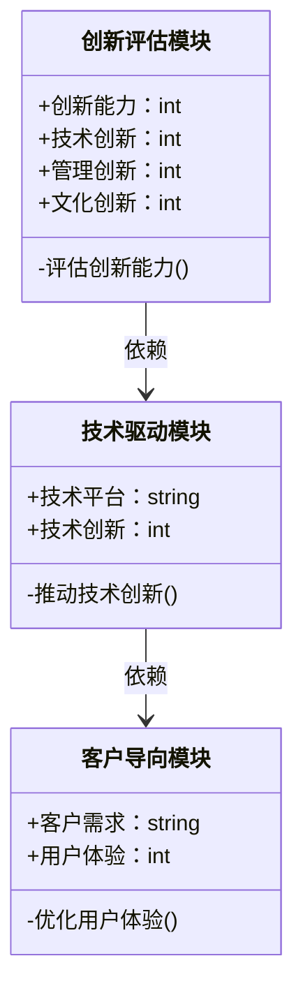
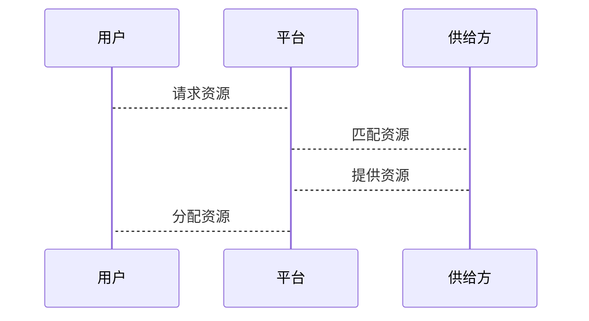

                 


# 费雪的创新公司特征：在共享经济模式中的体现

## 关键词：费雪创新公司特征、共享经济模式、企业创新、经济模式、技术应用

## 摘要：本文探讨了费雪的创新公司特征在共享经济模式中的体现。通过分析共享经济的核心特征，结合费雪创新公司特征的理论，详细阐述了这些特征如何在共享经济中应用，以及它们对共享经济模式的影响。文章还通过具体的案例分析和系统设计，展示了如何将这些特征转化为实际的商业模式和技术实现。

---

# 第一部分: 费雪的创新公司特征与共享经济模式背景

## 第1章: 费雪的创新公司特征概述

### 1.1 费雪的创新公司特征

#### 1.1.1 费雪创新公司特征定义
费雪的创新公司特征是指公司在市场中通过创新的产品、服务或商业模式来实现持续增长和竞争优势的特质。这种特征强调公司的创新能力、灵活性和适应性，以及对市场需求的敏锐洞察。

#### 1.1.2 费雪创新公司特征的核心要素
1. **创新文化**：公司内部鼓励创新，员工有自主权和激励机制。
2. **技术驱动**：公司依赖先进的技术来推动产品和服务的创新。
3. **客户导向**：公司以客户为中心，通过客户需求驱动创新。
4. **快速迭代**：公司能够快速响应市场变化，进行产品和服务的迭代。

#### 1.1.3 费雪创新公司特征的演变
随着市场环境的变化，创新公司特征也在不断演变。从传统的技术创新到现在的商业模式创新，公司的创新特征更加多元化和复杂化。

### 1.2 共享经济模式的定义与特点

#### 1.2.1 共享经济的定义
共享经济是一种基于共享资源使用权的经济模式，通过数字化平台连接供给方和需求方，实现资源的高效利用和共享。

#### 1.2.2 共享经济的核心特征
1. **资源共享**：资源的所有权与使用权分离，通过平台实现资源共享。
2. **平台驱动**：依赖数字化平台进行供需匹配和交易。
3. **灵活参与**：参与者可以根据需求灵活选择参与方式。

#### 1.2.3 共享经济与传统经济模式的区别
1. **所有权与使用权**：共享经济强调使用权而非所有权。
2. **平台角色**：传统经济依赖中间商，而共享经济依赖平台。
3. **参与方式**：共享经济允许个人和企业灵活参与，而传统经济更具刚性。

## 第2章: 费雪创新公司特征与共享经济模式的联系

### 2.1 费雪创新公司特征在共享经济中的体现

#### 2.1.1 费雪创新公司特征与共享经济模式的契合点
1. **平台创新**：公司通过创新的数字化平台实现资源共享。
2. **用户参与**：公司通过创新的用户参与机制提升用户体验。
3. **快速响应**：公司能够快速响应市场变化，调整商业模式。

#### 2.1.2 费雪创新公司特征在共享经济中的具体表现
1. **创新文化**：公司鼓励员工提出新的共享经济模式。
2. **技术驱动**：公司利用大数据和人工智能优化资源共享效率。
3. **客户导向**：公司通过客户反馈不断优化共享经济平台。

#### 2.1.3 费雪创新公司特征对共享经济模式的影响
1. **提升效率**：通过创新的技术和平台，提升资源共享的效率。
2. **降低成本**：通过创新的商业模式降低运营成本。
3. **增强竞争力**：通过持续的创新，增强公司在共享经济中的竞争力。

### 2.2 费雪创新公司特征与共享经济模式的关系

#### 2.2.1 费雪创新公司特征对共享经济模式的推动作用
1. **推动资源共享**：通过创新的平台和模式，推动资源的高效共享。
2. **促进技术创新**：通过技术创新，提升共享经济平台的效率和用户体验。
3. **优化商业模式**：通过持续的商业模式创新，优化共享经济的运营模式。

#### 2.2.2 共享经济模式对费雪创新公司特征的反哺效应
1. **促进创新文化**：共享经济模式的灵活性和多样性促进了公司的创新文化。
2. **推动技术进步**：共享经济模式的需求推动了技术创新。
3. **增强市场适应性**：共享经济模式的快速变化增强了公司的市场适应性。

#### 2.2.3 费雪创新公司特征与共享经济模式的协同发展
1. **协同发展**：通过创新公司特征和共享经济模式的结合，实现资源的高效利用和市场的快速响应。
2. **互相促进**：创新公司特征的提升推动了共享经济的发展，而共享经济的发展又进一步促进了公司的创新。

---

# 第二部分: 费雪创新公司特征与共享经济模式的核心概念

## 第3章: 费雪创新公司特征的核心概念

### 3.1 费雪创新公司特征的原理

#### 3.1.1 费雪创新公司特征的理论基础
费雪的创新公司特征理论基于现代经济学和管理学的理论，强调公司的创新能力和市场适应性。

#### 3.1.2 费雪创新公司特征的数学模型
费雪的创新公司特征可以通过以下数学模型进行描述：

$$
\text{创新能力} = \text{技术创新} + \text{管理创新} + \text{文化创新}
$$

其中，技术创新、管理创新和文化创新是费雪创新公司特征的三个核心要素。

#### 3.1.3 费雪创新公司特征的应用场景
1. **科技公司**：通过技术创新推动产品升级。
2. **服务行业**：通过管理创新提升服务质量。
3. **文化行业**：通过文化创新提升品牌影响力。

### 3.2 费雪创新公司特征与共享经济模式的对比分析

#### 3.2.1 费雪创新公司特征与共享经济模式的属性对比
| 特征               | 费雪创新公司特征         | 共享经济模式         |
|--------------------|--------------------------|--------------------|
| 核心目标           | 提升创新能力             | 提升资源共享效率     |
| 驱动力             | 技术创新和管理创新       | 平台驱动和用户参与   |
| 表现形式           | 新产品、新服务           | 共享平台、共享资源   |

#### 3.2.2 费雪创新公司特征与共享经济模式的优劣势分析
1. **优势**：
   - 费雪创新公司特征能够为共享经济提供技术支持和创新思路。
   - 共享经济模式能够为费雪创新公司特征提供试验平台和应用场景。
2. **劣势**：
   - 费雪创新公司特征的实施需要较高的研发投入和管理成本。
   - 共享经济模式的成功依赖于平台的高效运营和用户的积极参与。

#### 3.2.3 费雪创新公司特征与共享经济模式的协同关系
1. **协同创新**：通过创新公司特征和共享经济模式的结合，实现技术和资源的协同创新。
2. **协同效应**：通过协同创新，提升公司的市场竞争力和共享经济的效率。

## 第4章: 费雪创新公司特征与共享经济模式

### 4.1 费雪创新公司特征在共享经济中的应用
1. **平台创新**：通过创新的平台设计提升资源共享效率。
2. **服务创新**：通过创新的服务模式提升用户体验。
3. **技术创新**：通过技术创新提升平台的安全性和稳定性。

### 4.2 费雪创新公司特征对共享经济模式的影响
1. **提升效率**：通过创新的平台和技术，提升资源共享的效率。
2. **降低成本**：通过创新的商业模式降低运营成本。
3. **增强竞争力**：通过持续的创新，增强公司在共享经济中的竞争力。

---

# 第三部分: 费雪创新公司特征与共享经济模式的算法原理

## 第5章: 费雪创新公司特征的算法原理

### 5.1 费雪创新公司特征的评分系统

#### 5.1.1 评分系统的设计思路
1. **数据采集**：收集公司的创新能力、技术驱动和客户导向等数据。
2. **数据处理**：对数据进行清洗和预处理。
3. **评分计算**：通过数学模型计算公司的创新评分。

#### 5.1.2 评分计算公式
$$
\text{创新评分} = 0.4 \times \text{技术创新} + 0.3 \times \text{管理创新} + 0.3 \times \text{文化创新}
$$

#### 5.1.3 评分系统的实现
```python
def calculate_innovation_score(technology, management, culture):
    score = 0.4 * technology + 0.3 * management + 0.3 * culture
    return score

technology = 80
management = 70
culture = 85

score = calculate_innovation_score(technology, management, culture)
print("创新评分:", score)
```

### 5.2 共享经济模式的供需匹配算法

#### 5.2.1 供需匹配算法的设计思路
1. **数据采集**：收集供给方和需求方的资源和需求信息。
2. **数据处理**：对数据进行清洗和预处理。
3. **供需匹配**：通过算法实现供给和需求的最佳匹配。

#### 5.2.2 供需匹配算法的实现
```python
def match_supply_demand(supply, demand):
    matched = []
    for s in supply:
        for d in demand:
            if s['resource'] == d['resource'] and s['location'] == d['location']:
                matched.append(s)
    return matched

supply = [{'resource': 'car', 'location': '北京'}, {'resource': 'bike', 'location': '上海'}]
demand = [{'resource': 'car', 'location': '北京'}, {'resource': 'bike', 'location': '上海'}]

matched_resources = match_supply_demand(supply, demand)
print("匹配的资源:", matched_resources)
```

### 5.3 费雪创新公司特征与共享经济模式的协同算法

#### 5.3.1 协同算法的设计思路
1. **数据采集**：收集公司的创新能力和共享经济平台的运行数据。
2. **数据处理**：对数据进行清洗和预处理。
3. **协同计算**：通过算法实现公司创新能力和共享经济模式的协同优化。

#### 5.3.2 协同算法的实现
```python
def optimize_innovation_share(innovation, sharing):
    optimized = []
    for i in innovation:
        for s in sharing:
            if i['sector'] == s['sector'] and i['technology'] == s['technology']:
                optimized.append(i)
    return optimized

innovation = [{'sector': '科技', 'technology': '人工智能'}, {'sector': '服务', 'technology': '大数据'}]
sharing = [{'sector': '科技', 'technology': '人工智能'}, {'sector': '服务', 'technology': '大数据'}]

optimized_strategy = optimize_innovation_share(innovation, sharing)
print("优化的协同策略:", optimized_strategy)
```

---

# 第四部分: 费雪创新公司特征与共享经济模式的系统分析

## 第6章: 费雪创新公司特征的系统分析

### 6.1 费雪创新公司特征的系统功能设计

#### 6.1.1 系统功能模块
1. **创新评估模块**：评估公司的创新能力。
2. **技术驱动模块**：推动技术创新。
3. **客户导向模块**：以客户为中心进行创新。

#### 6.1.2 系统功能设计的 Mermaid 类图


### 6.2 共享经济模式的系统架构设计

#### 6.2.1 系统架构设计的 Mermaid 架构图


### 6.3 共享经济模式的系统交互设计

#### 6.3.1 系统交互流程的 Mermaid 序列图


---

# 第五部分: 费雪创新公司特征与共享经济模式的项目实战

## 第7章: 费雪创新公司特征的项目实战

### 7.1 项目背景与目标
本项目旨在通过费雪创新公司特征的理论和方法，设计一个基于共享经济模式的创新公司评估系统。

### 7.2 项目实施步骤

#### 7.2.1 环境安装
1. **安装 Python**：用于开发和实现算法。
2. **安装 Mermaid**：用于绘制系统架构图和交互流程图。
3. **安装 Jupyter Notebook**：用于数据处理和算法实现。

#### 7.2.2 核心代码实现
1. **创新评分计算**：实现创新评分的计算和输出。
2. **供需匹配算法**：实现供给和需求的匹配算法。
3. **协同优化算法**：实现公司创新能力和共享经济模式的协同优化。

#### 7.2.3 代码解读与分析
1. **创新评分计算**：通过 Python 代码实现创新评分的计算，展示评分计算的详细过程。
2. **供需匹配算法**：通过 Mermaid 流程图展示供需匹配的交互过程。
3. **协同优化算法**：通过 Mermaid 类图展示协同优化的系统设计。

### 7.3 实际案例分析

#### 7.3.1 案例背景
以共享经济平台滴滴为例，分析其创新公司特征在共享经济中的体现。

#### 7.3.2 案例分析
滴滴通过创新的平台设计和技术创新，提升了资源的共享效率和用户体验。

#### 7.3.3 分析结果
滴滴的成功证明了费雪创新公司特征在共享经济中的重要性。

### 7.4 项目小结
本项目通过理论分析和实际案例，展示了费雪创新公司特征在共享经济中的应用和影响。

---

# 第六部分: 费雪创新公司特征与共享经济模式的最佳实践

## 第8章: 费雪创新公司特征与共享经济模式的最佳实践

### 8.1 最佳实践小结
1. **创新文化**：公司需要建立创新文化，鼓励员工提出新的共享经济模式。
2. **技术驱动**：公司需要依赖先进技术，优化共享经济平台的效率和用户体验。
3. **客户导向**：公司需要以客户为中心，通过客户需求驱动创新。

### 8.2 注意事项
1. **创新风险**：创新过程中存在失败的风险，公司需要有风险控制机制。
2. **技术挑战**：技术创新需要大量的研发投入和技术积累。
3. **用户参与**：共享经济的成功依赖于用户的积极参与和平台的高效运营。

### 8.3 拓展阅读
1. **费雪创新公司特征的相关书籍**：推荐几本关于创新管理和公司特征的经典书籍。
2. **共享经济模式的前沿研究**：介绍当前共享经济领域的最新研究和趋势。
3. **技术实现的深度探讨**：详细探讨共享经济模式中的技术创新和实现方法。

---

# 结语

费雪的创新公司特征在共享经济模式中的体现是一个复杂而有趣的话题。通过本文的分析，我们可以看到，创新公司特征和共享经济模式的结合，不仅提升了公司的市场竞争力，还推动了经济模式的变革。未来，随着技术的不断进步和市场的变化，费雪创新公司特征在共享经济中的应用将更加广泛和深入。

---

以上是文章的完整目录和部分章节内容，您可以根据需要进一步扩展和深化各部分内容。

