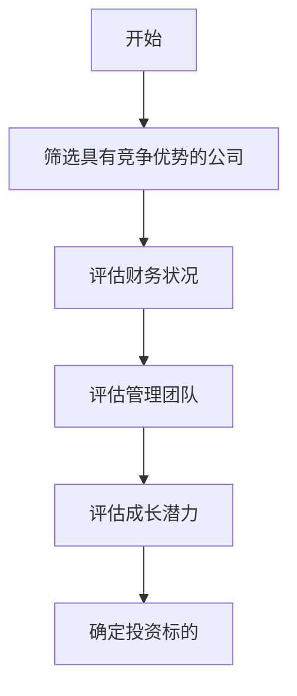
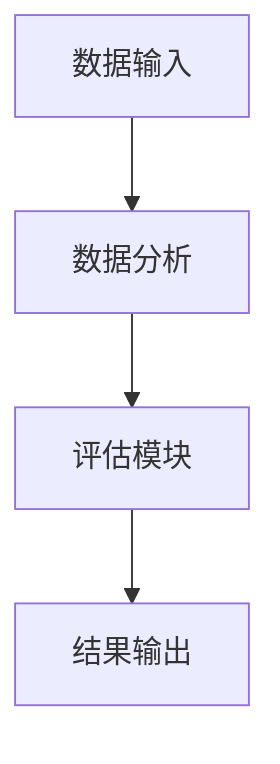
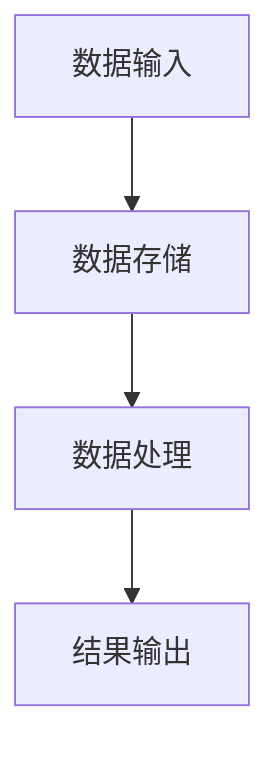

                 


# 费雪的创新型公司识别方法

## 关键词：费雪、创新型公司、识别方法、投资理论、成长性评估、风险控制、价值评估

## 摘要：本文将介绍费雪的创新型公司识别方法，分析其背后的理论基础和逻辑框架，详细阐述其算法原理和系统架构设计。通过实际案例分析，帮助读者掌握如何识别和评估创新型公司，提供最佳实践和投资建议。

---

## 第1章 费雪创新型公司识别方法的背景与核心概念

### 1.1 费雪创新型公司识别方法的背景

#### 1.1.1 费雪投资理论的起源与发展
菲利普·费雪（Philip Fisher）是20世纪著名的投资专家，以其“成长性投资”理论闻名。他强调选择那些具有持续增长潜力的公司，而非仅仅关注短期股价波动。

#### 1.1.2 费雪方法在投资领域的地位
费雪的方法被认为是价值投资的重要组成部分，尤其在识别创新型公司方面具有独特的优势。他的方法强调对公司基本面的深入分析，尤其是公司的管理团队和创新能力。

#### 1.1.3 费雪方法的核心思想与目标
费雪的核心思想是通过分析公司的财务数据、管理团队和行业地位，识别那些具有长期增长潜力的公司。他的目标是找到那些能够在未来几年内保持高增长的公司，并长期持有以获得超额收益。

---

### 1.2 费雪创新型公司的定义与特征

#### 1.2.1 创新型公司的定义
创新型公司是指那些在产品、技术、市场或商业模式上具有创新优势，并能够持续保持竞争优势的公司。

#### 1.2.2 创新型公司的核心特征
创新型公司通常具有以下特征：
1. **强大的研发能力**：公司投入大量资源用于研发，以保持技术领先。
2. **高成长性**：公司收入和利润持续增长，且增长速度高于行业平均水平。
3. **独特的竞争优势**：公司在市场上具有独特的竞争优势，如专利、品牌或成本优势。
4. **优秀的管理团队**：公司管理层具有清晰的愿景和强大的执行能力。
5. **良好的财务状况**：公司财务健康，现金流充足，负债率低。

#### 1.2.3 费雪方法与传统公司的对比
以下是创新型公司与传统公司的特征对比表：

| 特征                | 创新型公司                | 传统公司                |
|---------------------|--------------------------|--------------------------|
| 成长性              | 高                       | 低或稳定                |
| 创新能力            | 强                       | 弱或无                   |
| 管理团队            | 优秀                     | 平平                     |
| 财务状况            | 健康                     | 较差或不稳定             |
| 市场地位            | 领先                     | 竞争激烈或边缘           |

---

### 1.3 费雪方法的理论基础

#### 1.3.1 费雪的三重过滤法
费雪提出了“三重过滤法”，用于筛选具有成长潜力的公司：
1. **第一重过滤**：筛选出那些具有强大竞争优势的公司。
2. **第二重过滤**：进一步筛选出那些财务健康、管理团队优秀的公司。
3. **第三重过滤**：综合考虑行业趋势和宏观经济因素，最终确定投资标的。

#### 1.3.2 费雪的内在价值评估模型
费雪的内在价值评估模型强调对公司未来现金流的评估，公式如下：
$$
\text{内在价值} = \sum_{t=1}^{n} \frac{\text{现金流}_t}{(1 + r)^t}
$$
其中，\( r \) 是折现率，\( \text{现金流}_t \) 是第 \( t \) 年的现金流。

#### 1.3.3 费雪的成长性与风险评估体系
费雪的成长性评估体系包括以下几个方面：
1. **收入增长率**：公司过去几年的收入增长率是否持续高于行业平均水平。
2. **净利润增长率**：公司净利润是否持续增长。
3. **ROE（净资产收益率）**：公司ROE是否高于行业平均水平。
4. **管理团队稳定性**：公司管理层是否稳定，是否有清晰的发展战略。

---

## 第2章 费雪创新型公司识别方法的核心概念与联系

### 2.1 核心概念原理

#### 2.1.1 费雪方法的核心要素
1. **竞争优势**：公司是否具有独特的竞争优势。
2. **成长潜力**：公司未来几年的收入和利润是否具有持续增长的潜力。
3. **财务健康**：公司财务状况是否健康，现金流是否充足。
4. **管理团队**：公司管理层是否优秀，是否有清晰的发展战略。

#### 2.1.2 费雪方法的逻辑框架
费雪方法的逻辑框架可以用以下mermaid流程图表示：



---

### 2.2 核心概念属性特征对比表格

#### 2.2.1 创新型公司与非创新型公司的特征对比
以下是创新型公司与非创新型公司的特征对比表：

| 特征                | 创新型公司                | 非创新型公司              |
|---------------------|--------------------------|---------------------------|
| 创新能力            | 强                       | 弱或无                   |
| 成长性              | 高                       | 低或稳定                 |
| 管理团队            | 优秀                     | 平平                     |
| 财务状况            | 健康                     | 较差或不稳定             |
| 市场地位            | 领先                     | 竞争激烈或边缘           |

---

### 2.3 ER实体关系图架构

#### 2.3.1 实体关系图的构建
以下是费雪创新型公司识别方法的ER实体关系图：

```mermaid
erd
    Company {
        id: int
        name: string
        industry: string
        revenue: float
        net_profit: float
        ROE: float
        management_team: string
        competitive_advantage: string
    }
```

---

## 第3章 费雪创新型公司识别方法的算法原理

### 3.1 算法原理概述

#### 3.1.1 费雪方法的基本流程
费雪方法的基本流程包括以下几个步骤：
1. **筛选具有竞争优势的公司**：通过分析公司的竞争优势，筛选出具有强大竞争优势的公司。
2. **评估财务状况**：通过分析公司的财务数据，评估公司的财务健康状况。
3. **评估管理团队**：评估公司管理团队的稳定性和优秀程度。
4. **评估成长潜力**：综合考虑公司的成长潜力和行业趋势，评估公司的成长潜力。
5. **确定投资标的**：综合考虑以上因素，最终确定投资标的。

---

### 3.2 算法原理的数学模型与公式

#### 3.2.1 费雪方法的内在价值计算公式
费雪的内在价值计算公式如下：
$$
\text{内在价值} = \sum_{t=1}^{n} \frac{\text{现金流}_t}{(1 + r)^t}
$$
其中，\( r \) 是折现率，\( \text{现金流}_t \) 是第 \( t \) 年的现金流。

#### 3.2.2 费雪方法的成长性评估公式
成长性评估公式如下：
$$
\text{成长性评分} = \frac{\text{收入增长率} + \text{净利润增长率} + \text{ROE}}{3}
$$

---

### 3.3 算法原理的详细讲解与举例说明

#### 3.3.1 内在价值计算的详细步骤
1. **确定现金流**：预测公司未来几年的现金流。
2. **确定折现率**：根据市场利率和公司的风险水平确定折现率。
3. **计算内在价值**：使用费雪的内在价值公式计算公司的内在价值。

#### 3.3.2 成长性评估的详细步骤
1. **计算收入增长率**：（当年收入 - 上年收入）/ 上年收入。
2. **计算净利润增长率**：（当年净利润 - 上年净利润）/ 上年净利润。
3. **计算ROE**：净利润 / 净资产。
4. **计算成长性评分**：（收入增长率 + 净利润增长率 + ROE）/ 3。

---

## 第4章 费雪创新型公司识别方法的系统分析与架构设计方案

### 4.1 系统分析与设计概述

#### 4.1.1 系统分析的目标
系统分析的目标是通过分析公司的财务数据、管理团队和行业趋势，识别出具有成长潜力的创新型公司。

#### 4.1.2 系统设计的步骤
1. **需求分析**：明确系统的需求和目标。
2. **功能设计**：设计系统的功能模块。
3. **系统架构设计**：设计系统的架构。
4. **系统实现**：实现系统的功能模块。
5. **系统测试**：测试系统的功能和性能。

---

### 4.2 系统功能设计

#### 4.2.1 系统功能模块划分
系统功能模块包括：
1. **数据输入模块**：输入公司的财务数据、管理团队信息和行业趋势。
2. **数据分析模块**：分析公司的财务数据、管理团队和行业趋势。
3. **评估模块**：评估公司的竞争优势、财务状况和成长潜力。
4. **结果输出模块**：输出评估结果。

#### 4.2.2 系统功能模块的实现
以下是系统的功能模块实现：



---

### 4.3 系统架构设计

#### 4.3.1 系统架构的构建
以下是系统的架构设计：



---

## 第5章 费雪创新型公司识别方法的项目实战

### 5.1 项目环

#### 5.1.1 环境安装
1. **安装Python**：安装Python 3.8或更高版本。
2. **安装相关库**：安装pandas、numpy和scikit-learn。

#### 5.1.2 核心代码实现

以下是核心代码实现：

```python
import pandas as pd
import numpy as np

# 定义内在价值计算函数
def calculate_intrinsic_value(cash_flows, discount_rate):
    return sum(cash_flow / (1 + discount_rate) ** t for t, cash_flow in enumerate(cash_flows))

# 定义成长性评分函数
def calculate_growth_score(revenue_growth, net_profit_growth, ROE):
    return (revenue_growth + net_profit_growth + ROE) / 3

# 读取数据
data = pd.read_csv('company_data.csv')

# 计算内在价值
cash_flows = data['cash_flows'].tolist()
discount_rate = 0.08
intrinsic_value = calculate_intrinsic_value(cash_flows, discount_rate)

# 计算成长性评分
revenue_growth = data['revenue_growth'].mean()
net_profit_growth = data['net_profit_growth'].mean()
ROE = data['ROE'].mean()
growth_score = calculate_growth_score(revenue_growth, net_profit_growth, ROE)

print(f"内在价值: {intrinsic_value}")
print(f"成长性评分: {growth_score}")
```

#### 5.1.3 案例分析与解读
以下是案例分析：

假设我们有以下公司的数据：

| 公司名称 | 收入增长率 | 净利润增长率 | ROE |
|----------|------------|--------------|-----|
| 公司A    | 20%        | 15%          | 25% |
| 公司B    | 10%        | 5%           | 15% |

计算成长性评分：

公司A：
$$
\text{成长性评分} = \frac{20 + 15 + 25}{3} = 16.67
$$

公司B：
$$
\text{成长性评分} = \frac{10 + 5 + 15}{3} = 10
$$

结论：公司A的综合成长性评分高于公司B，具有更大的成长潜力。

---

## 第6章 费雪创新型公司识别方法的最佳实践

### 6.1 总结与反思

#### 6.1.1 总结
费雪的创新型公司识别方法是一种有效的投资方法，通过分析公司的竞争优势、财务状况和成长潜力，识别出具有长期增长潜力的公司。

#### 6.1.2 反思
在实际应用中，费雪的方法需要结合市场环境和行业趋势，不断调整和优化。

---

### 6.2 小结

#### 6.2.1 小结
费雪的创新型公司识别方法是一种科学的投资方法，通过分析公司的竞争优势、财务状况和成长潜力，识别出具有长期增长潜力的公司。

---

### 6.3 注意事项

#### 6.3.1 注意事项
1. **数据准确性**：确保数据的准确性和完整性。
2. **模型优化**：根据市场环境和行业趋势，不断优化模型。
3. **风险控制**：注意投资风险，分散投资。

---

### 6.4 拓展阅读

#### 6.4.1 拓展阅读材料
1. 费雪的《成长股投资法则》
2. 彼得·林奇的《选股之道》
3. 约翰·涅曼的《投资组合管理》

---

通过以上步骤，我们可以系统地应用费雪的创新型公司识别方法，识别出具有长期增长潜力的公司，为投资决策提供科学依据。

