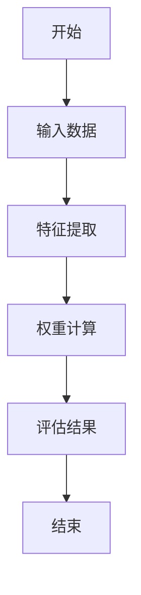

                 


# 费雪的创新评估体系：应对颠覆性技术的影响

> **关键词**：费雪创新评估体系、颠覆性技术、技术评估、创新管理、系统架构  
> **摘要**：本文详细介绍了费雪创新评估体系的核心概念、算法原理、系统架构以及实际应用。通过分析颠覆性技术对企业的影响，提出了基于费雪体系的创新评估方法，并结合实际案例展示了如何在企业中实施该体系，以应对技术变革带来的挑战。

---

## 第一部分: 费雪创新评估体系的背景与核心概念

### 第1章: 费雪创新评估体系概述

#### 1.1 颠覆性技术的背景与挑战
- **1.1.1 颠覆性技术的定义与特征**  
  颠覆性技术是指能够从根本上改变现有市场或行业规则的技术，其特点是低成本、高效率和创新性。例如，互联网颠覆了传统的媒体行业，人工智能颠覆了传统的人力密集型行业。

- **1.1.2 颠覆性技术对企业的影响**  
  颠覆性技术可能对企业的生存构成威胁，但也可能带来新的商业机会。企业需要及时识别和评估这些技术，以制定有效的应对策略。

- **1.1.3 创新评估体系的重要性**  
  创新评估体系帮助企业识别潜在的技术威胁和机会，优化资源配置，提升创新效率。

#### 1.2 费雪创新评估体系的起源
- **1.2.1 费雪体系的提出背景**  
  随着技术的快速发展，企业需要一种系统化的评估方法来应对颠覆性技术的挑战。费雪体系正是在这种背景下提出的一种创新评估方法。

- **1.2.2 费雪体系的核心思想**  
  费雪体系强调从技术的潜力、市场适应性和企业能力三个维度进行评估，以全面衡量技术的颠覆性影响。

- **1.2.3 费雪体系与其他评估方法的区别**  
  费雪体系的独特之处在于其综合考虑了技术的多维度影响，并结合企业的实际情况进行评估。

#### 1.3 费雪创新评估体系的框架
- **1.3.1 体系的基本结构**  
  费雪体系包括技术潜力评估、市场适应性评估和企业能力评估三个模块。

- **1.3.2 体系的核心要素**  
  包括技术的创新性、市场规模、技术成熟度、企业战略目标等。

- **1.3.3 体系的应用场景**  
  适用于企业内部的技术评估、投资决策和技术战略制定。

---

### 第2章: 创新评估的核心概念与联系

#### 2.1 核心概念原理
- **2.1.1 创新评估的基本原理**  
  创新评估需要从技术、市场和企业三个维度进行综合分析。

- **2.1.2 费雪模型的数学基础**  
  费雪模型基于加权评分法，通过给每个评估维度赋予权重，计算技术的综合得分。

- **2.1.3 创新评估的维度与权重**  
  技术潜力（权重40%）、市场适应性（权重30%）、企业能力（权重30%）。

#### 2.2 核心概念对比表格
| 评估维度       | 技术潜力 | 市场适应性 | 企业能力 |
|----------------|----------|------------|----------|
| 定义           | 技术的创新性和颠覆性潜力 | 技术在市场中的适应性和可行性 | 企业是否具备实施该技术的能力 |
| 评估方法       | 加权评分法 | 加权评分法 | 加权评分法 |
| 示例           | AI技术的创新性 | AI技术在特定行业的应用可行性 | 企业是否有AI技术开发能力 |

#### 2.3 ER实体关系图
```mermaid
erd
  entity 技术 (id, 名称, 创新性, 成熟度, 适应性)
  entity 企业 (id, 名称, 能力, 战略目标, 资源)
  entity 评估结果 (id, 技术id, 企业id, 综合得分)
```

---

### 第3章: 费雪创新评估体系的算法原理

#### 3.1 算法原理概述
- **3.1.1 费雪模型的算法流程**  
  1. 确定评估维度和权重。  
  2. 收集技术数据。  
  3. 计算每个维度的评分。  
  4. 综合计算技术的综合得分。

- **3.1.2 算法的输入与输出**  
  输入：技术数据、评估维度、权重；输出：技术综合得分。

- **3.1.3 算法的步骤分解**  
  - 数据预处理：清洗和标准化。  
  - 维度评分：根据权重计算各维度得分。  
  - 综合评分：计算技术的综合得分。

#### 3.2 算法流程图


#### 3.3 数学模型与公式
- **3.3.1 创新潜力评估公式**  
  $$创新潜力 = \sum_{i=1}^{n} w_i x_i$$  
  其中，$w_i$ 是第 $i$ 个特征的权重，$x_i$ 是第 $i$ 个特征的值。

- **3.3.2 评估结果计算**  
  $$评估结果 = \frac{\sum_{i=1}^{m} a_i}{m}$$  
  其中，$a_i$ 是第 $i$ 个评估指标的得分，$m$ 是指标总数。

---

### 第4章: 系统分析与架构设计

#### 4.1 问题场景介绍
- **4.1.1 颠覆性技术对企业的影响**  
  颠覆性技术可能导致企业业务模式的改变或被淘汰。

- **4.1.2 创新评估体系的应用场景**  
  在企业内部进行技术评估、投资决策和技术战略制定。

- **4.1.3 系统设计的目标**  
  构建一个基于费雪体系的创新评估系统，帮助企业快速识别和应对颠覆性技术。

#### 4.2 系统功能设计
- **4.2.1 领域模型**  
  ```mermaid
  classDiagram
    class 技术 {
        id
        名称
        创新性
        成熟度
        适应性
    }
    class 企业 {
        id
        名称
        能力
        战略目标
        资源
    }
    class 评估结果 {
        id
        技术id
        企业id
        综合得分
    }
    技术 --> 评估结果
    企业 --> 评估结果
  ```

- **4.2.2 系统架构设计**  
  ```mermaid
  architecture
  Client --> 评估系统
  评估系统 --> 数据库
  评估系统 --> 分析模块
  分析模块 --> 报告生成器
  ```

- **4.2.3 系统接口设计**  
  - 输入接口：接收技术数据和企业信息。  
  - 输出接口：输出评估报告和建议。

- **4.2.4 系统交互序列图**  
  ```mermaid
  sequenceDiagram
    Client ->> 评估系统: 提交技术数据
    评估系统 ->> 数据库: 查询企业信息
    评估系统 ->> 分析模块: 计算评估结果
    分析模块 ->> 报告生成器: 生成评估报告
    评估系统 ->> Client: 返回评估报告
  ```

---

## 第五部分: 项目实战

### 第5章: 项目实战

#### 5.1 环境安装与代码实现
- **5.1.1 环境安装**  
  需要安装Python、NumPy、Pandas和Mermaid工具。

- **5.1.2 核心代码实现**  
  ```python
  def calculate_score(technology, weights):
      return sum(w * t for w, t in zip(weights, technology))
  
  technology_data = [0.8, 0.6, 0.7]
  weights = [0.4, 0.3, 0.3]
  score = calculate_score(technology_data, weights)
  print(f"技术综合得分为：{score}")
  ```

#### 5.2 实际案例分析与解读
- **5.2.1 案例1：AI技术评估**  
  评估AI技术在医疗行业的颠覆性潜力，计算其综合得分。

- **5.2.2 案例2：区块链技术评估**  
  评估区块链技术在金融行业的市场适应性和企业能力。

#### 5.3 项目小结
- 通过实际案例展示了费雪创新评估体系的应用方法和效果。

---

## 第六部分: 总结与展望

### 第6章: 总结与展望

#### 6.1 体系的应用与效果
- 费雪创新评估体系帮助企业有效识别和应对颠覆性技术，优化资源配置。

#### 6.2 体系的局限性与改进方向
- 局限性：评估结果受主观因素影响较大。  
- 改进方向：引入更多数据源和动态调整权重。

#### 6.3 对未来技术的展望
- 预测未来可能的颠覆性技术，如量子计算和生物技术。

---

## 第七部分: 最佳实践与注意事项

### 第7章: 最佳实践

#### 7.1 关键技术点
- 数据的准确性和完整性是评估的基础。  
- 权重的合理分配需要结合企业实际情况。

#### 7.2 小结与注意事项
- 定期更新评估模型和权重，以适应技术的发展变化。

---

### 参考文献与拓展阅读
- 费雪的经典论文《技术创新评估体系的研究》。  
- 推荐书籍：《创新管理：颠覆性技术的应对策略》。

---

通过以上内容，我们详细介绍了费雪创新评估体系的核心概念、算法原理、系统架构以及实际应用。该体系能够帮助企业有效应对颠覆性技术的挑战，提升创新能力和竞争力。

