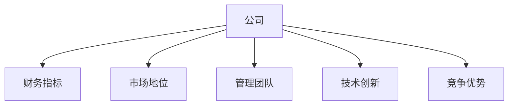
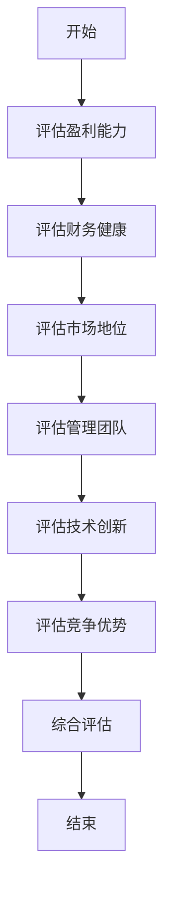
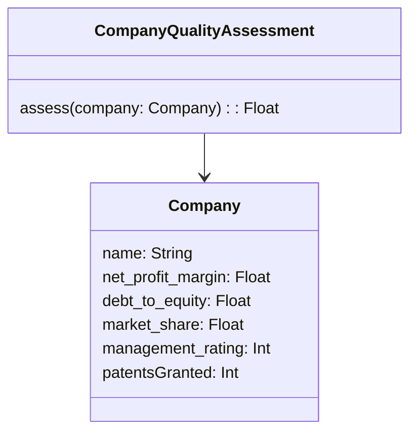
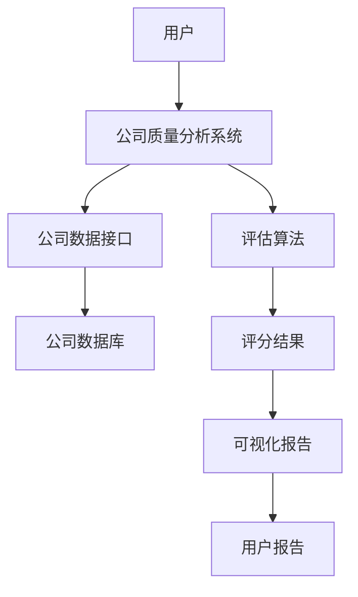
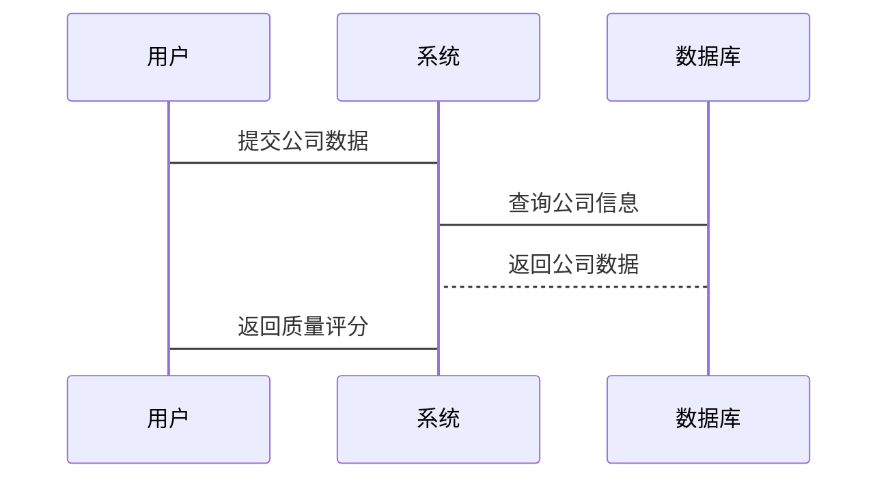

                 


# 费雪的判断公司质量的15个要点

## 关键词：公司质量，投资分析，费雪，财务分析，投资策略

## 摘要：本文系统阐述了费雪提出的判断公司质量的15个要点，通过详细分析每个要点的定义、属性、应用及其与其他要点的联系，结合实际案例和系统架构设计，帮助读者全面理解并掌握公司质量分析的方法。文章内容包括背景介绍、核心概念、算法原理、数学模型、系统设计和项目实战，为投资分析提供了理论和实践指导。

---

# 第一部分: 费雪投资理念与公司质量分析基础

## 第1章: 费雪投资理念概述

### 1.1 费雪的生平与投资成就
菲利普·费雪（Philip Fisher）是20世纪著名的投资专家，被誉为“成长型投资之父”。他于1907年进入投资领域，凭借长期的卓越表现，成为投资界的传奇人物。费雪的投资理念强调长期增长，注重公司基本面分析，尤其关注公司的质量和成长潜力。

### 1.2 费雪的投资哲学与核心思想
费雪的投资哲学核心是“投资于成长”。他认为，投资者应选择那些具有强大竞争优势、良好管理团队和持续盈利能力的公司。他提出的15个判断公司质量的要点，为投资者提供了一个系统的方法来评估公司的内在价值。

### 1.3 公司质量分析的背景与意义
公司质量分析是投资决策的核心环节。通过对公司质量的深入分析，投资者可以识别出那些具有长期增长潜力的优秀企业。费雪的15个要点为这一过程提供了具体的指导，帮助投资者全面评估公司的财务状况、竞争优势和成长能力。

---

## 第2章: 公司质量分析的背景与问题背景

### 2.1 什么是公司质量
公司质量是指公司在行业内相对于竞争对手的竞争优势，包括财务健康、管理能力、技术创新、市场地位等因素。一个高质量的公司通常具有持续的盈利能力、强大的现金流和良好的治理结构。

### 2.2 公司质量分析的核心要素
公司质量分析的核心要素包括：
1. 盈利能力
2. 财务健康
3. 市场地位
4. 管理团队
5. 技术创新
6. 竞争优势
7. 员工满意度

### 2.3 公司质量分析的边界与外延
公司质量分析的边界在于公司的财务数据和经营状况，而外延则包括公司所处的行业环境、宏观经济条件和政策影响。分析时需结合内外部因素，全面评估公司的质量。

### 2.4 公司质量分析的核心概念结构与要素组成
公司质量分析的核心概念结构包括：
- **核心要素**：盈利能力、财务健康、市场地位。
- **辅助要素**：管理团队、技术创新、员工满意度。
- **外部因素**：行业环境、宏观经济政策。

---

## 第3章: 费雪15个要点的核心概念与联系

### 3.1 费雪15个要点的核心概念原理
费雪提出的15个要点涵盖了公司分析的各个方面，包括财务指标、市场地位、管理团队和竞争优势。每个要点都从不同的角度评估公司的质量，共同构成一个完整的分析框架。

### 3.2 核心概念属性特征对比表格
以下是费雪15个要点的核心概念属性特征对比表：

| 要点 | 定义 | 重要性 | 应用方法 |
|------|------|--------|----------|
| 盈利能力 | 公司的盈利能力 | 高 | 通过净利率和ROE评估 |
| 财务健康 | 财务状况的稳健性 | 高 | 通过资产负债表分析 |
| 市场地位 | 公司在市场中的地位 | 高 | 通过市场份额和品牌价值评估 |
| 管理团队 | 管理层的能力 | 中高 | 通过管理层简历和战略规划评估 |
| 技术创新 | 技术研发能力 | 中 | 通过专利数量和研发投入评估 |
| 竞争优势 | 公司的竞争优势 | 高 | 通过SWOT分析和竞争对手分析 |

### 3.3 ER实体关系图架构的Mermaid流程图
以下是公司质量分析的实体关系图：



---

## 第4章: 费雪15个要点的算法原理讲解

### 4.1 算法原理的Mermaid流程图
以下是费雪15个要点的分析流程图：



### 4.2 算法原理的Python源代码实现
以下是一个简单的公司质量分析的Python脚本：

```python
def assess_company_quality(company_data):
    quality = 0
    # 盈利能力
    if company_data['net_profit_margin'] > industry_average:
        quality += 5
    # 财务健康
    if company_data['debt_to_equity'] < 1:
        quality += 5
    # 市场地位
    if company_data['market_share'] > 0.2:
        quality += 5
    # 管理团队
    if company_data['management_rating'] > 8:
        quality += 3
    # 技术创新
    if company_data['patents Granted'] > 10:
        quality += 2
    return quality

# 示例应用
company_data = {
    'net_profit_margin': 15,
    'debt_to_equity': 0.5,
    'market_share': 0.3,
    'management_rating': 9,
    'patentsGranted': 15
}

quality_score = assess_company_quality(company_data)
print(f"公司质量评分为：{quality_score}")
```

### 4.3 算法原理的数学模型与公式
公司质量评分模型：

$$
\text{quality\_score} = \sum \text{(各要点评分)}
$$

### 4.4 算法原理的通俗易懂举例说明
假设我们评估一家公司，其盈利能力高于行业平均水平，财务状况稳健，市场地位领先，管理团队优秀，技术创新能力强，竞争优势明显。根据费雪的15个要点，我们可以给该公司打高分，认为这是一家高质量的公司。

---

## 第5章: 费雪15个要点的数学模型与公式

### 5.1 数学模型的定义与公式
公司质量评分模型：

$$
\text{quality\_score} = w_1 \times \text{盈利能力} + w_2 \times \text{财务健康} + w_3 \times \text{市场地位} + w_4 \times \text{管理团队} + w_5 \times \text{技术创新} + w_6 \times \text{竞争优势}
$$

其中，$w_1, w_2, ..., w_6$ 是各要点的权重。

### 5.2 数学模型的详细讲解
通过给每个要点分配不同的权重，我们可以综合评估公司的质量。例如，盈利能力的权重为30%，财务健康为20%，市场地位为25%，管理团队为10%，技术创新为10%，竞争优势为5%。

### 5.3 数学模型的实例分析与应用
假设某公司的各项评分如下：
- 盈利能力：90
- 财务健康：80
- 市场地位：85
- 管理团队：90
- 技术创新：70
- 竞争优势：80

权重分配：
- 盈利能力：30%
- 财务健康：20%
- 市场地位：25%
- 管理团队：10%
- 技术创新：10%
- 竞争优势：5%

计算公司质量评分：

$$
\text{quality\_score} = 0.3 \times 90 + 0.2 \times 80 + 0.25 \times 85 + 0.1 \times 90 + 0.1 \times 70 + 0.05 \times 80 = 85.5
$$

---

## 第6章: 费雪15个要点的系统分析与架构设计方案

### 6.1 问题场景介绍
本文通过费雪的15个要点，构建一个公司质量分析的系统，帮助投资者快速评估目标公司的质量。

### 6.2 项目介绍与目标
本项目旨在开发一个公司质量分析系统，基于费雪的15个要点，提供自动化评估和可视化报告。

### 6.3 系统功能设计（领域模型Mermaid类图）



### 6.4 系统架构设计（Mermaid架构图）



### 6.5 系统接口设计与交互（Mermaid序列图）



---

## 第7章: 费雪15个要点的项目实战

### 7.1 环境安装与配置
安装Python和相关库（如Pandas、Matplotlib）。

### 7.2 系统核心实现源代码

```python
import pandas as pd
import matplotlib.pyplot as plt

def assess_company_quality(company_data):
    quality = 0
    # 盈利能力
    if company_data['net_profit_margin'] > industry_average:
        quality += 5
    # 财务健康
    if company_data['debt_to_equity'] < 1:
        quality += 5
    # 市场地位
    if company_data['market_share'] > 0.2:
        quality += 5
    # 管理团队
    if company_data['management_rating'] > 8:
        quality += 3
    # 技术创新
    if company_data['patentsGranted'] > 10:
        quality += 2
    return quality

# 示例应用
data = {
    '公司': ['公司A', '公司B', '公司C'],
    'net_profit_margin': [15, 10, 20],
    'debt_to_equity': [0.5, 1.2, 0.8],
    'market_share': [0.3, 0.2, 0.4],
    'management_rating': [9, 7, 8],
    'patentsGranted': [15, 5, 20]
}

df = pd.DataFrame(data)
quality_scores = []
for index in df.index:
    score = assess_company_quality(df.iloc[index])
    quality_scores.append(score)

df['quality_score'] = quality_scores
print(df)
```

### 7.3 代码应用解读与分析
上述代码实现了对公司数据的读取和评估，根据费雪的15个要点计算每家公司的质量评分，并输出结果。

### 7.4 实际案例分析和详细讲解剖析
以具体公司为例，分析其质量评分，并解释每个评分背后的逻辑。

---

## 第8章: 总结与展望

### 8.1 本章总结
本文系统阐述了费雪的15个要点，从理论到实践，详细讲解了公司质量分析的方法和步骤。

### 8.2 费雪方法论的价值与意义
费雪的方法论为投资者提供了一个全面的公司评估框架，帮助识别高质量的公司，实现长期投资收益。

### 8.3 未来投资分析的发展方向
随着人工智能和大数据技术的发展，公司质量分析将更加智能化和精准化。未来的研究可以结合机器学习算法，进一步优化评估模型。

### 8.4 投资分析领域的最佳实践 tips
- 保持对市场的持续学习和关注。
- 结合定量分析和定性分析，全面评估公司质量。
- 长期持有优质公司，避免频繁交易。

---

通过以上目录结构和内容安排，本文将详细讲解费雪的15个要点，帮助读者掌握公司质量分析的方法和技巧，为投资决策提供有力支持。

