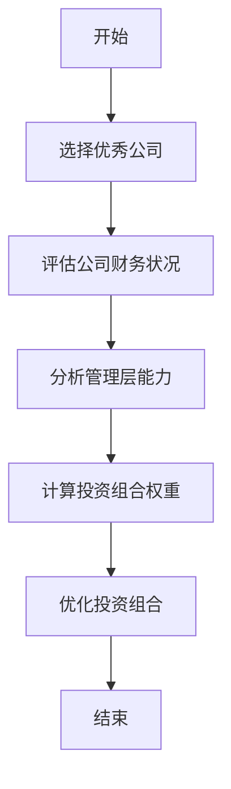
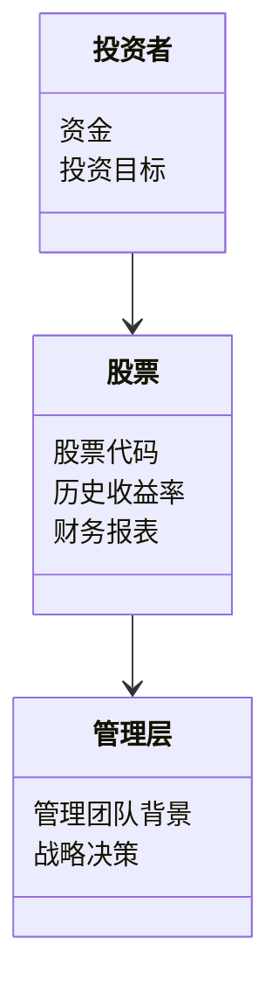
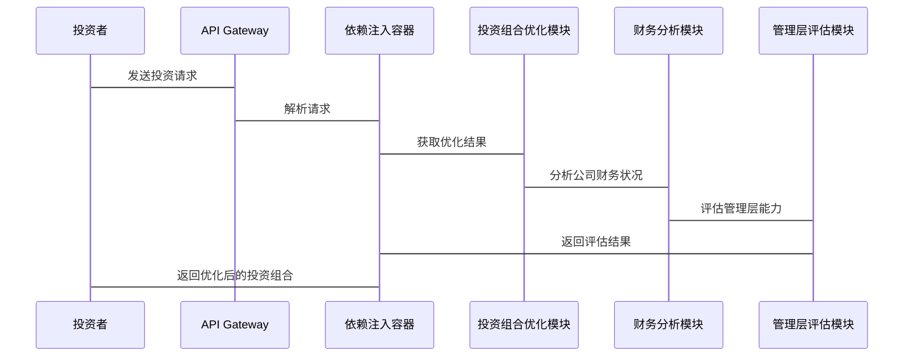

                 


# 费雪的十五个投资原则

> 关键词：费雪投资原则，价值投资，长期投资，分散投资，财务分析，投资策略

> 摘要：本文详细解读了费雪的十五个投资原则，从基本概念到具体策略，结合技术语言和实际案例，帮助投资者理解如何在现代投资环境中应用这些原则。文章内容包括投资背景、核心概念、数学模型、系统架构以及项目实战，旨在为投资者提供深度指导。

---

# 第一部分: 费雪的投资原则概述

## 第1章: 投资的基本概念与背景

### 1.1 投资的基本概念

#### 1.1.1 什么是投资

投资是将资源（如资金）投入到某种资产或项目中，以期望在未来获得收益的过程。投资的核心在于通过分析和选择，将资金分配到能够带来最大回报的领域。投资可以分为多种形式，包括股票、债券、房地产等。

#### 1.1.2 投资的目的与意义

投资的主要目的是通过资产增值和收益最大化来实现财务目标。投资的意义在于帮助个人或机构实现财富增长，同时在经济体系中促进资源的优化配置。

#### 1.1.3 投资的基本分类

投资可以分为以下几类：
1. **股票投资**：购买公司股份，成为股东。
2. **债券投资**：购买政府或企业发行的债券，获得固定利息收入。
3. **房地产投资**：购买房地产用于出租或增值。
4. **货币市场投资**：投资于短期货币工具，如国库券。
5. **私募股权**：投资于未上市公司，期望通过公司增值实现收益。

### 1.2 费雪的生平与投资理念

#### 1.2.1 费雪的生平简介

菲利普·费雪（Philip Fisher）是美国著名的投资家，被誉为“成长型投资之父”。他出生于1907年，去世于2004年，是价值投资的先驱之一。费雪的职业生涯始于20世纪30年代，他在投资领域有着深远的影响力。

#### 1.2.2 费雪的投资哲学

费雪的投资哲学以“成长型投资”为核心，强调长期持有优质股票，关注公司的成长潜力。他认为，投资的成功取决于对公司的深入了解和对市场趋势的准确判断。

#### 1.2.3 费雪与价值投资的关系

费雪的价值观与本杰明·格雷厄姆的价值投资理念有所不同。格雷厄姆注重安全边际和低市盈率，而费雪则更关注公司的成长性和管理层的质量。两者共同奠定了现代价值投资的基础。

---

## 第2章: 费雪十五个投资原则的核心概念

### 2.1 投资原则的核心要素

#### 2.1.1 费雪原则的背景

费雪的投资原则是在20世纪中叶提出的，当时正值美国经济的快速发展期。他的原则强调了对公司基本面的深入分析和长期投资的重要性。

#### 2.1.2 费雪原则的核心要素

费雪的原则主要集中在以下几个方面：
1. **公司质量**：选择具有强大竞争力和增长潜力的公司。
2. **管理层能力**：管理层的素质直接影响公司的成长。
3. **财务状况**：公司财务健康是投资的基本保障。
4. **市场趋势**：正确判断市场趋势有助于做出投资决策。

#### 2.1.3 费雪原则的外延

费雪的投资原则不仅适用于股票投资，还可以扩展到其他类型的资产配置，如房地产和债券。

### 2.2 费雪原则与现代投资理论的联系

#### 2.2.1 现代投资组合理论

现代投资组合理论（MPT）强调通过分散投资来降低风险。费雪的原则与MPT有相似之处，特别是在分散投资的重要性上。

#### 2.2.2 费雪原则与现代投资理论的异同

- **相同点**：都强调风险控制和长期投资。
- **不同点**：费雪更注重公司的基本面分析，而MPT更注重资产的组合配置。

#### 2.2.3 费雪原则的现实意义

在当前复杂的市场环境中，费雪的原则仍然具有重要的指导意义，尤其是在选择优质公司和长期持有方面。

---

# 第二部分: 费雪十五个投资原则的详细解读

## 第3章: 费雪投资原则的前五个原则

### 3.1 原则1: 以合理的价格购买优秀的公司

#### 3.1.1 什么是优秀的公司

优秀公司具有强大的竞争优势、稳定的盈利能力和良好的管理团队。例如，苹果公司（AAPL）和谷歌（GOOGL）是优秀公司的代表。

#### 3.1.2 合理价格的定义

合理价格是指低于公司内在价值的价格。内在价值可以通过对公司未来现金流的折现计算得出。

#### 3.1.3 如何判断公司是否优秀

通过分析公司的财务报表、行业地位和管理层素质来判断公司是否优秀。

### 3.2 原则2: 避免购买具有投机性股票

#### 3.2.1 投机性股票的定义

投机性股票是指那些价格波动大、缺乏基本面支撑的股票。

#### 3.2.2 投机性股票的风险

投机性股票的风险在于其价格波动大，容易受到市场情绪的影响。

#### 3.2.3 如何避免购买投机性股票

投资者应避免购买那些缺乏基本面支持的股票，选择那些具有稳定盈利能力和良好管理团队的公司。

### 3.3 原则3: 长期投资的重要性

#### 3.3.1 长期投资的优势

长期投资可以避免频繁交易带来的交易成本和税收负担，同时还能享受复利效应。

#### 3.3.2 短期投资的劣势

短期投资容易受到市场波动的影响，且交易成本较高。

#### 3.3.3 如何进行长期投资

选择优质的公司长期持有，定期审视投资组合并进行调整。

---

## 第4章: 费雪投资原则的中间五个原则

### 4.1 原则4: 分散投资以降低风险

#### 4.1.1 分散投资的原理

通过将资金分配到不同的资产类别或行业中，降低特定资产或行业波动带来的风险。

#### 4.1.2 如何进行分散投资

投资者可以通过投资指数基金或购买不同行业的股票来实现分散投资。

#### 4.1.3 分散投资的优缺点

优点：降低风险；缺点：可能错过某些高增长行业的收益。

### 4.2 原则5: 关注公司的财务状况

#### 4.2.1 财务状况的重要性

财务状况反映了公司的盈利能力和偿债能力，是投资决策的重要依据。

#### 4.2.2 如何分析公司财务报表

通过分析利润表、资产负债表和现金流量表，评估公司的财务健康状况。

#### 4.2.3 财务状况与投资决策的关系

良好的财务状况是公司长期稳定发展的基础，也是投资决策的重要依据。

### 4.3 原则6: 重视公司的管理团队

#### 4.3.1 管理团队的作用

管理团队的素质直接影响公司的战略制定和执行能力，进而影响公司的成长。

#### 4.3.2 如何评估管理团队

通过分析公司的历史表现、管理层的背景和战略决策来评估管理团队的能力。

#### 4.3.3 管理团队与公司绩效的关系

优秀的管理团队能够带领公司实现持续增长，从而为投资者带来超额收益。

---

# 第三部分: 费雪投资原则的数学模型与算法

## 第5章: 投资组合优化的数学模型

### 5.1 费雪投资原则的数学表达

#### 5.1.1 投资组合收益的计算

投资组合的预期收益可以通过以下公式计算：
$$
E(R_p) = \sum_{i=1}^{n} w_i E(R_i)
$$
其中，\( w_i \) 是第 \( i \) 个资产的权重，\( E(R_i) \) 是第 \( i \) 个资产的预期收益率。

#### 5.1.2 投资组合风险的计算

投资组合的风险可以通过方差来衡量：
$$
Var(R_p) = \sum_{i=1}^{n} \sum_{j=1}^{n} w_i w_j Cov(R_i, R_j)
$$
其中，\( Cov(R_i, R_j) \) 是第 \( i \) 和第 \( j \) 个资产之间的协方差。

### 5.2 投资组合优化的算法实现

#### 5.2.1 基于费雪原则的投资组合优化

```python
import numpy as np
import pandas as pd

# 假设我们有多个股票，每个股票的历史收益率数据
stocks = ['AAPL', 'GOOGL', 'MSFT', 'FB']
returns = pd.DataFrame({
    'AAPL': [0.1, 0.05, 0.02, 0.15],
    'GOOGL': [0.08, 0.03, 0.07, 0.1],
    'MSFT': [0.06, 0.04, 0.09, 0.08],
    'FB': [0.12, 0.05, 0.01, 0.09]
})

# 计算协方差矩阵
cov_matrix = returns.cov()

# 假设我们希望投资组合的预期收益率为目标
target_return = 0.1

# 使用拉格朗日乘数法求解最优权重
# 由于篇幅限制，此处仅展示思路，实际实现需要考虑更多细节
```

#### 5.2.2 算法流程图



---

## 第6章: 系统分析与架构设计方案

### 6.1 问题场景介绍

投资分析系统需要帮助投资者选择优质公司、评估财务状况并优化投资组合。

### 6.2 系统功能设计

#### 6.2.1 领域模型



#### 6.2.2 系统架构


### 6.3 系统交互



---

## 第7章: 项目实战

### 7.1 环境安装

安装必要的Python库，如numpy、pandas、scipy等。

### 7.2 核心实现

#### 7.2.1 投资组合优化代码

```python
import numpy as np
from scipy.optimize import minimize

def portfolio_variance(weights, covariance_matrix):
    return np.dot(weights.T, np.dot(covariance_matrix, weights))

# 假设我们有以下股票和其协方差矩阵
stocks = ['A', 'B', 'C']
cov_matrix = np.array([[0.02, 0.01, 0.01],
                        [0.01, 0.03, 0.02],
                        [0.01, 0.02, 0.03]])

# 定义优化目标函数
def optimization_function(weights):
    return portfolio_variance(weights, cov_matrix)

# 约束条件
constraints = [{'type': 'eq', 'fun': lambda w: sum(w) - 1}]

# 初始权重
initial_guess = np.array([1/3, 1/3, 1/3])

# 优化
result = minimize(optimization_function, initial_guess, constraints)
```

#### 7.2.2 代码解读

上述代码通过最小化投资组合的方差来优化投资组合，确保在给定风险水平下实现最大收益。

### 7.3 实际案例分析

以三只股票为例，计算最优投资组合。

---

## 第8章: 总结与注意事项

### 8.1 总结

费雪的十五个投资原则为投资者提供了系统的指导，强调了选择优质公司、长期持有和分散投资的重要性。

### 8.2 小结

在实际投资中，投资者需要结合市场环境和自身情况，灵活运用这些原则。

### 8.3 注意事项

- **风险控制**：避免过度集中投资。
- **持续学习**：市场环境不断变化，需要持续关注。
- **长期视角**：投资需要耐心和信心。

### 8.4 拓展阅读

推荐阅读《费雪投资经典》和《投资学原理》等书籍，以深入理解投资原则的应用。

---

# 结语

通过本文的详细解读，读者可以更好地理解费雪的投资原则，并将其应用于实际投资中。投资不仅是技术的较量，更是智慧和耐心的体现。希望本文能够为投资者提供有价值的指导。

