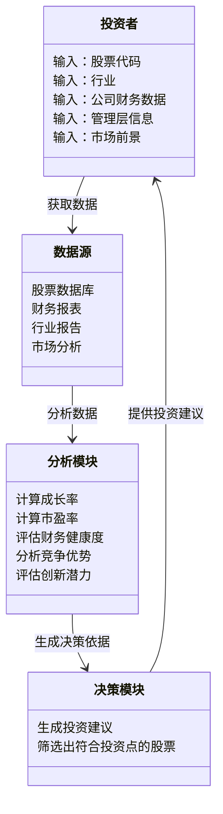
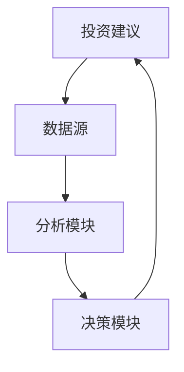
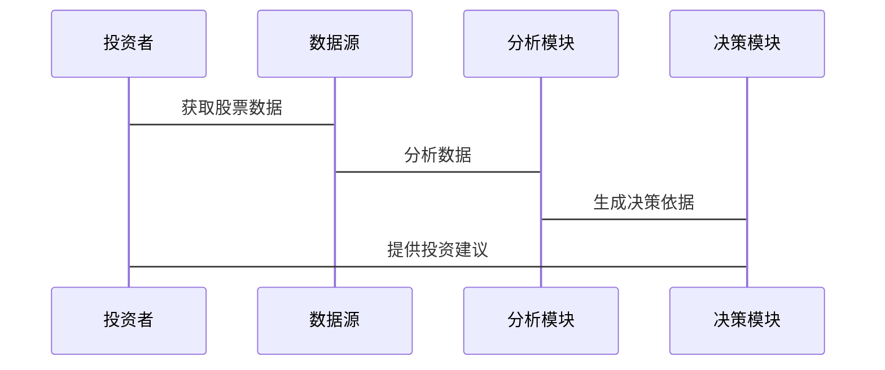

                 


# 费雪的十五个投资点：选股的黄金法则

## 关键词：费雪投资点，选股法则，成长股，投资策略，投资分析

## 摘要：本文详细解读了菲利普·费雪的投资理念，特别是其著名的十五个投资点，为投资者提供了一套系统化的选股方法。文章从背景介绍、核心概念分析、算法原理、数学模型、系统架构设计、项目实战等多个方面展开，帮助读者深入理解并实际应用费雪的投资策略，以做出明智的投资决策。

---

# 第一部分：费雪投资理念概述

## 第1章：费雪投资理念的背景与核心思想

### 1.1 费雪其人：投资大师的生平简介
菲利普·费雪（Philip Fisher）是20世纪最著名的价值投资者之一，被誉为“成长股投资之父”。他于1906年出生于美国加利福尼亚州，1926年进入哈佛大学，随后在投资领域取得了卓越成就。费雪的投资理念强调长期成长和深入研究，他的思想对现代投资理论产生了深远影响。

### 1.2 费雪投资理念的核心思想
费雪的核心思想是寻找那些具备持续增长潜力的公司，即成长股。他认为，投资成功的关键在于找到那些管理优秀、行业地位稳固、财务健康且具有创新能力的公司。他提出了著名的“十五个投资点”，为投资者提供了一套系统化的选股法则。

### 1.3 费雪投资理念的现实意义
尽管费雪的投资理念提出于几十年前，但其核心思想在今天依然具有重要的现实意义。随着全球经济的发展和市场的变化，投资者需要不断调整策略，但费雪的成长股理念为长期投资提供了宝贵的指导。

---

# 第二部分：费雪的十五个投资点

## 第2章：费雪十五个投资点的详细解读

### 2.1 投资点1：寻找成长股
**定义与特征**：成长股是指那些收入和利润能够持续增长的公司股票。这些公司通常处于高速发展的行业，具有较强的市场竞争力。

**筛选标准**：
- 收入增长率：过去几年收入持续增长，且未来增长潜力大。
- 净利润增长率：净利润持续增长，且利润率稳定或提高。

**投资策略**：
- 重点投资于具有持续增长潜力的行业，如科技、医疗等。
- 关注公司的市场份额和竞争优势。

### 2.2 投资点2：关注公司盈利能力
**盈利能力的衡量指标**：
- 净利润：衡量公司盈利能力的核心指标。
- 净利润率：净利润与营业收入的比率，反映公司每单位收入的盈利能力。

**分析方法**：
- 通过财务报表分析公司的盈利能力。
- 对比同行业公司的利润率，找出表现优异的公司。

### 2.3 投资点3：评估公司的财务状况
**财务报表分析的基本方法**：
- 资产负债表：分析公司的资产、负债和所有者权益。
- 利润表：分析公司的收入、成本和利润。
- 现金流量表：分析公司的现金流状况。

**关键指标**：
- 负债率：负债总额与资产总额的比率，反映公司的财务杠杆和风险。
- 资产周转率：营业收入与平均资产总额的比率，反映公司资产的使用效率。

### 2.4 投资点4：关注公司管理团队
**管理团队的素质与能力**：
- 领导力：管理层是否具备战略眼光和决策能力。
- 团队稳定性：管理团队是否稳定，是否有频繁的人员变动。

**利益一致性**：
- 管理层与股东的利益是否一致，例如通过股票期权激励管理层。

### 2.5 投资点5：分析公司的行业地位
**行业分析的基本方法**：
- 市场结构：行业是垄断还是竞争激烈的。
- 市场容量：行业的市场规模和增长潜力。

**市场占有率**：
- 公司的市场份额是否处于领先地位，是否具有竞争优势。

### 2.6 投资点6：评估公司的创新能力
**创新能力的定义与衡量标准**：
- 创新能力是指公司在产品、技术、商业模式等方面的创新能力。
- 创新的频率和质量：公司是否能够持续推出新产品或改进现有产品。

**创新能力与公司竞争优势的关系**：
- 创新能力强的公司通常具有更强的市场竞争力和增长潜力。

### 2.7 投资点7：关注公司的市场前景
**市场需求的预测与分析**：
- 行业的需求增长是否持续，是否有足够的市场空间。

**市场增长潜力的评估**：
- 市场的未来发展潜力，包括政策支持、技术进步等因素。

### 2.8 投资点8：关注公司的财务健康度
**财务健康度的衡量指标**：
- 资产负债率：反映公司的债务负担。
- 现金流：公司是否有稳定的现金流，能否支持持续的业务发展。

### 2.9 投资点9：评估公司的竞争优势
**竞争优势的来源**：
- 技术优势：公司是否拥有独特的技术或专利。
- 成本优势：公司在生产或运营中的成本是否低于竞争对手。
- 品牌优势：公司品牌是否具有强大的市场影响力。

### 2.10 投资点10：关注公司的管理层决策风格
**管理层的决策风格**：
- 是否具备长期战略眼光，是否注重股东利益。

**决策透明度**：
- 公司管理层是否愿意公开信息，与投资者保持良好的沟通。

### 2.11 投资点11：分析公司的行业风险
**行业风险的定义**：
- 行业面临的政策、经济和技术风险。

**行业风险的评估**：
- 行业的周期性：行业的波动性是否大，是否受经济周期影响。
- 政策风险：行业是否受到政府政策的限制或支持。

### 2.12 投资点12：关注公司的财务杠杆
**财务杠杆的定义**：
- 财务杠杆是指公司通过债务融资来放大股东权益回报的能力。

**财务杠杆的风险**：
- 高财务杠杆可能导致公司财务负担加重，风险增加。

### 2.13 投资点13：评估公司的成长空间
**成长空间的定义**：
- 公司未来的增长潜力，包括市场规模、产品扩展能力等。

**成长空间的分析**：
- 公司是否能够在现有市场中进一步扩大份额，或者是否能够开拓新的市场。

### 2.14 投资点14：关注公司的创新能力
**创新能力的持续性**：
- 公司是否能够持续创新，推出新产品或改进现有产品。

**创新成果的评估**：
- 创新成果是否能够转化为实际的收入增长和利润提升。

### 2.15 投资点15：评估公司的长期发展潜力
**长期发展潜力的定义**：
- 公司未来几年的收入和利润是否能够持续增长。

**长期发展潜力的分析**：
- 公司是否具备持续增长的核心竞争力，如技术、市场、管理等方面。

---

# 第三部分：费雪投资点的系统架构设计

## 第3章：系统功能设计

### 3.1 领域模型设计


### 3.2 系统架构设计


### 3.3 接口设计
- 数据接口：从股票数据库获取公司财务数据、管理层信息、市场前景等。
- 分析接口：调用分析模块中的成长率计算、市盈率计算、财务健康度评估等方法。
- 决策接口：根据分析结果生成投资建议。

### 3.4 交互设计


---

# 第四部分：项目实战

## 第4章：项目实战与代码实现

### 4.1 环境安装
- Python 3.8+
- Pandas、NumPy、Matplotlib、Scikit-learn等库。

### 4.2 核心代码实现
```python
import pandas as pd
import numpy as np

# 数据加载
df = pd.read_csv('stocks.csv')

# 计算成长率
def calculate_growth_rate(data, years=3):
    return (data['收入'].pct_change(periods=years) * 100).round(2)

# 计算市盈率
def calculate_pe_ratio(data):
    return data['市盈率'].round(2)

# 评估财务健康度
def assess_financial_health(data):
    health_score = 0
    if data['资产负债率'] < 50:
        health_score += 20
    if data['现金流'] > 0:
        health_score += 30
    if data['净利润率'] > 10:
        health_score += 30
    return health_score

# 分析竞争优势
def analyze_competitive_advantage(data):
    advantage_score = 0
    if data['市场份额'] > 0.2:
        advantage_score += 20
    if data['创新专利数'] > 5:
        advantage_score += 20
    if data['品牌影响力'] > 0.2:
        advantage_score += 30
    return advantage_score

# 主函数
def main():
    df['成长率'] = calculate_growth_rate(df)
    df['市盈率'] = calculate_pe_ratio(df)
    df['财务健康度'] = df.apply(assess_financial_health, axis=1)
    df['竞争优势'] = df.apply(analyze_competitive_advantage, axis=1)
    df.to_csv('分析结果.csv', index=False)

if __name__ == "__main__":
    main()
```

### 4.3 案例分析
假设我们有以下数据：
| 股票代码 | 收入 | 净利润 | 市盈率 | 资产负债率 | 现金流 | 市场份额 | 创新专利数 | 品牌影响力 |
|----------|------|--------|--------|------------|--------|-----------|------------|------------|
| A        | 100  | 20     | 15     | 40%        | 10     | 20%       | 5          | 中          |
| B        | 150  | 30     | 20     | 30%        | 15     | 25%       | 6          | 高          |

计算结果：
- 股票A：
  - 成长率：20%
  - 财务健康度：50
  - 竞争优势：40
- 股票B：
  - 成长率：50%
  - 财务健康度：60
  - 竞争优势：50

根据费雪的投资点，股票B在多个方面表现优于股票A，更具投资价值。

---

# 第五部分：总结与展望

## 第5章：总结与展望

### 5.1 最佳实践 tips
- 深入研究公司的财务数据和管理层信息。
- 结合行业前景和市场潜力进行综合分析。
- 长期持有优质成长股，避免频繁交易。

### 5.2 小结
费雪的十五个投资点为投资者提供了一套系统化的选股法则。通过深入分析公司的成长潜力、财务健康度、竞争优势和市场前景，投资者可以找到具有长期增长潜力的优质股票。

### 5.3 注意事项
- 投资有风险，需谨慎选择投资标的。
- 定期复盘和调整投资组合，以适应市场变化。

### 5.4 拓展阅读
- 费雪的《成长股投资策略》。
- 其他投资大师的选股法则，如彼得·林奇的成长股投资法。

---

通过以上分析和实战，我们深入理解了费雪的投资理念，并能够实际应用到投资决策中，为读者提供了清晰的投资指导。

