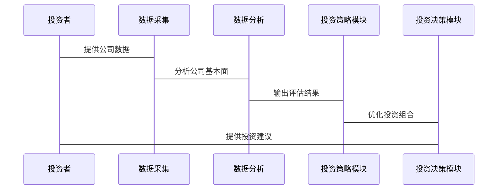

                 


# 费雪的十五个投资点：选股策略详解

> 关键词：费雪投资理论，选股策略，基本面分析，财务报表分析，投资点解读

> 摘要：本文详细解读了费雪的投资理论，重点分析了其十五个投资点，并通过系统化的分析框架、数学模型和实际案例，探讨了这些投资点在现代选股策略中的应用。文章从理论背景、核心要点、实际操作等多个维度展开，旨在为投资者提供一套科学、系统的选股方法。

---

# 第1章 费雪投资理念的核心思想

## 1.1 费雪投资理论的背景与意义

### 1.1.1 费雪投资理论的起源
费雪（Philip Fisher）是20世纪著名的投资家，他的投资理念以“成长股”理论闻名。费雪的投资方法强调长期持有优质股票，关注公司的成长性和盈利能力。他的投资理论不仅影响了后来的投资者，也为现代选股策略奠定了基础。

### 1.1.2 费雪投资理论的核心思想
费雪的核心思想是：投资成功的关键在于选择具有持续成长潜力的公司，并长期持有这些股票。他认为，投资者应该关注公司的基本面，特别是公司的盈利能力、财务健康状况和管理团队的能力。

### 1.1.3 费雪投资理论的现代应用价值
在当今复杂的市场环境中，费雪的投资理论依然具有重要的指导意义。通过分析公司的基本面和行业地位，投资者可以更好地识别具有长期增长潜力的公司，从而在市场波动中保持稳健的投资回报。

## 1.2 费雪十五个投资点的概述

### 1.2.1 投资点的分类与特点
费雪提出的十五个投资点可以分为三大类：
1. **公司基本面分析**：包括盈利能力、财务健康状况等。
2. **行业与市场分析**：包括行业周期、竞争优势等。
3. **管理与团队评估**：包括管理层能力、公司治理等。

### 1.2.2 投资点的核心要素与逻辑关系
费雪的投资点是一个有机的整体，每个点都与其他点相互关联，共同构成了一个完整的选股框架。例如，盈利能力是公司成长的核心，而财务健康状况则是公司成长的保障。

### 1.2.3 投资点的实战应用与案例分析
通过实际案例分析，我们可以更好地理解费雪投资点的应用。例如，分析某公司的财务报表，判断其盈利能力、资产质量和行业地位，从而决定是否投资该公司。

## 1.3 费雪投资理论的逻辑框架

### 1.3.1 投资决策的三要素
费雪的投资框架强调了三个关键要素：
1. **公司基本面**：包括盈利能力、财务状况等。
2. **行业地位**：包括市场占有率、竞争优势等。
3. **管理层能力**：包括管理团队的决策能力、企业治理等。

### 1.3.2 投资点的权重分配
在实际操作中，投资者需要根据具体情况给每个投资点赋予不同的权重。例如，盈利能力的重要性可能高于行业地位。

### 1.3.3 投资点的动态调整机制
市场环境和公司状况会不断变化，因此投资者需要动态调整投资点的权重和关注重点。例如，在经济衰退期间，财务健康状况可能成为更重要的考虑因素。

## 1.4 本章小结

### 1.4.1 费雪投资理论的核心要点总结
费雪的投资理论以基本面分析为核心，强调选择具有持续成长潜力的公司，并长期持有。

### 1.4.2 投资点的逻辑框架与实际应用
通过系统化的分析框架，投资者可以更好地识别具有长期增长潜力的公司，并制定科学的投资策略。

### 1.4.3 本书的结构安排与内容概览
本书将从理论背景、核心要点、实际操作等多个维度展开，帮助投资者全面理解和掌握费雪的投资策略。

---

# 第2章 费雪十五个投资点的详细解读

## 2.1 投资点1: 公司基本面分析

### 2.1.1 公司基本面的核心要素
公司基本面分析是选股的核心，包括以下几个方面：
1. **盈利能力**：包括净利润、毛利率等指标。
2. **财务状况**：包括资产负债表、现金流等。
3. **行业地位**：包括市场占有率、竞争优势等。

### 2.1.2 财务报表分析的关键指标
通过分析财务报表，我们可以获取公司的盈利能力、资产质量和财务健康状况等信息。例如，净利润率（Net Profit Margin）的计算公式为：
$$ \text{净利润率} = \frac{\text{净利润}}{\text{营业收入}} \times 100\% $$

### 2.1.3 行业分析与竞争地位评估
行业分析是公司基本面分析的重要组成部分。例如，可以通过计算市场份额（Market Share）来评估公司的行业地位：
$$ \text{市场份额} = \frac{\text{公司销售额}}{\text{行业总销售额}} \times 100\% $$

---

## 2.2 投资点2: 盈利能力分析

### 2.2.1 净利润与毛利率的关系
净利润是公司盈利能力的核心指标，而毛利率则反映了公司在成本控制方面的表现。例如，毛利率（Gross Profit Margin）的计算公式为：
$$ \text{毛利率} = \frac{\text{营业收入} - \text{营业成本}}{\text{营业收入}} \times 100\% $$

### 2.2.2 净资产收益率（ROE）的计算与意义
净资产收益率（ROE）是衡量公司盈利能力的重要指标，公式为：
$$ \text{ROE} = \frac{\text{净利润}}{\text{净资产}} \times 100\% $$

### 2.2.3 盈利能力的行业对比分析
通过将公司的盈利能力与行业平均水平进行对比，可以更好地评估公司的竞争地位。

---

## 2.3 投资点3: 资产质量评估

### 2.3.1 资产负债表分析的关键点
资产负债表分析是评估资产质量的重要手段，包括流动资产、非流动资产、流动负债和非流动负债等。

### 2.3.2 存货周转率与应收账款周转率的计算
存货周转率（Inventory Turnover）和应收账款周转率（Accounts Receivable Turnover）是衡量资产流动性的重要指标。例如，存货周转率的计算公式为：
$$ \text{存货周转率} = \frac{\text{营业成本}}{\text{平均存货}} $$

---

## 2.4 投资点4: 财务健康状况评估

### 2.4.1 负债结构分析与偿债能力评估
负债结构分析是评估财务健康状况的重要内容，包括短期负债和长期负债的比例。

### 2.4.2 现金流分析与企业流动性管理
现金流分析是评估企业流动性的重要手段，包括经营活动现金流、投资活动现金流和筹资活动现金流。

### 2.4.3 财务健康状况对投资决策的影响
财务健康状况良好的公司通常具有更强的抗风险能力和增长潜力。

---

## 2.5 投资点5: 市场地位与竞争优势

### 2.5.1 市场份额的计算与分析
市场份额是衡量市场地位的重要指标，公式为：
$$ \text{市场份额} = \frac{\text{公司销售额}}{\text{行业总销售额}} \times 100\% $$

### 2.5.2 核心竞争力的评估指标
核心竞争力是公司在市场竞争中的优势，包括技术创新、成本优势、品牌影响力等。

### 2.5.3 竞争优势的动态变化与投资机会
竞争优势不是一成不变的，投资者需要关注公司的创新能力和发展潜力。

---

## 2.6 投资点6: 管理层能力评估

### 2.6.1 管理层的背景与经验分析
管理层的背景和经验是评估公司治理的重要因素，包括管理团队的稳定性、决策能力和企业治理水平。

### 2.6.2 管理层决策的透明度与风险控制
管理层的决策透明度和风险控制能力直接影响公司的长期发展。

### 2.6.3 管理层能力对投资决策的影响
优秀的管理层能够带领公司实现持续增长，从而为投资者创造更大的价值。

---

## 2.7 投资点7: 行业周期分析

### 2.7.1 行业周期的定义与特征
行业周期包括衰退期、复苏期、成长期和成熟期四个阶段。

### 2.7.2 行业周期对投资策略的影响
在不同行业周期下，投资者需要调整投资策略。例如，在行业成长期，应选择具有较强竞争优势的公司。

### 2.7.3 行业周期的预测与实际应用
通过分析宏观经济指标和行业数据，投资者可以更好地预测行业周期的变化。

---

## 2.8 投资点8: 公司成长性评估

### 2.8.1 公司成长性的定义与衡量指标
公司成长性是指公司未来收入和利润的增长潜力，常用的衡量指标包括收入增长率和净利润增长率。

### 2.8.2 收入增长率的计算与分析
收入增长率的计算公式为：
$$ \text{收入增长率} = \frac{\text{本年收入} - \text{上年收入}}{\text{上年收入}} \times 100\% $$

### 2.8.3 净利润增长率的计算与分析
净利润增长率的计算公式为：
$$ \text{净利润增长率} = \frac{\text{本年净利润} - \text{上年净利润}}{\text{上年净利润}} \times 100\% $$

---

## 2.9 投资点9: 财务杠杆与资本结构

### 2.9.1 财务杠杆的定义与作用
财务杠杆是指公司通过借款来放大股东权益回报的能力。

### 2.9.2 资本结构的优化与风险控制
优化资本结构可以降低公司的财务风险，提高资本回报率。

### 2.9.3 财务杠杆对投资决策的影响
过高的财务杠杆可能导致公司面临更大的财务风险，投资者需要综合考虑。

---

## 2.10 投资点10: 现金流健康状况

### 2.10.1 现金流的定义与分类
现金流包括经营活动现金流、投资活动现金流和筹资活动现金流。

### 2.10.2 现金流健康状况的评估指标
现金流健康状况可以通过现金流比率（Cash Flow Ratio）来衡量，公式为：
$$ \text{现金流比率} = \frac{\text{经营活动现金流净额}}{\text{净利润}} $$

---

## 2.11 投资点11: 产品生命周期分析

### 2.11.1 产品生命周期的定义与阶段划分
产品生命周期包括导入期、成长期、成熟期和衰退期四个阶段。

### 2.11.2 产品生命周期对投资策略的影响
在产品生命周期的不同阶段，投资者需要调整投资策略。例如，在成长期应选择具有创新能力和市场潜力的公司。

---

## 2.12 投资点12: 行业集中度分析

### 2.12.1 行业集中度的定义与衡量指标
行业集中度是指行业内主要企业的市场份额集中程度，常用的衡量指标包括CR4（前4大企业的市场份额）和HHI指数（赫芬达尔-赫希曼指数）。

### 2.12.2 行业集中度对投资策略的影响
高集中度的行业通常具有更强的竞争优势和定价能力，但同时也可能面临更大的竞争压力。

---

## 2.13 投资点13: 公司治理结构

### 2.13.1 公司治理结构的定义与重要性
公司治理结构是公司内部管理的重要组成部分，包括董事会结构、管理层职责和股东权利等。

### 2.13.2 股东权利的保护与公司治理
良好的公司治理结构可以有效保护股东权利，提高公司治理透明度。

### 2.13.3 公司治理对投资决策的影响
优秀的公司治理结构能够提高公司的管理效率和抗风险能力，从而为投资者创造更大的价值。

---

## 2.14 投资点14: 行业政策与法规环境

### 2.14.1 行业政策的定义与影响
行业政策是指政府对行业发展的政策支持和监管措施，包括税收政策、行业准入政策等。

### 2.14.2 法规环境对投资策略的影响
行业政策和法规环境的变化可能对公司的经营和投资产生重大影响，投资者需要密切关注相关政策变化。

---

## 2.15 投资点15: 公司创新能力

### 2.15.1 创新能力的定义与衡量指标
创新能力是指公司在技术创新、产品创新和管理创新等方面的综合能力。

### 2.15.2 创新能力对投资策略的影响
具有强大创新能力的公司通常具有更强的市场竞争力和增长潜力，是投资者的理想选择。

---

## 2.16 本章小结

### 2.16.1 费雪十五个投资点的核心要点总结
费雪的投资点涵盖了公司基本面分析、行业地位评估、财务健康状况评估、管理层能力评估等多个方面。

### 2.16.2 投资点的系统化分析与实际应用
通过系统化的分析框架，投资者可以更好地识别具有长期增长潜力的公司，并制定科学的投资策略。

### 2.16.3 费雪投资理论的现代价值与应用
费雪的投资理论在现代投资实践中依然具有重要的指导意义，可以帮助投资者在复杂多变的市场环境中做出明智的投资决策。

---

# 第3章 费雪投资理论的数学模型与估值方法

## 3.1 投资价值的量化评估

### 3.1.1 股票估值的基本原理
股票估值是投资决策的重要环节，常用的估值方法包括市盈率（P/E）、市净率（P/B）和股息率等。

### 3.1.2 市盈率的计算与应用
市盈率的计算公式为：
$$ \text{市盈率} = \frac{\text{股价}}{\text{每股收益}} $$

---

## 3.2 盈利能力的量化分析

### 3.2.1 净资产收益率（ROE）的计算
$$ \text{ROE} = \frac{\text{净利润}}{\text{净资产}} \times 100\% $$

### 3.2.2 资产回报率（ROA）的计算
$$ \text{ROA} = \frac{\text{净利润}}{\text{总资产}} \times 100\% $$

---

## 3.3 财务健康状况的量化评估

### 3.3.1 流动比率的计算
$$ \text{流动比率} = \frac{\text{流动资产}}{\text{流动负债}} $$

### 3.3.2 速动比率的计算
$$ \text{速动比率} = \frac{\text{速动资产}}{\text{流动负债}} $$

---

## 3.4 投资组合的优化与风险控制

### 3.4.1 投资组合的构建
通过合理配置资产，投资者可以降低投资组合的整体风险。

### 3.4.2 风险与收益的平衡
在投资过程中，投资者需要在风险和收益之间找到平衡点，以实现长期稳定的投资回报。

---

## 3.5 本章小结

### 3.5.1 投资价值的量化评估方法
通过数学模型和估值方法，投资者可以更好地量化投资价值，做出科学的投资决策。

### 3.5.2 费雪投资理论的数学模型与实际应用
数学模型的应用可以帮助投资者更好地理解和掌握费雪投资理论的核心思想，并将其应用于实际投资实践中。

---

# 第4章 费雪投资理论的系统分析与架构设计

## 4.1 问题场景介绍

### 4.1.1 投资决策的复杂性
在实际投资中，投资者需要综合考虑多个因素，包括公司基本面、行业地位、财务状况、管理层能力等。

### 4.1.2 系统化分析的必要性
通过系统化的方法，投资者可以更好地识别具有长期增长潜力的公司，并制定科学的投资策略。

---

## 4.2 系统功能设计

### 4.2.1 领域模型设计
以下是领域模型的类图：

```mermaid
classDiagram
    class 公司基本面 {
        + 净利润: float
        + 毛利率: float
        + 资产负债表: 资产负债表
        + 现金流表: 现金流表
    }
    class 财务状况 {
        + 流动比率: float
        + 速动比率: float
        + 净资产收益率: float
    }
    class 竞争优势 {
        + 市场份额: float
        + 行业地位: string
        + 核心竞争力: string
    }
    class 管理层能力 {
        + 管理团队稳定性: boolean
        + 决策透明度: boolean
    }
    company -> 财务状况
    company -> 竞争优势
    company -> 管理层能力
```

---

## 4.3 系统架构设计

### 4.3.1 系统架构设计
以下是系统架构图：

```mermaid
architecturalDiagram
    subsystem 投资者界面 {
        component 输入模块
        component 输出模块
    }
    subsystem 数据处理模块 {
        component 数据采集
        component 数据分析
        component 数据存储
    }
    subsystem 投资策略模块 {
        component 公司基本面分析
        component 财务状况评估
        component 竞争优势分析
        component 管理层能力评估
    }
    subsystem 投资决策模块 {
        component 投资组合优化
        component 风险控制
    }
    投资者界面 --> 数据处理模块
    数据处理模块 --> 投资策略模块
    投资策略模块 --> 投资决策模块
```

---

## 4.4 系统接口设计

### 4.4.1 输入接口设计
投资者可以通过输入模块输入公司财务数据、行业数据等信息。

### 4.4.2 输出接口设计
系统会根据输入数据，输出投资建议和投资组合优化方案。

---

## 4.5 系统交互设计

### 4.5.1 系统交互流程
以下是系统交互流程图：



---

## 4.6 本章小结

### 4.6.1 系统化分析的必要性
通过系统化的分析框架，投资者可以更好地识别具有长期增长潜力的公司，并制定科学的投资策略。

### 4.6.2 费雪投资理论的系统架构设计
系统的架构设计为投资者提供了一个清晰的分析框架，有助于更好地理解和应用费雪投资理论。

---

# 第5章 费雪投资理论的项目实战与案例分析

## 5.1 环境安装

### 5.1.1 投资分析工具的选择
常用的 investment analysis tools include Bloomberg, Morningstar, and Excel.

### 5.1.2 数据获取与处理
投资者需要获取公司的财务数据、行业数据等信息。

---

## 5.2 核心实现

### 5.2.1 Python代码实现
以下是Python代码实现：

```python
import pandas as pd

# 读取数据
data = pd.read_csv('company_data.csv')

# 计算市盈率
data['PE'] = data['股价'] / data['每股收益']

# 计算ROE
data['ROE'] = data['净利润'] / data['净资产'] * 100

# 输出结果
print(data[['公司名称', 'PE', 'ROE']])
```

---

## 5.3 代码应用解读与分析

### 5.3.1 数据处理与分析
通过Python代码，投资者可以快速计算公司的重要财务指标，如市盈率和ROE。

### 5.3.2 投资决策的辅助
通过分析财务指标，投资者可以更好地评估公司的投资价值。

---

## 5.4 实际案例分析

### 5.4.1 案例背景介绍
假设我们选择某公司进行分析。

### 5.4.2 数据分析与评估
通过分析公司的财务数据和行业数据，评估其是否符合费雪的投资点。

### 5.4.3 投资决策与建议
根据分析结果，提出投资建议。

---

## 5.5 本章小结

### 5.5.1 项目实战的必要性
通过实际案例分析，投资者可以更好地理解费雪投资理论的核心思想，并将其应用于实际投资中。

### 5.5.2 费雪投资理论的实际应用与扩展
费雪投资理论的应用不仅限于股票投资，还可以扩展到其他投资领域。

---

# 第6章 费雪投资理论的总结与最佳实践

## 6.1 费雪投资理论的核心要点总结

### 6.1.1 投资理念的核心思想
费雪的投资理念以基本面分析为核心，强调选择具有持续成长潜力的公司。

### 6.1.2 十五个投资点的核心要点
费雪的投资点涵盖了公司基本面分析、行业地位评估、财务健康状况评估、管理层能力评估等多个方面。

---

## 6.2 费雪投资理论的最佳实践

### 6.2.1 投资策略的制定
投资者需要根据具体情况制定科学的投资策略，包括资产配置、风险控制等。

### 6.2.2 投资组合的优化
通过合理配置资产，投资者可以降低投资组合的整体风险。

### 6.2.3 风险管理的注意事项
投资者需要时刻关注市场变化，及时调整投资策略，以应对可能出现的风险。

---

## 6.3 投资者需要注意的事项

### 6.3.1 风险提示
投资有风险，投资者需要根据自身风险承受能力制定投资策略。

### 6.3.2 市场环境的变化
市场环境的变化可能对投资决策产生重大影响，投资者需要保持高度敏感。

---

## 6.4 拓展阅读与深入学习

### 6.4.1 费雪投资理论的经典书籍
推荐阅读费雪的《成长股投资策略》。

### 6.4.2 现代投资理论的发展
了解现代投资理论的发展，如现代资产组合理论（CAPM）等。

---

# 附录

## 附录A 费雪投资理论的数学公式汇总

## 附录B 常用投资工具与资源

## 附录C 投资术语表

---

# 结语

通过本文的详细解读，我们深入探讨了费雪的投资理论，并通过系统化的分析框架、数学模型和实际案例，帮助投资者更好地理解和掌握费雪的投资策略。希望本文能够为投资者提供有价值的参考和启发，帮助他们在复杂的市场环境中做出明智的投资决策。

