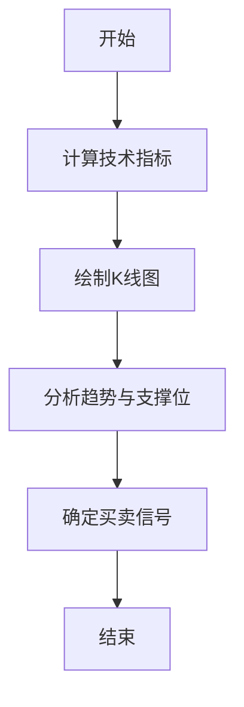

                 


# 费雪的十五个投资要点：选股的艺术

## 关键词：投资策略，选股艺术，费雪投资要点，技术分析，风险管理，长期投资

## 摘要：费雪的投资理念以基本面分析和长期投资为核心，强调选择具有持续竞争优势和优秀管理团队的企业。本文通过详细解析费雪的十五个投资要点，结合技术分析和数学模型，为投资者提供系统化的选股方法，涵盖投资背景、核心概念、算法原理、系统架构、项目实战及最佳实践，帮助读者掌握科学的投资策略。

---

## 第一部分：投资背景与费雪理念

### 第1章：投资的基本概念与原则

#### 1.1 投资的基本概念
- 投资的定义与分类
- 投资的核心目标：资产增值与风险控制
- 投资的基本原则：分散投资、长期持有、价值发现

#### 1.2 费雪投资理念的背景
- 费雪的生平与投资风格
- 费雪投资理念的核心：基本面分析与长期投资
- 费雪理念在现代投资中的应用与演变

---

## 第二部分：费雪的十五个投资要点

### 第2章：投资要点一：理解企业的基本面

#### 2.1 企业的基本面分析
- 财务报表分析：利润表、资产负债表、现金流量表
- 企业盈利能力：ROE、ROA、净利率分析
- 行业地位与竞争优势：波特五力模型

#### 2.2 财务健康状况评估
- 负债与流动比率：$流动资产/流动负债$
- 利润质量：净利润与现金流匹配度
- 财务风险：杠杆率与偿债能力

### 第3章：投资要点二：寻找具有持续竞争优势的企业

#### 3.1 持续竞争优势的定义
- 投资者如何识别企业的核心竞争力
- 技术壁垒、品牌优势、成本优势分析

#### 3.2 竞争优势的持久性
- 行业周期与竞争优势的变化
- 技术进步对企业竞争优势的影响

### 第4章：投资要点三：关注企业的管理团队

#### 4.1 管理团队的重要性
- 团队稳定性与决策能力
- 高管薪酬与公司绩效的关系

#### 4.2 管理团队的评估方法
- 企业治理结构：董事会与管理层职责
- 管理层的历史业绩与未来承诺

---

## 第三部分：技术分析与数学模型

### 第5章：技术分析在投资中的应用

#### 5.1 技术分析的基本原理
- K线图：开盘价、收盘价、最高价、最低价
- 均线与趋势线：短期与长期趋势判断
- 成交量分析：成交量与价格变动的关系

#### 5.2 费雪选股模型的技术分析部分


### 第6章：数学模型与投资决策

#### 6.1 费雪选股模型的数学基础
- 股票估值公式：$$内在价值 = 股息率 \times (1 + 增长率)^{-1}$$
- 风险调整回报模型：$$夏普比率 = (E[r] - r_f) / \sigma$$

#### 6.2 基于费雪要点的选股算法
```python
def fisher选股策略(股票数据):
    for stock in 股票列表:
        计算ROE = 净利润 / 平均股东权益
        计算ROA = 净利润 / 平均总资产
        计算毛利率 = (收入 - 成本) / 收入
        计算净利率 = 净利润 / 收入
        如果 ROE > 行业平均且毛利率稳步增长:
            添加到候选名单
    返回候选名单
```

---

## 第四部分：系统架构与投资实战

### 第7章：投资决策支持系统的架构设计

#### 7.1 系统功能设计
- 数据采集模块：实时数据获取与存储
- 数据分析模块：基于费雪要点的选股算法
- 投资组合管理模块：风险评估与资产配置

#### 7.2 系统架构图


### 第8章：项目实战：基于费雪要点的选股策略实现

#### 8.1 环境搭建
- 数据源：股票数据接口API
- 工具：Python、Pandas、Matplotlib

#### 8.2 核心代码实现
```python
import pandas as pd
import matplotlib.pyplot as plt

def 计算ROE(数据):
    roe = 数据['净利润'] / 数据['股东权益']
    return roe

数据 = pd.read_csv('股票数据.csv')
roe = 计算ROE(数据)
plt.plot(roe)
plt.title('ROE趋势图')
plt.show()
```

---

## 第五部分：最佳实践与小结

### 第9章：最佳实践与注意事项

#### 9.1 投资中的常见误区
- 过度依赖技术分析
- 忽略企业的基本面
- 过度交易与情绪化决策

#### 9.2 费雪投资要点的现代应用
- 结合ESG因素进行选股
- 利用大数据与AI优化投资策略

### 第10章：总结与展望

#### 10.1 费雪投资要点的核心价值
- 长期投资与价值发现
- 风险控制与资产配置

#### 10.2 未来投资策略的发展方向
- 数字化投资与智能投顾
- 可持续投资与社会责任投资

---

通过系统地分析费雪的十五个投资要点，结合技术分析与数学模型，本文为投资者提供了一套科学的选股方法。希望读者能够通过本文，掌握基本面分析与技术分析的结合，实现稳健的投资回报。

