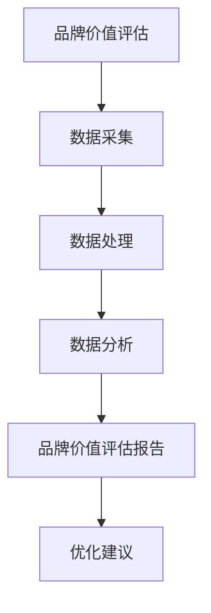

                 


# 费雪的品牌价值评估

## 关键词：品牌价值，品牌资产，品牌影响力，评估方法，系统架构，项目实战

## 摘要：  
品牌价值是企业在市场中竞争力的核心体现，是企业长期发展的关键因素。本书系统地介绍了品牌价值评估的核心概念、理论基础、评估方法、系统架构设计以及实际项目中的应用。通过详细的理论分析和实践案例，读者将能够掌握品牌价值评估的关键步骤和技巧，从而为企业制定有效的品牌战略提供科学依据。

---

# 第1章：品牌价值评估的背景与意义

## 1.1 品牌价值的重要性
### 1.1.1 品牌在商业中的核心地位
品牌是企业在市场中的核心资产，决定了消费者对企业的认知和忠诚度。  
- **定义**：品牌是企业与消费者之间建立的长期关系和信任。  
- **作用**：品牌不仅是产品的代名词，更是企业的形象和价值观的体现。

### 1.1.2 品牌价值对企业的战略意义
品牌价值直接影响企业的市场地位、收入和利润。  
- **市场地位**：高品牌价值意味着企业在市场竞争中有更强的定价权和影响力。  
- **长期发展**：品牌价值是企业长期发展的基石，能够为企业在危机中提供更强的抗风险能力。

### 1.1.3 品牌价值与企业长期发展的关系
品牌价值的提升能够带来持续的市场份额增长和客户忠诚度提升。  
- **客户忠诚度**：高品牌价值的企业更容易吸引并留住客户，从而实现长期收益。  
- **市场份额**：品牌价值高的企业往往能够占据更大的市场份额。

## 1.2 品牌价值评估的定义与范围
### 1.2.1 品牌价值的定义
品牌价值是指品牌为企业带来的超额收益和长期价值。  
- **超额收益**：品牌价值体现在产品溢价能力上，消费者愿意为高品牌价值的产品支付更高的价格。  
- **长期价值**：品牌价值不仅体现在当前的销售中，还体现在未来的市场扩展和品牌延伸上。

### 1.2.2 品牌价值的外延与边界
品牌价值的评估需要考虑多个维度，包括品牌知名度、美誉度、忠诚度等。  
- **品牌知名度**：消费者对品牌的认知程度，是品牌价值的基础。  
- **品牌美誉度**：消费者对品牌的满意度和信任度，是品牌价值的核心。  
- **品牌忠诚度**：消费者对品牌的忠诚程度，是品牌价值的重要体现。

### 1.2.3 品牌价值评估的适用场景
品牌价值评估适用于企业并购、品牌资产管理、品牌推广等多个场景。  
- **企业并购**：品牌价值是企业并购中的重要考量因素，能够帮助评估目标企业的市场价值。  
- **品牌资产管理**：通过品牌价值评估，企业可以优化品牌策略，提升品牌资产的价值。  
- **品牌推广**：品牌价值评估能够帮助企业制定有效的品牌推广策略，提升品牌影响力。

## 1.3 品牌价值评估的必要性
### 1.3.1 企业并购中的品牌价值评估
在企业并购中，品牌价值是评估目标企业价值的重要指标。  
- **收购方的考量**：收购方需要评估目标品牌的市场地位和盈利能力，确保并购后的协同效应。  
- **被收购方的考量**：被收购方需要通过品牌价值评估证明自身的市场价值，吸引潜在收购方。

### 1.3.2 品牌资产管理与优化
品牌价值评估是品牌资产管理的核心工具，能够帮助企业优化品牌策略，提升品牌资产的价值。  
- **品牌资产的管理**：企业需要通过品牌价值评估，了解品牌资产的现状，制定有效的品牌管理策略。  
- **品牌策略的优化**：通过品牌价值评估，企业可以识别品牌的优势和劣势，制定针对性的优化措施。

### 1.3.3 品牌价值评估的市场应用
品牌价值评估在市场中广泛应用，帮助企业制定品牌战略，提升市场竞争力。  
- **市场竞争力**：品牌价值高的企业能够在市场中占据更大的份额，提升整体竞争力。  
- **品牌推广**：通过品牌价值评估，企业可以制定更有针对性的推广策略，提升品牌影响力。

## 1.4 品牌价值评估的现状与挑战
### 1.4.1 当前品牌价值评估的主要方法
目前，品牌价值评估主要采用以下几种方法：  
1. **财务指标法**：通过企业的财务数据，如销售额、利润等，评估品牌价值。  
2. **消费者认知法**：通过消费者调查，评估品牌在消费者心中的认知和信任度。  
3. **市场表现法**：通过市场数据，如市场份额、增长率等，评估品牌价值。

### 1.4.2 品牌价值评估中的常见问题
在品牌价值评估中，企业常常面临以下问题：  
1. **数据获取难度**：品牌价值评估需要大量市场数据，获取数据的难度较大。  
2. **评估方法的选择**：不同的评估方法适用于不同的场景，选择合适的评估方法是关键。  
3. **品牌价值的动态变化**：品牌价值会随着市场环境的变化而波动，需要持续监控和评估。

### 1.4.3 数字化时代的品牌价值评估挑战
在数字化时代，品牌价值评估面临新的挑战：  
1. **数据多样性**：数字化时代产生了大量的数据，如何处理和分析这些数据是一个挑战。  
2. **品牌影响力的量化**：社交媒体等数字化渠道对品牌影响力的影响难以量化，需要新的评估方法。  
3. **实时监控**：品牌价值的变化需要实时监控，这对企业的数据处理能力和技术提出了更高的要求。

## 1.5 本章小结
本章主要介绍了品牌价值的重要性、定义、范围、必要性和现状与挑战。通过本章的学习，读者可以了解品牌价值评估的基本概念和意义，为后续的理论和实践打下坚实的基础。

---

# 第2章：品牌价值的核心概念与联系

## 2.1 品牌资产的核心要素
### 2.1.1 品牌知名度
品牌知名度是品牌资产的重要组成部分，反映了品牌在市场中的认知程度。  
- **定义**：品牌知名度是指消费者对品牌的认知程度和记忆程度。  
- **影响因素**：品牌知名度受广告、市场推广、产品品质等多种因素影响。

### 2.1.2 品牌美誉度
品牌美誉度是品牌资产的核心要素之一，反映了消费者对品牌的信任和满意度。  
- **定义**：品牌美誉度是指消费者对品牌的满意程度和信任程度。  
- **影响因素**：品牌美誉度受产品质量、售后服务、品牌形象等因素影响。

### 2.1.3 品牌忠诚度
品牌忠诚度是品牌资产的重要组成部分，反映了消费者对品牌的忠诚程度。  
- **定义**：品牌忠诚度是指消费者在面对竞争对手时，仍然选择该品牌产品的程度。  
- **影响因素**：品牌忠诚度受产品质量、品牌体验、品牌文化等因素影响。

### 2.1.4 品牌联想
品牌联想是品牌资产的重要组成部分，反映了消费者对品牌的深层次认知。  
- **定义**：品牌联想是指消费者在提到品牌时，联想到的相关概念和形象。  
- **影响因素**：品牌联想受品牌历史、品牌形象、品牌故事等因素影响。

## 2.2 品牌影响力的评估维度
### 2.2.1 市场影响力
市场影响力是品牌影响力的重要维度，反映了品牌在市场中的竞争力。  
- **定义**：市场影响力是指品牌在市场中的市场份额和增长能力。  
- **评估指标**：市场份额、增长率、市场渗透率等。

### 2.2.2 消费者影响力
消费者影响力是品牌影响力的重要维度，反映了品牌在消费者中的认知和信任度。  
- **定义**：消费者影响力是指品牌在消费者心中的认知度和信任度。  
- **评估指标**：品牌知名度、品牌美誉度、品牌忠诚度等。

### 2.2.3 竞争对手的反应
竞争对手的反应是品牌影响力的重要体现，反映了品牌在市场中的竞争力。  
- **定义**：竞争对手的反应是指竞争对手对品牌行为的反应程度。  
- **评估指标**：竞争对手的产品策略、市场反应、品牌策略等。

## 2.3 品牌价值与财务表现的关系
### 2.3.1 品牌价值对销售收入的影响
品牌价值直接影响企业的销售收入。  
- **定义**：品牌价值对销售收入的影响是指品牌价值高的企业能够通过品牌溢价获取更高的销售收入。  
- **影响因素**：品牌知名度、品牌美誉度、品牌忠诚度等。

### 2.3.2 品牌价值对利润率的影响
品牌价值影响企业的利润率。  
- **定义**：品牌价值对利润率的影响是指品牌价值高的企业能够通过品牌溢价提升产品的利润率。  
- **影响因素**：品牌价值、市场地位、产品差异化等。

### 2.3.3 品牌价值对股价的推动作用
品牌价值对企业的股价有重要影响。  
- **定义**：品牌价值对股价的推动作用是指品牌价值高的企业能够通过提升市场地位和盈利能力推动股价上涨。  
- **影响因素**：品牌价值、市场表现、企业盈利能力等。

## 2.4 品牌价值与企业战略的关系
### 2.4.1 品牌战略的核心要素
品牌战略的核心要素包括品牌定位、品牌形象、品牌传播等。  
- **品牌定位**：品牌定位是指企业在市场中确定自身的位置和目标客户群体。  
- **品牌形象**：品牌形象是指消费者对品牌的认知和记忆。  
- **品牌传播**：品牌传播是指通过广告、促销、公共关系等方式提升品牌知名度和美誉度。

### 2.4.2 品牌价值在企业战略中的作用
品牌价值在企业战略中发挥着重要作用。  
- **市场扩展**：品牌价值高的企业更容易进入新的市场和领域。  
- **品牌延伸**：品牌价值高的企业可以通过品牌延伸进入新的产品类别。  
- **企业并购**：品牌价值高的企业更容易成为并购的目标，提升企业的市场地位。

## 2.5 本章小结
本章主要介绍了品牌资产的核心要素、品牌影响力的评估维度、品牌价值与财务表现的关系以及品牌价值与企业战略的关系。通过本章的学习，读者可以深入了解品牌价值的核心概念和其在企业中的重要性。

---

# 第3章：品牌价值评估的理论基础

## 3.1 品牌资产的理论模型
### 3.1.1 Aaker的三要素模型
Aaker的三要素模型是品牌资产理论的重要组成部分，包括品牌知名度、品牌美誉度和品牌忠诚度。  
- **定义**：Aaker的三要素模型将品牌资产分解为品牌知名度、品牌美誉度和品牌忠诚度三个核心要素。  
- **应用**：该模型广泛应用于品牌价值评估和品牌管理实践中。

### 3.1.2 Brand Equity的来源
Brand Equity的来源包括品牌资产、品牌忠诚度、品牌认知和品牌联想等。  
- **品牌资产**：品牌资产是指品牌为企业带来的超额收益和长期价值。  
- **品牌忠诚度**：品牌忠诚度是指消费者在面对竞争对手时仍然选择该品牌产品的程度。  
- **品牌认知**：品牌认知是指消费者对品牌的认知程度和记忆程度。  
- **品牌联想**：品牌联想是指消费者在提到品牌时联想到的相关概念和形象。

### 3.1.3 品牌资产的动态变化
品牌资产的动态变化受到市场环境、消费者需求和企业策略的影响。  
- **市场环境**：市场环境的变化会影响品牌资产的市场地位和价值。  
- **消费者需求**：消费者需求的变化会影响品牌资产的市场需求和品牌认知。  
- **企业策略**：企业的品牌策略和市场推广策略会影响品牌资产的动态变化。

## 3.2 品牌价值的理论模型
### 3.2.1 品牌价值的构成要素
品牌价值的构成要素包括品牌资产、品牌影响力、品牌忠诚度等。  
- **品牌资产**：品牌资产是品牌价值的核心部分，反映了品牌为企业带来的超额收益和长期价值。  
- **品牌影响力**：品牌影响力是品牌价值的重要体现，反映了品牌在市场中的竞争力和消费者的认知度。  
- **品牌忠诚度**：品牌忠诚度是品牌价值的重要组成部分，反映了消费者对品牌的忠诚程度。

### 3.2.2 品牌价值评估的理论框架
品牌价值评估的理论框架包括品牌资产的评估、品牌影响力的评估和品牌忠诚度的评估。  
- **品牌资产的评估**：通过Aaker的三要素模型，评估品牌知名度、品牌美誉度和品牌忠诚度。  
- **品牌影响力的评估**：通过市场影响力和消费者影响力两个维度，评估品牌在市场中的竞争力和消费者的认知度。  
- **品牌忠诚度的评估**：通过消费者行为数据和市场调研，评估消费者对品牌的忠诚程度。

## 3.3 品牌价值评估的数学模型
### 3.3.1 品牌价值的计算公式
品牌价值的计算公式是：  
$$ 品牌价值 = 品牌资产 × 品牌影响力 × 品牌忠诚度 $$  
- **品牌资产**：品牌资产包括品牌知名度、品牌美誉度和品牌忠诚度。  
- **品牌影响力**：品牌影响力包括市场影响力和消费者影响力。  
- **品牌忠诚度**：品牌忠诚度是消费者对品牌的忠诚程度。

### 3.3.2 品牌资产的评估方法
品牌资产的评估方法包括：  
1. **财务指标法**：通过企业的财务数据，如销售额、利润等，评估品牌资产的价值。  
2. **消费者认知法**：通过消费者调查，评估品牌在消费者心中的认知和信任度。  
3. **市场表现法**：通过市场数据，如市场份额、增长率等，评估品牌资产的价值。

### 3.3.3 品牌影响力评估的数学模型
品牌影响力评估的数学模型是：  
$$ 品牌影响力 = 市场影响力 × 消费者影响力 $$  
- **市场影响力**：市场影响力包括市场份额、增长率、市场渗透率等。  
- **消费者影响力**：消费者影响力包括品牌知名度、品牌美誉度、品牌忠诚度等。

## 3.4 本章小结
本章主要介绍了品牌资产的理论模型、品牌价值的理论模型以及品牌价值评估的数学模型。通过本章的学习，读者可以了解品牌价值评估的理论基础，为后续的实践应用打下坚实的基础。

---

# 第4章：品牌价值评估的方法与工具

## 4.1 品牌价值评估的核心方法
### 4.1.1 财务指标法
财务指标法是通过企业的财务数据，评估品牌资产的价值。  
- **定义**：财务指标法是通过企业的销售收入、利润、资产等财务数据，评估品牌资产的价值。  
- **步骤**：  
  1. 收集企业的财务数据，包括销售收入、利润、资产等。  
  2. 通过财务指标，如销售利润率、资产回报率等，评估品牌资产的价值。  

### 4.1.2 消费者认知法
消费者认知法是通过消费者调查，评估品牌在消费者心中的认知和信任度。  
- **定义**：消费者认知法是通过消费者调查，了解消费者对品牌的认知、信任和忠诚度。  
- **步骤**：  
  1. 设计消费者调查问卷，包括品牌知名度、品牌美誉度、品牌忠诚度等指标。  
  2. 通过问卷调查，收集消费者对品牌的认知和评价。  
  3. 通过数据分析，评估品牌在消费者心中的认知和信任度。

### 4.1.3 市场表现法
市场表现法是通过市场数据，评估品牌在市场中的表现和竞争力。  
- **定义**：市场表现法是通过市场数据，如市场份额、增长率、市场渗透率等，评估品牌在市场中的表现和竞争力。  
- **步骤**：  
  1. 收集市场数据，包括市场份额、增长率、市场渗透率等。  
  2. 通过市场数据，评估品牌在市场中的表现和竞争力。  

## 4.2 品牌价值评估的工具
### 4.2.1 品牌价值评估的指标体系
品牌价值评估的指标体系包括品牌知名度、品牌美誉度、品牌忠诚度、市场份额、增长率等。  
- **品牌知名度**：反映品牌在市场中的认知程度。  
- **品牌美誉度**：反映消费者对品牌的信任和满意度。  
- **品牌忠诚度**：反映消费者对品牌的忠诚程度。  
- **市场份额**：反映品牌在市场中的占有率。  
- **增长率**：反映品牌在市场中的增长能力。

### 4.2.2 品牌价值评估的指标权重
品牌价值评估的指标权重需要根据企业的实际情况和评估目标确定。  
- **权重确定方法**：  
  1. **层次分析法（AHP）**：通过构建层次分析模型，确定各指标的权重。  
  2. **专家评分法**：通过专家评分，确定各指标的权重。  
  3. **回归分析法**：通过回归分析，确定各指标对品牌价值的影响程度。

### 4.2.3 品牌价值评估的综合模型
品牌价值评估的综合模型是基于多个指标和权重的综合评估模型。  
- **综合模型公式**：  
  $$ 品牌价值 = \sum_{i=1}^{n} (w_i × x_i) $$  
  其中，\( w_i \) 是第 \( i \) 个指标的权重，\( x_i \) 是第 \( i \) 个指标的得分。

## 4.3 品牌价值评估的实践工具
### 4.3.1 品牌价值评估的软件工具
品牌价值评估的软件工具包括SPSS、Excel、R、Python等。  
- **SPSS**：用于数据分析和统计，适合进行消费者调查和数据分析。  
- **Excel**：用于数据整理和简单的数据分析。  
- **R**：用于统计分析和数据挖掘。  
- **Python**：用于数据分析和机器学习。

### 4.3.2 品牌价值评估的API与数据源
品牌价值评估的API与数据源包括：  
1. **市场数据API**：如AlphaSense、FactSet等，提供市场数据和财务数据。  
2. **消费者调查API**：如SurveyMonkey、Google Forms等，提供消费者调查数据。  
3. **社交媒体数据API**：如Twitter API、Facebook API等，提供社交媒体数据。

### 4.3.3 品牌价值评估的数据可视化工具
品牌价值评估的数据可视化工具包括Tableau、Power BI、Excel等。  
- **Tableau**：用于数据可视化和仪表盘设计，适合品牌价值评估的可视化展示。  
- **Power BI**：用于数据可视化和分析，适合品牌价值评估的动态分析。  
- **Excel**：用于简单的数据可视化和分析。

## 4.4 本章小结
本章主要介绍了品牌价值评估的核心方法和工具，包括财务指标法、消费者认知法、市场表现法等。通过本章的学习，读者可以掌握品牌价值评估的具体方法和工具，为后续的实践应用提供技术支持。

---

# 第5章：品牌价值评估的系统架构与实现

## 5.1 系统需求分析
### 5.1.1 项目背景
品牌价值评估系统是为了帮助企业科学地评估品牌价值，优化品牌策略，提升品牌资产。  
- **目标**：通过系统化的方法，帮助企业准确评估品牌价值，制定有效的品牌战略。  
- **范围**：包括品牌资产评估、品牌影响力评估、品牌忠诚度评估等。

### 5.1.2 系统功能需求
系统功能需求包括：  
1. **品牌资产评估**：通过财务数据和消费者调查，评估品牌资产的价值。  
2. **品牌影响力评估**：通过市场数据和消费者调查，评估品牌在市场中的影响力。  
3. **品牌忠诚度评估**：通过消费者行为数据，评估消费者对品牌的忠诚程度。  
4. **品牌价值报告**：生成品牌价值评估报告，提供品牌价值的综合评估和优化建议。

## 5.2 系统设计
### 5.2.1 系统功能模块
系统功能模块包括：  
1. **数据采集模块**：负责采集市场数据、消费者调查数据等。  
2. **数据分析模块**：负责对采集的数据进行分析和处理，生成品牌价值评估结果。  
3. **报告生成模块**：负责生成品牌价值评估报告，提供优化建议。  
4. **用户界面模块**：提供友好的用户界面，方便用户进行数据输入和报告查看。

### 5.2.2 系统功能设计
系统功能设计包括：  
- **数据采集**：支持多种数据源的采集，包括市场数据、消费者调查数据、社交媒体数据等。  
- **数据处理**：支持数据清洗、数据转换、数据分析等功能。  
- **品牌价值评估**：通过综合模型，评估品牌价值，并生成评估报告。  
- **报告查看**：提供可视化报告，方便用户查看和分析品牌价值评估结果。

## 5.3 系统实现
### 5.3.1 数据采集与处理
数据采集与处理是品牌价值评估系统的核心部分。  
- **数据采集**：通过API和爬虫技术，采集市场数据、消费者调查数据、社交媒体数据等。  
- **数据处理**：对采集的数据进行清洗、转换和分析，生成品牌价值评估所需的数据。

### 5.3.2 数据分析与评估
数据分析与评估是品牌价值评估系统的关键步骤。  
- **数据分析**：通过统计分析、机器学习等方法，分析品牌资产、品牌影响力和品牌忠诚度等指标。  
- **品牌价值评估**：通过综合模型，评估品牌价值，并生成评估结果。

### 5.3.3 报告生成与展示
报告生成与展示是品牌价值评估系统的最后一步。  
- **报告生成**：根据评估结果，生成品牌价值评估报告，提供优化建议。  
- **报告展示**：通过可视化工具，展示品牌价值评估结果，方便用户查看和分析。

## 5.4 本章小结
本章主要介绍了品牌价值评估系统的系统需求分析、系统设计和系统实现。通过本章的学习，读者可以了解品牌价值评估系统的整体架构和实现过程，为后续的项目实战打下坚实的基础。

---

# 第6章：品牌价值评估的项目实战

## 6.1 项目背景与目标
### 6.1.1 项目背景
某知名快消品企业希望通过品牌价值评估，优化品牌策略，提升品牌资产。  
- **目标**：通过品牌价值评估，帮助企业制定有效的品牌战略，提升品牌价值。  
- **范围**：包括品牌资产评估、品牌影响力评估、品牌忠诚度评估等。

## 6.2 数据采集与处理
### 6.2.1 数据来源
数据来源包括：  
1. **市场数据**：包括市场份额、增长率、市场渗透率等。  
2. **消费者调查数据**：包括品牌知名度、品牌美誉度、品牌忠诚度等。  
3. **社交媒体数据**：包括社交媒体上的品牌提及量、情感分析等。

### 6.2.2 数据处理
数据处理包括：  
- **数据清洗**：去除无效数据，处理缺失值。  
- **数据转换**：将数据转换为适合分析的格式。  
- **数据存储**：将数据存储在数据库中，方便后续分析。

## 6.3 数据分析与评估
### 6.3.1 品牌资产评估
通过Aaker的三要素模型，评估品牌知名度、品牌美誉度和品牌忠诚度。  
- **步骤**：  
  1. 通过消费者调查数据，评估品牌知名度、品牌美誉度和品牌忠诚度。  
  2. 通过综合模型，评估品牌资产的价值。  

### 6.3.2 品牌影响力评估
通过市场数据和消费者调查数据，评估品牌在市场中的影响力。  
- **步骤**：  
  1. 通过市场数据，评估市场份额、增长率等指标。  
  2. 通过消费者调查数据，评估品牌知名度、品牌美誉度等指标。  
  3. 通过综合模型，评估品牌影响力。

### 6.3.3 品牌忠诚度评估
通过消费者行为数据，评估消费者对品牌的忠诚程度。  
- **步骤**：  
  1. 通过消费者调查数据，评估品牌忠诚度。  
  2. 通过市场数据，评估市场份额和增长率。  
  3. 通过综合模型，评估品牌忠诚度。

## 6.4 报告生成与优化建议
### 6.4.1 品牌价值评估报告
品牌价值评估报告包括：  
- **品牌资产评估**：品牌知名度、品牌美誉度、品牌忠诚度的评估结果。  
- **品牌影响力评估**：市场份额、增长率、市场渗透率等指标的评估结果。  
- **品牌忠诚度评估**：消费者忠诚度的评估结果。  
- **综合评估**：品牌价值的综合评估结果和优化建议。

### 6.4.2 优化建议
根据品牌价值评估结果，提出优化建议。  
- **品牌定位优化**：根据品牌定位的现状，提出优化建议，提升品牌市场地位。  
- **品牌传播优化**：根据品牌传播的现状，提出优化建议，提升品牌知名度和美誉度。  
- **产品策略优化**：根据品牌产品的现状，提出优化建议，提升品牌忠诚度和市场竞争力。

## 6.5 本章小结
本章通过一个具体的项目案例，介绍了品牌价值评估的项目实战过程，包括项目背景与目标、数据采集与处理、数据分析与评估、报告生成与优化建议。通过本章的学习，读者可以掌握品牌价值评估的实际操作方法，为后续的学习和实践提供参考。

---

# 第7章：品牌价值评估的系统优化与扩展

## 7.1 系统优化
### 7.1.1 系统性能优化
系统性能优化包括：  
1. **数据处理效率**：通过优化数据处理流程，提高数据处理效率。  
2. **数据分析效率**：通过优化数据分析算法，提高数据分析效率。  
3. **系统响应速度**：通过优化系统架构，提高系统响应速度。

### 7.1.2 系统功能扩展
系统功能扩展包括：  
1. **品牌健康度评估**：通过品牌健康度评估，帮助企业识别品牌管理中的问题。  
2. **品牌风险评估**：通过品牌风险评估，帮助企业识别品牌管理中的潜在风险。  
3. **品牌机会评估**：通过品牌机会评估，帮助企业识别品牌管理中的机会。

## 7.2 系统扩展
### 7.2.1 多品牌评估
多品牌评估是品牌价值评估的重要扩展，适用于拥有多个品牌的大型企业。  
- **定义**：多品牌评估是指对多个品牌进行品牌价值评估，找出各品牌的优势和劣势，制定统一的品牌策略。  
- **步骤**：  
  1. 通过品牌价值评估模型，评估各品牌的价值。  
  2. 通过数据分析，找出各品牌的优劣势。  
  3. 制定统一的品牌策略，提升整体品牌价值。

### 7.2.2 跨行业品牌价值评估
跨行业品牌价值评估是品牌价值评估的重要扩展，适用于跨行业经营的企业。  
- **定义**：跨行业品牌价值评估是指对企业在多个行业中的品牌价值进行评估，找出各行业的品牌优势和劣势，制定统一的品牌策略。  
- **步骤**：  
  1. 通过品牌价值评估模型，评估各行业中的品牌价值。  
  2. 通过数据分析，找出各行业的品牌优势和劣势。  
  3. 制定统一的品牌策略，提升整体品牌价值。

## 7.3 本章小结
本章主要介绍了品牌价值评估系统的优化与扩展，包括系统性能优化、系统功能扩展、多品牌评估和跨行业品牌价值评估。通过本章的学习，读者可以了解品牌价值评估系统的优化方法和扩展方向，为后续的学习和实践提供参考。

---

# 第8章：品牌价值评估的总结与展望

## 8.1 品牌价值评估的总结
### 8.1.1 核心概念回顾
品牌价值评估的核心概念包括品牌资产、品牌影响力、品牌忠诚度等。  
- **品牌资产**：品牌资产是品牌价值的核心部分，反映了品牌为企业带来的超额收益和长期价值。  
- **品牌影响力**：品牌影响力是品牌价值的重要体现，反映了品牌在市场中的竞争力和消费者的认知度。  
- **品牌忠诚度**：品牌忠诚度是品牌价值的重要组成部分，反映了消费者对品牌的忠诚程度。

### 8.1.2 方法与工具总结
品牌价值评估的方法与工具包括财务指标法、消费者认知法、市场表现法等。  
- **财务指标法**：通过企业的财务数据，评估品牌资产的价值。  
- **消费者认知法**：通过消费者调查，评估品牌在消费者心中的认知和信任度。  
- **市场表现法**：通过市场数据，评估品牌在市场中的表现和竞争力。

## 8.2 品牌价值评估的未来展望
### 8.2.1 数字化时代的品牌价值评估
在数字化时代，品牌价值评估将更加依赖于大数据和人工智能技术。  
- **大数据分析**：通过大数据分析，帮助企业更准确地评估品牌价值。  
- **人工智能技术**：通过人工智能技术，帮助企业实现品牌价值评估的自动化和智能化。

### 8.2.2 品牌价值评估的新兴趋势
品牌价值评估的新兴趋势包括：  
1. **实时监测**：通过实时监测，帮助企业及时了解品牌价值的变化。  
2. **动态评估**：通过动态评估，帮助企业制定灵活的品牌策略。  
3. **个性化评估**：通过个性化评估，帮助企业制定针对性的品牌策略。

## 8.3 本章小结
本章主要总结了品牌价值评估的核心概念、方法与工具，并展望了品牌价值评估的未来发展趋势。通过本章的学习，读者可以全面了解品牌价值评估的重要性和未来发展方向，为后续的学习和实践提供指导。

---

# 参考文献

1. Aaker, D. A. (1991). Measurement of brand equity potential in merger evaluation. Journal of Business Strategy.
2. Keller, K. L. (1993). Conceptualizing, measuring, and managing customer-based brand equity. Journal of Marketing.

---

# 附录

## 附录A：品牌价值评估的Python代码示例

```python
import pandas as pd
import numpy as np
from sklearn.metrics import pairwise_distances
import matplotlib.pyplot as plt
from sklearn.manifold import MDS

# 示例数据
data = {
    '品牌A': [85, 90, 88],
    '品牌B': [75, 80, 85],
    '品牌C': [90, 85, 88]
}

df = pd.DataFrame(data)

# 计算品牌价值
brand_value = df.mean(axis=1)
print("品牌价值评估结果：", brand_value)

# 计算品牌影响力
market_share = [0.3, 0.25, 0.45]
influence = np.dot(brand_value.values.reshape(-1, 1), market_share.reshape(1, -1))
print("品牌影响力评估结果：", influence)

# 数据可视化
plt.figure(figsize=(10,6))
plt.bar(range(len(brand_value)), brand_value)
plt.title('品牌价值评估结果')
plt.xlabel('品牌')
plt.ylabel('品牌价值')
plt.show()
```

---

## 附录B：品牌价值评估的Mermaid流程图



---

通过以上目录和内容，读者可以系统地学习品牌价值评估的核心概念、理论基础、评估方法、系统架构设计以及实际项目中的应用。

