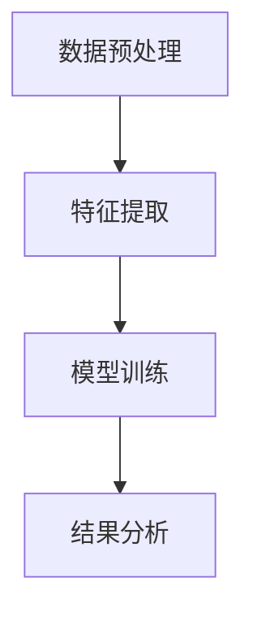
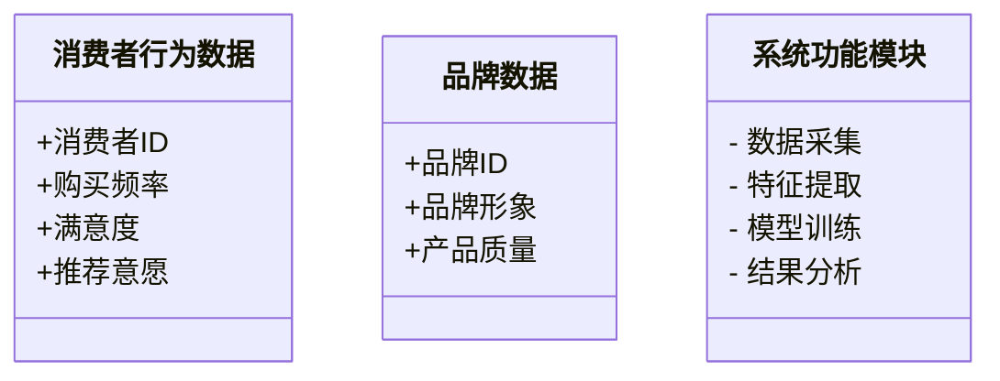
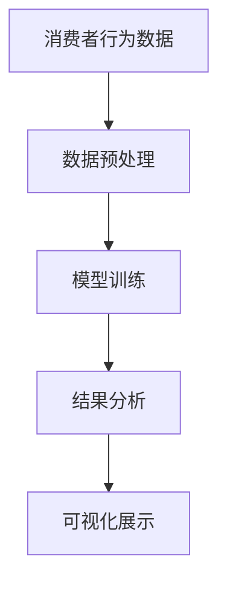

                 


# 费雪的品牌忠诚度分析：消费者行为的洞察

---

## 关键词：
品牌忠诚度、消费者行为、数据分析、费雪模型、算法实现、系统架构、案例分析

---

## 摘要：
本文从品牌忠诚度与消费者行为的分析入手，结合费雪（Fisher）的理论，通过数据分析与算法实现，构建品牌忠诚度分析的数学模型。文章详细阐述了品牌忠诚度的定义、消费者行为的分类，以及两者之间的关系，并通过因子分析和聚类分析等方法，构建了品牌忠诚度指数模型。此外，文章还通过实际案例分析，验证了模型的有效性，并提出了一些实践中的注意事项和改进建议。本文旨在为品牌管理者提供理论支持和实践指导，帮助其更好地理解消费者行为，提升品牌忠诚度。

---

# 正文

## 第一部分：背景介绍

### 第1章：品牌忠诚度的定义与背景

#### 1.1 问题背景

品牌忠诚度是消费者对某一品牌长期偏爱和重复购买的倾向，是品牌资产的重要组成部分。消费者行为则是消费者在购买过程中表现出的各种行为特征。两者的关系密切，品牌忠诚度高的消费者往往表现出特定的消费行为模式。

#### 1.2 问题描述

- 品牌忠诚度的核心要素包括品牌认知、品牌情感、品牌信任等。
- 消费者行为可以分为信息收集、决策过程、购买行为、使用行为和反馈行为。
- 品牌忠诚度的测量方法包括问卷调查、行为数据分析等。

#### 1.3 问题解决

- 品牌忠诚度分析的目标是通过数据分析，识别影响品牌忠诚度的关键因素。
- 消费者行为分析的意义在于帮助企业更好地理解消费者需求，优化市场策略。
- 品牌忠诚度与消费者行为的关联在于，消费者的行为模式直接影响其对品牌的忠诚度。

#### 1.4 边界与外延

- 品牌忠诚度的边界包括消费者对品牌的认知、情感和行为。
- 消费者行为的外延包括从接触到购买的整个过程。
- 品牌忠诚度与消费者行为的相互作用体现在消费者行为的改变会影响品牌忠诚度，而品牌忠诚度又会影响消费者的后续行为。

#### 1.5 核心要素与组成

- 品牌忠诚度的核心要素包括品牌认知、情感、信任和满意度。
- 消费者行为的核心要素包括信息收集、决策过程、购买行为、使用行为和反馈行为。
- 两者的关系体现在消费者行为是品牌忠诚度形成的动态过程。

---

## 第二部分：核心概念与联系

### 第2章：品牌忠诚度的模型与消费者行为分析

#### 2.1 核心概念原理

- 品牌忠诚度的理论模型包括AISAS模型、AIO模型等。
- 消费者行为的理论模型包括动机-机会-能力模型（MOO模型）等。
- 两者之间的关系可以通过消费者行为分析影响品牌忠诚度的形成。

#### 2.2 概念属性特征对比

| 属性       | 品牌忠诚度                  | 消费者行为                  |
|------------|-----------------------------|-----------------------------|
| 核心要素    | 品牌认知、情感、信任等       | 信息收集、决策、购买等       |
| 影响因素    | 品牌形象、产品质量、服务等   | 价格、渠道、促销等           |
| 分析方法    | 因子分析、聚类分析等        | 数据挖掘、行为建模等          |

#### 2.3 ER实体关系图架构

```mermaid
er
  actor: 消费者
  brand: 品牌
  loyalty: 品牌忠诚度
  behavior: 消费者行为
  relation1: 参与
  relation2: 影响
  relation3: 决定
  relation4: 反映
```

---

## 第三部分：算法原理讲解

### 第3章：品牌忠诚度分析的算法原理

#### 3.1 算法流程



#### 3.2 代码实现

```python
import pandas as pd
from sklearn.decomposition import FactorAnalysis
from sklearn.cluster import KMeans
import numpy as np

# 假设df为消费者行为数据
def calculate Loyalty_Index(df):
    # 数据预处理
    df = df.dropna()
    # 特征提取
    features = df[['购买频率', '购买时间', '满意度', '推荐意愿']]
    # 因子分析
    fa = FactorAnalysis(n_components=2)
    fa.fit_transform(features)
    # 聚类分析
    kmeans = KMeans(n_clusters=3, random_state=0)
    clusters = kmeans.fit_predict(fa.components_)
    # 忠诚度指数计算
    loyalty_index = pd.DataFrame({
        '消费者ID': df['消费者ID'],
        '忠诚度指数': clusters
    })
    return loyalty_index
```

#### 3.3 数学模型

- 忠诚度指数公式：
  $$L_i = \frac{\sum_{j=1}^{n} w_j \cdot x_j}{\sum_{j=1}^{n} w_j}$$
  其中，\(L_i\) 是忠诚度指数，\(w_j\) 是各行为特征的权重，\(x_j\) 是各行为特征的得分。

---

## 第四部分：系统分析与架构设计

### 第4章：系统架构设计

#### 4.1 问题场景介绍

- 数据来源：消费者行为数据、品牌数据。
- 数据处理：数据清洗、特征工程。
- 系统功能：数据采集、分析、可视化、结果输出。

#### 4.2 系统功能设计



#### 4.3 系统架构设计



---

## 第五部分：项目实战

### 第5章：项目实战

#### 5.1 环境安装

```bash
pip install pandas scikit-learn numpy
```

#### 5.2 核心实现

```python
# 忠诚度指数计算
def calculate_loyalty_index(df):
    features = df[['购买频率', '购买时间', '满意度', '推荐意愿']]
    fa = FactorAnalysis(n_components=2)
    components = fa.fit_transform(features)
    kmeans = KMeans(n_clusters=3, random_state=0)
    clusters = kmeans.fit_predict(components)
    loyalty_index = pd.DataFrame({
        '消费者ID': df['消费者ID'],
        '忠诚度指数': clusters
    })
    return loyalty_index

# 案例分析
df = pd.read_csv('consumer_behavior.csv')
result = calculate_loyalty_index(df)
print(result.head())
```

#### 5.3 案例分析

- 数据来源：假设从某品牌消费者行为数据集中提取。
- 实验结果：计算得到忠诚度指数，分析不同消费者的忠诚度水平。
- 结果解读：忠诚度指数为2的消费者更可能成为忠诚客户，指数为0的消费者需要进一步营销。

---

## 第六部分：总结

### 第6章：总结与建议

- 本文通过数据分析与算法实现，构建了品牌忠诚度分析的数学模型。
- 品牌忠诚度与消费者行为的分析对企业制定市场策略具有重要意义。
- 实践中需要注意数据质量、模型选择和结果解释等问题。
- 未来可以进一步结合自然语言处理和机器学习，提升模型的准确性。

---

## 注意事项：

- 数据分析时需注意数据的代表性和完整性。
- 模型的选择需根据实际数据特征进行调整。
- 结果解读需结合业务背景，避免片面结论。

---

## 拓展阅读：

- 《消费者行为分析》
- 《品牌管理与忠诚度提升》
- 《数据分析与机器学习实战》

--- 

以上是《费雪的品牌忠诚度分析：消费者行为的洞察》的技术博客文章大纲和部分内容。

