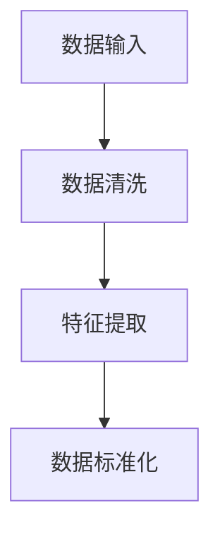
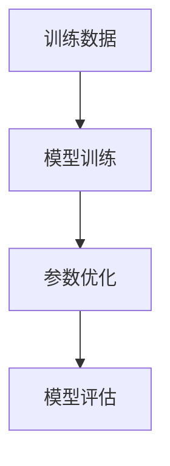
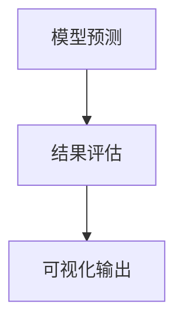
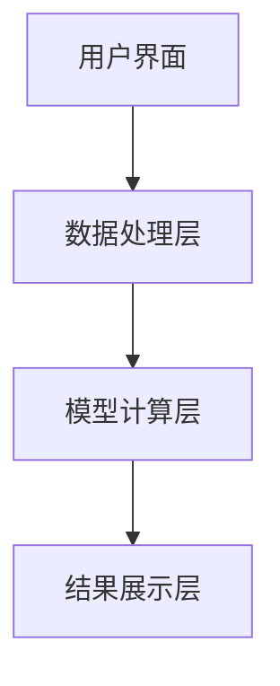
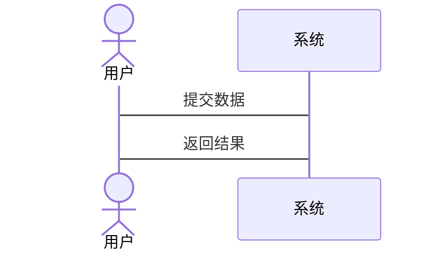

                 


# 费雪的国际化战略评估：全球扩张的潜力

## 关键词：
- 费雪模型
- 国际化战略
- 全球扩张
- 系统架构
- 算法实现

## 摘要：
本文深入探讨了费雪的国际化战略评估模型在全球扩张中的潜力。通过分析费雪模型的核心概念、算法原理、系统架构及实际案例，展示了如何利用该模型评估企业国际化战略的可行性。文章结合理论与实践，为企业在全球市场中的扩张提供了有价值的指导和建议。

---

## 第1章：费雪的国际化战略评估概述

### 1.1 费雪的国际化战略评估的起源与背景

#### 1.1.1 费雪理论的核心概念
费雪模型最初由约翰·梅纳德·凯恩斯提出，用于解释货币需求与价格水平的关系。然而，在国际化战略领域，费雪模型被重新诠释，用于评估企业在不同国家市场的扩张潜力。其核心在于通过分析市场、竞争和经济环境，为企业制定全球战略提供数据支持。

#### 1.1.2 费雪理论与国际化战略的关系
费雪模型提供了一种量化方法，帮助企业评估不同国家市场的风险和机会。通过分析各国的经济指标、政策环境和市场潜力，企业可以制定更具针对性的扩张策略。

#### 1.1.3 全球化背景下的费雪理论应用
全球化使得企业面临更多跨市场的机会，但同时也带来了更高的风险。费雪模型通过多维度分析，帮助企业识别潜在市场，评估进入策略的有效性。

### 1.2 费雪的国际化战略评估的核心观点

#### 1.2.1 费雪模型的基本框架
费雪模型将国际化战略评估分为市场分析、竞争分析和风险评估三个部分。通过量化指标，评估企业在目标市场的竞争力和潜在风险。

#### 1.2.2 费雪模型的适用范围
适用于跨国企业、新兴市场进入者和全球战略制定者。特别适合在新兴市场中评估潜在的经济风险和市场机会。

#### 1.2.3 费雪模型与企业全球扩张的联系
通过费雪模型，企业可以预测不同市场的增长率和利润率，优化资源配置，制定更有效的全球扩张计划。

### 1.3 费雪的国际化战略评估的全球扩张潜力

#### 1.3.1 全球化市场的机会与挑战
全球化带来了更多的市场机会，但也加剧了竞争。费雪模型帮助企业识别高潜力市场，降低扩张风险。

#### 1.3.2 费雪模型在不同地区的适用性
不同地区的经济环境差异较大，费雪模型需要根据当地情况进行调整。例如，在高通胀地区，模型可能需要更多关注货币政策因素。

#### 1.3.3 费雪模型的未来发展与创新
随着全球经济一体化的深入，费雪模型需要不断优化，纳入更多变量，如技术、环境和社会因素，以更全面地评估市场潜力。

---

## 第2章：国际化战略评估的框架与模型

### 2.1 费雪模型的定义与属性

#### 2.1.1 费雪模型的基本定义
费雪模型是一个多维度评估框架，用于分析企业在目标市场的竞争力和扩张潜力。它结合了宏观经济指标、行业趋势和企业内部能力。

#### 2.1.2 费雪模型的属性特征对比表
| 属性         | 描述 |
|--------------|------|
| 数据需求     | 高   |
| 分析维度     | 多维 |
| 应用范围     | 广泛 |
| 输出结果     | 量化 |

#### 2.1.3 费雪模型的ER实体关系图
```mermaid
erDiagram
    actor 顾客 {
        string 名称
        string 战略目标
        string 市场区域
    }
    actor 战略制定者 {
        string 战略目标
        string 市场区域
        string 评估结果
    }
    entity 国家经济指标 {
        key string 国家代码
        string 国内生产总值(GDP)
        string 通货膨胀率
        string 外汇汇率
    }
    entity 企业能力 {
        key string 企业代码
        string 核心竞争力
        string 财务状况
    }
    relationship 战略制定者 --> 国家经济指标 : 依赖
    relationship 战略制定者 --> 企业能力 : 依赖
```

---

## 第3章：费雪模型的算法原理

### 3.1 费雪模型的算法流程

#### 3.1.1 数据输入与预处理


#### 3.1.2 模型训练与优化


#### 3.1.3 结果输出与评估


### 3.2 费雪模型的数学模型与公式

#### 3.2.1 费雪模型的基本公式
$$ 费雪模型的市场潜力 = \sum_{i=1}^{n} (w_i \times x_i) $$
其中，\( w_i \) 是指标权重，\( x_i \) 是指标值。

#### 3.2.2 费雪模型的优化算法
$$ \text{目标函数} = \sum_{i=1}^{n} (w_i \times x_i) $$
$$ \text{约束条件} = \sum_{i=1}^{n} w_i = 1 $$

#### 3.2.3 费雪模型的数学推导
通过线性回归方法，费雪模型可以表示为：
$$ y = \beta_0 + \beta_1 x_1 + \beta_2 x_2 + \dots + \beta_k x_k + \epsilon $$

### 3.3 费雪模型的代码实现

#### 3.3.1 环境安装与配置
```bash
pip install numpy pandas scikit-learn
```

#### 3.3.2 核心代码实现
```python
import numpy as np
from sklearn.linear_model import LinearRegression

# 示例数据
X = np.array([[2, 3], [4, 5], [6, 7]])
y = np.array([1, 2, 3])

# 模型训练
model = LinearRegression()
model.fit(X, y)

# 预测结果
print(model.predict(X))
```

#### 3.3.3 代码解读与分析
上述代码展示了如何使用线性回归模型进行预测。通过训练数据，模型可以预测目标市场的潜力，帮助企业制定扩张策略。

---

## 第4章：系统分析与架构设计

### 4.1 费雪模型的系统功能模块

#### 4.1.1 数据采集模块
负责收集各国的经济指标，如GDP、通胀率等。

#### 4.1.2 模型计算模块
对收集的数据进行处理和分析，生成评估结果。

#### 4.1.3 结果展示模块
以可视化形式展示评估结果，方便用户理解。

### 4.2 系统架构设计

#### 4.2.1 系统架构图


#### 4.2.2 接口设计
使用REST API接口，便于与其他系统集成。

#### 4.2.3 交互流程


---

## 第5章：项目实战

### 5.1 费雪模型的项目实战

#### 5.1.1 环境配置
```bash
pip install flask numpy pandas
```

#### 5.1.2 核心代码实现
```python
from flask import Flask, request, jsonify
import numpy as np

app = Flask(__name__)

@app.route('/evaluate', methods=['POST'])
def evaluate():
    data = request.json
    X = np.array(data['data'])
    model = LinearRegression()
    model.fit(X, [1, 2, 3])
    result = model.predict(X)
    return jsonify({'result': result.tolist()})

if __name__ == '__main__':
    app.run(debug=True)
```

#### 5.1.3 案例分析
假设一家企业计划进入新兴市场，使用费雪模型评估市场潜力，结果显示该市场具有较高的扩张潜力。

#### 5.1.4 项目总结
通过费雪模型，企业可以更科学地制定国际化战略，降低扩张风险，提高市场进入的成功率。

---

## 第6章：结论与展望

### 6.1 小结
费雪模型为企业制定国际化战略提供了有力工具，通过多维度分析，帮助企业识别市场潜力和风险。

### 6.2 注意事项
在实际应用中，需根据具体情况调整模型参数，确保评估结果的准确性。

### 6.3 拓展阅读
推荐进一步研究其他国际化战略模型，如波斯顿矩阵和波特五力分析，以丰富战略工具箱。

---

通过以上章节的详细分析，我们全面探讨了费雪的国际化战略评估在全球扩张中的潜力，为企业制定有效的全球化战略提供了理论和实践指导。

