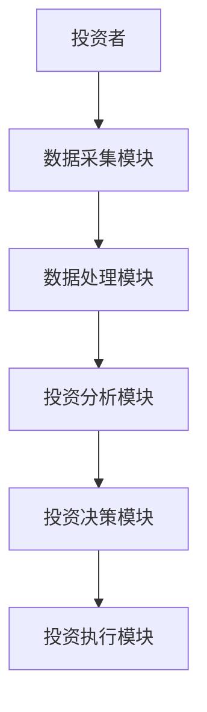

                 


# 费雪的增长型价值投资：平衡当前价值和未来潜力

## 关键词：费雪投资理论，增长型价值投资，内在价值，未来现金流，投资策略

## 摘要：本文深入探讨了菲利普·费雪的增长型价值投资理论，分析了其核心概念、数学模型及实际应用。通过系统架构设计和案例分析，展示了如何平衡当前价值与未来潜力，实现稳健投资回报。

---

## 第一部分: 增长型价值投资的背景与核心理念

### 第1章: 增长型价值投资的起源与发展

#### 1.1 增长型投资的起源

- **投资学的基本概念**  
  投资学研究如何通过资产配置和风险管理实现财富增长。传统投资理论包括股息贴现模型（DDM）和资本资产定价模型（CAPM），但这些方法在评估成长型企业时显得不足。

- **费雪投资理论的提出**  
  菲利普·费雪（Philip Fisher）在20世纪中期提出增长型价值投资，强调选择那些具有持续增长潜力的企业。他的理论认为，投资的回报不仅来自股息，还来自资本增值。

- **与传统价值投资的区别**  
  传统价值投资（如格雷厄姆的价值投资）关注低估值企业，而增长型投资关注高成长性企业。费雪提出，企业的未来现金流比当前收益更重要。

#### 1.2 费雪增长型价值投资的核心要素

- **股票的内在价值**  
  股票的内在价值是未来现金流的现值。费雪模型通过贴现率将未来现金流折现，计算内在价值。

- **股票的未来现金流**  
  企业的未来现金流取决于其盈利能力、行业地位和管理能力。费雪强调选择那些具有持续增长潜力的企业。

- **股东权益的长期增长**  
  股东权益的增长是企业长期价值增长的关键。费雪认为，优秀的企业能够持续创造股东价值，而不仅仅是短期收益。

### 第2章: 费雪增长型价值投资的数学模型

#### 2.1 费雪模型的数学表达式

$$ V = \frac{E_1}{(r - g)} $$

- **变量解释**  
  - \( V \)：股票的内在价值  
  - \( E_1 \)：第一年的预期收益（如每股收益）  
  - \( r \)：贴现率（反映风险的回报要求）  
  - \( g \)：收益的年增长率  

- **假设条件**  
  - 企业未来收益将以固定增长率 \( g \) 增长  
  - 贴现率 \( r \) 大于增长率 \( g \)  

- **模型优缺点**  
  优点：简单易用，适用于评估成长型企业  
  缺点：假设未来收益和增长率不变，可能与实际情况不符  

#### 2.2 模型的实际应用

- **案例分析**  
  假设某科技公司第一年收益为 $2，贴现率为 10%，增长率为 5%，则其内在价值为：

  $$ V = \frac{2}{0.10 - 0.05} = \frac{2}{0.05} = 40 $$

  即该股票的合理价值为 $40/每股。

---

## 第二部分: 增长型价值投资的系统分析与架构设计

### 第3章: 投资决策的系统架构

#### 3.1 系统功能模块划分

- **数据采集模块**  
  从财务报表、市场数据等来源获取企业信息。

- **数据处理模块**  
  清洗和整理数据，计算关键指标如市盈率、ROE等。

- **投资分析模块**  
  应用费雪模型评估股票价值，生成投资建议。

- **投资决策模块**  
  结合市场趋势、行业分析等因素，制定投资策略。

- **投资执行模块**  
  执行交易指令，监控投资组合。

#### 3.2 系统架构设计



---

## 第三部分: 增长型价值投资的项目实战

### 第4章: 项目实战：科技公司投资分析

#### 4.1 环境安装

- **开发工具**：Python 3.8+，Jupyter Notebook
- **数据源**：财务报表、行业报告、市场数据

#### 4.2 核心实现源代码

```python
# 费雪模型实现
def fisher_model(E1, r, g):
    return E1 / (r - g)

# 示例数据
E1 = 2  # 第一年收益
r = 0.10  # 贴现率
g = 0.05  # 收益增长率

# 计算内在价值
value = fisher_model(E1, r, g)
print(f"股票的内在价值为：{value}")
```

#### 4.3 案例分析

- **公司背景**  
  某科技公司近五年收入年均增长20%，净利润率15%，行业地位领先。

- **数据处理**  
  计算未来现金流，贴现至现值。

- **投资决策**  
  根据模型计算，股票价值被低估，建议买入并长期持有。

#### 4.4 项目小结

- 成功实现费雪模型的系统化应用
- 结合实际案例，验证模型的有效性
- 强调持续跟踪和动态调整的重要性

---

## 第四部分: 总结与展望

### 第5章: 总结与展望

#### 5.1 核心要点回顾

- 费雪增长型价值投资平衡了当前价值与未来潜力
- 数学模型提供了量化工具，帮助评估企业价值
- 系统架构确保了投资决策的科学性和可操作性

#### 5.2 未来研究方向

- 结合动态贴现率模型，优化评估精度
- 研究人工智能技术在投资分析中的应用
- 开发多因素模型，综合考虑更多变量

#### 5.3 最佳实践 Tips

- **持续学习**：市场环境不断变化，需持续更新知识和模型
- **分散投资**：避免过度集中，降低风险
- **长期视角**：耐心持有优质资产，避免短期波动干扰

---

## 结语

费雪的增长型价值投资为投资者提供了平衡当前价值与未来潜力的方法。通过深入理解其理论、模型和系统架构，投资者可以更科学地进行决策，实现稳健的财富增长。未来，随着技术进步和市场发展，增长型价值投资将继续演变，为投资者提供更多可能性。

