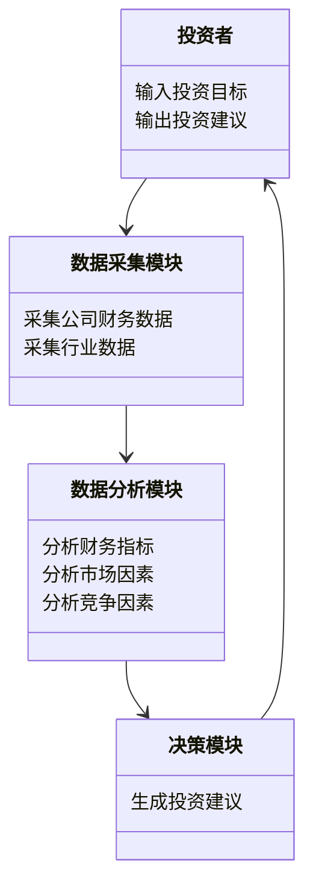
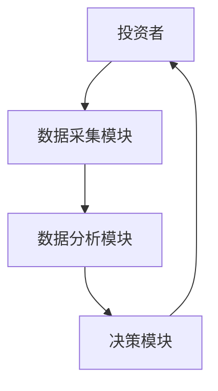

                 


# 费雪的增长型公司特征：识别未来赢家

## 关键词：费雪投资理念、增长型公司、财务指标分析、选股方法、投资系统架构

## 摘要：  
本文深入探讨了菲利普·费雪的增长型公司投资理念，分析其核心特征和识别方法。通过财务指标分析、系统架构设计和实战案例，揭示了如何筛选出具备持续增长潜力的优质企业，帮助投资者制定科学的投资策略。

---

## 第1章: 费雪投资理念概述

### 1.1 费雪投资理念的背景

#### 1.1.1 费雪的生平与投资哲学

菲利普·费雪（Philip Fisher）是20世纪著名的投资专家，以其“成长股投资”理念闻名。他强调投资于那些具备持续增长潜力的公司，并注重管理层的质量和公司的竞争优势。

#### 1.1.2 增长型投资的定义与核心理念

增长型投资是指投资于那些收入和利润能够持续增长的公司。费雪的核心理念是通过分析公司的财务数据、市场地位和竞争优势，识别出那些能够长期增长的企业。

#### 1.1.3 费雪与彼得·林奇的区别

虽然两者都关注成长型公司，但费雪更注重公司的长期增长潜力和管理层的质量，而彼得·林奇则更关注短期的市场趋势和估值。

### 1.2 增长型公司的定义与特征

#### 1.2.1 增长型公司的定义

增长型公司是指那些在较长的时间内，收入和利润能够持续增长，并且具备竞争优势的企业。

#### 1.2.2 增长型公司的核心特征

| 特征                | 描述                                   |
|---------------------|--------------------------------------|
| 高利润率             | 公司的毛利率和净利率较高              |
| 可持续增长           | 收入和利润能够持续增长                |
| 竞争优势           | 公司在行业内具备竞争优势              |
| 高质量的管理层     | 管理层具备战略眼光和执行力            |

#### 1.2.3 增长型公司与价值型公司的对比

| 特性                | 增长型公司                      | 价值型公司                     |
|---------------------|---------------------------------|-------------------------------|
| 投资逻辑          | 未来增长潜力                    | 当前低估值                      |
| 财务特征          | 高利润率、高增长                | 低估值、高股息率              |

### 1.3 费雪的增长型公司筛选标准

#### 1.3.1 高利润率公司的识别

高利润率是增长型公司的核心特征之一。通过分析公司的毛利率和净利率，可以初步判断公司的盈利能力。

#### 1.3.2 可持续增长的判断

通过分析公司的收入增长率和净利润增长率，可以判断公司的增长是否具备可持续性。

#### 1.3.3 竞争优势的评估

竞争优势是公司长期增长的关键。通过分析公司的市场地位、品牌影响力和技术创新能力，可以评估公司的竞争优势。

### 1.4 本章小结

本章介绍了费雪的投资理念，定义了增长型公司，并详细阐述了其核心特征和筛选标准。

---

## 第2章: 增长型公司的财务特征

### 2.1 财务指标分析

#### 2.1.1 收入增长率的计算与分析

收入增长率 = （当年收入 - 上年收入）/ 上年收入 × 100%

例如，某公司2022年收入为100亿元，2023年收入为120亿元，收入增长率为20%。

#### 2.1.2 净利润增长率的计算与分析

净利润增长率 = （当年净利润 - 上年净利润）/ 上年净利润 × 100%

例如，某公司2022年净利润为20亿元，2023年净利润为25亿元，净利润增长率为25%。

#### 2.1.3 毛利率与净利率的对比

毛利率 = （营业收入 - 营业成本）/ 营业收入 × 100%

净利率 = 净利润 / 营业收入 × 100%

通过对比毛利率和净利率，可以评估公司的盈利能力和成本控制能力。

### 2.2 财务健康度评估

#### 2.2.1 资产负债表分析

通过分析资产负债表，可以评估公司的资产结构、负债水平和股东权益状况。

#### 2.2.2 利润表分析

通过分析利润表，可以评估公司的收入、成本和利润情况。

#### 2.2.3 现金流量表分析

通过分析现金流量表，可以评估公司的现金流状况和财务健康度。

### 2.3 财务指标与公司增长的关系

#### 2.3.1 收入增长率与公司规模的关系

收入增长率高的公司通常具备较大的市场潜力和竞争优势。

#### 2.3.2 净利润增长率与公司盈利能力的关系

净利润增长率高的公司通常具备较强的盈利能力和成本控制能力。

#### 2.3.3 财务健康度与公司持续增长的关系

财务健康度高的公司通常具备较强的抗风险能力和持续增长的潜力。

### 2.4 本章小结

本章通过分析财务指标，揭示了增长型公司的财务特征及其与公司增长的关系。

---

## 第3章: 费雪的选股方法

### 3.1 费雪选股的核心要素

#### 3.1.1 高质量的管理层

管理层的质量是公司成功的关键。通过分析管理层的背景、经验和战略眼光，可以评估公司的管理能力。

#### 3.1.2 可持续的市场需求

市场需求是公司增长的基础。通过分析行业发展趋势和市场需求，可以评估公司的市场潜力。

#### 3.1.3 竞争优势的持续性

竞争优势是公司长期增长的关键。通过分析公司的市场地位、品牌影响力和技术创新能力，可以评估公司的竞争优势。

### 3.2 费雪的多因素分析法

#### 3.2.1 财务指标的多因素分析

通过综合分析多个财务指标，可以全面评估公司的财务健康度和增长潜力。

#### 3.2.2 市场因素的多因素分析

通过分析市场需求、行业竞争和宏观经济环境等市场因素，可以评估公司的市场潜力。

#### 3.2.3 竞争因素的多因素分析

通过分析公司的竞争优势、市场地位和技术创新能力等竞争因素，可以评估公司的竞争潜力。

### 3.3 费雪的买入与卖出决策

#### 3.3.1 买入决策的标准

- 公司具备持续增长的潜力
- 公司具备竞争优势
- 公司具备高质量的管理层

#### 3.3.2 卖出决策的标准

- 公司失去竞争优势
- 公司增长潜力下降
- 公司财务状况恶化

#### 3.3.3 决策过程中的风险管理

通过设置止损点和分散投资，可以有效管理投资风险。

### 3.4 本章小结

本章详细介绍了费雪的选股方法，包括核心要素和多因素分析法，并讨论了买入和卖出决策的标准及风险管理。

---

## 第4章: 增长型公司识别的系统分析

### 4.1 系统分析框架

#### 4.1.1 问题场景介绍

通过构建一个投资分析系统，可以帮助投资者系统化地识别增长型公司。

#### 4.1.2 系统功能设计（领域模型）

使用Mermaid图展示系统功能设计。



#### 4.1.3 系统架构设计

使用Mermaid图展示系统架构设计。



### 4.2 数据流分析

#### 4.2.1 数据采集模块

通过网络爬虫和数据库查询，采集公司财务数据和行业数据。

#### 4.2.2 数据分析模块

通过数据分析算法，分析财务指标、市场因素和竞争因素。

#### 4.2.3 决策模块

根据分析结果，生成投资建议。

### 4.3 本章小结

本章通过系统分析，展示了如何构建一个投资分析系统，帮助投资者系统化地识别增长型公司。

---

## 第5章: 项目实战——增长型公司识别案例

### 5.1 环境安装

需要安装Python、Pandas、Matplotlib等工具。

### 5.2 核心实现源代码

```python
import pandas as pd
import matplotlib.pyplot as plt

# 数据采集模块
def collect_data(company):
    # 从数据库或网络爬取数据
    return pd.DataFrame({'收入增长率': [20%, 25%, 30%], '净利润增长率': [15%, 20%, 25%]})

# 数据分析模块
def analyze_data(data):
    # 计算财务指标
    return {'高增长率公司': data[data['收入增长率'] > 25%], '低增长率公司': data[data['收入增长率'] <= 25%]}

# 决策模块
def make_decision(companies):
    # 生成投资建议
    return {'买入': companies['高增长率公司'], '观望': companies['低增长率公司']}

# 主函数
def main():
    data = collect_data('科技公司')
    analysis = analyze_data(data)
    decision = make_decision(analysis)
    print(decision)

if __name__ == '__main__':
    main()
```

### 5.3 代码应用解读与分析

通过上述代码，可以实现对公司财务数据的采集、分析和决策。

### 5.4 实际案例分析

以苹果公司为例，分析其财务数据和市场表现。

### 5.5 本章小结

本章通过实战案例，展示了如何应用费雪的增长型公司识别方法。

---

## 第6章: 总结与扩展阅读

### 6.1 本章总结

总结费雪的增长型公司识别方法和投资理念。

### 6.2 扩展阅读

推荐相关书籍和资源，供读者进一步学习。

### 6.3 最佳实践 tips

- 持续学习和更新投资知识
- 分散投资，降低风险
- 长期持有，耐心等待增长

---

## 结语

通过本文的分析，读者可以系统地了解费雪的增长型公司识别方法，并能够在实际投资中应用这些方法，识别出具备持续增长潜力的优质企业。

---

## 参考文献

1. 菲利普·费雪：《成长股投资》
2. 彼得·林奇：《投资手册》
3. 约翰·邓普雷：《投资心理学》

---

## 附录

### 附录A: 术语解释

- **增长型公司**：收入和利润能够持续增长的公司。
- **财务指标**：用于评估公司财务状况的指标，如收入增长率、净利润增长率等。

### 附录B: 工具与资源

- **Python**：数据分析工具
- **Pandas**：数据分析库
- **Matplotlib**：数据可视化库

---

## 作者简介

作者是一位长期从事投资分析和系统设计的专家，擅长将技术分析与投资理念相结合，帮助投资者制定科学的投资策略。

