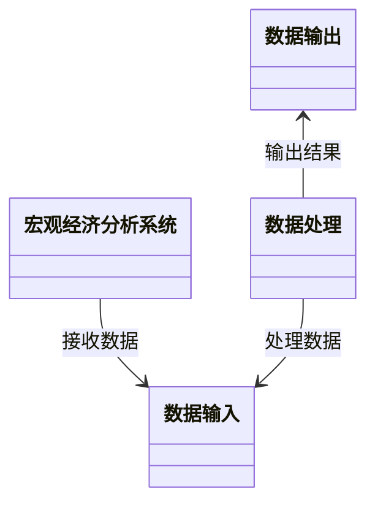
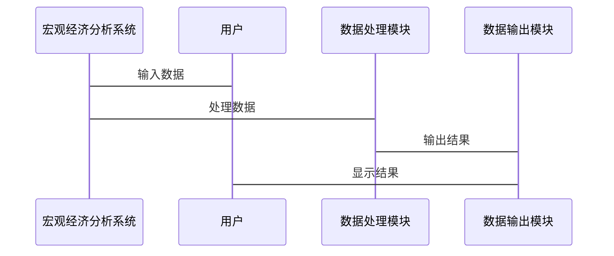

                 


# 费雪的宏观经济分析：把握大趋势

> 关键词：费雪，宏观经济分析，经济周期，货币流通速度，消费函数，债务-通货再膨胀

> 摘要：本文将详细分析费雪的宏观经济分析理论，从基本概念到数学模型，从系统架构设计到项目实战，帮助读者全面掌握宏观经济分析的方法和技巧。通过详细的案例分析和实际应用，本文将展示如何利用费雪的理论来解决实际的经济问题，把握宏观经济的大趋势。

---

## 第1章: 费雪的宏观经济分析基础

### 1.1 宏观经济分析概述

#### 1.1.1 宏观经济的定义与研究对象
- 宏观经济的定义
- 宏观经济的研究对象
- 宏观经济与微观经济的关系

#### 1.1.2 费雪在宏观经济分析中的地位
- 费雪的贡献与影响力
- 费雪理论的核心思想

#### 1.1.3 宏观经济分析的现状与发展趋势
- 当前宏观经济分析的现状
- 未来宏观经济分析的发展方向

### 1.2 费雪的宏观经济分析方法

#### 1.2.1 费雪的经济周期理论
- 经济周期的定义
- 费雪对经济周期的解释

#### 1.2.2 费雪的货币需求理论
- 货币需求的定义
- 费雪的货币需求理论

#### 1.2.3 费雪的消费函数理论
- 消费函数的定义
- 费雪的消费函数理论

### 1.3 宏观经济分析的核心概念与联系

#### 1.3.1 宏观经济核心概念的定义与属性
- GDP的定义与属性
- 失业率的定义与属性
- 通货膨胀率的定义与属性

#### 1.3.2 核心概念的对比分析（表格形式）
| 概念       | 定义                       | 属性                   |
|------------|----------------------------|------------------------|
| GDP        | 国内生产总值               | 衡量经济规模           |
| 失业率      | 失业人口占劳动力的比例     | 衡量就业状况           |
| 通货膨胀率  | 物价水平的上涨幅度         | 衡量货币购买力的变化   |

#### 1.3.3 实体关系图（ER图）架构（Mermaid流程图）
```mermaid
erd
actor 宏观经济分析者
--|> role: 分析宏观经济数据
participant GDP
participant 失业率
participant 通货膨胀率
```

---

## 第2章: 费雪的宏观经济分析理论

### 2.1 费雪的货币流通速度理论

#### 2.1.1 费雪方程式的定义与推导
- 费雪方程式的定义
- 费雪方程式的推导过程

#### 2.1.2 费雪方程式的数学模型（LaTeX公式）
$$ TV = PT \times V $$
其中，T为交易量，P为价格水平，T为交易次数，V为货币流通速度。

#### 2.1.3 实际案例分析与应用
- 案例分析：费雪方程式的实际应用

### 2.2 费雪的消费函数理论

#### 2.2.1 消费函数的定义与特点
- 消费函数的定义
- 消费函数的特点

#### 2.2.2 费雪消费函数的数学模型（LaTeX公式）
$$ C = aY + b $$ 
其中，C为消费，Y为收入，a为边际消费倾向，b为基本消费支出。

#### 2.2.3 实际案例分析与应用
- 案例分析：消费函数的实际应用

### 2.3 费雪的债务-通货再膨胀理论

#### 2.3.1 理论的定义与特点
- 债务-通货再膨胀理论的定义
- 债务-通货再膨胀理论的特点

#### 2.3.2 数学模型与公式（LaTeX）
$$ M = P \times V $$
其中，M为货币供应量，P为价格水平，V为货币流通速度。

#### 2.3.3 实际案例分析与应用
- 案例分析：债务-通货再膨胀理论的实际应用

---

## 第3章: 宏观经济分析的数学模型与公式

### 3.1 宏观经济分析的核心数学模型

#### 3.1.1 费雪方程式的数学推导
- 费雪方程式的数学推导过程

#### 3.1.2 消费函数的数学模型
- 消费函数的数学模型推导

#### 3.1.3 经济周期的数学模型
- 经济周期的数学模型推导

### 3.2 宏观经济分析的公式应用

#### 3.2.1 费雪方程式的实际应用
- 费雪方程式的实际应用案例

#### 3.2.2 消费函数的实际应用
- 消费函数的实际应用案例

#### 3.2.3 经济周期分析的实际应用
- 经济周期分析的实际应用案例

---

## 第4章: 宏观经济分析的系统架构设计

### 4.1 宏观经济分析的系统架构

#### 4.1.1 系统功能设计（Mermaid类图）


#### 4.1.2 系统架构设计（Mermaid架构图）


#### 4.1.3 系统接口设计
- 系统接口设计说明

---

## 第5章: 项目实战

### 5.1 项目背景与目标
- 项目背景
- 项目目标

### 5.2 项目实现

#### 5.2.1 环境配置
- 环境配置说明

#### 5.2.2 核心代码实现
- 代码实现说明
- 代码解读

#### 5.2.3 系统交互设计（Mermaid序列图）


### 5.3 项目总结
- 项目总结

---

## 第6章: 总结与展望

### 6.1 核心理论总结
- 核心理论总结

### 6.2 未来研究方向
- 未来研究方向

### 6.3 最佳实践 tips
- 最佳实践 tips

### 6.4 小结
- 小结

### 6.5 注意事项
- 注意事项

### 6.6 拓展阅读
- 拓展阅读推荐

---

通过以上目录结构，我们可以看到，文章从费雪的宏观经济分析基础开始，逐步深入到具体的理论分析、数学模型、系统架构设计，最后通过项目实战来巩固和应用所学知识。每一章都包含了丰富的细节和实际案例，帮助读者全面掌握宏观经济分析的方法和技巧。

