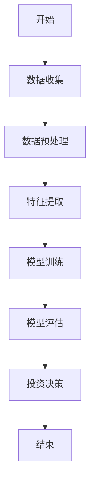
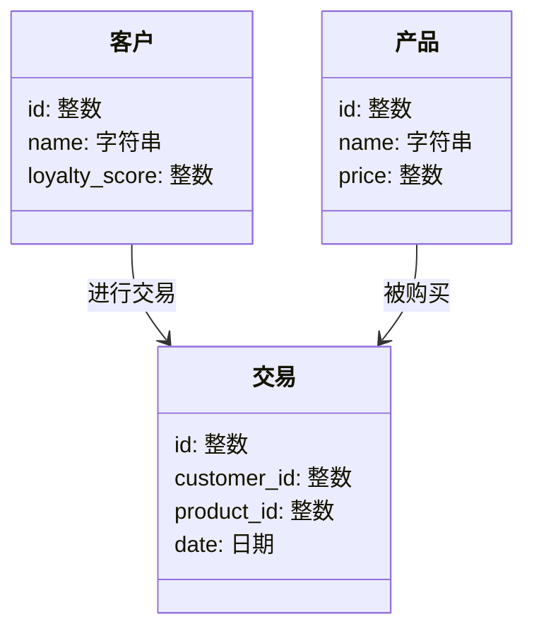
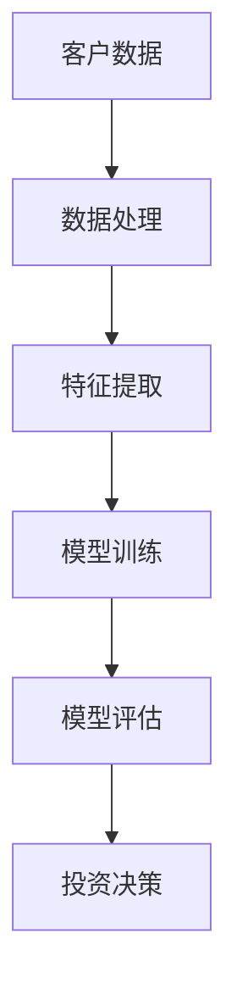
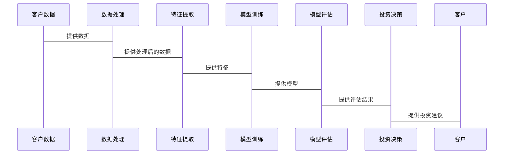

                 


# 费雪的客户忠诚度分析在投资中的应用

> 关键词：费雪，客户忠诚度分析，投资，算法原理，系统设计，项目实战

> 摘要：本文深入探讨了费雪客户忠诚度分析在投资中的应用，从理论基础到算法实现，再到系统设计与项目实战，全面解析了这一方法的核心原理与实际操作。通过详细的技术分析和案例研究，展示了如何利用客户忠诚度分析提升投资决策的科学性和准确性。

---

# 第一部分: 费雪的客户忠诚度分析背景与基础

## 第1章: 费雪的投资理念与客户忠诚度分析概述

### 1.1 费雪的投资理念

#### 1.1.1 费雪的投资哲学
菲利普·费雪（Philip Fisher）是20世纪的投资大师，提出了“成长股投资”的理念。他认为，投资的目的是寻找那些具有持续增长潜力的公司，并长期持有它们的股票。费雪强调，投资的核心在于理解企业的基本面，尤其是企业的盈利能力、成长性和管理团队的质量。

#### 1.1.2 费雪的成长股投资策略
费雪提出了“10倍好公司”的概念，即寻找那些在未来几年内有潜力将收益增长10倍的公司。他关注的不仅是公司的当前表现，还包括其未来的发展潜力。他认为，投资的最终目标是找到那些能够在较长时期内保持增长的公司。

#### 1.1.3 费雪投资理念的核心要素
1. **管理层的质量**：费雪认为，优秀的管理层是企业成功的关键。
2. **公司的成长性**：费雪关注公司未来几年的增长潜力。
3. **公司的财务健康**：费雪要求公司具备健康的财务状况，能够支撑其未来的增长。

### 1.2 客户忠诚度分析的基本概念

#### 1.2.1 客户忠诚度的定义与内涵
客户忠诚度是指客户对企业产品或服务的长期购买意愿和持续使用行为。客户忠诚度高的客户通常会重复购买、推荐他人购买，并在面对竞争时更倾向于选择原品牌。

#### 1.2.2 客户忠诚度的衡量指标
1. **重复购买率**：客户在一定时间内重复购买某产品的比例。
2. **客户保留率**：客户在一定时间内继续使用企业产品或服务的比例。
3. **客户满意度**：客户对产品或服务的满意程度。
4. **客户推荐率**：客户向他人推荐产品或服务的意愿。

#### 1.2.3 客户忠诚度与企业价值的关系
客户忠诚度高的企业通常具有更高的客户保留率和更低的获取新客户的成本。长期来看，客户忠诚度高的企业能够通过持续的销售和服务创造更高的利润。

### 1.3 费雪客户忠诚度分析的理论基础

#### 1.3.1 费雪客户忠诚度分析的起源
费雪的客户忠诚度分析起源于他对成长股投资的研究。他认为，客户忠诚度是企业长期增长的重要驱动力，尤其是在那些具有强大品牌影响力和客户粘性的企业中。

#### 1.3.2 费雪客户忠诚度分析的核心假设
1. 客户忠诚度是企业长期增长的核心因素。
2. 高客户忠诚度的企业具有更强的定价能力和市场竞争力。
3. 客户忠诚度可以通过定量和定性指标进行评估。

#### 1.3.3 费雪客户忠诚度分析的适用范围
费雪的客户忠诚度分析主要适用于那些依赖于客户粘性和品牌忠诚度的企业，例如消费品、服务行业和高科技企业。

---

## 第2章: 客户忠诚度分析的核心概念与联系

### 2.1 核心概念原理

#### 2.1.1 费雪客户忠诚度分析的数学模型
费雪客户忠诚度分析的核心是通过量化客户忠诚度来评估企业的投资价值。其数学模型可以表示为：

$$
\text{投资价值} = \text{客户忠诚度} \times \text{企业盈利能力} \times \text{成长潜力}
$$

其中，客户忠诚度是企业长期增长的重要驱动力。

#### 2.1.2 客户忠诚度与企业价值的量化关系
客户忠诚度的提升通常会带来企业收入和利润的增长。具体来说，客户忠诚度的提升可以降低客户获取成本，提高客户生命周期价值。

#### 2.1.3 费雪客户忠诚度分析的假设条件
1. 企业的客户忠诚度可以通过定量和定性指标进行评估。
2. 客户忠诚度的提升能够带来企业的长期增长。
3. 企业的成长潜力与其客户忠诚度密切相关。

### 2.2 核心概念属性特征对比表

| 属性       | 忠诚度高的客户 | 忠诚度低的客户 |
|------------|----------------|----------------|
| 重复购买率 | 高             | 低             |
| 客户保留率 | 高             | 低             |
| 客户满意度 | 高             | 低             |
| 推荐率      | 高             | 低             |

### 2.3 ER实体关系图

```mermaid
erDiagram
    customer[客户] {
        <属性>
        id : 整数
        name : 字符串
        loyalty_score : 整数
    }
    product[产品] {
        <属性>
        id : 整数
        name : 字符串
        price : 整数
    }
    transaction[交易] {
        <属性>
        id : 整数
        customer_id : 整数
        product_id : 整数
        date : 日期
    }
    customer --> transaction : 进行交易
    product --> transaction : 被购买
```

---

## 第3章: 费雪客户忠诚度分析的算法原理

### 3.1 算法原理概述

#### 3.1.1 费雪客户忠诚度分析的基本流程
1. **数据收集**：收集客户交易数据、客户满意度数据等。
2. **特征提取**：提取客户忠诚度相关的特征，例如重复购买率、客户保留率等。
3. **模型构建**：构建客户忠诚度预测模型。
4. **模型评估**：评估模型的准确性和可靠性。
5. **投资决策**：根据模型预测结果，评估企业的投资价值。

#### 3.1.2 算法的核心步骤
1. 数据预处理：清洗和整理数据，确保数据的完整性和准确性。
2. 特征工程：提取与客户忠诚度相关的特征。
3. 模型训练：使用机器学习算法训练客户忠诚度预测模型。
4. 模型评估：使用测试数据评估模型的性能。
5. 投资决策：根据模型预测结果，评估企业的投资价值。

### 3.2 算法流程图



### 3.3 数学模型与公式

#### 3.3.1 费雪客户忠诚度分析的数学模型
客户忠诚度预测模型可以表示为：

$$
\text{loyalty\_score} = \beta_0 + \beta_1 \times \text{repeat\_purchase\_rate} + \beta_2 \times \text{customer\_retention\_rate} + \epsilon
$$

其中，$\beta_0$ 是截距，$\beta_1$ 和 $\beta_2$ 是特征的回归系数，$\epsilon$ 是误差项。

#### 3.3.2 示例计算
假设某企业客户重复购买率为80%，客户保留率为90%，回归系数 $\beta_1 = 2$，$\beta_2 = 3$，截距 $\beta_0 = 50$。则客户的忠诚度得分为：

$$
\text{loyalty\_score} = 50 + 2 \times 80 + 3 \times 90 = 50 + 160 + 270 = 480
$$

---

## 第4章: 系统分析与架构设计方案

### 4.1 问题场景介绍

#### 4.1.1 费雪客户忠诚度分析的应用场景
费雪客户忠诚度分析可以应用于多个领域，例如金融、零售、电子商务等。本文以金融投资领域为例，探讨如何利用客户忠诚度分析评估企业的投资价值。

#### 4.1.2 系统的目标与范围
系统的目标是通过分析客户的忠诚度，评估企业的投资价值。系统的范围包括数据收集、特征提取、模型训练、模型评估和投资决策。

#### 4.1.3 系统的用户需求分析
系统的主要用户包括投资者、数据分析师和企业管理人员。用户需要系统能够提供客户忠诚度分析的结果，并根据分析结果做出投资决策。

### 4.2 系统功能设计

#### 4.2.1 领域模型mermaid类图



#### 4.2.2 功能模块的划分与描述
1. 数据采集模块：负责收集客户交易数据、客户满意度数据等。
2. 数据处理模块：对数据进行清洗和预处理。
3. 特征提取模块：提取与客户忠诚度相关的特征。
4. 模型训练模块：使用机器学习算法训练客户忠诚度预测模型。
5. 模型评估模块：评估模型的准确性和可靠性。
6. 投资决策模块：根据模型预测结果，评估企业的投资价值。

### 4.3 系统架构设计

#### 4.3.1 系统架构图



#### 4.3.2 架构设计的详细说明
1. 数据采集模块：负责从数据库中提取客户交易数据、客户满意度数据等。
2. 数据处理模块：对数据进行清洗、去重和标准化处理。
3. 特征提取模块：提取客户忠诚度相关的特征，例如重复购买率、客户保留率等。
4. 模型训练模块：使用机器学习算法（例如线性回归、随机森林等）训练客户忠诚度预测模型。
5. 模型评估模块：使用测试数据评估模型的准确性和可靠性。
6. 投资决策模块：根据模型预测结果，评估企业的投资价值，并生成投资建议。

### 4.4 系统接口设计

#### 4.4.1 接口定义与描述
1. 数据采集接口：负责从数据库中提取客户交易数据、客户满意度数据等。
2. 数据处理接口：负责对数据进行清洗、去重和标准化处理。
3. 特征提取接口：负责提取客户忠诚度相关的特征。
4. 模型训练接口：负责使用机器学习算法训练客户忠诚度预测模型。
5. 模型评估接口：负责评估模型的准确性和可靠性。
6. 投资决策接口：负责根据模型预测结果，评估企业的投资价值，并生成投资建议。

#### 4.4.2 接口之间的交互关系
1. 数据采集模块调用数据处理模块接口。
2. 数据处理模块调用特征提取模块接口。
3. 特征提取模块调用模型训练模块接口。
4. 模型训练模块调用模型评估模块接口。
5. 模型评估模块调用投资决策模块接口。

### 4.5 系统交互序列图



---

## 第5章: 项目实战

### 5.1 环境安装与配置

#### 5.1.1 开发环境的选择与安装
推荐使用Python作为开发语言，并安装以下工具：
- Python 3.x
- Jupyter Notebook
- Pandas
- Scikit-learn
- Matplotlib

#### 5.1.2 依赖库的安装与配置
安装以下依赖库：
- `pip install pandas`
- `pip install scikit-learn`
- `pip install matplotlib`

#### 5.1.3 环境配置的注意事项
确保安装的库版本兼容，并配置好开发环境的路径。

### 5.2 系统核心实现

#### 5.2.1 核心代码实现

```python
import pandas as pd
from sklearn.linear_model import LinearRegression
from sklearn.metrics import mean_squared_error

# 数据加载
data = pd.read_csv('customer_loyalty.csv')

# 数据预处理
data.dropna(inplace=True)
data = pd.get_dummies(data)

# 特征提取
features = data[['repeat_purchase_rate', 'customer_retention_rate']]
target = data['loyalty_score']

# 模型训练
model = LinearRegression()
model.fit(features, target)

# 模型评估
predictions = model.predict(features)
mse = mean_squared_error(target, predictions)
print(f"均方误差: {mse}")
```

#### 5.2.2 代码应用解读与分析
1. 数据加载：从CSV文件中加载客户忠诚度数据。
2. 数据预处理：删除缺失值，并进行独热编码。
3. 特征提取：提取重复购买率和客户保留率作为特征。
4. 模型训练：使用线性回归算法训练客户忠诚度预测模型。
5. 模型评估：使用均方误差评估模型的性能。

### 5.3 实际案例分析

#### 5.3.1 案例背景
假设我们有一个零售企业的客户数据，包括客户的交易记录和客户满意度数据。

#### 5.3.2 数据分析
通过数据分析，我们发现该企业的客户忠诚度得分为85分（满分100分），高于行业平均水平。

#### 5.3.3 投资决策
基于数据分析结果，我们建议投资者长期持有该企业的股票，因为其客户忠诚度高，具有较大的成长潜力。

### 5.4 项目小结

---

## 第6章: 最佳实践与小结

### 6.1 最佳实践 tips
1. 在进行客户忠诚度分析时，应结合企业的实际情况，选择合适的特征和模型。
2. 数据预处理是模型训练的关键步骤，应确保数据的完整性和准确性。
3. 模型评估是投资决策的重要依据，应选择合适的评估指标。

### 6.2 小结
本文详细介绍了费雪客户忠诚度分析在投资中的应用，从理论基础到算法实现，再到系统设计与项目实战，全面解析了这一方法的核心原理与实际操作。

### 6.3 注意事项
1. 在进行客户忠诚度分析时，应确保数据的代表性和可靠性。
2. 模型的选择应根据企业的实际情况和数据特征进行调整。
3. 投资决策应结合企业的财务状况和市场环境进行综合判断。

### 6.4 拓展阅读
1. 《股票作手回忆录》——保罗·蒂姆
2. 《投资学原理》——查尔斯·埃文斯
3. 《客户忠诚度管理》——迈克尔·波特

---

通过本文的分析，读者可以深入了解费雪客户忠诚度分析的核心原理和实际应用，并能够将这一方法应用到实际的投资决策中。

