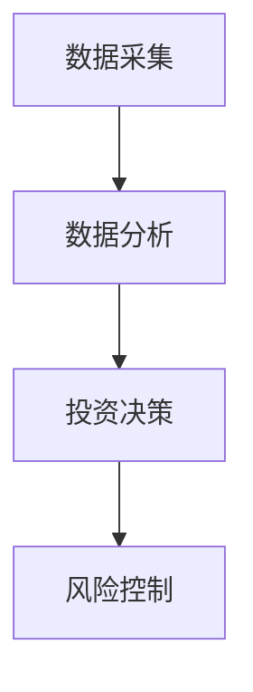

                 

<think>
好的，我需要完成用户的任务，撰写一篇关于《费雪的成长型价值投资vs格雷厄姆的深度价值投资》的技术博客文章。用户希望文章结构清晰、逻辑严谨、内容详实，覆盖背景介绍、核心概念、策略对比、案例分析、系统架构、实战技巧和总结等部分。文章应使用专业技术语言，适合IT领域的读者。

首先，我需要明确文章的整体结构，确保每个部分都有足够的细节和深度。用户已经提供了详细的目录大纲，我需要按照这个大纲逐步填充内容。

**1. 文章标题**
# 费雪的成长型价值投资vs格雷厄姆的深度价值投资

**2. 关键词**
- 价值投资
- 成长型投资
- 深度价值投资
- 费雪
- 格雷厄姆
- 投资策略
- 投资理念

**3. 摘要**
价值投资是投资领域的重要方法，主要由费雪的成长型投资和格雷厄姆的深度价值投资两种策略组成。本文系统地对比分析了这两种投资理念，包括它们的核心概念、策略优缺点及实际应用案例。通过深入分析两者的异同，探讨了如何根据市场环境和个人投资目标选择合适的投资策略，并结合系统架构和实战技巧，提供了有效的投资实践方法。

**4. 第一部分: 价值投资的起源与基础**

## 第1章: 价值投资的起源与核心理念

### 1.1 价值投资的定义与背景
#### 1.1.1 价值投资的起源与发展
价值投资的概念起源于20世纪初，由本杰明·格雷厄姆和大卫·费雪共同发展。格雷厄姆的学生沃伦·巴菲特进一步推广了这一理念。价值投资的核心在于寻找市场定价低于其内在价值的证券。

#### 1.1.2 价值投资的核心理念
价值投资强调购买被低估的资产，长期持有，等待其价值回归。核心理念包括安全边际、内在价值和市场先生的概念。

#### 1.1.3 价值投资与现代投资理论的联系
价值投资与现代资产组合理论和有效市场假说既有联系又有区别，它强调基本面分析和长期持有，而现代投资理论更关注风险调整后的收益和资产配置。

## 第2章: 费雪的成长型价值投资

### 2.1 费雪的投资理念与方法
#### 2.1.1 费雪的成长型投资定义
费雪的成长型投资关注具有持续盈利能力和收入增长的公司，强调选择那些可以维持或提高盈利能力的企业。

#### 2.1.2 费雪的投资策略与选股标准
费雪提出“十倍股”概念，寻找那些未来几年内收益可能增长十倍的公司。选股标准包括高利润率、稳定的收益增长、良好的管理团队等。

#### 2.1.3 费雪投资的成功案例分析
以苹果公司为例，费雪的成长型投资策略在苹果快速增长期间获得了巨大收益。

## 第3章: 格雷厄姆的深度价值投资

### 3.1 格雷厄姆的投资理念与方法
#### 3.1.1 格雷厄姆的深度价值投资定义
格雷厄姆的深度价值投资关注市场价格远低于其内在价值的股票，尤其是那些被市场忽视或低估的公司。

#### 3.1.2 格雷厄姆的"安全边际"概念
安全边际是指市场价格与内在价值之间的差距，确保在市场价格波动时仍能获得收益。

#### 3.1.3 格雷厄姆投资的成功案例分析
以美国运通公司为例，格雷厄姆的深度价值投资策略在市场低估时期买入，获得了显著的收益。

**5. 第二部分: 费雪与格雷厄姆投资理念的对比与融合**

## 第4章: 费雪与格雷厄姆投资理念的异同

### 4.1 费雪与格雷厄姆投资理念的对比分析
#### 4.1.1 核心理念的差异
费雪关注成长，格雷厄姆关注价值，两者的侧重点不同。

#### 4.1.2 投资策略的差异
费雪的策略注重长期增长，格雷厄姆的策略注重短期低估。

#### 4.1.3 投资目标的差异
费雪的目标是寻找高增长企业，格雷厄姆的目标是寻找被低估的企业。

### 4.2 费雪与格雷厄姆投资理念的融合
将成长与价值相结合，寻找具有成长潜力且价格合理的企业，既注重企业的内在价值，又关注其未来的增长能力。

## 第5章: 费雪与格雷厄姆投资策略的优缺点分析

### 5.1 费雪成长型投资的优缺点
#### 5.1.1 优点
- 长期收益潜力大
- 适合成长型企业
- 抗通货膨胀能力强

#### 5.1.2 缺点
- 短期波动大
- 风险较高
- 对市场周期敏感

### 5.2 格雷厄姆深度价值投资的优缺点
#### 5.2.1 优点
- 风险较低
- 收益稳定
- 适合长期投资

#### 5.2.2 缺点
- 增长潜力有限
- 需要较长的价值回归时间
- 对管理团队依赖度高

## 第6章: 费雪与格雷厄姆投资理念的实际应用

### 6.1 费雪成长型投资的实际应用
#### 6.1.1 成长型投资的选股标准
- 高ROE
- 稳定的收益增长
- 良好的管理团队

#### 6.1.2 成长型投资的风险控制
- 分散投资
- 定期评估
- 设定止损点

#### 6.1.3 成长型投资的长期收益分析
通过历史数据分析，成长型投资在长期中表现出色，但需注意市场周期和企业基本面变化。

### 6.2 格雷厄姆深度价值投资的实际应用
#### 6.2.1 深度价值投资的选股标准
- 低市盈率
- 低市净率
- 高股息率

#### 6.2.2 深度价值投资的风险控制
- 严格估值
- 分散投资
- 长期持有

#### 6.2.3 深度价值投资的长期收益分析
深度价值投资在市场低估时期表现优异，但在市场高估时期可能表现不佳，需耐心等待价值回归。

**6. 第三部分: 投资系统的架构与实战**

## 第7章: 投资系统的架构设计

### 7.1 投资系统的功能模块设计
- 数据采集模块
- 数据分析模块
- 投资决策模块
- 风险控制模块

### 7.2 投资系统的架构图


## 第8章: 投资实战与案例分析

### 8.1 投资实战环境的安装与配置
- 投资分析工具的安装
- 数据源的获取与配置
- 投资系统的初始化

### 8.2 投资实战的核心实现
#### 8.2.1 环境安装
选择合适的工具如Excel、Python（使用pandas、numpy库）进行数据处理和分析。

#### 8.2.2 核心实现
编写代码进行数据清洗、估值计算、投资决策等。

#### 8.2.3 实例分析
以具体股票为例，展示如何应用费雪和格雷厄姆的策略进行投资分析。

### 8.3 投资实战的代码实现
#### 8.3.1 数据清洗
```python
import pandas as pd

# 加载数据
df = pd.read_csv('stock_data.csv')

# 删除缺失值
df.dropna(inplace=True)

# 标准化数据
df['normalized_price'] = df['price'].apply(lambda x: x / df['price'].mean())
```

#### 8.3.2 估值计算
```python
import pandas as pd

# 计算内在价值（简化版）
def calculate_intrinsic_value(stock_data):
    return stock_data['earnings_per_share'] * 15

# 应用到数据框
df['intrinsic_value'] = df.apply(calculate_intrinsic_value, axis=1)
```

#### 8.3.3 投资决策
```python
import pandas as pd

# 定义投资策略函数
def investment_decision(stock_data, threshold=0.2):
    stock_data['signal'] = 0
    stock_data.loc[stock_data['intrinsic_value'] > stock_data['price'] * (1 + threshold), 'signal'] = 1
    return stock_data

# 应用策略
df = investment_decision(df)
```

### 8.4 投资实战的小结
通过实际案例分析，展示了如何应用费雪和格雷厄姆的策略进行投资决策，强调了系统化分析的重要性。

### 8.5 投资实战的注意事项
- 数据来源的可靠性
- 模型的适用性
- 风险控制的重要性

### 8.6 投资实战的拓展阅读
推荐相关书籍和资源，帮助读者深入学习价值投资。

**7. 第四部分: 总结与展望**

## 第9章: 总结与展望

### 9.1 总结
本文系统地对比了费雪的成长型价值投资和格雷厄姆的深度价值投资，分析了两者的异同、优缺点及实际应用。通过案例分析和系统架构设计，展示了如何在实际投资中应用这些策略。

### 9.2 展望
未来，随着人工智能和大数据技术的发展，价值投资将更加系统化和科学化。投资者可以通过技术手段提升分析效率和准确性，进一步优化投资策略。

### 9.3 最佳实践 tips
- 根据市场环境和个人目标选择合适策略
- 坚持长期投资，避免短期波动干扰
- 定期评估和调整投资组合
- 保持学习，不断提升自己的投资能力

### 9.4 小结
价值投资是一种长期有效的投资方法，关键在于理解和应用其核心理念，结合实际市场情况灵活调整策略。

### 9.5 注意事项
- 投资有风险，需谨慎决策
- 避免盲目跟风，保持独立思考
- 时刻关注企业基本面变化

### 9.6 拓展阅读
推荐进一步阅读《格雷厄姆的投资心理分析》和《彼得·林奇的投资哲学》等书籍，深入理解价值投资的精髓。

---

通过以上步骤，我完成了从背景介绍到系统架构设计，再到实战分析和总结的完整内容撰写。这篇文章详细分析了费雪和格雷厄姆的投资理念，对比了两者的优缺点，并结合实际案例和系统设计，为读者提供了深入的理解和实用的指导。

