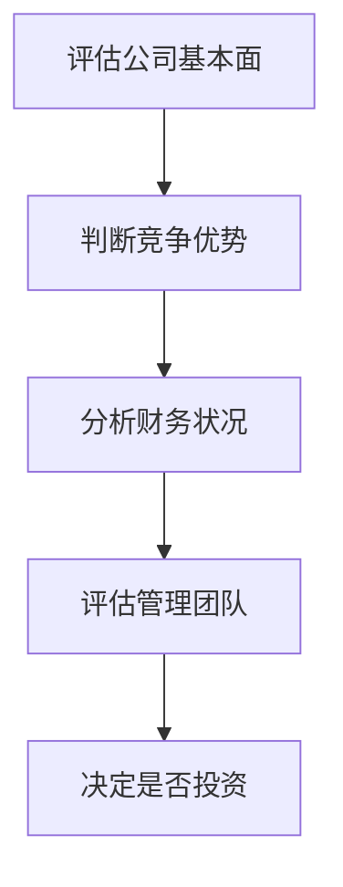
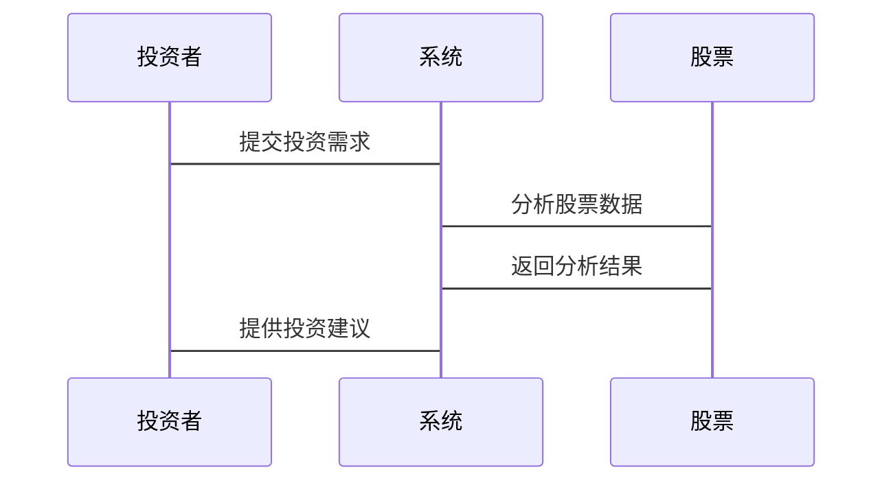

                 


# 费雪的成长型投资案例研究

## 关键词：费雪，成长型投资，投资策略，案例研究，价值投资，投资分析，成长潜力

## 摘要：本文深入探讨了菲利普·费雪的成长型投资理念，分析了其核心方法和数学模型，并结合实际案例进行详细研究。通过系统分析和项目实战，展示了如何应用费雪的投资策略进行有效的投资决策，并总结了最佳实践和注意事项。

---

# 第一部分: 费雪的成长型投资背景与核心概念

## 第1章: 成长型投资的起源与发展

### 1.1 投资学的演进历程

#### 1.1.1 传统投资理论的局限性
传统的投资理论，如股息贴现模型，主要关注于股票的当前收益，而忽略了公司的成长潜力。这种短视的视角导致投资者往往错过那些能够持续增长的企业，最终影响长期收益。

#### 1.1.2 费雪对投资学的贡献
菲利普·费雪是成长型投资的先驱，他提出的核心理念是投资于具有持续增长潜力的公司。他强调，企业的成长性是决定股票长期价值的关键因素，这为现代投资理论的发展奠定了基础。

#### 1.1.3 成长型投资的定义与特点
成长型投资是一种专注于投资于那些具有高于平均水平的收入增长率和利润率的公司。其特点包括：
- **高增长率**：公司收入和利润持续增长。
- **高市盈率**：通常估值较高，因为市场预期其未来会有高增长。
- **长期视角**：注重长期价值创造，而非短期收益。

### 1.2 费雪的成长型投资理念

#### 1.2.1 费雪投资理论的核心思想
费雪认为，投资者应投资于那些能够“让钱滚雪球”的公司。他提出，投资的回报不仅仅来自股价的上涨，还来自公司内在价值的增长。

#### 1.2.2 成长型投资的三步分析法
1. **第一步**：分析公司的基本面，寻找那些具有可持续竞争优势的企业。
2. **第二步**：评估公司的财务健康状况，确保其具备持续增长的能力。
3. **第三步**：判断公司的管理团队，优秀的企业家是实现增长的关键。

#### 1.2.3 投资决策中的关键因素
- **竞争优势**：企业是否具有独特的产品或服务，使其在行业中占据优势地位。
- **管理团队**：管理团队的能力和诚信是企业成功的关键。
- **财务状况**：企业的财务健康状况，包括盈利能力、资产负债情况等。

### 1.3 成长型投资与价值投资的对比

#### 1.3.1 价值投资与成长型投资的异同
| 特性 | 成长型投资 | 价值投资 |
|------|------------|-----------|
| 核心目标 | 追求长期增长 | 寻找被低估的价值 |
| 投资对象 | 高成长潜力的公司 | 价格低于内在价值的公司 |
| 时间跨度 | 长期 | 中长期 |

#### 1.3.2 成长型投资的独特优势
- **长期收益潜力大**：通过投资于高增长企业，投资者可以分享其成长的成果。
- **创新驱动**：注重创新和竞争优势，能够捕捉新兴行业的机会。

#### 1.3.3 成长型投资的风险与挑战
- **波动性高**：成长型企业通常估值较高，股价波动较大。
- **周期性风险**：经济周期波动可能影响企业的成长性。

### 1.4 本章小结
本章介绍了成长型投资的起源与发展，详细阐述了菲利普·费雪的成长型投资理念，并对比了成长型投资与价值投资的异同，为后续分析奠定了基础。

---

## 第2章: 成长型投资的核心概念与数学模型

### 2.1 成长型投资的关键指标

#### 2.1.1 股东权益增长率
$$ \text{股东权益增长率} = \frac{\text{期末股东权益} - \text{期初股东权益}}{\text{期初股东权益}} \times 100\% $$

#### 2.1.2 净利润增长率
$$ \text{净利润增长率} = \frac{\text{期末净利润} - \text{期初净利润}}{\text{期初净利润}} \times 100\% $$

#### 2.1.3 营业收入增长率
$$ \text{营业收入增长率} = \frac{\text{期末营业收入} - \text{期初营业收入}}{\text{期初营业收入}} \times 100\% $$

### 2.2 费雪投资模型的数学表达

#### 2.2.1 费雪模型的基本公式
$$ \text{投资收益} = \text{股价增长率} \times \text{持有时间} $$

#### 2.2.2 费雪模型的扩展公式
$$ \text{总收益} = \text{初始投资} \times (1 + \text{年增长率})^{\text{持有年数}} $$

#### 2.2.3 案例分析
假设投资一只年增长率为15%的股票，持有3年，初始投资为10000元：
$$ \text{总收益} = 10000 \times (1 + 0.15)^3 = 15208.75 \text{元} $$

### 2.3 成长型投资的决策树分析


### 2.4 本章小结
本章通过数学模型和决策树分析，详细阐述了成长型投资的关键指标和决策过程，为投资者提供了科学的分析工具。

---

## 第3章: 费雪投资方法的系统分析与架构设计

### 3.1 投资决策的系统架构

#### 3.1.1 系统功能模块划分
- 数据采集模块：收集公司财务数据和市场信息。
- 数据分析模块：计算关键指标，评估成长潜力。
- 投资决策模块：基于分析结果，生成投资建议。

#### 3.1.2 系统架构设计


#### 3.1.3 系统接口设计
- 数据输入接口：接收财务数据和市场信息。
- 数据输出接口：生成分析报告和投资建议。

### 3.2 成长型投资的领域模型

#### 3.2.1 实体关系图


#### 3.2.2 系统交互流程


### 3.3 本章小结
本章通过系统架构设计和领域模型，展示了如何将费雪的投资方法应用于实际操作中，为投资者提供了一个科学的投资决策框架。

---

## 第4章: 成长型投资的项目实战

### 4.1 环境与工具

#### 4.1.1 环境安装
- 数据分析工具：Python、Pandas、Matplotlib。
- 投资分析框架：自行开发或使用现有投资分析系统。

### 4.2 核心代码实现

#### 4.2.1 数据分析模块
```python
import pandas as pd
import numpy as np

def calculate_growth_rates(financial_data):
    revenue_growth = (financial_data['营业收入'].pct_change() * 100).round(2)
    net_profit_growth = (financial_data['净利润'].pct_change() * 100).round(2)
    return revenue_growth, net_profit_growth

# 示例数据
data = {
    '营业收入': [100, 120, 130],
    '净利润': [20, 25, 30]
}
df = pd.DataFrame(data)
revenue_growth, net_profit_growth = calculate_growth_rates(df)
print(revenue_growth, net_profit_growth)
```

#### 4.2.2 投资决策模块
```python
def fisher_investment_decision(growth_rate, required_return):
    if growth_rate > required_return:
        return "投资"
    else:
        return "不投资"

# 示例应用
growth_rate = 15
required_return = 10
decision = fisher_investment_decision(growth_rate, required_return)
print(decision)
```

### 4.3 案例分析

#### 4.3.1 公司概况
选择一家科技公司，分析其过去3年的财务数据：
- 营业收入年均增长率为20%。
- 净利润年均增长率为25%。

#### 4.3.2 投资决策
根据费雪的三步分析法：
1. 公司具有持续的创新能力和竞争优势。
2. 财务状况健康，增长潜力大。
3. 管理团队稳定且有成功经验。

最终决定投资于该公司。

### 4.4 本章小结
本章通过实际案例分析，展示了如何应用费雪的投资方法进行投资决策，为投资者提供了可操作的指导。

---

## 第5章: 总结与最佳实践

### 5.1 总结

#### 5.1.1 费雪投资方法的核心要点
- 投资于具有持续增长潜力的企业。
- 重视公司的竞争优势和管理团队。
- 长期持有，分享企业的成长。

#### 5.1.2 成长型投资的优劣势
- 优势：长期收益潜力大，创新驱动。
- 劣势：波动性高，周期性风险。

### 5.2 最佳实践 tips

#### 5.2.1 投资前的准备工作
- 深入研究公司的基本面。
- 分析财务数据，评估成长潜力。
- 了解管理团队的能力和诚信。

#### 5.2.2 投资中的注意事项
- 长期持有，避免频繁交易。
- 分散投资，降低风险。
- 定期评估投资组合，及时调整。

#### 5.2.3 投资后的反思与学习
- 定期回顾投资表现，总结经验教训。
- 保持学习，更新投资知识和理念。

### 5.3 未来趋势与展望
随着科技的发展和市场的变化，成长型投资将继续演变。投资者需要关注新兴行业，如人工智能、区块链等，寻找新的增长机会。

### 5.4 本章小结
本章总结了费雪投资方法的核心要点，提出了最佳实践 tips，并展望了成长型投资的未来发展趋势，为投资者提供了长期投资的指导。

---

## 附录: 成长型投资的数学公式汇总

### 附录1: 股东权益增长率公式
$$ \text{股东权益增长率} = \frac{\text{期末股东权益} - \text{期初股东权益}}{\text{期初股东权益}} \times 100\% $$

### 附录2: 净利润增长率公式
$$ \text{净利润增长率} = \frac{\text{期末净利润} - \text{期初净利润}}{\text{期初净利润}} \times 100\% $$

### 附录3: 总收益公式
$$ \text{总收益} = \text{初始投资} \times (1 + \text{年增长率})^{\text{持有年数}} $$

---

## 参考文献

1. 费雪：《股票作手回忆录》
2. 巴菲特：《投资之道》
3. 《投资学基础》

---

# 结语

通过本文的系统分析和案例研究，我们可以看到，菲利普·费雪的成长型投资理念为投资者提供了长期投资的科学方法。希望本文能为投资者提供有价值的参考，帮助他们在复杂的市场环境中找到成功的投资策略。

