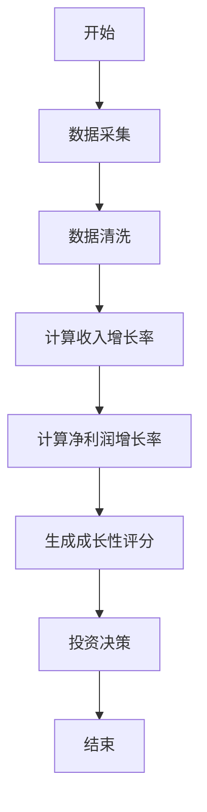
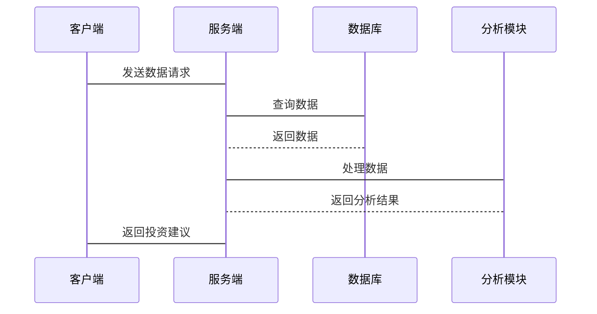

                 


# 费雪的成长型投资策略

## 关键词：成长型投资，费雪，投资策略，内在价值，企业成长性

## 摘要：本文系统地介绍了费雪的成长型投资策略，从其核心理念、数学模型到实际应用，全面解析了这一投资方法。文章通过详细分析，揭示了如何通过量化方法评估企业的成长性和内在价值，构建一个稳健的投资策略。

---

# 第一部分：成长型投资的背景与核心理念

## 第1章：成长型投资的定义与背景

### 1.1 成长型投资的定义
#### 1.1.1 投资的定义与分类
投资是指将资金投入到某个资产或项目中，以期望在未来获得超过初始投入的回报。投资可以分为多种类型，包括股票、债券、房地产等。成长型投资是其中一种类型，专注于投资于具有高成长潜力的企业。

#### 1.1.2 成长型投资的核心特征
成长型投资的核心特征是关注企业的成长潜力，而非仅仅关注企业的当前价值。投资者通过投资于那些具有持续增长能力的企业，期望在未来获得超额回报。

#### 1.1.3 成长型投资与价值投资的区别
成长型投资与价值投资的主要区别在于，成长型投资关注企业的未来增长潜力，而价值投资关注企业的当前价值是否被市场低估。成长型投资更注重企业的成长性和创新性，而价值投资更注重企业的内在价值和安全边际。

### 1.2 费雪的成长型投资理念
#### 1.2.1 费雪的投资哲学
费雪的投资哲学强调长期投资，关注企业的内在价值和成长性。他认为，投资的成功取决于对企业的深入研究和对市场趋势的准确判断。

#### 1.2.2 费雪的成长型投资策略
费雪的成长型投资策略包括以下几个方面：
- **选择具有强大竞争优势的企业**：投资于那些在市场上具有强大竞争优势的企业，这些企业能够持续增长并创造超额利润。
- **关注企业的成长性**：通过分析企业的财务数据，评估企业的收入增长率、净利润增长率等指标，选择那些具有高成长潜力的企业。
- **长期持有**：费雪主张长期持有优质企业，避免频繁交易，以减少交易成本和市场波动的影响。

#### 1.2.3 费雪投资理念的历史背景
费雪的投资理念形成于20世纪，当时美国经济正处于快速增长阶段。费雪通过研究和实践，总结出了一套适合成长型企业投资的策略。

### 1.3 成长型投资的适用场景
#### 1.3.1 成长型投资的适用市场环境
成长型投资适用于经济快速增长、市场环境较为稳定的市场环境。在这样的环境下，企业更容易实现持续增长，投资者也更容易找到具有高成长潜力的企业。

#### 1.3.2 不同经济周期下的成长型投资策略
在不同的经济周期下，成长型投资策略需要进行适当的调整。例如，在经济衰退期间，投资者可能需要更加谨慎，选择那些具有强大现金流和低杠杆率的企业。

#### 1.3.3 成长型投资的长期与短期表现
成长型投资的长期表现通常优于短期表现。由于成长型企业需要时间来实现增长，投资者需要有足够的耐心，等待企业的成长潜力逐步释放。

### 1.4 本章小结
本章介绍了成长型投资的定义、核心特征以及与价值投资的区别，详细阐述了费雪的成长型投资理念及其适用场景。通过本章的学习，读者可以对成长型投资有一个全面的了解。

---

## 第2章：成长型投资的核心概念与分析框架

### 2.1 成长型投资的核心要素
#### 2.1.1 企业成长性的定义与衡量标准
企业成长性是指企业在未来一段时间内实现收入和利润增长的能力。衡量企业成长性的标准包括收入增长率、净利润增长率、资产回报率等。

#### 2.1.2 企业的竞争优势分析
竞争优势是企业能够在市场上获得超额利润的关键因素。竞争优势可以分为成本优势、技术优势、品牌优势等。

#### 2.1.3 企业的财务健康状况评估
企业的财务健康状况是评估企业成长性的重要指标。财务健康状况评估包括分析企业的资产负债表、利润表和现金流量表，评估企业的盈利能力、偿债能力和运营效率。

#### 2.1.4 企业的管理团队
管理团队是企业成功的关键因素之一。投资者需要关注管理团队的背景、经验和战略规划能力。

### 2.2 成长型投资的数学模型
#### 2.2.1 成长性评估的数学公式
收入增长率公式：
$$ 收入增长率 = \frac{收入_{current} - 收入_{previous}}{收入_{previous}} $$

净利润增长率公式：
$$ 净利润增长率 = \frac{净利润_{current} - 净利润_{previous}}{净利润_{previous}} $$

#### 2.2.2 内在价值计算的数学模型
内在价值是企业未来现金流的现值。计算内在价值的公式为：
$$ 内在价值 = \sum_{t=1}^{n} \frac{CF_t}{(1 + r)^t} $$
其中，\( CF_t \) 是第 t 年的现金流，\( r \) 是折现率，\( n \) 是现金流的期限。

#### 2.2.3 成长性与价值的平衡点分析
成长型投资需要在成长性和价值之间找到平衡点。如果企业成长性高，但内在价值被高估，投资者可能需要等待更好的买入时机。

### 2.3 成长型投资的对比分析
#### 2.3.1 不同投资策略的对比表格
以下是成长型投资与其他投资策略的对比：

| 投资策略 | 核心关注点 | 适合市场环境 | 风险水平 |
|----------|------------|---------------|----------|
| 成长型投资 | 企业成长性 | 高速增长市场 | 中高风险 |
| 价值型投资 | 内在价值低估 | 稳定市场 | 中低风险 |
| 投机型投资 | 短期价格波动 | 不稳定市场 | 高风险 |

#### 2.3.2 费雪策略与其他策略的异同点
- **相同点**：都关注企业的内在价值和财务健康状况。
- **不同点**：成长型投资更注重企业的成长性，而价值型投资更注重企业的内在价值是否被低估。

#### 2.3.3 费雪策略的优缺点分析
- **优点**：能够捕捉到具有高成长潜力的企业，长期回报率高。
- **缺点**：在经济衰退期间可能表现不佳，风险较高。

### 2.4 本章小结
本章详细阐述了成长型投资的核心要素和数学模型，分析了费雪策略与其他投资策略的异同点，并对费雪策略的优缺点进行了总结。通过本章的学习，读者可以更好地理解成长型投资的内在逻辑。

---

## 第3章：成长型投资的算法与数学模型

### 3.1 成长性评估的算法流程
#### 3.1.1 数据采集与预处理
- 数据来源：企业财务报表、行业报告、市场数据等。
- 数据清洗：处理缺失值、异常值等。

#### 3.1.2 成长性指标的计算
- 收入增长率计算：
$$ 收入增长率 = \frac{收入_{current} - 收入_{previous}}{收入_{previous}} $$
- 净利润增长率计算：
$$ 净利润增长率 = \frac{净利润_{current} - 净利润_{previous}}{净利润_{previous}} $$

#### 3.1.3 成长性评估的决策树
1. 收集企业财务数据。
2. 计算收入增长率和净利润增长率。
3. 评估企业的竞争优势和管理团队。
4. 综合评估企业的成长性，决定是否投资。

#### 3.1.4 案例分析
以某科技公司为例，计算其收入增长率和净利润增长率，评估其成长性。

### 3.2 成长性评估的数学模型
#### 3.2.1 成长性评估的数学公式
$$ 成长性评分 = 0.5 \times 收入增长率 + 0.5 \times 净利润增长率 $$

#### 3.2.2 内在价值计算的数学模型
$$ 内在价值 = \sum_{t=1}^{n} \frac{CF_t}{(1 + r)^t} $$

#### 3.2.3 成长性与价值的平衡点分析
- 如果成长性评分高于行业平均水平，且内在价值被低估，考虑买入。
- 如果成长性评分低于行业平均水平，或者内在价值被高估，考虑卖出。

### 3.3 算法实现的Python代码
#### 3.3.1 数据处理代码
```python
import pandas as pd
import numpy as np

# 假设df是包含企业财务数据的DataFrame
# 计算收入增长率
df['收入增长率'] = (df['收入_current'] - df['收入_previous']) / df['收入_previous']

# 计算净利润增长率
df['净利润增长率'] = (df['净利润_current'] - df['净利润_previous']) / df['净利润_previous']
```

#### 3.3.2 成长性评估代码
```python
def calculate_growth_score(df):
    df['成长性评分'] = 0.5 * df['收入增长率'] + 0.5 * df['净利润增长率']
    return df

# 示例使用
growth_score_df = calculate_growth_score(df)
```

#### 3.3.3 模型验证代码
```python
# 计算投资组合的回报率
returns = growth_score_df['回报率']
# 计算基准指数的回报率
benchmark_returns = pd.read_csv('benchmark.csv')['回报率']
# 计算超额回报率
excess_returns = returns - benchmark_returns
```

### 3.4 本章小结
本章通过算法和数学模型，详细阐述了成长性评估的过程。通过Python代码实现数据处理和模型验证，帮助读者更好地理解和应用这些模型。

---

## 第4章：系统分析与架构设计

### 4.1 系统功能设计
#### 4.1.1 系统功能模块
- 数据采集模块：收集企业财务数据和市场数据。
- 数据处理模块：清洗和预处理数据。
- 成长性评估模块：计算收入增长率、净利润增长率等指标。
- 投资决策模块：根据评估结果生成投资建议。

#### 4.1.2 系统功能流程图


### 4.2 系统架构设计
#### 4.2.1 系统架构图


#### 4.2.2 系统接口设计
- 数据采集接口：用于收集企业财务数据和市场数据。
- 数据处理接口：用于清洗和预处理数据。
- 成长性评估接口：用于计算收入增长率和净利润增长率。
- 投资决策接口：用于生成投资建议。

### 4.3 系统交互流程图


### 4.4 本章小结
本章通过系统分析与架构设计，详细阐述了如何构建一个基于费雪策略的投资决策支持系统。通过功能模块、架构图和交互流程图，帮助读者更好地理解系统的整体结构和运行流程。

---

## 第5章：项目实战

### 5.1 环境安装
- 安装Python和相关库：
  ```bash
  pip install pandas numpy matplotlib
  ```

### 5.2 核心代码实现
#### 5.2.1 数据处理代码
```python
import pandas as pd
import numpy as np

# 读取数据
df = pd.read_csv('data.csv')

# 计算收入增长率
df['收入增长率'] = (df['收入_current'] - df['收入_previous']) / df['收入_previous']

# 计算净利润增长率
df['净利润增长率'] = (df['净利润_current'] - df['净利润_previous']) / df['净利润_previous']

# 保存数据
df.to_csv('processed_data.csv', index=False)
```

#### 5.2.2 成长性评估代码
```python
def calculate_growth_score(df):
    df['成长性评分'] = 0.5 * df['收入增长率'] + 0.5 * df['净利润增长率']
    return df

# 示例使用
growth_score_df = calculate_growth_score(df)
```

#### 5.2.3 投资决策代码
```python
def generate_investment_recommendation(df):
    recommendations = []
    for index, row in df.iterrows():
        if row['成长性评分'] > 0.6:
            recommendations.append('买入')
        elif row['成长性评分'] > 0.4:
            recommendations.append('持有')
        else:
            recommendations.append('卖出')
    return recommendations

# 示例使用
recommendations = generate_investment_recommendation(growth_score_df)
```

### 5.3 案例分析
#### 5.3.1 数据来源与处理
- 数据来源：某行业上市公司的财务数据。
- 数据处理：清洗和预处理数据，计算收入增长率和净利润增长率。

#### 5.3.2 成长性评估
- 选择具有高成长性评分的企业，生成投资建议。

### 5.4 本章小结
本章通过项目实战，展示了如何利用Python代码实现成长性评估和投资决策。通过实际案例分析，帮助读者更好地理解和应用这些方法。

---

## 第6章：最佳实践与注意事项

### 6.1 最佳实践
#### 6.1.1 选择优质企业
- 关注企业的竞争优势和管理团队。
- 选择具有高成长潜力的企业。

#### 6.1.2 分散投资
- 避免过度集中，降低风险。

#### 6.1.3 长期持有
- 避免频繁交易，减少交易成本和市场波动的影响。

### 6.2 注意事项
#### 6.2.1 风险控制
- 评估企业的财务健康状况，避免投资于财务状况不佳的企业。

#### 6.2.2 市场风险
- 在经济衰退期间，成长型投资可能表现不佳，需要谨慎操作。

#### 6.2.3 信息获取
- 及时获取企业的最新信息，关注行业动态和市场趋势。

### 6.3 小结
本章总结了成长型投资的最佳实践和注意事项，帮助投资者更好地应用费雪策略进行投资。

---

## 第7章：总结与展望

### 7.1 总结
本文系统地介绍了费雪的成长型投资策略，从核心理念到数学模型，再到实际应用，全面解析了这一投资方法。通过本文的学习，读者可以掌握如何通过量化方法评估企业的成长性和内在价值，构建一个稳健的投资策略。

### 7.2 展望
未来，随着人工智能和大数据技术的发展，成长型投资策略将更加智能化和精准化。投资者可以通过机器学习算法，进一步提高成长性评估的准确性和效率。

### 7.3 推荐阅读
- 《彼得·林奇的成功投资》
- 《价值投资实战》
- 《股票投资策略与技巧》

---

通过本文的学习，读者可以更好地理解和应用费雪的成长型投资策略，实现稳健的投资回报。

