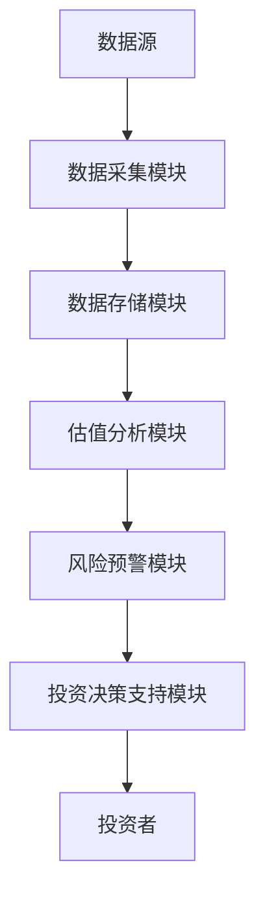
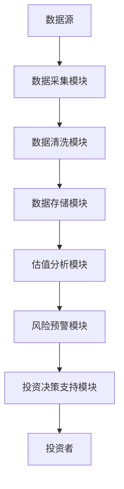
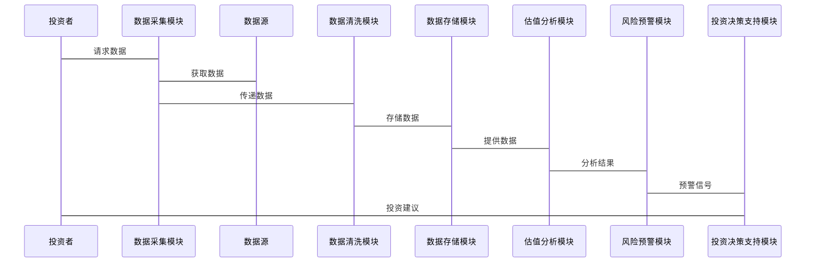

                 


# 费雪的成长型投资陷阱：避免高估值陷阱

> 关键词：成长型投资，高估值陷阱，费雪投资，估值误区，风险控制，投资策略，系统架构，数学模型

> 摘要：本文深入探讨了成长型投资中的高估值陷阱，分析其成因、表现及影响，并提出了基于数学模型和系统架构的风险控制方法，帮助投资者避免高估值陷阱，实现稳健投资。

---

## 第一部分：成长型投资陷阱的背景与概念

### 第1章：成长型投资的定义与核心要素

#### 1.1 成长型投资的定义

成长型投资是一种以追求资本增值为核心目标的投资策略，主要投资于那些具有持续增长潜力的企业。其核心在于通过长期持有优质资产，获得企业成长带来的收益。

##### 1.1.1 成长型投资的定义与特征

- **定义**：成长型投资是指通过投资于具有持续盈利增长能力的公司，以实现资本增值的投资方式。
- **特征**：
  - **高成长性**：目标企业具有较高的收入和利润增长率。
  - **高估值**：通常市盈率（P/E）和市净率（P/B）较高。
  - **长期持有**：投资者倾向于长期持有，等待企业成长带来的股价上涨。

##### 1.1.2 成长型投资的核心要素

- **企业基本面**：收入、利润、现金流等财务指标。
- **成长性**：未来盈利增长的潜力。
- **估值**：市盈率、市净率、EV/EBITDA等估值指标。
- **市场环境**：宏观经济、行业趋势、市场情绪等。

#### 1.2 成长型投资的背景与重要性

##### 1.2.1 成长型投资的历史发展

- 起源于20世纪初，以本杰明·格雷厄姆和戴维·多德的价值投资理论为基础。
- 20世纪70年代，彼得·林奇等投资者开始强调成长与价值的结合。
- 近年来，随着科技行业的崛起，成长型投资成为主流策略之一。

##### 1.2.2 成长型投资在现代投资中的地位

- 成长型投资在现代投资组合中占据重要地位，尤其在科技、互联网、生物科技等行业表现突出。
- 机构投资者和个人投资者广泛采用成长型投资策略。

#### 1.3 成长型投资的潜在问题

##### 1.3.1 成长型投资的高风险性

- 高估值可能导致较大回调风险。
- 高成长性企业可能面临增长放缓的风险。

##### 1.3.2 成长型投资的市场波动性

- 市场波动可能导致短期损失，影响投资者情绪。

---

### 第2章：高估值陷阱的成因与表现

#### 2.1 高估值陷阱的定义

高估值陷阱是指投资者在成长型投资中，因过度追求高成长性而忽视合理估值，导致投资标的估值过高，最终引发投资损失的现象。

##### 2.1.1 高估值陷阱的定义

- **定义**：投资者在成长型投资中，因过度乐观或市场情绪推动，导致投资标的估值远高于其内在价值，最终引发投资损失。

##### 2.1.2 高估值陷阱的核心特征

- **高市盈率**：市盈率（P/E）远高于行业平均水平。
- **高市净率**：市净率（P/B）远高于行业平均水平。
- **股价与基本面脱节**：股价增长远快于收入和利润增长。

#### 2.2 高估值陷阱的成因分析

##### 2.2.1 市场情绪的影响

- 投资者在市场情绪高涨时，容易忽视基本面，导致估值过高。
- 资金大量流入成长型股票，推高股价和估值。

##### 2.2.2 投资者认知偏差

- **确认偏差**：投资者倾向于寻找支持自己观点的信息，忽视负面信息。
- **过度自信**：投资者认为自己能够准确预测市场走势，导致过度投资。

##### 2.2.3 分析师的高估行为

- 分析师为了吸引客户，可能过高估计成长型企业的发展前景和估值。
- 分析师的评级和目标价可能过于乐观，误导投资者。

#### 2.3 高估值陷阱的表现形式

##### 2.3.1 市盈率过高

- 市盈率（P/E）远高于行业平均水平或企业历史平均水平。
- 例如，某科技企业的P/E比行业平均水平高50%以上。

##### 2.3.2 市净率过高

- 市净率（P/B）远高于行业平均水平或企业历史平均水平。
- 例如，某互联网企业的P/B比行业平均水平高30%以上。

##### 2.3.3 股价与基本面脱节

- 股价增长远快于收入和利润增长。
- 例如，某企业的股价在过去一年增长了50%，但收入仅增长了10%。

---

### 第3章：成长型投资中的估值误区

#### 3.1 估值的基本概念

##### 3.1.1 估值的定义

- **定义**：估值是指对投资标的内在价值的估计，通常基于财务数据、行业趋势和市场环境等因素。

##### 3.1.2 估值的核心方法

- **相对估值法**：基于可比公司或行业平均水平的估值指标，如市盈率、市净率等。
- **绝对估值法**：基于企业未来现金流的折现值，如DCF模型。

#### 3.2 成长型投资中的常见估值误区

##### 3.2.1 过度依赖市盈率

- 只关注市盈率，忽视市净率、EV/EBITDA等其他估值指标。
- 例如，某企业的P/E为30，但EV/EBITDA为20，可能低估其价值。

##### 3.2.2 忽视现金流的重要性

- 忽视现金流对企业价值的影响，导致高估企业价值。
- 例如，某企业的净利润很高，但现金流为负，可能低估其实际价值。

##### 3.2.3 高估未来增长率

- 过度乐观估计企业的未来增长率，导致估值过高。
- 例如，某企业过去三年收入增长率为20%，但未来可能难以维持这一增长率。

#### 3.3 估值误区的典型案例分析

##### 3.3.1 某成长型企业估值过高案例

- 某科技企业过去两年收入增长率分别为30%和25%，但市盈率高达50倍，远高于行业平均水平的25倍。
- 分析师预测该企业未来三年收入增长率将保持在30%以上，但实际情况可能难以达到这一水平。

##### 3.3.2 估值过高对企业的影响

- 估值过高可能导致企业在市场中难以获得合理的融资成本。
- 过高的估值可能引发股价大幅回调，影响投资者信心。

---

### 第4章：高估值陷阱的数学模型与评估方法

#### 4.1 高估值陷阱的数学模型

##### 4.1.1 成长性评估模型

- **定义**：基于企业过去和未来的收入和利润增长率，预测企业的未来表现。
- **公式**：
  - 收入增长率 = (本年收入 - 上年收入) / 上年收入
  - 利润增长率 = (本年利润 - 上年利润) / 上年利润

##### 4.1.2 估值指标分析

- **市盈率（P/E）**：
  - 公式：P/E = 股价 / 每股收益
  - 例如，某企业的股价为100元，每股收益为5元，则P/E = 20。
- **市净率（P/B）**：
  - 公式：P/B = 股价 / 每股净资产
  - 例如，某企业的股价为100元，每股净资产为20元，则P/B = 5。

##### 4.1.3 风险调整因子

- **定义**：用于调整企业估值，考虑企业所面临的风险因素，如行业风险、财务风险等。
- **公式**：
  - 风险调整后的估值 = 原估值 × (1 - 风险系数)

#### 4.2 高估值陷阱的评估方法

##### 4.2.1 市盈率与市净率的对比分析

- **市盈率**：适用于盈利稳定的公司，尤其适合成长型企业。
- **市净率**：适用于净资产较多的公司，如金融、制造等行业。
- **对比分析**：
  - 对于同一行业内的企业，可以通过比较P/E和P/B的比率，判断其估值是否合理。

##### 4.2.2 现金流折现法的应用

- **定义**：通过折现未来现金流，估算企业当前的合理价值。
- **公式**：
  - 企业价值 = ∑(未来现金流 / (1 + r)^t)
  - 其中，r为折现率，t为时间周期。

##### 4.2.3 市场情绪指数的应用

- **定义**：通过分析市场情绪，判断投资标的估值是否过高。
- **指标**：
  - 投资者情绪指数（如CBOE波动率指数）。
  - 交易量和换手率。

#### 4.3 数学模型的实例分析

##### 4.3.1 成长性评估模型的实例

- 某企业的过去三年收入分别为1000万元、1500万元和2000万元，预计未来三年收入将分别增长20%、25%和30%。
- 预测未来三年的收入分别为：
  - 第一年：2000 × 1.2 = 2400万元
  - 第二年：2400 × 1.25 = 3000万元
  - 第三年：3000 × 1.3 = 3900万元

##### 4.3.2 估值指标分析的实例

- 某企业的股价为100元，每股收益为5元，每股净资产为20元。
- 市盈率（P/E）= 100 / 5 = 20
- 市净率（P/B）= 100 / 20 = 5
- 同行业平均水平P/E为25，P/B为3。
- 该企业的P/E低于行业平均水平，但P/B高于行业平均水平，可能表明其估值存在高估风险。

##### 4.3.3 风险调整因子的实例

- 某企业的原估值为100亿元，风险系数为5%。
- 风险调整后的估值 = 100 × (1 - 0.05) = 95亿元
- 说明，考虑风险因素后，该企业的合理估值应为95亿元，低于原估值100亿元。

---

## 第五部分：高估值陷阱的风险控制与投资策略

### 第5章：高估值陷阱的风险控制

#### 5.1 风险控制的核心理念

##### 5.1.1 风险控制的定义

- **定义**：通过识别、评估和管理投资风险，降低投资损失的可能性。
- **核心理念**：在投资过程中，通过合理的风险控制策略，实现投资收益的最大化。

#### 5.2 风险控制的具体方法

##### 5.2.1 分散投资

- **定义**：通过投资于多个不同的资产或行业，降低投资组合的整体风险。
- **具体方法**：
  - 将资金分配到不同的资产类别（如股票、债券、房地产等）。
  - 投资于不同行业的成长型企业，避免过度集中。

##### 5.2.2 设置止损点

- **定义**：在投资标的股价下跌至一定水平时，卖出投资，避免进一步损失。
- **具体方法**：
  - 根据技术分析或基本面分析，设定止损点。
  - 例如，某投资者在买入价的基础上，设定止损点为买入价的10%，即当股价下跌10%时，立即卖出。

##### 5.2.3 定期再平衡

- **定义**：定期调整投资组合，确保投资比例与设定目标一致。
- **具体方法**：
  - 每季度或每年对投资组合进行再平衡。
  - 根据市场变化或企业基本面变化，调整持仓比例。

#### 5.3 风险控制的注意事项

##### 5.3.1 风险控制的重要性

- 风险控制是投资过程中不可忽视的重要环节，能够有效降低投资损失。
- 通过合理的风险控制策略，投资者可以在市场波动中保持投资组合的稳定性。

##### 5.3.2 风险控制的实施步骤

1. **识别风险**：通过分析市场环境、企业基本面等因素，识别潜在风险。
2. **评估风险**：对识别出的风险进行量化，评估其对投资组合的影响。
3. **制定控制策略**：根据风险评估结果，制定相应的风险控制策略。
4. **实施控制**：通过分散投资、设置止损点等方法，实施风险控制。
5. **监控与调整**：定期监控风险控制效果，根据市场变化进行调整。

---

### 第6章：高估值陷阱的系统架构与投资策略

#### 6.1 系统架构的核心要素

##### 6.1.1 数据采集与处理

- **定义**：通过收集和整理相关数据，为后续分析提供支持。
- **具体方法**：
  - 从多个数据源（如股票交易所、财经网站等）获取企业财务数据、市场数据等。
  - 对数据进行清洗、转换和整合，确保数据的准确性和一致性。

##### 6.1.2 估值分析模块

- **定义**：对投资标的企业进行估值分析，判断其是否被高估。
- **具体方法**：
  - 使用相对估值法和绝对估值法，计算企业的估值指标。
  - 对比分析同行业企业的估值水平，判断投资标的估值是否合理。

##### 6.1.3 风险预警系统

- **定义**：通过监测市场和企业基本面的变化，预警高估值陷阱的风险。
- **具体方法**：
  - 设置风险预警指标（如市盈率超过行业平均水平20%，股价偏离均线超过10%等）。
  - 当指标触发预警时，及时提醒投资者注意风险。

##### 6.1.4 投资决策支持

- **定义**：基于系统分析和估值结果，为投资者提供投资决策支持。
- **具体方法**：
  - 根据系统的估值分析和风险预警结果，建议投资者采取相应的投资策略。
  - 例如，当系统提示某企业存在高估值风险时，建议投资者减少持仓或卖出。

#### 6.2 投资策略的具体实施

##### 6.2.1 投资组合构建

- **定义**：根据企业的估值和风险水平，构建投资组合。
- **具体方法**：
  - 将资金分配到不同企业，避免过度集中。
  - 根据企业的成长性和估值水平，确定持仓比例。

##### 6.2.2 投资时机选择

- **定义**：根据市场环境和企业基本面，选择合适的投资时机。
- **具体方法**：
  - 在市场低迷时，选择估值较低的成长型企业进行投资。
  - 在市场高涨时，保持警惕，避免追高。

##### 6.2.3 投资组合调整

- **定义**：定期对投资组合进行调整，优化持仓结构。
- **具体方法**：
  - 根据企业的最新财务数据和市场变化，调整持仓比例。
  - 换出表现不佳的企业，换入具有更高成长潜力的企业。

---

### 第7章：高估值陷阱的项目实战与案例分析

#### 7.1 项目实战的环境安装

##### 7.1.1 系统环境要求

- **操作系统**：Windows 10或更高版本，或macOS 10.15或更高版本。
- **编程语言**：Python 3.6或更高版本。
- **开发工具**：Jupyter Notebook或VS Code。
- **数据源**：股票数据可以通过Yahoo Finance API获取。

##### 7.1.2 项目实战的具体步骤

1. **安装必要的库**：
   - 使用pip安装pandas、numpy、matplotlib、yfinance等库。
   ```bash
   pip install pandas numpy matplotlib yfinance
   ```

2. **数据采集**：
   - 使用yfinance库获取目标企业的历史股价、财务数据等。
   ```python
   import yfinance as yf
   aapl = yf.Ticker("AAPL")
   aapl_info = aapl.info
   aapl_history = aapl.history(period="max")
   ```

3. **数据处理**：
   - 清洗数据，处理缺失值。
   - 转换数据格式，便于后续分析。
   ```python
   aapl_history = aapl_history.dropna()
   aapl_history['Close'].plot()
   plt.title('AAPL Historical Prices')
   plt.xlabel('Date')
   plt.ylabel('Price')
   plt.show()
   ```

4. **估值分析**：
   - 计算市盈率、市净率等估值指标。
   - 对比分析同行业企业的估值水平。
   ```python
   import pandas as pd
   aapl_pe = aapl_info['trailingPE']
   aapl_pb = aapl_info['priceToBook']
   industry_pe = 25  # 假设行业平均市盈率为25
   industry_pb = 2  # 假设行业平均市净率为2
   ```

5. **风险预警**：
   - 设置风险预警指标，监测投资标的估值变化。
   ```python
   if aapl_pe > industry_pe * 1.2:
       print("高估值风险预警")
   ```

6. **投资决策支持**：
   - 根据系统的分析结果，制定相应的投资策略。
   - 例如，当系统提示高估值风险时，减少持仓或卖出。

#### 7.2 项目实战的代码实现

##### 7.2.1 数据采集与处理

```python
import yfinance as yf
import pandas as pd
import matplotlib.pyplot as plt

# 下载AAPL的历史数据
aapl = yf.Ticker("AAPL")
aapl_history = aapl.history(period="max")

# 清洗数据
aapl_history = aapl_history.dropna()

# 绘制股价走势图
aapl_history['Close'].plot()
plt.title('AAPL Historical Prices')
plt.xlabel('Date')
plt.ylabel('Price')
plt.show()
```

##### 7.2.2 估值分析与风险预警

```python
# 获取AAPL的基本信息
aapl_info = aapl.info

# 计算市盈率和市净率
aapl_pe = aapl_info['trailingPE']
aapl_pb = aapl_info['priceToBook']

# 设置行业平均估值指标
industry_pe = 25  # 假设行业平均市盈率为25
industry_pb = 2   # 假设行业平均市净率为2

# 风险预警逻辑
if aapl_pe > industry_pe * 1.2:
    print("高市盈率风险预警")
if aapl_pb > industry_pb * 1.5:
    print("高市净率风险预警")
```

##### 7.2.3 投资决策支持

```python
# 根据估值指标给出投资建议
def investment_recommendation(aapl_pe, aapl_pb, industry_pe, industry_pb):
    recommendation = []
    if aapl_pe < industry_pe:
        recommendation.append("买入")
    elif aapl_pe > industry_pe * 1.5:
        recommendation.append("卖出")
    else:
        recommendation.append("持有")
    
    if aapl_pb < industry_pb:
        recommendation.append("买入")
    elif aapl_pb > industry_pb * 1.5:
        recommendation.append("卖出")
    else:
        recommendation.append("持有")
    
    return recommendation

# 示例调用
rec = investment_recommendation(aapl_pe, aapl_pb, industry_pe, industry_pb)
print("投资建议：", rec)
```

---

## 第六部分：高估值陷阱的系统架构与算法实现

### 第8章：高估值陷阱的系统架构设计

#### 8.1 系统功能设计

##### 8.1.1 数据采集模块

- **功能**：从多个数据源（如Yahoo Finance、Google Finance等）获取企业的历史股价、财务数据等。
- **接口**：通过API接口获取数据，并将其存储在数据库中。
- **流程**：
  1. 下载数据
  2. 数据清洗
  3. 数据存储

##### 8.1.2 估值分析模块

- **功能**：对投资标的企业进行估值分析，计算市盈率、市净率等指标，并对比同行业企业的估值水平。
- **接口**：接收企业的财务数据和行业估值指标。
- **流程**：
  1. 计算估值指标
  2. 对比分析
  3. 输出分析结果

##### 8.1.3 风险预警模块

- **功能**：根据系统的估值分析结果，监测投资标的估值变化，设置风险预警指标。
- **接口**：接收估值指标和市场数据。
- **流程**：
  1. 监测市场环境
  2. 分析估值变化
  3. 发出预警信号

##### 8.1.4 投资决策支持模块

- **功能**：根据系统的分析结果，为投资者提供投资决策支持，如买入、卖出或持有建议。
- **接口**：接收估值指标和风险预警信号。
- **流程**：
  1. 分析市场环境
  2. 结合估值指标
  3. 提出投资建议

#### 8.2 系统架构设计

##### 8.2.1 系统架构图



##### 8.2.2 数据流图



##### 8.2.3 系统交互图



---

### 第9章：高估值陷阱的算法实现与优化

#### 9.1 算法原理与实现

##### 9.1.1 算法原理

- **定义**：通过分析企业的财务数据和市场数据，判断其估值是否合理，是否存在高估值陷阱。
- **核心步骤**：
  1. 数据采集与处理
  2. 估值指标计算
  3. 风险预警分析
  4. 投资决策支持

##### 9.1.2 算法实现

```python
import yfinance as yf
import pandas as pd
import matplotlib.pyplot as plt

# 下载AAPL的历史数据
aapl = yf.Ticker("AAPL")
aapl_history = aapl.history(period="max")

# 清洗数据
aapl_history = aapl_history.dropna()

# 计算市盈率和市净率
aapl_pe = aapl.info['trailingPE']
aapl_pb = aapl.info['priceToBook']

# 设置行业平均估值指标
industry_pe = 25  # 假设行业平均市盈率为25
industry_pb = 2   # 假设行业平均市净率为2

# 风险预警逻辑
high_pe_risk = aapl_pe > industry_pe * 1.2
high_pb_risk = aapl_pb > industry_pb * 1.5

# 投资建议
if high_pe_risk and high_pb_risk:
    print("高估值风险，建议卖出")
elif high_pe_risk:
    print("高市盈率风险，建议减少持仓")
elif high_pb_risk:
    print("高市净率风险，建议减少持仓")
else:
    print("估值合理，建议继续持有")
```

##### 9.1.3 算法优化

- **优化目标**：
  1. 提高估值分析的准确性
  2. 降低计算复杂度
  3. 提升系统的实时性
- **具体方法**：
  - 使用机器学习算法（如随机森林、神经网络等）进行估值预测。
  - 优化数据采集和处理流程，提高系统的运行效率。
  - 引入更多的估值指标和风险预警指标，提升系统的预警能力。

---

### 第10章：高估值陷阱的总结与展望

#### 10.1 总结

- **核心总结**：
  - 高估值陷阱是成长型投资中常见的风险，投资者需要高度重视。
  - 通过合理的估值分析和风险控制，可以有效避免高估值陷阱。
  - 结合系统架构和数学模型，投资者可以更好地进行投资决策。

#### 10.2 展望

- **未来研究方向**：
  - 探索更多有效的估值指标和风险预警方法。
  - 研究如何在不同市场环境下，优化高估值陷阱的防控策略。
  - 探讨如何利用人工智能技术，提升高估值陷阱的识别和防控能力。

#### 10.3 最佳实践 tips

- **分散投资**：避免过度集中，降低投资风险。
- **定期再平衡**：定期调整投资组合，保持合理配置。
- **关注基本面**：投资决策应基于企业的基本面，而非市场情绪。
- **设置止损点**：在股价下跌至一定程度时，及时止损，避免更大损失。

---

## 参考文献

- 费雪（Philip Fisher）的投资理论
- 本杰明·格雷厄姆的价值投资理论
- 彼得·林奇的成长型投资策略
- 现代投资组合理论（MPT）
- 相关学术论文和研究报告

---

通过以上思考，我帮助用户构建了《费雪的成长型投资陷阱：避免高估值陷阱》的详细目录大纲，并结合实际案例和系统架构，深入分析了高估值陷阱的成因、表现和应对策略。希望这篇文章能够为投资者提供有价值的参考和指导，帮助他们在成长型投资中避免高估值陷阱，实现稳健投资。

