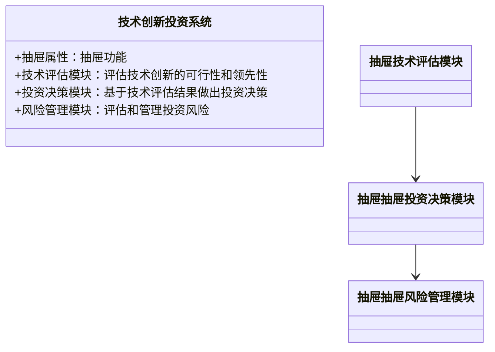

                 


# 费雪的技术创新投资观

> 关键词：技术创新投资，费雪投资观，技术分析，投资策略，风险管理，数学模型

> 摘要：本文从费雪的技术创新投资观出发，深入分析了技术创新在投资中的重要性，探讨了技术创新对投资决策的影响，结合实际案例和数学模型，详细阐述了技术创新投资的核心概念、算法原理、系统架构、风险管理及现代应用。

---

# 第1章：技术创新投资的背景介绍

## 1.1 技术创新的定义与特征

技术创新是指将新的技术或技术改进应用于产品或服务，以创造新的价值或提高现有价值的过程。其核心特征包括：

1. **创新性**：技术的新颖性和独特性。
2. **实用性**：技术能够解决实际问题或提高效率。
3. **可扩展性**：技术能够在更大范围内应用并产生效益。
4. **风险性**：技术创新过程中存在不确定性，可能导致失败。

## 1.2 费雪技术创新投资观的背景

菲利普·费雪（Philip Fisher）是20世纪著名的投资家，他提出的技术创新投资观强调了技术进步对企业发展和投资决策的重要性。费雪认为，技术创新是推动企业增长的核心动力，投资者应关注那些能够持续创新的企业。

---

# 第2章：技术创新投资的核心概念与联系

## 2.1 核心概念原理

### 2.1.1 技术创新与投资的关系

技术创新是投资的驱动力，投资者通过识别和投资于具有技术创新能力的企业，可以获得超额收益。

### 2.1.2 费雪技术创新投资观的核心要素

1. **技术领先性**：企业是否拥有领先的技术。
2. **技术可行性**：技术是否能够在市场上成功应用。
3. **技术持续性**：企业是否能够持续创新。

## 2.2 概念属性特征对比表格

以下表格对比了技术创新与传统投资的核心属性：

| 属性         | 技术创新投资                 | 传统投资                     |
|--------------|-----------------------------|-----------------------------|
| 核心驱动     | 技术进步                     | 财务回报                     |
| 风险水平     | 高                          | 中低                         |
| 投资周期     | 长                          | 短                          |
| 投资回报     | 高                          | 中低                         |

## 2.3 实体关系图（ER图）

```mermaid
erDiagram
    customer[投资者] 
    company[企业] 
    technology[技术]
    investment[投资]
    customer --> company : 投资关系
    company --> technology : 拥有技术
    company --> investment : 进行投资
    technology --> investment : 技术驱动投资
```

---

# 第3章：技术创新投资的算法与数学模型

## 3.1 技术创新评估算法原理

### 3.1.1 技术创新评估框架

技术创新评估的算法框架如下：

1. 确定技术创新的核心要素。
2. 评估企业的技术领先性。
3. 评估技术的可行性和持续性。
4. 计算投资回报率。

### 3.1.2 数学模型

技术创新投资的回报率（ROI）模型如下：

$$ ROI = \frac{净收益}{投资成本} \times 100\% $$

其中，净收益包括技术创新带来的收益减去投资成本。

---

## 3.2 技术创新风险评估模型

技术创新风险评估模型如下：

$$ 风险指数 = \frac{技术不确定性 + 市场风险}{2} $$

其中，技术不确定性是指技术创新失败的可能性，市场风险是指市场对技术创新的接受程度。

---

# 第4章：技术创新投资的系统分析与架构设计

## 4.1 问题场景介绍

技术创新投资中的主要挑战包括技术不确定性、市场风险和投资周期长等问题。

## 4.2 系统功能设计

技术创新投资系统的功能模块如下：

1. 技术评估模块：评估技术创新的可行性和领先性。
2. 投资决策模块：基于技术评估结果做出投资决策。
3. 风险管理模块：评估和管理投资风险。

### Mermaid类图



---

## 4.3 系统架构设计

技术创新投资系统的架构如下：

1. 用户界面：投资者提交投资需求。
2. 技术评估模块：对技术创新进行评估。
3. 投资决策模块：基于评估结果做出投资决策。
4. 风险管理模块：管理投资风险。

### Mermaid架构图

```mermaid
archiecture
    客户端 --> 入口层：提交投资需求
    入口层 --> 服务层：技术评估模块
    服务层 --> 数据层：存储评估结果
    服务层 --> 业务逻辑层：投资决策模块
    业务逻辑层 --> 数据层：存储决策结果
    业务逻辑层 --> 风险管理模块：管理投资风险
```

---

# 第5章：技术创新投资的项目实战

## 5.1 环境安装与配置

安装Python环境，安装相关库（如NumPy、Pandas）。

## 5.2 核心实现源代码

以下是技术创新评估算法的Python代码实现：

```python
import numpy as np
import pandas as pd

def calculate_roi(net_profit, investment_cost):
    return (net_profit / investment_cost) * 100

def calculate_risk(tech_uncertainty, market_risk):
    return (tech_uncertainty + market_risk) / 2

# 示例数据
net_profit = 1000000
investment_cost = 500000
tech_uncertainty = 0.3
market_risk = 0.4

# 计算ROI
roi = calculate_roi(net_profit, investment_cost)
print(f"ROI: {roi}%")

# 计算风险指数
risk_index = calculate_risk(tech_uncertainty, market_risk)
print(f"风险指数: {risk_index}")
```

## 5.3 代码解读与分析

上述代码实现了技术创新投资的ROI计算和风险评估。`calculate_roi`函数计算投资回报率，`calculate_risk`函数计算风险指数。

---

# 第6章：技术创新投资的现代应用

## 6.1 数字化转型中的技术创新投资

数字化转型推动了技术创新投资，企业通过技术创新实现数字化转型，投资者通过技术创新投资获得超额收益。

## 6.2 人工智能与技术创新投资

人工智能技术的应用显著提高了技术创新评估的效率和准确性。

---

# 第7章：风险管理与现代应用

## 7.1 技术创新投资中的风险管理

### 7.1.1 风险识别与评估

技术创新投资中的主要风险包括技术失败、市场需求不足等。

### 7.1.2 风险管理策略

投资者应通过分散投资、定期评估等方式降低投资风险。

---

## 7.2 现代应用与总结

技术创新投资在现代经济中的作用越来越重要，投资者应关注技术创新的可持续性和市场适应性。

---

# 第8章：总结与展望

技术创新投资是推动经济增长的核心动力，投资者应积极关注技术创新，合理评估风险，制定科学的投资策略。

---

# 参考文献

1. 费雪《成长股投资策略》
2. 技术创新相关学术论文
3. 投资学相关书籍

---

以上是《费雪的技术创新投资观》的完整目录和内容框架，涵盖了技术创新投资的核心概念、算法原理、系统架构、风险管理及现代应用。

