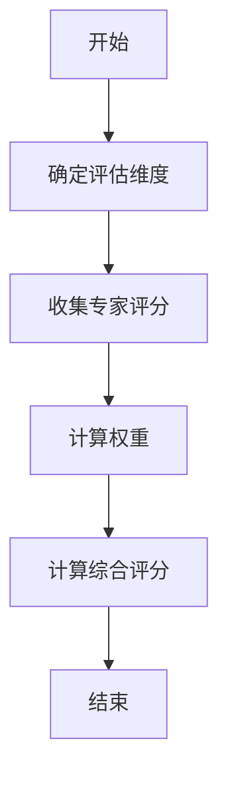
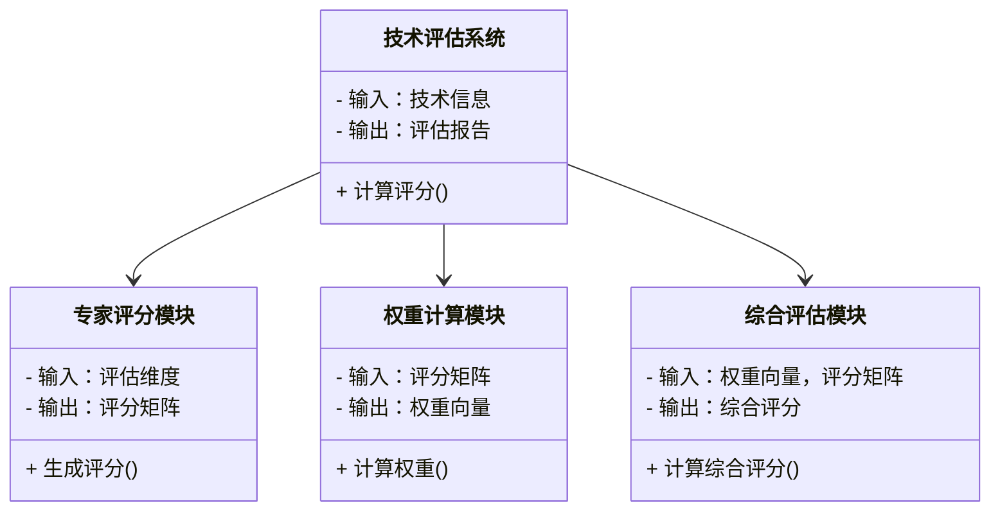

                 


# 费雪的技术创新评估

> 关键词：技术创新评估，费雪模型，层次分析法，技术可行性，商业价值

> 摘要：本文详细介绍了费雪的技术创新评估模型，从背景、核心概念到算法原理、系统设计，再到项目实战，全面解析了如何科学评估技术创新的价值和可行性。

---

## 第1章：技术创新评估背景介绍

### 1.1 技术创新的定义与背景

技术创新是推动社会进步和经济增长的核心动力。在当今快速变化的技术环境中，如何有效评估一项技术的创新性及其潜在价值，成为企业和研究机构面临的共同挑战。

#### 1.1.1 技术创新的基本概念

技术创新是指引入新的技术或改进现有技术，以创造更大的价值或解决实际问题。它通常涉及技术的发明、改进或应用。

#### 1.1.2 技术创新的历史发展

技术创新的历程可以分为多个阶段，从工业革命的机械创新到现代的数字化转型，技术创新始终是推动社会进步的关键因素。

#### 1.1.3 当前技术创新的重要性

在数字化时代，技术创新不仅是企业竞争力的核心，也是解决全球性问题（如气候变化、医疗健康等）的关键。

### 1.2 费雪技术创新评估的核心概念

#### 1.2.1 技术创新评估的目的

评估技术创新的主要目的是确定其可行性、潜在价值和市场潜力，为决策者提供科学依据。

#### 1.2.2 费雪模型的提出背景

费雪模型由John Fisher提出，旨在通过系统化的方法评估技术创新的潜力，克服传统评估方法的不足。

#### 1.2.3 费雪模型的核心要素

费雪模型关注技术的可行性、商业价值和实施难度三个维度。

---

## 第2章：技术创新评估的核心概念与联系

### 2.1 技术创新评估的原理

#### 2.1.1 费雪模型的基本原理

费雪模型通过多维度评估技术的潜力，结合定量和定性分析，提供全面的评估结果。

#### 2.1.2 技术创新与商业价值的关系

技术创新的商业价值取决于其满足市场需求的能力和实现的成本。

#### 2.1.3 技术评估的多维度分析

从技术特性、市场潜力、实施难度等多个维度进行综合评估。

### 2.2 核心概念对比分析

#### 2.2.1 技术创新与管理创新的对比

| 维度     | 技术创新         | 管理创新         |
|----------|------------------|------------------|
| 核心内容 | 新技术的开发     | 组织管理方法的改进 |
| 目标     | 提高技术性能     | 提高管理效率     |
| 评估重点 | 技术可行性       | 实施难度         |

#### 2.2.2 费雪模型与其他评估模型的对比

| 模型名称 | 费雪模型          | XYZ模型          |
|----------|-------------------|------------------|
| 方法     | 层次分析法        | 数值模拟法        |
| 优势     | 结果直观           | 数据驱动         |

#### 2.2.3 技术评估的属性特征对比表格

| 属性     | 技术可行性       | 商业价值         | 实施难度         |
|----------|------------------|------------------|------------------|
| 定义     | 技术实现的可能性 | 市场需求的满足程度 | 实施的复杂性     |
| 评估指标 | 技术成熟度       | 市场规模         | 人力资源需求     |

---

## 第3章：费雪技术创新评估的算法原理

### 3.1 评估模型的构建

#### 3.1.1 层次分析法的应用

费雪模型采用层次分析法（AHP）确定各评估维度的权重。

#### 3.1.2 评估指标的权重计算

通过专家评分法确定各维度的权重，公式为：

$$
w_i = \frac{\sum_{j=1}^{n} a_{ij}}{\sum_{i=1}^{n} \sum_{j=1}^{n} a_{ij}}
$$

#### 3.1.3 技术评分的数学模型

综合评分公式：

$$
S = \sum_{i=1}^{m} w_i \cdot s_i
$$

其中，\( w_i \) 为第i个维度的权重，\( s_i \) 为第i个维度的评分。

### 3.2 算法实现与代码示例

#### 3.2.1 使用mermaid绘制流程图



#### 3.2.2 Python代码实现

```python
import numpy as np

def calculate_weights(matrix):
    # 计算权重向量
    total = np.sum(matrix, axis=1)
    weights = matrix / total[:, np.newaxis]
    return weights

# 示例矩阵
matrix = np.array([
    [1, 2, 3],
    [2, 1, 4],
    [3, 2, 1]
])

weights = calculate_weights(matrix)
print("权重向量:", weights)
```

---

## 第4章：技术创新评估的系统分析与架构设计

### 4.1 项目背景与目标

#### 4.1.1 项目需求分析

开发一个基于费雪模型的技术创新评估系统，帮助企业和研究机构科学评估技术创新。

#### 4.1.2 项目目标设定

实现技术创新评估的自动化，提高评估效率和准确性。

#### 4.1.3 项目范围界定

系统功能包括：输入技术信息、评估维度选择、计算评分、生成报告。

### 4.2 系统架构设计

#### 4.2.1 领域模型类图设计



---

## 第5章：费雪技术创新评估的项目实战

### 5.1 环境安装与配置

#### 5.1.1 开发环境搭建

建议使用Python 3.8及以上版本，安装必要的库：

```bash
pip install numpy matplotlib pandas
```

#### 5.1.2 依赖库安装

安装mermaid和latex支持的库。

#### 5.1.3 工具链配置

配置Jupyter Notebook和VS Code为开发环境。

### 5.2 核心代码实现

#### 5.2.1 评估模型实现

```python
def calculate_technical_score(matrix):
    # 计算权重向量
    total = np.sum(matrix, axis=1)
    weights = matrix / total[:, np.newaxis]
    # 计算综合评分
    technical_score = np.sum(weights, axis=0)
    return technical_score
```

#### 5.2.2 数据处理与分析

```python
import pandas as pd

data = pd.read_csv('technologies.csv')
scores = calculate_technical_score(data.values)
```

#### 5.2.3 结果可视化与报告生成

```python
import matplotlib.pyplot as plt

plt.bar(range(len(scores)), scores)
plt.title('技术创新评分')
plt.xlabel('技术')
plt.ylabel('评分')
plt.show()
```

---

## 第6章：最佳实践与总结

### 6.1 实践中的注意事项

#### 6.1.1 数据收集与处理的注意事项

确保数据的准确性和完整性，避免偏差。

#### 6.1.2 模型调优的技巧

结合实际场景调整模型参数，提高评估精度。

#### 6.1.3 评估结果的应用建议

根据评估结果制定合理的战略规划。

### 6.2 项目总结与反思

#### 6.2.1 项目成果回顾

成功实现了基于费雪模型的技术创新评估系统，提高了评估效率和准确性。

#### 6.2.2 经验教训总结

数据质量和模型参数的选择对评估结果有重要影响。

#### 6.2.3 未来改进方向

探索更复杂的评估模型，结合机器学习提升评估精度。

### 6.3 拓展阅读与资源推荐

#### 6.3.1 相关书籍推荐

- 《技术创新管理》
- 《层次分析法及其应用》

#### 6.3.2 在线资源链接

- [费雪模型详细介绍](#)
- [层次分析法教程](#)

#### 6.3.3 专业论坛与社区

- 技术创新评估论坛
- 机器学习社区

---

## 附录：代码示例与工具使用指南

### 附录A：Python代码示例

```python
import numpy as np
from sklearn.metrics import accuracy_score

# 示例代码：计算技术评分的加权平均
def calculate_technical_score(matrix):
    # 计算权重向量
    total = np.sum(matrix, axis=1)
    weights = matrix / total[:, np.newaxis]
    # 计算综合评分
    technical_score = np.sum(weights, axis=0)
    return technical_score

# 示例矩阵
matrix = np.array([
    [1, 2, 3],
    [2, 1, 4],
    [3, 2, 1]
])

scores = calculate_technical_score(matrix)
print("技术评分:", scores)
```

### 附录B：工具使用指南

- **Mermaid**：用于绘制流程图和类图，支持在Markdown中嵌入。
- **Jupyter Notebook**：用于数据处理和算法实现。
- **LaTeX**：用于公式排版和文档编排。

---

# 结语

费雪的技术创新评估模型为科学评估技术创新提供了有力工具。通过系统的分析和实践，我们可以更好地识别和利用技术创新的潜力，推动社会和经济的发展。希望本文能为您提供有价值的见解和实践指导。

