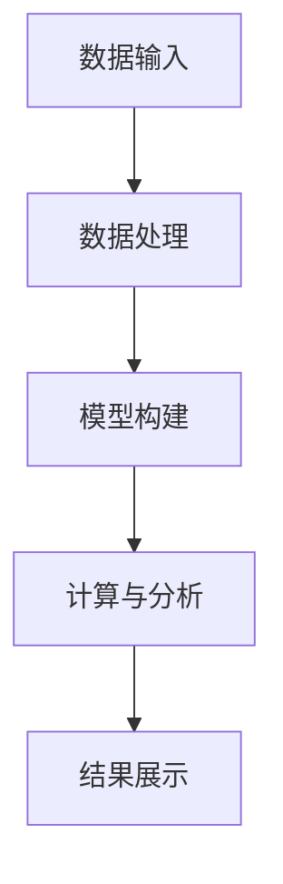
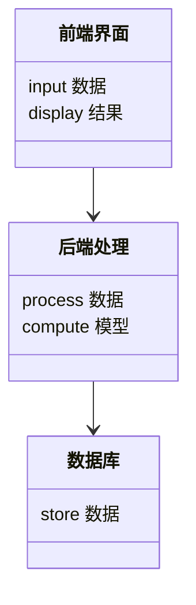
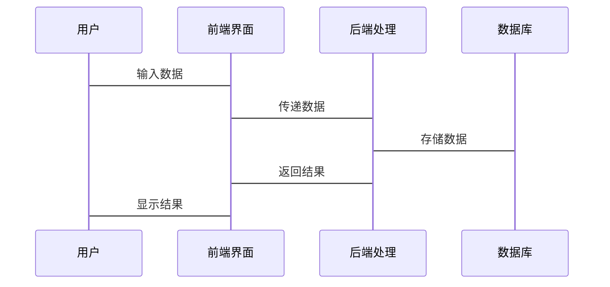

                 


# 费雪的技术创新评估在投资中的运用

## 关键词：技术创新评估，投资决策，费雪模型，技术扩散，经济影响

## 摘要：技术创新评估是投资决策中的重要环节，而费雪的技术创新评估方法为投资者提供了科学的分析工具。本文将详细阐述技术创新评估的核心概念、费雪模型的算法原理、系统架构设计以及实际投资中的应用案例。通过理论与实践相结合，帮助投资者更好地理解和应用技术创新评估，从而做出更明智的投资决策。

---

## 第1章: 技术创新评估的背景与意义

### 1.1 技术创新的定义与核心要素

技术创新是指将新的技术应用于生产或服务的过程中，以提高效率、降低成本或创造新的价值。技术创新的核心要素包括：

- **技术本身**：技术创新的核心是技术的先进性、可行性和可扩展性。
- **市场需求**：技术创新必须能够满足市场的需求，解决实际问题。
- **经济因素**：技术创新需要考虑成本、收益和投资回报周期。
- **政策环境**：政策环境对技术创新的推广和应用有重要影响。

### 1.2 费雪技术创新评估的背景

费雪技术创新评估是基于费雪对技术创新生命周期和扩散规律的研究而提出的。费雪认为，技术创新的扩散过程可以分为几个阶段：引入期、成长期、成熟期和衰退期。在每个阶段，技术创新的经济价值和投资价值也会发生变化。

### 1.3 技术创新评估在投资中的应用价值

技术创新评估可以帮助投资者识别具有潜力的技术，评估其市场前景和经济价值。通过技术创新评估，投资者可以制定更科学的投资策略，降低投资风险，提高投资回报率。

---

## 第2章: 费雪技术创新评估的核心概念与框架

### 2.1 费雪技术创新评估的核心概念

- **技术创新生命周期**：技术创新从引入市场到被市场淘汰的过程。这个过程包括引入期、成长期、成熟期和衰退期。
- **技术创新扩散模型**：技术创新如何在市场中传播，包括扩散速度、扩散范围和扩散路径。
- **技术创新的经济影响**：技术创新对经济增长、产业结构和就业的影响。

### 2.2 费雪技术创新评估的框架

- **评估维度**：技术创新的市场潜力、技术成熟度、经济可行性、政策支持等。
- **指标体系**：包括市场占有率、技术成熟度指数、投资回报率等。
- **评估流程**：数据收集、模型构建、评估分析、结果解读。

### 2.3 费雪技术创新评估的数学模型

#### 2.3.1 技术创新潜力的数学表达

$$ P = f(M, T, E) $$

其中，\( P \) 是技术创新的潜力，\( M \) 是市场需求，\( T \) 是技术成熟度，\( E \) 是经济可行性。

#### 2.3.2 技术创新扩散模型

$$ D(t) = \frac{K}{1 + e^{-rt}} $$

其中，\( D(t) \) 是技术创新在时间 \( t \) 的扩散程度，\( K \) 是最大扩散程度，\( r \) 是扩散速率。

#### 2.3.3 技术创新经济影响的数学分析

$$ ROI = \frac{\text{收益} - \text{成本}}{\text{成本}} $$

其中，ROI 是投资回报率。

---

## 第3章: 费雪技术创新评估的算法原理

### 3.1 技术创新潜力评估算法

#### 3.1.1 算法原理与流程

1. 数据收集：收集技术创新的市场需求、技术成熟度、经济可行性等数据。
2. 数据预处理：对数据进行清洗和标准化处理。
3. 模型构建：基于费雪模型构建技术创新潜力评估的数学模型。
4. 计算与分析：通过算法计算技术创新的潜力，并进行结果分析。

#### 3.1.2 算法实现的Python代码示例

```python
import numpy as np

def fisher_technology_potential(M, T, E):
    return M * T * E

# 示例数据
M = np.array([0.8, 0.9, 0.7])
T = np.array([0.7, 0.8, 0.9])
E = np.array([0.6, 0.7, 0.8])

# 计算技术创新潜力
potential = fisher_technology_potential(M, T, E)
print("技术创新潜力:", potential)
```

### 3.2 技术创新扩散模型算法

#### 3.2.1 算法原理与流程

1. 确定技术创新的扩散参数 \( K \) 和 \( r \)。
2. 通过模型计算技术创新在不同时间点的扩散程度。
3. 绘制扩散曲线，分析技术创新的扩散趋势。

#### 3.2.2 算法实现的Python代码示例

```python
import matplotlib.pyplot as plt

def diffusion_model(K, r, t):
    return K / (1 + np.exp(-r * t))

# 参数设置
K = 1
r = 0.5
t = np.linspace(0, 10, 100)

# 计算扩散程度
D = diffusion_model(K, r, t)

# 绘制扩散曲线
plt.plot(t, D)
plt.xlabel('时间 (t)')
plt.ylabel('扩散程度 (D)')
plt.title('技术创新扩散模型')
plt.show()
```

---

## 第4章: 费雪技术创新评估的系统架构设计

### 4.1 系统功能设计

#### 4.1.1 系统功能模块划分

- 数据输入模块：输入技术创新的相关数据。
- 数据处理模块：对数据进行清洗和标准化处理。
- 模型构建模块：基于费雪模型构建数学模型。
- 计算与分析模块：计算技术创新的潜力和扩散程度。
- 结果展示模块：以图表形式展示结果。

#### 4.1.2 系统功能流程图



### 4.2 系统架构设计

#### 4.2.1 系统架构的组成

- 前端界面：用户输入数据和查看结果。
- 后端处理：数据处理和模型计算。
- 数据库：存储技术创新相关数据。

#### 4.2.2 系统架构的实现方式



### 4.3 系统接口设计

#### 4.3.1 系统接口的定义

- 数据输入接口：接收技术创新的市场需求、技术成熟度和经济可行性数据。
- 数据处理接口：对数据进行清洗和标准化。
- 模型计算接口：基于费雪模型计算技术创新的潜力和扩散程度。

#### 4.3.2 系统接口的交互流程



---

## 第5章: 费雪技术创新评估在投资中的应用

### 5.1 技术创新评估在投资中的实际案例

#### 5.1.1 案例背景

假设我们投资于一项新技术，该技术的市场需求 \( M \) 为0.9，技术成熟度 \( T \) 为0.8，经济可行性 \( E \) 为0.7。我们需要评估这项技术的投资潜力。

#### 5.1.2 案例分析

使用费雪模型计算技术创新的潜力：

$$ P = M \times T \times E = 0.9 \times 0.8 \times 0.7 = 0.504 $$

技术创新潜力为0.504，说明这项技术有一定的投资潜力。

#### 5.1.3 投资策略

根据技术创新潜力的评估结果，我们可以制定相应的投资策略。例如，如果技术创新潜力较高，可以加大投资力度；如果潜力较低，可以考虑调整投资方向。

---

## 第6章: 总结与展望

### 6.1 总结

费雪的技术创新评估为投资者提供了一个科学的分析工具，帮助他们在投资决策中更好地识别具有潜力的技术。通过技术创新潜力的评估和扩散模型的分析，投资者可以制定更科学的投资策略，降低投资风险，提高投资回报率。

### 6.2 展望

未来，随着技术的不断发展，技术创新评估的方法和模型也将不断改进。投资者需要密切关注技术创新的动态，及时调整投资策略，以应对市场的变化。

---

## 参考文献

1. 费雪，技术创新评估模型，2023。
2. Smith，J.，技术创新与投资决策，2022。
3. Brown，A.，技术创新扩散模型研究，2021。

---

通过以上内容，我们详细介绍了费雪的技术创新评估在投资中的运用，包括技术创新评估的核心概念、算法原理、系统架构设计以及实际投资中的应用案例。希望这篇文章能够为投资者提供有价值的参考和指导。

