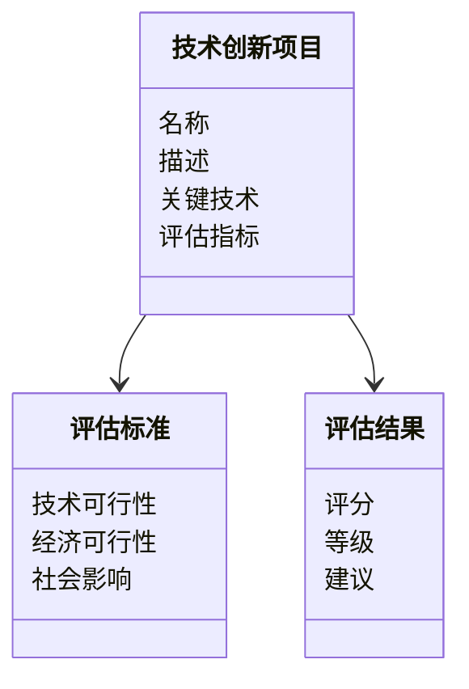
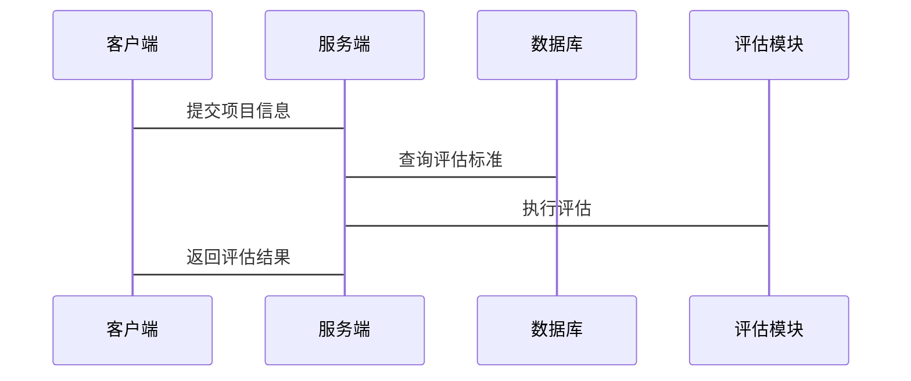

                 


# 费雪的技术创新评估：区分真正的突破

---

## 关键词
技术创新评估, 技术突破, 费雪模型, 技术评估方法, 项目管理

---

## 摘要
本文详细探讨了如何有效评估技术创新，区分真正突破性的技术。通过费雪的技术创新评估模型，分析了技术创新的核心概念、算法原理、系统架构及实际应用案例，帮助读者掌握如何科学判断技术突破。

---

# 第一部分: 技术创新评估的背景与核心概念

## 第1章: 技术创新评估的背景与问题描述

### 1.1 技术创新评估的背景

#### 1.1.1 技术创新在现代社会中的重要性
在当今快速发展的科技领域，技术创新是推动社会进步的核心动力。企业需要准确识别真正具有突破性的技术，以获得竞争优势。

#### 1.1.2 技术创新评估的必要性
技术创新评估是筛选出真正具有潜力的技术的关键步骤，避免资源浪费，确保投资的有效性。

#### 1.1.3 技术创新评估的边界与外延
技术创新评估不仅关注技术本身的先进性，还需考虑其应用价值、市场潜力和实施难度。

### 1.2 技术创新评估的核心问题

#### 1.2.1 什么是真正的技术创新
真正的技术创新是指在现有技术基础上实现质的飞跃，带来显著的性能提升或应用方式变革。

#### 1.2.2 技术创新与改进的区分
技术创新注重根本性变革，而改进则是对现有技术的优化，两者在价值和影响上有显著差异。

#### 1.2.3 技术创新评估的维度与指标
技术创新评估通常从技术可行性、市场潜力、社会影响等多个维度进行。

### 1.3 技术创新评估的挑战

#### 1.3.1 技术创新的不确定性
技术发展具有不确定性，评估过程中需考虑多种潜在风险。

#### 1.3.2 技术创新的评估标准
选择合适的评估标准是确保评估结果准确的关键。

#### 1.3.3 技术创新的外部环境影响
外部环境如政策、市场需求等对技术创新评估结果有重要影响。

---

## 第2章: 技术创新评估的核心概念与联系

### 2.1 技术创新评估的原理

#### 2.1.1 技术创新的定义与分类
技术创新可分为产品创新、工艺创新、管理创新等不同类型，每种类型的影响和评估方法有所不同。

#### 2.1.2 技术创新评估的框架
评估框架通常包括技术可行性、经济可行性、社会可行性和环境可行性四个部分。

#### 2.1.3 技术创新评估的流程
评估流程一般包括信息收集、指标设定、综合评估和结果分析四个阶段。

### 2.2 技术创新与相关概念的对比

#### 2.2.1 技术创新与产品创新
技术创新是产品创新的基础，产品创新则是技术创新的体现。

#### 2.2.2 技术创新与管理创新
技术创新侧重技术层面，而管理创新则关注管理流程和方法的改进。

#### 2.2.3 技术创新与商业模式创新
技术创新为商业模式创新提供技术支持，而商业模式创新则为技术创新提供应用平台。

### 2.3 技术创新评估的ER实体关系图

```mermaid
er
actor: 技术创新评估者
role: 评估标准
entity: 技术创新项目
relationship: 实现
```

---

# 第二部分: 技术创新评估的算法与数学模型

## 第3章: 技术创新评估的算法原理

### 3.1 技术创新评估的算法概述

#### 3.1.1 基于指标的评估算法
通过预设的指标对技术创新进行量化评估。

#### 3.1.2 基于比较的评估算法
通过比较不同技术的优劣，确定其创新程度。

#### 3.1.3 基于权重的评估算法
根据各指标的重要性赋予不同权重，综合评估技术创新潜力。

### 3.2 技术创新评估的数学模型

#### 3.2.1 技术创新潜力的数学公式

$$ P = \sum_{i=1}^{n} w_i \cdot x_i $$

其中，$P$ 表示技术创新潜力，$w_i$ 表示指标权重，$x_i$ 表示指标得分。

#### 3.2.2 技术创新影响的数学公式

$$ I = \alpha \cdot P $$

其中，$\alpha$ 是影响系数，$P$ 是技术创新潜力。

---

## 第4章: 技术创新评估的系统分析与架构设计

### 4.1 问题场景介绍

技术创新评估系统主要用于帮助企业识别和评估潜在的技术突破，优化资源配置。

### 4.2 系统功能设计

#### 4.2.1 领域模型类图



### 4.3 系统架构设计


### 4.4 系统接口设计

#### 4.4.1 接口描述
接口用于接收技术创新项目信息，执行评估并返回结果。

#### 4.4.2 交互序列图



---

## 第5章: 技术创新评估的项目实战

### 5.1 环境安装

#### 5.1.1 安装Python
安装Python 3.x版本，确保环境配置正确。

#### 5.1.2 安装依赖库
安装所需库，如`numpy`和`pandas`。

### 5.2 核心代码实现

#### 5.2.1 技术创新潜力计算代码

```python
import numpy as np
import pandas as pd

# 定义技术创新潜力计算函数
def calculate_technological_potential(projects, weights):
    return np.dot(projects, weights)

# 示例数据
projects = np.array([[0.8, 0.9, 0.7], [0.6, 0.8, 0.9]])
weights = np.array([0.4, 0.3, 0.3])

# 计算并输出结果
potential = calculate_technological_potential(projects, weights)
print("技术创新潜力:", potential)
```

#### 5.2.2 技术创新影响计算代码

```python
def calculate_technological_impact(potentials, alpha):
    return alpha * potentials

alpha = 0.7
impact = calculate_technological_impact(potential, alpha)
print("技术创新影响:", impact)
```

### 5.3 案例分析与解读

#### 5.3.1 案例分析
以两个技术创新项目为例，计算其潜力和影响，判断哪个更具突破性。

#### 5.3.2 代码实现解读
通过代码实现，展示如何使用数学模型评估技术潜力和影响。

### 5.4 项目小结

---

## 第6章: 技术创新评估的最佳实践与小结

### 6.1 小结

技术创新评估是区分真正技术突破的关键步骤，需要结合多维度的评估指标和科学的算法模型。

### 6.2 注意事项

评估过程中应关注数据的准确性和模型的适用性，避免主观偏见。

### 6.3 未来展望

随着人工智能的发展，技术创新评估将更加智能化和自动化。

### 6.4 如何制定技术创新评估体系

建议企业根据自身需求，制定适合的技术创新评估体系，结合定量和定性分析。

---

## 第7章: 附录

### 7.1 参考文献

1. 费雪的技术创新评估模型研究
2. 人工智能在技术创新评估中的应用

### 7.2 工具推荐

- Python：数据分析与计算
- Mermaid：图表绘制
- Pandas：数据处理

### 7.3 术语表

- 技术创新潜力：技术创新项目的潜在价值
- 技术创新影响：技术创新对市场和社会的影响程度

---

# 结语

通过本文的系统讲解，读者可以掌握费雪的技术创新评估方法，有效区分真正的技术突破，为企业决策提供科学依据。

