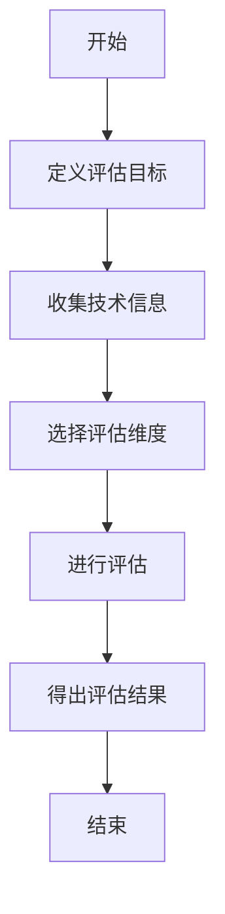
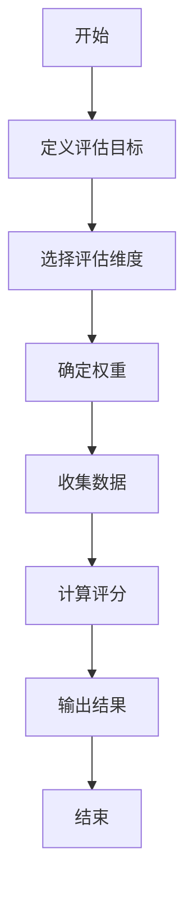
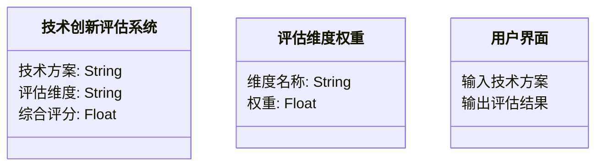
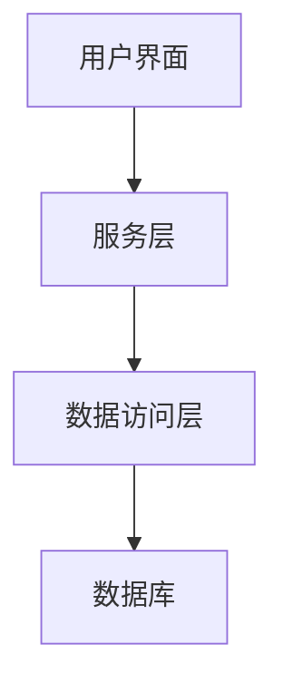
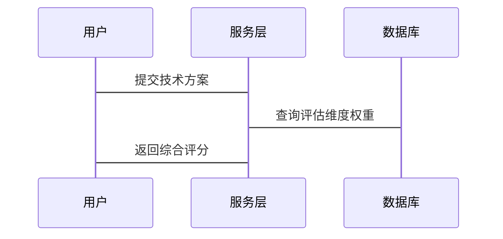

                 


# 费雪的技术创新评估：未来领导者的特征

> 关键词：技术创新评估，未来领导者，技术管理，创新策略，企业架构

> 摘要：技术创新评估是企业在快速变化的技术环境中保持竞争力的关键。本文将深入探讨费雪的技术创新评估方法，分析其核心概念、算法原理、数学模型，并通过实际案例展示其应用。通过本文，读者将了解如何通过技术创新评估成为未来的技术领导者，并掌握在实际工作中应用这些方法的技巧。

---

## 第一部分: 费雪技术创新评估的背景与核心概念

### 第1章: 技术创新评估的背景与问题背景

#### 1.1 技术创新评估的定义与重要性

##### 1.1.1 技术创新评估的基本概念
技术创新评估是通过系统化的方法对技术的创新性、可行性和潜在影响进行分析和评价的过程。它旨在帮助企业识别具有战略意义的技术创新，优化资源配置，降低技术风险。

##### 1.1.2 技术创新评估的重要性
在数字化转型和全球化竞争的背景下，技术创新是企业保持竞争优势的核心驱动力。通过技术创新评估，企业能够：
- **识别潜在的技术机会**：发现市场中尚未被满足的技术需求。
- **降低技术风险**：评估技术的可行性和潜在风险，避免资源浪费。
- **优化创新流程**：通过系统化的评估方法，提高创新效率。
- **制定战略规划**：为企业的技术发展方向提供数据支持。

##### 1.1.3 技术创新评估的边界与外延
技术创新评估不仅关注技术本身的创新性，还涉及其对商业模式、组织结构和市场需求的影响。其外延包括从基础研究到产品商业化整个生命周期的技术评估。

#### 1.2 问题背景与问题描述

##### 1.2.1 技术创新评估的现实需求
随着技术的快速发展，企业面临着技术选择的复杂性和不确定性。如何在众多技术中筛选出具有战略价值的创新点，成为企业技术管理的核心挑战。

##### 1.2.2 技术创新评估的核心问题
- **技术可行性**：评估技术是否能够在现有条件下实现。
- **技术价值**：评估技术的市场潜力和商业价值。
- **技术风险**：评估技术在开发和应用过程中可能面临的风险。

##### 1.2.3 技术创新评估的解决路径
通过系统化的评估方法和技术工具，结合数据分析和专家意见，企业可以更科学地进行技术选择和创新决策。

### 第2章: 技术创新评估的核心概念与联系

#### 2.1 技术创新评估的原理与方法

##### 2.1.1 技术创新评估的原理
技术创新评估基于技术评估理论和方法论，结合定量分析和定性分析，对企业技术的创新性、可行性和潜在价值进行全面评估。

##### 2.1.2 技术创新评估的主要方法
- **定性评估**：通过专家访谈、案例分析等方法，评估技术的创新性和市场潜力。
- **定量评估**：通过数据建模和分析，评估技术的经济效益和技术风险。

#### 2.2 核心概念的属性特征对比

##### 2.2.1 技术创新与管理创新的对比
| 属性       | 技术创新                     | 管理创新                     |
|------------|------------------------------|------------------------------|
| 核心内容   | 技术的开发与应用             | 组织结构与流程优化           |
| 风险类型   | 技术失败风险                 | 组织变革阻力                 |
| 评估重点   | 技术的可行性和市场潜力       | 组织的适应性和效率提升       |

##### 2.2.2 技术创新与商业模式创新的对比
| 属性       | 技术创新                     | 商业模式创新                 |
|------------|------------------------------|------------------------------|
| 核心内容   | 新技术的开发与应用           | 改变收入来源或成本结构       |
| 评估重点   | 技术的创新性和市场潜力       | 模式的可行性和盈利能力       |

#### 2.3 实体关系图与流程图

##### 2.3.1 技术创新评估的ER实体关系图
```mermaid
er
  entity 技术创新 {
    key 码: String
    名称: String
    类型: String
    描述: String
  }

  entity 评估维度 {
    key 码: String
    维度名称: String
    维度描述: String
  }

  entity 技术创新评估结果 {
    key 码: String
    技术创新码: String
    维度码: String
    评估结果: Integer
  }
```

##### 2.3.2 技术创新评估的流程图


---

## 第二部分: 技术创新评估的算法与数学模型

### 第3章: 技术创新评估的算法原理

#### 3.1 技术创新评估模型的数学基础

##### 3.1.1 技术创新评估的数学模型
技术创新评估模型通常采用加权评分法，其数学表达式为：
$$ \text{综合评分} = \sum_{i=1}^{n} w_i \cdot s_i $$
其中，\( w_i \) 是第 \( i \) 个维度的权重，\( s_i \) 是第 \( i \) 个维度的评分。

##### 3.1.2 技术创新评估的权重分配
权重分配可以通过层次分析法（AHP）确定。例如，假设技术创新的权重为 \( w_1 = 0.4 \)，市场需求的权重为 \( w_2 = 0.3 \)，技术可行性的权重为 \( w_3 = 0.3 \)。

#### 3.2 技术创新评估的算法流程

##### 3.2.1 算法流程图


##### 3.2.2 算法实现步骤
1. 定义评估目标和范围。
2. 确定评估维度和权重。
3. 收集相关数据并进行预处理。
4. 使用加权评分法计算每个技术的综合评分。
5. 根据评分结果进行排序和筛选。

#### 3.3 技术创新评估的Python实现

##### 3.3.1 环境安装与配置
安装必要的Python库，例如 `pandas` 和 `numpy`：
```bash
pip install pandas numpy
```

##### 3.3.2 核心代码实现
```python
import pandas as pd

# 定义评估维度和权重
dimensions = ['技术创新', '市场需求', '技术可行性']
weights = [0.4, 0.3, 0.3]

# 创建评分数据
scores = {
    '技术创新': [0.8, 0.7, 0.9],
    '市场需求': [0.6, 0.8, 0.7],
    '技术可行性': [0.7, 0.6, 0.8]
}

df = pd.DataFrame(scores)

# 计算综合评分
df['综合评分'] = df[dimensions].apply(lambda x: sum(w * s for w, s in zip(weights, x)))

print(df)
```

##### 3.3.3 代码解读与分析
- 代码首先定义了评估维度和权重。
- 然后创建了评分数据，并使用 `apply` 函数计算每个技术的综合评分。
- 最终输出了评分结果。

### 第4章: 技术创新评估的数学模型与公式

#### 4.1 技术创新评估的数学模型

##### 4.1.1 技术创新评估的线性回归模型
$$ y = \beta_0 + \beta_1 x_1 + \beta_2 x_2 + \epsilon $$
其中，\( y \) 是综合评分，\( x_1 \) 和 \( x_2 \) 是两个评估维度，\( \beta \) 是回归系数。

##### 4.1.2 技术创新评估的权重计算公式
$$ w_i = \frac{e^{\lambda_i}}{\sum_{j=1}^{n} e^{\lambda_j}} $$
其中，\( \lambda_i \) 是第 \( i \) 个维度的专家评分，\( w_i \) 是第 \( i \) 个维度的权重。

##### 4.1.3 技术创新评估的综合评分公式
$$ S = \sum_{i=1}^{n} w_i \cdot s_i $$
其中，\( S \) 是综合评分，\( w_i \) 是第 \( i \) 个维度的权重，\( s_i \) 是第 \( i \) 个维度的评分。

#### 4.2 技术创新评估的公式推导

##### 4.2.1 技术创新评估的数学推导
假设技术创新的评分为 \( s_1 \)，市场需求的评分为 \( s_2 \)，技术可行性的评分为 \( s_3 \)，权重分别为 \( w_1 = 0.4 \)，\( w_2 = 0.3 \)，\( w_3 = 0.3 \)。则综合评分 \( S \) 为：
$$ S = 0.4s_1 + 0.3s_2 + 0.3s_3 $$

##### 4.2.2 技术创新评估的公式应用
例如，某技术的评分分别为 \( s_1 = 0.8 \)，\( s_2 = 0.6 \)，\( s_3 = 0.7 \)，则综合评分为：
$$ S = 0.4 \times 0.8 + 0.3 \times 0.6 + 0.3 \times 0.7 = 0.32 + 0.18 + 0.21 = 0.71 $$

---

## 第三部分: 技术创新评估的系统分析与架构设计

### 第5章: 技术创新评估的系统分析与架构设计

#### 5.1 问题场景介绍
企业需要评估多个技术方案的创新性和可行性，以选择最优的技术路线。

#### 5.2 系统功能设计

##### 5.2.1 领域模型设计


#### 5.3 系统架构设计

##### 5.3.1 系统架构图


#### 5.4 系统接口设计
- **输入接口**：接收技术方案和评估维度。
- **输出接口**：返回综合评分和评估结果。

#### 5.5 系统交互流程图

##### 5.5.1 评估流程


---

## 第四部分: 技术创新评估的项目实战

### 第6章: 项目实战

#### 6.1 环境安装与配置
安装Python和必要的库：
```bash
python --version
pip install pandas numpy
```

#### 6.2 核心代码实现

##### 6.2.1 代码实现
```python
import pandas as pd

# 定义评估维度和权重
dimensions = ['技术创新', '市场需求', '技术可行性']
weights = [0.4, 0.3, 0.3]

# 创建评分数据
scores = {
    '技术创新': [0.8, 0.7, 0.9],
    '市场需求': [0.6, 0.8, 0.7],
    '技术可行性': [0.7, 0.6, 0.8]
}

df = pd.DataFrame(scores)

# 计算综合评分
df['综合评分'] = df[dimensions].apply(lambda x: sum(w * s for w, s in zip(weights, x)))

print(df)
```

##### 6.2.2 代码解读与分析
- 代码首先定义了评估维度和权重。
- 然后创建了评分数据，并使用 `apply` 函数计算每个技术的综合评分。
- 最终输出了评分结果。

#### 6.3 实际案例分析

##### 6.3.1 案例分析
假设某企业有三个技术方案，其评分如下：
- 技术创新：0.8, 0.7, 0.9
- 市场需求：0.6, 0.8, 0.7
- 技术可行性：0.7, 0.6, 0.8

计算综合评分：
$$ S = 0.4 \times 0.8 + 0.3 \times 0.6 + 0.3 \times 0.7 = 0.32 + 0.18 + 0.21 = 0.71 $$
$$ S = 0.4 \times 0.7 + 0.3 \times 0.8 + 0.3 \times 0.6 = 0.28 + 0.24 + 0.18 = 0.70 $$
$$ S = 0.4 \times 0.9 + 0.3 \times 0.7 + 0.3 \times 0.8 = 0.36 + 0.21 + 0.24 = 0.81 $$

最终评分结果为：
| 技术方案 | 综合评分 |
|----------|----------|
| 方案1    | 0.71     |
| 方案2    | 0.70     |
| 方案3    | 0.81     |

##### 6.3.2 案例解读
方案3的综合评分最高，因此在三个技术方案中，方案3是最优选择。

---

## 第五部分: 技术创新评估的总结与展望

### 第7章: 总结与展望

#### 7.1 最佳实践 tips
- 在技术创新评估中，权重的分配应结合企业的实际情况和战略目标。
- 数据的准确性和完整性对评估结果有重要影响，需确保数据来源可靠。

#### 7.2 小结
技术创新评估是企业在技术竞争中保持优势的关键工具。通过科学的评估方法和系统化的实施过程，企业能够更好地识别和选择具有战略价值的技术创新。

#### 7.3 注意事项
- 技术创新评估应结合企业的实际情况，避免过于理论化。
- 在实际应用中，需考虑技术的动态变化和外部环境的影响。

#### 7.4 拓展阅读
建议进一步阅读以下内容：
- 技术创新评估的高级方法，如模糊评估法和层次分析法。
- 技术创新管理的最新研究和实践。

---

通过本文的系统讲解，读者可以全面了解费雪技术创新评估的核心思想和具体方法，并能够将其应用到实际工作中，成为未来的技术领导者。

