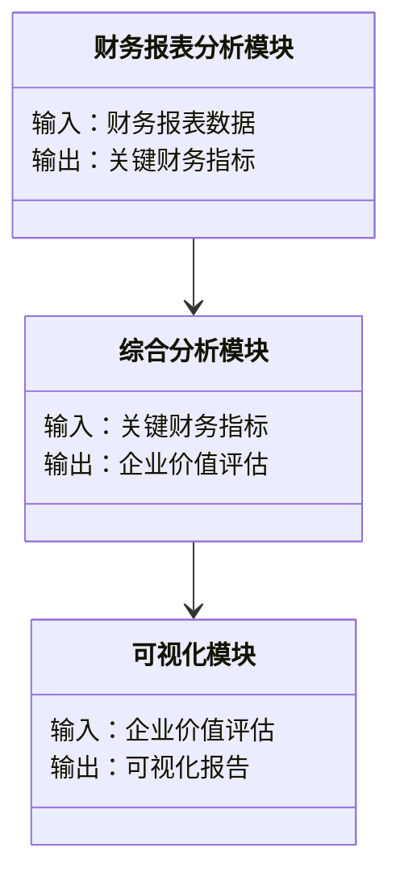

                 


# 费雪的探照灯理论：深入研究公司的方法

> 关键词：费雪探照灯理论, 公司分析, 股东权益, 财务报表分析, 企业价值评估

> 摘要：费雪的探照灯理论是一种通过分析公司财务报表和股东权益变化来评估企业内在价值的方法。本文将从理论背景、核心概念、数学模型、系统分析到项目实战，全面阐述探照灯理论的应用与实践，帮助读者深入理解如何通过财务数据进行公司分析。

---

## 第1章: 探照灯理论的核心概念与背景

### 1.1 费雪探照灯理论的起源与发展

#### 1.1.1 理论的提出背景

费雪的探照灯理论是由投资大师Philip A. Fisher提出的，旨在通过分析公司的财务数据和经营状况，发现那些具有持续增长潜力的优秀企业。该理论的核心在于通过分析股东权益的变化，揭示企业的内在价值。

#### 1.1.2 费雪探照灯理论的基本思想

探照灯理论认为，企业的价值取决于其未来现金流的现值。通过分析财务报表，特别是股东权益的变化，可以判断企业的盈利能力、成长潜力和财务健康状况。投资者可以通过对企业价值的深入分析，找到那些被市场低估的优秀企业。

#### 1.1.3 理论在投资分析中的地位

探照灯理论在投资分析中占据重要地位，它为投资者提供了一种基于财务数据的企业价值评估方法。与其他投资理论相比，探照灯理论更加注重企业的内在价值和长期发展潜力。

---

### 1.2 探照灯理论的核心要素

#### 1.2.1 财务报表分析的核心要素

探照灯理论的核心在于对财务报表的分析，特别是对利润表、资产负债表和现金流量表的深入研究。以下是财务报表分析的核心要素：

1. **利润表**：反映企业的收入、成本和利润情况，是衡量企业盈利能力的重要指标。
2. **资产负债表**：反映企业的资产、负债和股东权益情况，是评估企业财务状况的重要依据。
3. **现金流量表**：反映企业在经营活动、投资活动和筹资活动中的现金流情况，是评估企业流动性的重要指标。

#### 1.2.2 股东权益分析的关键点

股东权益是探照灯理论的核心分析对象，主要包括以下关键点：

1. **股东权益的构成**：包括股本、留存收益等，是衡量企业资本结构的重要指标。
2. **股东权益的变化**：通过分析股东权益的变化，可以判断企业的盈利能力和分红政策。
3. **股东权益与企业价值的关系**：股东权益的变化与企业价值密切相关，是评估企业内在价值的重要依据。

#### 1.2.3 现金流量分析的重要性

现金流量分析是探照灯理论的重要组成部分，主要包括以下内容：

1. **经营活动现金流**：反映企业日常经营活动中产生的现金流，是衡量企业盈利能力和流动性的重要指标。
2. **投资活动现金流**：反映企业投资活动中的现金流，是评估企业投资策略的重要依据。
3. **筹资活动现金流**：反映企业筹资活动中的现金流，是评估企业资本结构的重要指标。

---

## 第2章: 探照灯理论的数学模型与公式

### 2.1 探照灯理论的基本公式

#### 2.1.1 股东权益的计算公式

股东权益的计算公式如下：

$$ \text{股东权益} = \text{股本} + \text{留存收益} $$

其中，股本是指企业发行的普通股和优先股的总金额，留存收益是指企业从净利润中提取的公积金和未分配利润。

#### 2.1.2 现金流量的计算公式

现金流量的计算公式如下：

$$ \text{现金流量净额} = \text{经营活动现金流} + \text{投资活动现金流} + \text{筹资活动现金流} $$

其中，经营活动现金流是指企业从日常经营活动中产生的现金流，投资活动现金流是指企业投资活动中的现金流，筹资活动现金流是指企业筹资活动中的现金流。

---

### 2.2 探照灯理论的数学模型

#### 2.2.1 股东权益增长模型

股东权益增长模型如下：

$$ \text{股东权益增长} = \text{净利润} - \text{股东分红} $$

其中，净利润是指企业在一定会计期间的利润总额，股东分红是指企业向股东分配的股息和红利。

#### 2.2.2 现金流与企业价值的关系

现金流与企业价值的关系如下：

$$ \text{企业价值} = \text{现金流的现值} $$

其中，现金流的现值是指将未来现金流按一定的折现率折算到当前的价值。

---

### 2.3 公式应用实例

#### 2.3.1 某公司股东权益计算实例

假设某公司2022年的净利润为1000万元，股东分红为200万元，股本为500万元，留存收益为800万元。则股东权益为：

$$ \text{股东权益} = 500 + (1000 - 200) = 1300 \text{万元} $$

---

## 第3章: 探照灯理论的系统分析与架构设计

### 3.1 系统分析

#### 3.1.1 探照灯理论的分析框架

探照灯理论的分析框架如下：

1. **利润表分析**：分析企业的收入、成本和利润情况。
2. **资产负债表分析**：分析企业的资产、负债和股东权益情况。
3. **现金流量表分析**：分析企业的经营活动、投资活动和筹资活动的现金流情况。

#### 3.1.2 财务报表分析的流程图

以下是财务报表分析的流程图：


---

### 3.2 系统架构设计

#### 3.2.1 系统功能模块

以下是系统的功能模块：



---

## 第4章: 探照灯理论的项目实战

### 4.1 项目环境安装

#### 4.1.1 安装必要的财务分析工具

以下是安装必要的财务分析工具：

1. **Python**：用于数据分析和编程。
2. **Pandas**：用于数据处理和分析。
3. **Matplotlib**：用于数据可视化。

安装命令如下：

```bash
pip install pandas matplotlib
```

---

### 4.2 核心代码实现

#### 4.2.1 财务报表数据处理代码

以下是财务报表数据处理代码：

```python
import pandas as pd

# 假设财务报表数据存储在Excel文件中
df = pd.read_excel('financial_data.xlsx')

# 计算股东权益
equity = df['股本'] + df['留存收益']

# 计算净利润
net_profit = df['营业收入'] - df['营业成本'] - df['管理费用'] - df['销售费用'] - df['研发费用']

# 计算股东权益增长
equity_growth = net_profit - df['股东分红']
```

---

### 4.3 项目实战小结

通过以上项目实战，我们可以看到，探照灯理论在实际应用中具有很强的可操作性。通过对财务报表数据的处理和分析，我们可以准确地计算出股东权益、净利润和股东权益增长等关键指标，从而评估企业的内在价值。

---

## 总结

费雪的探照灯理论是一种通过分析公司财务报表和股东权益变化来评估企业内在价值的方法。通过本文的深入分析，我们可以看到，探照灯理论在实际应用中具有很强的可操作性。通过对财务报表数据的处理和分析，我们可以准确地计算出股东权益、净利润和股东权益增长等关键指标，从而评估企业的内在价值。

--- 

**最佳实践 tips**：

- 在实际应用中，建议结合企业的行业特点和市场环境，灵活运用探照灯理论。
- 定期更新财务数据，保持对企业的持续关注和分析。
- 多学习相关知识，提升自己的财务分析能力。

