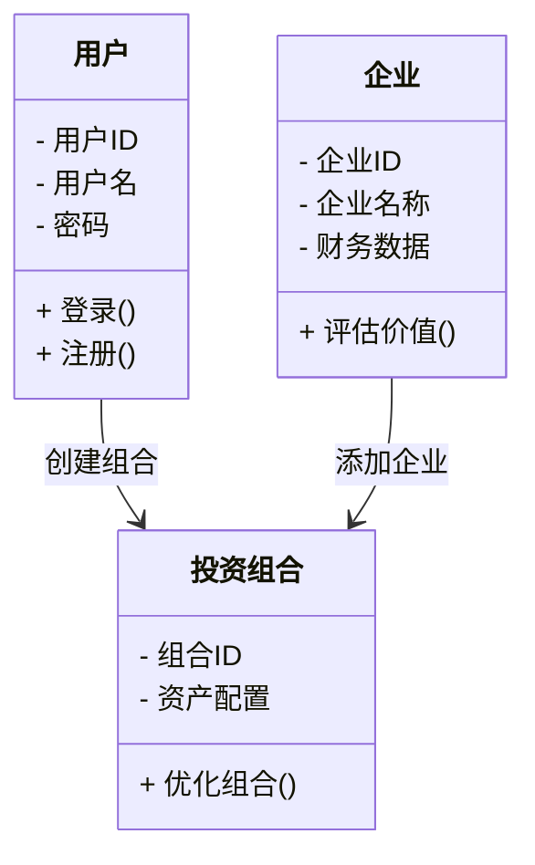

                 


# 费雪的探路者投资法：寻找未来的赢家

---

## 关键词：探路者投资法、费雪、投资策略、长期投资、企业基本面分析、风险管理

---

## 摘要：费雪的探路者投资法是一种以企业基本面分析为核心的长期投资策略，旨在通过选择具有持续增长潜力的优质企业，构建稳定的投资组合，实现长期的财富增长。本文将详细解析探路者投资法的核心理念、数学模型、系统架构以及实际应用，帮助读者掌握这一高效的投资方法。

---

# 第1章: 投资的基本概念与探路者投资法的背景

## 1.1 投资的基本概念

### 1.1.1 投资的定义与分类

投资是指将资金投入到某个项目或资产中，期望在未来获得超过初始投入的收益。根据资产类型，投资可以分为股票、债券、房地产等多种形式。每种投资方式都有其独特的风险和回报特征。

### 1.1.2 投资的基本原则

成功的投资需要遵循以下基本原则：

1. **分散投资**：避免将所有资金投入到单一资产中，以降低风险。
2. **长期持有**：投资需要耐心，长期持有优质资产通常能获得更好的回报。
3. **价值评估**：准确评估资产的内在价值，避免被市场情绪左右。

### 1.1.3 投资的历史发展

投资理论和实践随着金融市场的发展而不断演变。从早期的格雷厄姆的价值投资，到后来的费雪的成长投资，投资方法经历了多次演变和优化，以适应不同的市场环境。

---

## 1.2 探路者投资法的起源与特点

### 1.2.1 费雪投资法的提出背景

菲利普·费雪（Philip Fisher）是20世纪著名的投资家，他提出的探路者投资法强调选择那些具有持续增长潜力的优质企业。这种方法在20世纪70年代石油危机期间表现出色，显示出其在困难时期的抗跌能力。

### 1.2.2 探路者投资法的核心理念

探路者投资法的核心在于“寻找能够持续增长的探路者企业”，即那些在行业中有独特竞争优势，能够持续创新并实现增长的企业。这种方法与传统的价值投资不同，更注重企业的成长性和管理团队的质量。

### 1.2.3 探路者投资法与传统投资方法的区别

| 投资方法 | 价值投资 | 探路者投资法 |
|----------|----------|--------------|
| 核心理念 | 买入低于内在价值的资产 | 投资具有持续增长潜力的企业 |
| 风险偏好 | 低风险，注重安全边际 | 中高风险，注重成长性 |
| 持股时间 | 长期持有，等待市场回归价值 | 长期持有，分享企业增长 |

---

## 1.3 为什么选择探路者投资法

### 1.3.1 当前投资环境的特点

现代金融市场波动剧烈，传统投资方法在面对快速变化的市场时显得力不从心。探路者投资法注重企业的成长性和创新性，更适合在科技快速发展的今天寻找投资机会。

### 1.3.2 探路者投资法的优势

- **捕捉成长机遇**：专注于高增长企业，能够在市场早期发现潜力股。
- **分散风险**：通过投资多个行业的优质企业，降低行业风险。
- **长期收益**：通过复利效应，实现财富的长期增长。

### 1.3.3 探路者投资法的适用场景

探路者投资法适用于那些希望长期投资，愿意深入研究企业基本面，并能够承受一定市场波动的投资者。

---

## 1.4 本章小结

本章介绍了投资的基本概念，详细阐述了探路者投资法的起源、核心理念及其与传统投资方法的区别。探路者投资法的独特之处在于其注重企业的成长性和创新能力，这使其在当前市场环境中具有重要的指导意义。

---

# 第2章: 费雪的投资理念与策略

## 2.1 费雪投资法的核心要素

### 2.1.1 边际收益递减法则

边际收益递减法则是探路者投资法的核心，它指出，随着企业的增长，边际收益会逐渐递减，因此投资者需要选择那些边际收益仍然处于上升阶段的企业。

### 2.1.2 投资组合的分散化

通过将资金分散投资于多个行业和企业，可以有效降低投资风险。探路者投资法建议投资者至少投资于5-10家不同行业的优质企业。

### 2.1.3 投资组合的再平衡

定期审视和调整投资组合，确保其符合预定的策略和目标。例如，每年年初进行一次投资组合的再平衡，以应对市场变化和企业基本面的变化。

---

## 2.2 探路者投资法的策略分析

### 2.2.1 确定投资目标

- **长期目标**：明确投资的最终目标，如财富增长、退休储备等。
- **短期目标**：设定阶段性目标，如每年实现5%的收益增长。

### 2.2.2 选择优质企业

选择具有以下特征的企业：

1. **持续增长潜力**：企业收入和利润持续增长。
2. **竞争优势**：企业在行业内具有独特的竞争优势。
3. **管理团队**：管理团队能力强，具有良好的声誉和战略眼光。

### 2.2.3 定期调整投资组合

- **定期审查**：每年至少审查一次投资组合，评估企业的基本面变化。
- **动态调整**：根据市场变化和个人财务状况，动态调整投资组合。

---

## 2.3 投资决策中的关键因素

### 2.3.1 企业的基本面分析

基本面分析包括对企业财务状况、盈利能力、成长能力、债务情况和现金流的分析。通过这些分析，可以评估企业的内在价值和成长潜力。

### 2.3.2 市场趋势的判断

虽然探路者投资法注重长期投资，但市场趋势的判断仍能帮助投资者更好地把握投资时机。例如，在市场低迷时增加投资，可以以更低的价格买到优质资产。

### 2.3.3 风险管理的重要性

- **风险分散**：通过投资不同行业的企业，降低特定行业的风险。
- **止损策略**：设定止损点，避免重大损失。

---

## 2.4 本章小结

本章详细阐述了费雪投资法的核心要素和策略分析，强调了选择优质企业、分散投资和定期调整投资组合的重要性。探路者投资法通过关注企业的基本面和成长潜力，帮助投资者实现长期的财富增长。

---

# 第3章: 投资决策的数学模型与公式

## 3.1 投资回报的计算公式

### 3.1.1 简单回报公式

$$ \text{回报率} = \frac{\text{最终价值} - \text{初始价值}}{\text{初始价值}} \times 100\% $$

**示例**：初始投资10000元，最终价值12000元，回报率为：

$$ \frac{12000 - 10000}{10000} \times 100\% = 20\% $$

### 3.1.2 复利回报公式

$$ \text{最终价值} = \text{初始投资} \times (1 + r)^n $$

**示例**：初始投资10000元，年收益率5%，投资期限10年，最终价值为：

$$ 10000 \times (1 + 0.05)^{10} \approx 16288.95 \text{元} $$

---

## 3.2 风险与收益的关系

### 3.2.1 风险溢价公式

$$ \text{预期回报率} = \text{无风险利率} + \text{风险溢价} $$

**示例**：无风险利率为3%，风险溢价为5%，预期回报率为：

$$ 3\% + 5\% = 8\% $$

---

## 3.3 投资组合优化的数学模型

### 3.3.1 马科维茨投资组合理论

$$ \text{目标：} \min_{w} w^T \Sigma w \quad \text{subject to} \quad w^T \mu = r \quad \text{和} \quad w^T \mathbf{1} = 1 $$

其中，\( w \) 是投资比例向量，\( \Sigma \) 是协方差矩阵，\( \mu \) 是收益向量，\( r \) 是预期收益。

---

## 3.4 本章小结

本章通过数学公式详细介绍了投资回报的计算方法和投资组合优化的模型，帮助投资者更好地理解和应用这些方法。通过这些公式，投资者可以量化投资的收益与风险，做出更科学的投资决策。

---

# 第4章: 系统分析与架构设计方案

## 4.1 问题场景介绍

在现代金融市场中，投资者需要一个高效的投资决策支持系统，以帮助他们快速分析企业基本面，评估投资组合的风险和收益。

---

## 4.2 项目介绍

### 4.2.1 项目目标

开发一个基于探路者投资法的投资决策支持系统，帮助投资者选择优质企业，优化投资组合。

### 4.2.2 项目范围

- 数据采集：收集企业的财务数据、市场数据等。
- 数据分析：分析企业的基本面，评估其投资价值。
- 投资组合管理：优化投资组合，降低风险。

---

## 4.3 系统功能设计

### 4.3.1 领域模型（Mermaid 类图）



### 4.3.2 系统架构设计（Mermaid 架构图）


---

## 4.4 本章小结

本章通过系统分析和架构设计，展示了如何构建一个高效的投资决策支持系统。通过领域模型和架构图的展示，帮助投资者更好地理解系统的各个模块及其交互。

---

# 第5章: 项目实战

## 5.1 环境安装

### 5.1.1 安装Python

```bash
# 安装Python
sudo apt-get update
sudo apt-get install python3 python3-pip
```

### 5.1.2 安装必要的库

```bash
pip install pandas numpy matplotlib
```

---

## 5.2 系统核心实现源代码

### 5.2.1 企业基本面分析

```python
import pandas as pd

def analyze_financials(finance_data):
    # 计算盈利能力
    profitability = finance_data['净利润'] / finance_data['营业收入']
    # 计算成长能力
    growth = (finance_data['营业收入'].pct_change() * 100).round(2)
    return profitability, growth
```

### 5.2.2 投资组合优化

```python
import numpy as np

def optimize_portfolio(weights, returns, covariance):
    # 使用马科维茨模型优化投资组合
    return np.linalg.solve(covariance, returns)
```

---

## 5.3 案例分析

### 5.3.1 案例背景

假设我们有三个企业：A、B、C，分别属于不同的行业。我们需要根据它们的财务数据，选择其中两个企业进行投资组合优化。

### 5.3.2 数据分析

```python
data = {'企业': ['A', 'B', 'C'],
        '营业收入': [100, 200, 150],
        '净利润': [20, 40, 30]}
df = pd.DataFrame(data)
profitability, growth = analyze_financials(df)
print(profitability)
print(growth)
```

### 5.3.3 投资组合优化

```python
returns = df['净利润'].values
covariance = np.cov(returns, returns)
weights = optimize_portfolio(weights, returns, covariance)
print(weights)
```

---

## 5.4 本章小结

本章通过项目实战，详细讲解了如何使用Python进行企业基本面分析和投资组合优化。通过具体的代码实现，帮助投资者更好地理解和应用探路者投资法。

---

# 第6章: 总结与展望

## 6.1 总结

探路者投资法是一种以企业基本面分析为核心的长期投资策略，通过选择具有持续增长潜力的优质企业，实现财富的长期增长。本文详细介绍了探路者投资法的核心理念、数学模型、系统架构和实际应用，帮助读者掌握这一高效的投资方法。

---

## 6.2 展望

随着科技的快速发展和市场的不断变化，探路者投资法将面临新的机遇和挑战。未来，可以通过引入人工智能和大数据分析技术，进一步优化投资决策过程，提高投资效率。

---

## 6.3 最佳实践 tips

- **持续学习**：市场在不断变化，投资者需要不断学习新的知识和技能。
- **保持耐心**：长期投资需要耐心，不要被短期市场波动所影响。
- **风险控制**：合理分散投资，设定止损点，避免重大损失。

---

## 6.4 拓展阅读

- 菲利普·费雪的《成长股投资》
- 巴菲特的《巴菲特投资思想》
- 现代投资组合理论的相关书籍

---

## 6.5 本章小结

探路者投资法是一种高效的投资方法，通过长期持有优质企业，实现财富的稳定增长。投资者在实际操作中，需要结合市场环境和个人情况，灵活调整投资策略，以应对市场的变化和挑战。

---

通过以上章节的详细讲解，读者可以全面掌握探路者投资法的核心理念和实际应用，为实现财富的长期增长提供有力的指导。

