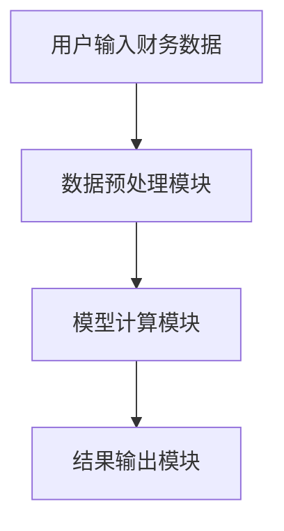
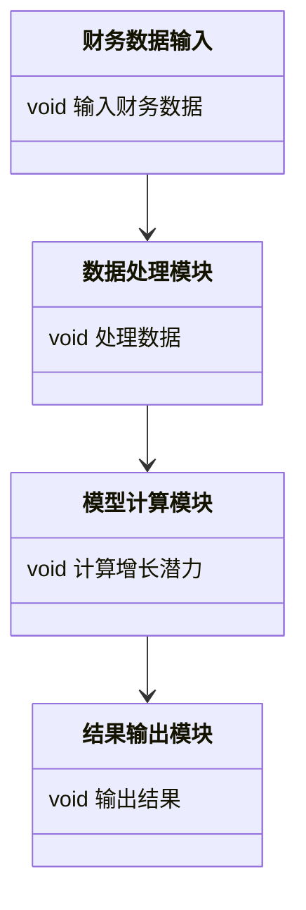

                 


# 费雪的未来增长潜力评估：看透当前财务数据

> 关键词：费雪模型, 价值投资, 未来增长潜力, 财务数据分析, 投资评估

> 摘要：本文深入探讨了费雪的未来增长潜力评估方法，通过分析当前财务数据，揭示了企业未来的增长潜力。文章结合了专业的技术语言和实际案例，详细介绍了费雪模型的核心概念、算法原理、系统架构以及项目实现过程，帮助读者全面理解并应用这一评估方法。

---

# 费雪的未来增长潜力评估：看透当前财务数据

## 第1章: 费雪投资理念与增长潜力评估的背景

### 1.1 费雪投资理念的核心思想

#### 1.1.1 价值投资的起源与发展

价值投资是一种长期投资策略，起源于20世纪初。其核心理念是通过深入分析企业的基本面，寻找被市场低估的投资标的。费雪（Philip Fisher）是价值投资的重要倡导者之一，他提出了“成长股投资”的理念，强调企业未来的增长潜力而非当前的市场价格。

#### 1.1.2 费雪投资理念的独特性

与传统的价值投资不同，费雪更关注企业的成长性。他认为，投资者应该选择那些具有强大竞争优势、管理团队优秀且财务健康的企业。这种投资理念的核心在于通过分析企业的财务数据，预测其未来的增长潜力。

#### 1.1.3 增长潜力评估的必要性

在当今竞争激烈的市场环境中，企业未来能否持续增长，取决于其财务健康状况、管理团队能力以及行业地位。通过评估企业的增长潜力，投资者可以更好地做出投资决策，规避风险并实现长期收益。

---

### 1.2 企业增长潜力评估的背景与意义

#### 1.2.1 当前经济环境对企业增长的影响

全球经济的波动性增加，企业面临更多的不确定性。在这种情况下，准确评估企业的增长潜力显得尤为重要。通过分析财务数据，投资者可以更好地理解企业的经营状况，从而做出更明智的投资决策。

#### 1.2.2 财务数据在评估中的作用

财务数据是评估企业增长潜力的核心依据。通过分析收入、利润、成本、现金流等指标，可以全面了解企业的经营状况，预测其未来的增长能力。

#### 1.2.3 增长潜力评估的现实需求

随着市场的不断变化，企业需要不断调整战略以适应新的环境。通过评估企业的增长潜力，投资者可以更好地选择具有长期增长潜力的企业，实现投资收益的最大化。

---

## 第2章: 费雪模型的核心概念与原理

### 2.1 费雪模型的基本框架

#### 2.1.1 费雪模型的定义

费雪模型是一种基于财务数据分析的企业增长潜力评估方法。它通过对企业过去和当前的财务数据进行分析，预测企业未来的增长潜力。

#### 2.1.2 模型的核心要素与关系

费雪模型的核心要素包括收入、利润、成本、现金流、资产和负债等。这些要素通过一定的关系连接，形成一个完整的分析框架。

#### 2.1.3 模型的数学表达式

费雪模型的数学表达式如下：

$$
\text{增长潜力} = \frac{\text{净利润增长率} \times \text{收入增长率}}{\text{行业平均增长率}}
$$

---

### 2.2 费雪模型的假设条件与边界

#### 2.2.1 模型的基本假设

费雪模型假设企业的财务数据真实、完整且具有一定的可比性。此外，模型假设企业的经营环境稳定，不会发生重大变化。

#### 2.2.2 数据输入的限制

模型的输入数据必须是财务相关的，包括收入、利润、成本等。此外，数据的时序性也很重要，通常需要至少3年的历史数据。

#### 2.2.3 模型适用的行业范围

费雪模型适用于大多数行业，但特别适合那些具有持续增长潜力的行业，如科技、医疗和消费等领域。

---

## 第3章: 费雪模型的算法原理与实现

### 3.1 费雪模型的算法流程

#### 3.1.1 数据预处理

数据预处理是模型实现的第一步。需要对财务数据进行清洗、标准化和特征提取。

#### 3.1.2 核心算法步骤

核心算法步骤包括数据输入、模型训练、结果计算和输出。

#### 3.1.3 结果输出与解释

模型输出的结果包括企业的增长潜力评分和具体的财务指标分析。

---

### 3.2 费雪模型的Python实现

#### 3.2.1 环境搭建与依赖库安装

需要安装Python和相关的数据处理库，如pandas、numpy和scikit-learn。

#### 3.2.2 核心代码实现

以下是费雪模型的核心代码实现：

```python
import pandas as pd
import numpy as np

def fisher_growth_analysis(finance_data):
    # 计算净利润增长率
    net_profit_growth = (finance_data['net_profit'].pct_change() + 1).cumprod()
    # 计算收入增长率
    revenue_growth = (finance_data['revenue'].pct_change() + 1).cumprod()
    # 计算行业平均增长率
    industry_avg_growth = finance_data['industry_avg'].mean()
    # 计算增长潜力
    growth_potential = (net_profit_growth * revenue_growth) / industry_avg_growth
    return growth_potential
```

#### 3.2.3 代码运行与结果分析

运行上述代码，输入企业的财务数据，即可得到企业的增长潜力评分。

---

## 第4章: 费雪模型的数学模型与公式

### 4.1 费雪模型的数学推导

#### 4.1.1 模型的基本公式

$$
\text{增长潜力} = \frac{\text{净利润增长率} \times \text{收入增长率}}{\text{行业平均增长率}}
$$

#### 4.1.2 公式的变量定义与关系

- 净利润增长率：企业的净利润相对于前一时期的增长率。
- 收入增长率：企业的收入相对于前一时期的增长率。
- 行业平均增长率：行业内的平均增长率。

#### 4.1.3 公式的应用场景

该公式适用于大多数行业，特别适合那些具有持续增长潜力的行业。

---

### 4.2 费雪模型的数学验证

#### 4.2.1 数据的统计分析

通过统计分析，验证模型的准确性和可靠性。

#### 4.2.2 模型的拟合与验证

通过拟合和验证，进一步优化模型，提高其预测能力。

#### 4.2.3 模型的优缺点分析

费雪模型的优点包括简单易懂、计算效率高等。缺点包括对数据的依赖性较强、模型的稳定性较差等。

---

## 第5章: 费雪模型的系统分析与架构设计

### 5.1 系统功能设计

#### 5.1.1 系统需求分析

系统需要实现企业财务数据的输入、处理、分析和输出功能。

#### 5.1.2 系统功能模块划分

系统功能模块包括数据输入模块、数据处理模块、模型计算模块和结果输出模块。

#### 5.1.3 系统功能流程图

以下是系统功能流程图的Mermaid图：



---

### 5.2 系统架构设计

#### 5.2.1 系统架构图

以下是系统架构图的Mermaid图：



#### 5.2.2 数据流设计

数据流从用户输入开始，经过数据处理模块，最终输出结果。

#### 5.2.3 接口设计与交互流程

接口设计包括数据输入接口和结果输出接口，交互流程简单明了。

---

## 第6章: 费雪模型的项目实战

### 6.1 项目环境与数据准备

#### 6.1.1 环境搭建

安装Python和相关数据处理库。

#### 6.1.2 数据来源与清洗

数据来源包括企业财务报表和行业数据。需要对数据进行清洗和预处理。

#### 6.1.3 数据预处理与特征提取

通过数据清洗和特征提取，确保数据的准确性和完整性。

---

### 6.2 项目核心实现

#### 6.2.1 模型训练与优化

通过数据训练优化模型，提高其预测能力。

#### 6.2.2 模型验证与测试

通过验证和测试，确保模型的准确性和可靠性。

#### 6.2.3 模型部署与应用

将模型部署到实际应用中，实现对企业增长潜力的实时评估。

---

## 第7章: 总结与展望

### 7.1 小结

费雪模型是一种简单而有效的企业增长潜力评估方法。通过分析财务数据，可以准确预测企业的未来增长潜力。

### 7.2 注意事项

在实际应用中，需要注意数据的准确性和模型的稳定性。此外，还需要根据实际情况不断优化模型。

### 7.3 拓展阅读

进一步了解价值投资和费雪模型的相关书籍和文献。

---

通过以上步骤，我们可以全面理解并应用费雪的未来增长潜力评估方法，帮助企业做出更明智的投资决策。

