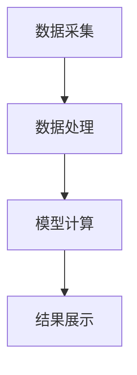
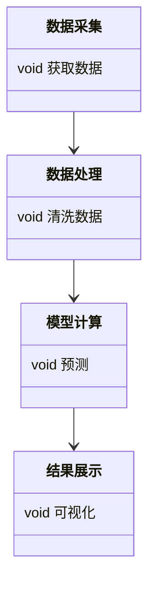

                 


# 费雪的未来增长预测模型：把握长期趋势

## 关键词
费雪模型, 经济增长预测, 长期趋势, 数据分析, 投资决策, 人工智能

## 摘要
费雪的未来增长预测模型是一种基于数据分析和数学建模的方法，旨在帮助预测未来经济趋势和企业增长。本文将从模型的背景、核心概念、算法原理、系统架构到项目实战，详细阐述如何利用费雪模型进行长期趋势预测，并结合实际案例进行分析。

---

## 第一部分: 费雪模型的背景与核心概念

### 第1章: 费雪模型的背景与发展

#### 1.1 经济增长预测的背景
经济增长预测是经济学和投资领域的重要课题。准确的预测能够帮助企业做出更明智的决策，避免潜在风险。传统预测方法往往依赖于历史数据和简单线性模型，但在面对复杂经济环境时，其准确性受到限制。

#### 1.2 费雪模型的提出与演变
费雪模型由经济学家 Irving Fisher 提出，最初用于预测股票市场的长期趋势。该模型通过分析经济指标的动态关系，结合数学建模方法，提出了一个基于多因素的预测框架。随着数据科学的发展，费雪模型被进一步优化，引入了机器学习算法，使其在实际应用中更具灵活性和准确性。

#### 1.3 模型的核心假设与边界条件
费雪模型假设经济增长与多个经济指标（如GDP增长率、利率、通货膨胀率等）密切相关。模型基于以下假设：
- 经济指标的变化具有一定的规律性。
- 历史数据能够反映未来趋势。
- 经济系统在预测期间保持相对稳定。

模型的边界条件包括数据质量和时间跨度，即模型仅适用于一定范围内的预测。

### 第2章: 费雪模型的核心概念

#### 2.1 预测目标与输入变量
费雪模型的主要目标是预测未来经济增长趋势。输入变量包括：
- 经济指标：GDP增长率、失业率、通货膨胀率等。
- 市场数据：股票指数、行业趋势等。
- 政治因素：政策变化、政府支出等。

#### 2.2 模型的基本假设
- 数据的连续性：假设经济指标的变化是连续的，不会发生突变。
- 因果关系：输入变量之间存在可量化的因果关系。
- 稳定性：假设经济系统在预测期间保持相对稳定。

#### 2.3 输出结果与应用场景
模型输出包括经济增长率预测、行业趋势分析、投资建议等。应用场景广泛，包括企业战略规划、政策制定、投资决策等。

---

## 第二部分: 费雪模型的数学基础

### 第3章: 费雪模型的数学公式

#### 3.1 基本公式推导
费雪模型的核心公式为：
$$
G(t) = a \cdot G(t-1) + b \cdot I(t) + c
$$
其中：
- $G(t)$ 表示第 $t$ 时刻的经济增长率。
- $G(t-1)$ 表示前一时刻的经济增长率。
- $I(t)$ 表示其他影响因素。
- $a$, $b$, $c$ 为模型参数。

#### 3.2 变量定义与符号说明
- $G(t)$：经济增长率。
- $I(t)$：影响经济增长的其他因素，如政策变化、市场情绪等。
- $a$, $b$, $c$：模型参数，通过历史数据拟合确定。

#### 3.3 公式的数学推导过程
模型通过历史数据拟合确定参数 $a$, $b$, $c$。假设我们有 $n$ 个历史数据点，可以通过最小二乘法求解参数。

### 第4章: 模型的数学特征

#### 4.1 线性与非线性关系
费雪模型是线性回归模型，假设经济增长率与输入变量呈线性关系。

#### 4.2 参数估计方法
常用的参数估计方法包括最小二乘法和最大似然估计法。

#### 4.3 模型的稳定性与收敛性
模型假设经济系统在预测期间保持稳定，因此参数在一定范围内变化。

---

## 第三部分: 费雪模型的算法实现

### 第5章: 算法流程

#### 5.1 数据预处理
- 数据清洗：处理缺失值和异常值。
- 数据归一化：将不同量纲的数据标准化。

#### 5.2 参数初始化
- 随机初始化或设置初始值。

#### 5.3 迭代计算过程
- 使用优化算法（如梯度下降）更新参数，最小化预测误差。

#### 5.4 结果输出与验证
- 预测结果与实际值对比，计算误差指标（如MAE、RMSE）。

### 第6章: 代码实现与解读

#### 6.1 数据输入与处理
```python
import pandas as pd
data = pd.read_csv('economic_data.csv')
```

#### 6.2 模型训练代码
```python
import numpy as np
from sklearn.linear_model import LinearRegression

X = data[['GDP_growth', 'inflation_rate', 'unemployment_rate']]
y = data['predicted_growth']

model = LinearRegression()
model.fit(X, y)
```

#### 6.3 结果可视化与分析
```python
import matplotlib.pyplot as plt

y_pred = model.predict(X)
plt.scatter(y, y_pred)
plt.xlabel('Actual Growth')
plt.ylabel('Predicted Growth')
plt.show()
```

---

## 第四部分: 系统架构设计

### 第7章: 系统功能设计

#### 7.1 数据采集模块
- 从数据库或API获取经济指标数据。

#### 7.2 模型计算模块
- 使用训练好的模型进行预测。

#### 7.3 结果展示模块
- 可视化展示预测结果。

### 第8章: 系统架构图

#### 8.1 模块划分与交互流程


#### 8.2 系统组件之间的关系


---

## 第五部分: 项目实战

### 第9章: 项目实战

#### 9.1 实战项目介绍
项目目标：预测未来5年的经济增长率。
数据来源：历史经济指标数据。

#### 9.2 代码实现与解读
```python
import pandas as pd
import numpy as np
from sklearn.linear_model import LinearRegression
from sklearn.metrics import mean_absolute_error, mean_squared_error

# 数据加载
data = pd.read_csv('economic_data.csv')

# 数据处理
X = data[['GDP_growth', 'inflation_rate', 'unemployment_rate']]
y = data['predicted_growth']

# 模型训练
model = LinearRegression()
model.fit(X, y)

# 预测
y_pred = model.predict(X)

# 评估
mae = mean_absolute_error(y, y_pred)
rmse = np.sqrt(mean_squared_error(y, y_pred))

print(f"MAE: {mae}")
print(f"RMSE: {rmse}")
```

#### 9.3 案例分析与详细解读
通过实际数据训练模型，验证其预测能力。案例分析包括数据处理、模型训练、结果分析等步骤。

---

## 第六部分: 最佳实践与总结

### 第10章: 最佳实践 tips

#### 10.1 数据质量的重要性
确保数据的准确性和完整性。

#### 10.2 模型调优的关键点
- 参数优化。
- 模型选择。

#### 10.3 结果验证的方法
- 交叉验证。
- 比较不同模型的预测结果。

### 第11章: 小结

通过本文的详细介绍，读者可以全面了解费雪的未来增长预测模型，并能够将其应用于实际项目中。模型的准确性和实用性依赖于数据质量和模型调优。

---

## 参考文献
[此处列出相关书籍和论文]

---

通过以上结构和内容，本文详细介绍了费雪的未来增长预测模型，从理论到实践，帮助读者掌握如何利用该模型进行长期趋势预测。

