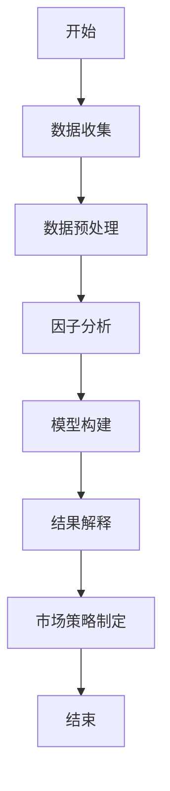
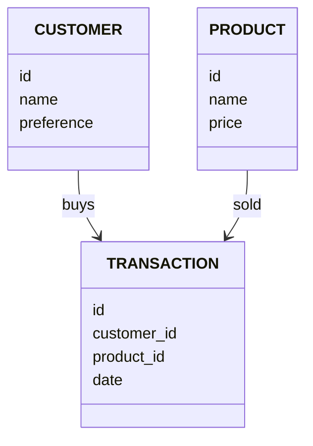

                 


# 费雪的消费者取向分析：把握市场脉搏

> 关键词：消费者取向分析，费雪分析法，市场调研，消费者心理学，数据分析，商业策略

> 摘要：本文深入探讨了费雪的消费者取向分析方法，从理论基础到实际应用，结合数据分析和商业策略，帮助读者掌握如何通过消费者取向分析把握市场脉搏，制定精准的市场策略。

---

# 第一部分: 费雪的消费者取向分析基础

## 第1章: 费雪分析法的背景与起源

### 1.1 消费者取向分析的定义与重要性

#### 1.1.1 什么是消费者取向分析
消费者取向分析是一种研究消费者行为和偏好的方法，旨在通过数据分析和心理学研究，揭示消费者的深层需求和行为模式。它帮助企业在制定市场策略时，能够更精准地定位目标客户，满足其需求。

#### 1.1.2 消费者取向分析的必要性
在竞争激烈的市场环境中，企业需要了解消费者的真实需求和偏好，才能制定有效的市场策略。消费者取向分析能够帮助企业从海量数据中提取有价值的信息，识别市场趋势和消费者行为的变化。

#### 1.1.3 费雪分析法的独特性
费雪分析法是一种基于统计学的消费者取向分析方法，它通过分析消费者在不同产品或服务上的选择行为，推断其偏好和需求。与其他方法相比，费雪分析法更加注重数据的精确性和分析的深度，能够为企业提供更精准的市场洞察。

### 1.2 费雪分析法的起源与发展

#### 1.2.1 费雪分析法的提出背景
费雪分析法由英国统计学家R.A. Fisher在20世纪初提出，最初用于农业实验设计。随着市场研究的需求增加，该方法逐渐被应用于消费者行为分析。

#### 1.2.2 费雪分析法的发展历程
从农业实验到市场研究，费雪分析法经历了多个阶段的发展。随着计算机技术和数据分析方法的进步，费雪分析法的应用范围和深度也在不断扩展。

#### 1.2.3 费雪分析法在现代的应用
在现代商业环境中，费雪分析法被广泛应用于市场调研、产品定位、消费者细分等领域，成为企业制定市场策略的重要工具。

### 1.3 费雪分析法与其他消费者分析方法的对比

#### 1.3.1 费雪分析法与传统市场调研的区别
传统市场调研通常依赖问卷调查和焦点小组，而费雪分析法则更注重数据分析和统计建模，能够从数据中提取更深层次的信息。

#### 1.3.2 费雪分析法与竞争对手分析的联系
通过费雪分析法，企业不仅可以了解消费者的偏好，还可以识别竞争对手的市场定位，从而制定更具竞争力的策略。

#### 1.3.3 费雪分析法与消费者心理学的融合
费雪分析法结合了统计学和心理学，能够更准确地预测消费者的购买行为和偏好变化，为企业的市场策略提供科学依据。

## 第2章: 费雪分析法的核心概念与联系

### 2.1 费雪分析法的核心原理

#### 2.1.1 消费者取向的核心要素
消费者取向分析的核心要素包括消费者的需求、偏好、购买行为和决策过程。这些要素通过数据分析和建模来揭示消费者的行为模式。

#### 2.1.2 费雪分析法的基本假设
费雪分析法假设消费者的选择行为是可以被测量和预测的，并且可以通过统计方法从数据中提取有意义的信息。

#### 2.1.3 费雪分析法的数学模型
费雪分析法基于多元统计分析，通过因子分析和回归分析等方法，揭示消费者取向的内在结构和影响因素。

### 2.2 费雪分析法的核心概念对比表

#### 2.2.1 消费者取向维度对比
| 维度 | 描述 |
|------|------|
| 需求 | 消费者对产品的基本需求 |
| 偏好 | 消费者对不同产品的偏好程度 |
| 购买行为 | 消费者的实际购买行为 |

#### 2.2.2 不同分析方法的优劣势对比
| 方法 | 优点 | 缺点 |
|------|------|------|
| 费雪分析法 | 数据驱动，精确性高 | 数据需求量大，分析复杂 |
| 传统调研 | 操作简单，成本低 | 结果不够深入，难以预测 |

#### 2.2.3 费雪分析法与其他方法的联系
费雪分析法可以与其他分析方法结合使用，例如与消费者画像结合，可以更全面地了解消费者行为。

### 2.3 费雪分析法的ER实体关系图

```mermaid
erDiagram
    customer[CUSTOMER] {
        +int id
        +string name
        +string preference
    }
    product[PRODUCT] {
        +int id
        +string name
        +float price
    }
    transaction[TRANSACTION] {
        +int id
        +int customer_id
        +int product_id
        +date date
    }
    customer --> transaction : "购买了"
    product --> transaction : "被购买"
```

---

## 第3章: 费雪分析法的算法原理

### 3.1 费雪分析法的算法流程

#### 3.1.1 数据收集与预处理
数据收集包括消费者行为数据、问卷调查数据等。预处理包括数据清洗和标准化。

#### 3.1.2 数据分析与建模
使用统计方法，如因子分析和回归分析，构建消费者取向的数学模型。

#### 3.1.3 结果解释与应用
通过模型结果，识别消费者偏好，制定市场策略。

### 3.2 费雪分析法的数学模型

#### 3.2.1 数据预处理的数学方法
数据预处理包括标准化和去噪。标准化公式为：
$$
z = \frac{x - \mu}{\sigma}
$$
其中，$\mu$ 是均值，$\sigma$ 是标准差。

#### 3.2.2 模型构建的数学公式
因子分析模型为：
$$
X = \mu + \Lambda \psi + \epsilon
$$
其中，$X$ 是观测变量，$\Lambda$ 是因子载荷矩阵，$\psi$ 是特定方差，$\epsilon$ 是误差。

#### 3.2.3 结果解释的数学方法
通过因子载荷矩阵，识别主要因子，并解释其含义。

### 3.3 费雪分析法的算法流程图



---

## 第4章: 费雪分析法的系统分析与架构设计方案

### 4.1 问题场景介绍

#### 4.1.1 项目介绍
我们计划开发一个基于费雪分析法的消费者取向分析系统，帮助企业在市场调研中更精准地定位消费者需求。

#### 4.1.2 系统功能设计
系统功能包括数据采集、数据分析、结果展示和策略建议。

### 4.2 系统功能设计

#### 4.2.1 领域模型
领域模型包括消费者数据、产品数据和交易数据。



#### 4.2.2 系统架构设计


---

## 第5章: 费雪分析法的项目实战

### 5.1 项目实战环境安装

#### 5.1.1 安装Python和相关库
安装Python和pandas、scipy、sklearn等库。

### 5.2 系统核心实现源代码

#### 5.2.1 数据预处理代码
```python
import pandas as pd
import numpy as np

# 数据预处理
def preprocess(data):
    # 去除缺失值
    data = data.dropna()
    # 标准化
    from sklearn.preprocessing import StandardScaler
    scaler = StandardScaler()
    data_scaled = scaler.fit_transform(data)
    return data_scaled
```

#### 5.2.2 因子分析代码
```python
from sklearn.decomposition import FactorAnalysis

def factor_analysis(data, n_factors=2):
    fa = FactorAnalysis(n_components=n_factors)
    factors = fa.fit_transform(data)
    return factors, fa.components_
```

#### 5.2.3 结果解释代码
```python
import matplotlib.pyplot as plt

def plot_factors(components, labels):
    plt.figure(figsize=(10,6))
    plt.scatter(components[:,0], components[:,1], c='blue')
    plt.xlabel('Factor 1')
    plt.ylabel('Factor 2')
    plt.title('Factor Analysis Results')
    plt.show()
```

### 5.3 代码应用解读与分析

#### 5.3.1 数据预处理结果
标准化后的数据分布更均匀，便于后续分析。

#### 5.3.2 因子分析结果
因子分析提取了主要因子，揭示了消费者取向的关键维度。

#### 5.3.3 结果可视化
因子分析结果的可视化帮助理解因子的分布和关系。

### 5.4 案例分析与详细讲解

#### 5.4.1 数据来源
数据来自消费者调查问卷，包括年龄、收入、购买频率等变量。

#### 5.4.2 数据分析结果
通过因子分析，识别了两个主要因子，分别代表价格敏感性和品牌忠诚度。

#### 5.4.3 实际应用建议
企业可以根据分析结果，调整定价策略和品牌推广策略。

### 5.5 项目小结

#### 5.5.1 成功经验总结
通过费雪分析法，企业能够更精准地识别消费者需求，制定有效的市场策略。

#### 5.5.2 实施中的注意事项
数据质量直接影响分析结果，需确保数据的准确性和完整性。

#### 5.5.3 未来优化方向
结合其他分析方法，进一步提升分析的准确性和深度。

---

## 第6章: 费雪分析法的最佳实践与总结

### 6.1 最佳实践 tips

#### 6.1.1 数据质量的重要性
确保数据的准确性和完整性，是分析结果可靠的基础。

#### 6.1.2 结果验证的必要性
通过交叉验证和实际案例分析，验证分析结果的有效性。

#### 6.1.3 持续监控与优化
市场环境不断变化，企业需要持续监控消费者行为，及时调整市场策略。

### 6.2 小结

#### 6.2.1 费雪分析法的核心价值
费雪分析法通过数据分析和统计建模，帮助企业更深入地了解消费者行为和偏好，制定精准的市场策略。

#### 6.2.2 费雪分析法的未来发展
随着大数据和人工智能技术的进步，费雪分析法的应用将更加广泛和深入，为企业提供更强大的市场洞察工具。

### 6.3 注意事项

#### 6.3.1 数据隐私保护
在数据采集和分析过程中，必须遵守相关法律法规，保护消费者隐私。

#### 6.3.2 结果解释的准确性
分析结果需要结合实际业务场景，避免过度解读和误用。

### 6.4 拓展阅读

#### 6.4.1 费雪分析法的深入研究
建议进一步阅读相关统计学书籍，深入理解费雪分析法的数学原理和应用方法。

#### 6.4.2 数据分析工具的学习
学习更多数据分析工具和技术，提升数据分析能力。

#### 6.4.3 市场研究的最新动态
关注市场研究领域的最新动态，了解新的分析方法和技术。

---

通过以上步骤，我们系统地介绍了费雪的消费者取向分析方法，从理论到实践，帮助读者掌握如何通过数据分析和统计建模，精准把握市场脉搏，制定有效的市场策略。

