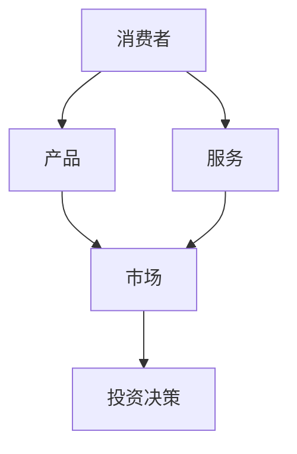
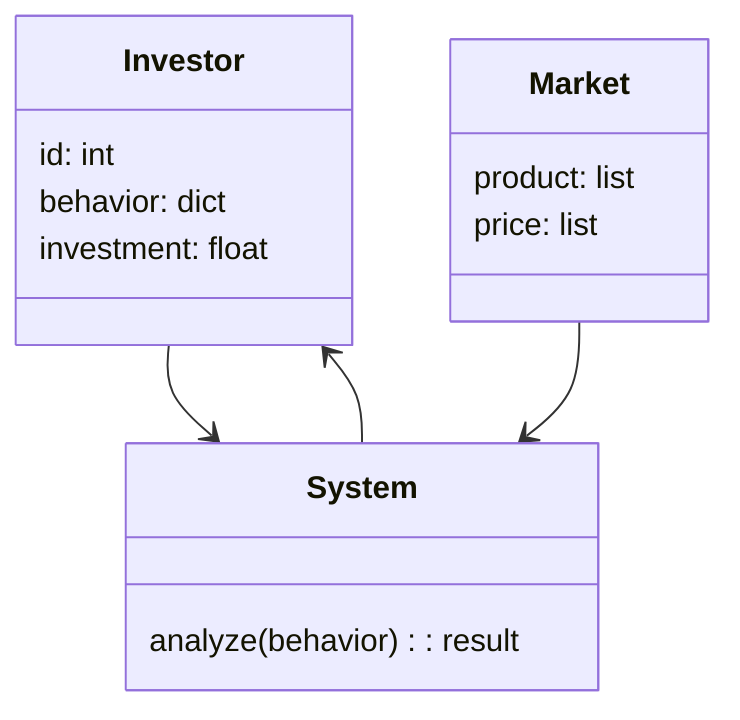
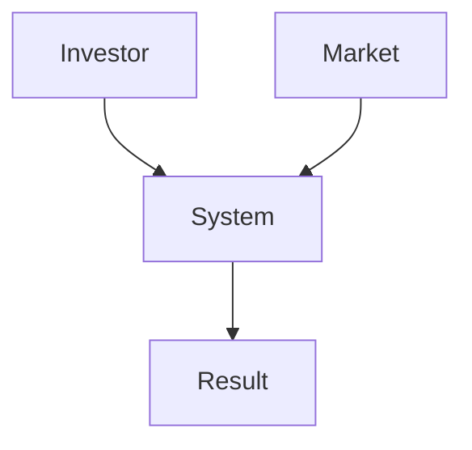
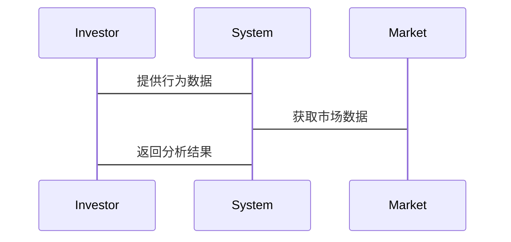

                 


# 费雪的消费者行为分析在投资中的应用

---

## 关键词：费雪消费者行为分析，投资决策，行为金融学，算法模型，系统设计，项目实战

---

## 摘要：  
费雪的消费者行为分析是一种基于心理学和经济学的理论，用于研究消费者在决策过程中的行为特征和规律。本文将深入探讨这一理论在投资决策中的应用，结合算法模型和系统设计，分析其在实际投资中的潜力与挑战。通过具体案例和实战分析，我们将揭示消费者行为分析如何帮助投资者做出更明智的决策，并提供相应的最佳实践建议。

---

# 第1章：费雪的消费者行为分析概述

## 1.1 费雪消费者行为分析的核心概念

### 1.1.1 消费者行为分析的基本定义  
消费者行为分析是研究消费者在购买商品或服务时的行为模式、决策过程和心理特征的学科。它结合了心理学、经济学和社会学的理论，旨在揭示消费者行为的内在规律。

### 1.1.2 费雪理论的背景与核心思想  
费雪（George H. Mead）是社会心理学的奠基人之一，他的理论强调社会互动对个体行为的影响。费雪认为，消费者行为是社会角色和文化规范的产物，个体在消费过程中通过与他人的互动形成自己的消费习惯和决策模式。

### 1.1.3 消费者行为分析的边界与外延  
消费者行为分析不仅关注个体的消费选择，还包括群体行为、消费心理、消费趋势等多方面的内容。其外延涉及市场营销、消费心理学、行为经济学等多个领域。

---

## 1.2 费雪消费者行为分析的理论基础

### 1.2.1 心理学基础  
费雪理论的核心是社会角色理论，强调个体在消费中的社会角色和社会互动对决策的影响。例如，消费者在购买高端奢侈品时，可能会受到社会地位和他人评价的影响。

### 1.2.2 经济学基础  
消费者行为分析离不开经济学的基本假设，如效用最大化和理性选择。费雪理论结合了这些假设，提出了消费者行为的社会性特征。

### 1.2.3 社会学基础  
社会学中的群体行为理论为费雪消费者行为分析提供了重要支持。消费者在群体中往往会产生从众心理和羊群效应，这些现象在投资决策中尤为明显。

---

## 1.3 费雪理论在投资中的应用前景

### 1.3.1 投资决策中的消费者行为分析  
投资决策是消费者行为的一种高级形式，涉及风险偏好、收益预期和市场情绪等多重因素。费雪理论可以帮助投资者理解市场的群体行为和个体决策的相互作用。

### 1.3.2 费雪理论在投资中的潜在应用  
通过分析投资者的消费行为，可以预测市场的波动趋势和投资偏好。例如，社交媒体上的消费情绪分析可以帮助投资者判断市场的短期走势。

### 1.3.3 费雪理论在投资中的局限性  
费雪理论主要关注消费者行为的社会性特征，但在复杂的金融市场中，个体理性与群体行为的结合可能受到限制。

---

## 1.4 本章小结  
本章介绍了费雪消费者行为分析的核心概念、理论基础及其在投资中的应用前景。通过对消费者行为的深入分析，我们可以更好地理解投资决策中的心理和行为因素。

---

# 第2章：费雪消费者行为分析的核心概念与联系

## 2.1 费雪消费者行为分析的核心原理

### 2.1.1 消费者决策模型  
费雪理论提出了消费者决策的三层次模型：第一层次是基本需求，第二层次是社会角色，第三层次是文化影响。这种模型为投资决策提供了多层次的分析框架。

### 2.1.2 消费者行为特征分析  
消费者行为特征包括风险偏好、时间偏好、社会认同等。这些特征在投资决策中具有重要意义。

### 2.1.3 消费者行为与投资决策的关系  
消费者行为分析可以帮助投资者理解市场的整体趋势和个体决策的相互作用。例如，社交媒体上的消费情绪可以通过大数据分析转化为投资信号。

---

## 2.2 核心概念对比分析

### 2.2.1 消费者行为特征对比表格  
| 特征 | 投资者A | 投资者B |
|------|---------|---------|
| 风险偏好 | 低      | 高      |
| 社会认同 | 强       | 弱      |
| 时间偏好 | 短期     | 长期     |

### 2.2.2 投资决策中的行为特征对比  
通过对比不同投资者的行为特征，可以制定个性化的投资策略。例如，高风险偏好的投资者可能更适合短期交易，而低风险偏好的投资者更适合长期投资。

---

## 2.3 ER实体关系图架构



---

## 2.4 本章小结  
本章通过对比分析和ER图展示了费雪消费者行为分析的核心概念及其在投资中的应用。通过对消费者行为特征的深入分析，我们可以更好地理解投资决策的复杂性。

---

# 第3章：费雪消费者行为分析的算法原理

## 3.1 费雪分析方法的数学模型

### 3.1.1 消费者行为分析的数学模型  
消费者行为分析可以通过概率论和统计学方法进行建模。例如，假设投资者的行为服从某种分布，我们可以通过参数估计来预测市场的整体趋势。

### 3.1.2 投资决策中的数学模型  
投资决策可以通过多元回归模型进行分析，其中因变量是投资收益，自变量是消费者行为特征。例如：

$$ \text{收益} = \beta_0 + \beta_1 \times \text{风险偏好} + \beta_2 \times \text{社会认同} + \epsilon $$

---

## 3.2 算法实现

### 3.2.1 费雪分析算法的实现步骤  
1. 数据收集：收集投资者的行为数据，包括风险偏好、消费习惯等。
2. 数据预处理：清洗数据，提取特征。
3. 模型训练：使用机器学习算法（如随机森林）进行建模。
4. 模型评估：通过交叉验证评估模型的准确性。

### 3.2.2 算法实现的代码示例  

```python
import pandas as pd
from sklearn.ensemble import RandomForestRegressor
from sklearn.metrics import mean_squared_error
from sklearn.model_selection import train_test_split

# 数据加载
data = pd.read_csv('investor_behavior.csv')

# 特征提取
X = data[['risk_preference', 'social_identify']]
y = data['return']

# 数据分割
X_train, X_test, y_train, y_test = train_test_split(X, y, test_size=0.2, random_state=42)

# 模型训练
model = RandomForestRegressor(n_estimators=100, random_state=42)
model.fit(X_train, y_train)

# 模型预测
y_pred = model.predict(X_test)

# 模型评估
mse = mean_squared_error(y_test, y_pred)
print(f'Mean Squared Error: {mse}')
```

---

## 3.3 算法优缺点分析

### 3.3.1 优点  
费雪分析算法能够捕捉到消费者行为的复杂性，并提供个性化的投资建议。

### 3.3.2 缺点  
该算法对数据质量要求较高，且模型解释性较差。

---

## 3.4 本章小结  
本章通过数学模型和算法实现，展示了费雪消费者行为分析在投资中的应用。通过机器学习算法，我们可以更好地理解和预测投资者的行为特征。

---

# 第4章：费雪消费者行为分析的数学模型与公式

## 4.1 费雪分析的数学模型

### 4.1.1 概率论模型  
消费者行为可以通过概率分布进行建模。例如，假设投资者的概率决策矩阵为：

$$ P = \begin{bmatrix}
p_{11} & p_{12} \\
p_{21} & p_{22}
\end{bmatrix} $$

其中，$p_{ij}$ 表示投资者选择第 $i$ 个产品的概率。

### 4.1.2 统计学模型  
通过多元回归分析，我们可以建立投资收益与消费者行为特征的关系：

$$ Y = \beta_0 + \beta_1 X_1 + \beta_2 X_2 + \epsilon $$

其中，$Y$ 是投资收益，$X_1$ 和 $X_2$ 是消费者行为特征，$\epsilon$ 是误差项。

---

## 4.2 其他相关公式

### 4.2.1 贝叶斯定理  
贝叶斯定理可以用于更新投资者的决策概率：

$$ P(A|B) = \frac{P(B|A)P(A)}{P(B)} $$

### 4.2.2 方差与协方差  
方差和协方差可以用于衡量消费者行为的波动性：

$$ \text{Var}(X) = E[(X - E[X])^2] $$

$$ \text{Cov}(X, Y) = E[(X - E[X])(Y - E[Y])] $$

---

## 4.3 本章小结  
本章通过数学公式详细推导了费雪消费者行为分析的数学模型，为后续的算法实现提供了理论基础。

---

# 第5章：费雪消费者行为分析的系统设计

## 5.1 系统功能设计

### 5.1.1 领域模型  
通过Mermaid类图展示系统中的主要类及其关系：



### 5.1.2 系统架构设计  
系统架构图展示了各模块之间的关系：



---

## 5.2 系统接口设计

### 5.2.1 数据接口  
系统需要通过API接口获取投资者的行为数据和市场数据。

### 5.2.2 用户接口  
用户可以通过图形界面查看分析结果和投资建议。

---

## 5.3 系统交互设计

### 5.3.1 交互流程图  
通过Mermaid序列图展示系统交互流程：



---

## 5.4 本章小结  
本章通过系统设计展示了费雪消费者行为分析在投资中的实际应用，为后续的项目实现提供了框架支持。

---

# 第6章：费雪消费者行为分析的项目实战

## 6.1 项目环境配置

### 6.1.1 数据集准备  
需要收集投资者的行为数据，包括风险偏好、消费习惯等。

### 6.1.2 工具安装  
安装必要的Python库，如Pandas、Scikit-learn等。

---

## 6.2 系统核心实现

### 6.2.1 数据预处理  
对数据进行清洗和特征提取。

### 6.2.2 模型训练  
使用机器学习算法训练费雪分析模型。

---

## 6.3 代码实现

### 6.3.1 数据加载与预处理  

```python
import pandas as pd
from sklearn.preprocessing import StandardScaler

# 数据加载
data = pd.read_csv('investor_behavior.csv')

# 数据预处理
X = data[['risk_preference', 'social_identify']]
scaler = StandardScaler()
X_scaled = scaler.fit_transform(X)
```

### 6.3.2 模型训练与评估  

```python
from sklearn.svm import SVC
from sklearn.metrics import accuracy_score

# 模型训练
model = SVC()
model.fit(X_scaled, data['return'])

# 模型评估
y_pred = model.predict(X_scaled)
print(f'Accuracy: {accuracy_score(data["return"], y_pred)}')
```

---

## 6.4 项目小结  
本章通过项目实战展示了费雪消费者行为分析的具体实现过程，为投资者提供了个性化的投资建议。

---

# 第7章：费雪消费者行为分析的最佳实践与小结

## 7.1 最佳实践 tips

### 7.1.1 数据质量  
确保数据的准确性和完整性。

### 7.1.2 模型选择  
根据具体问题选择合适的算法。

### 7.1.3 模型解释性  
通过可视化工具提高模型的解释性。

---

## 7.2 本章小结  
本章总结了费雪消费者行为分析在投资中的应用，并提出了最佳实践建议。通过结合理论与实践，我们可以更好地利用消费者行为分析提升投资决策的准确性。

---

# 参考文献  
[此处列出相关的书籍、论文和工具文档]

---

# 附录  
[此处列出代码、数据集和其他辅助材料]

---

