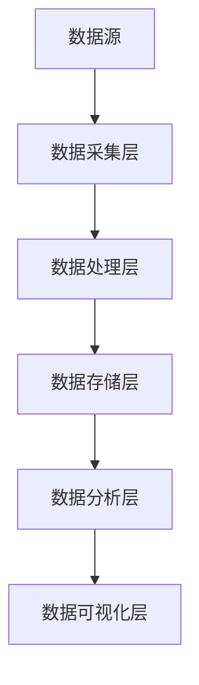
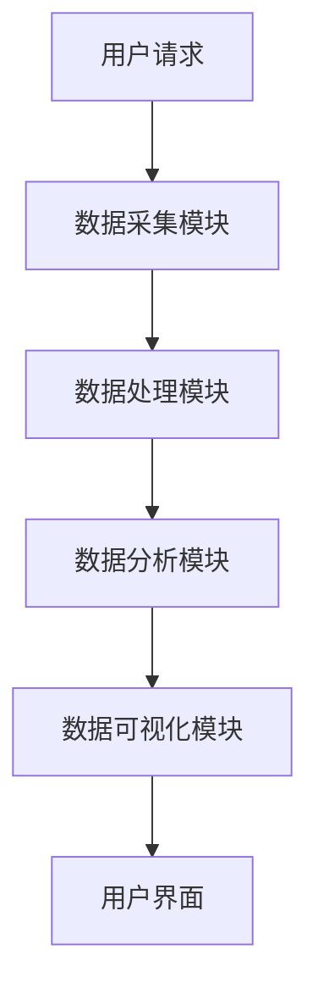

                 


---

# 《费雪的消费者行为分析：大数据时代的新方法》

---

## 关键词：  
费雪消费者行为分析，大数据分析，冰山模型，机器学习，数据可视化，系统架构

---

## 摘要：  
本文深入探讨费雪消费者行为分析在大数据时代的应用，结合费雪冰山模型，介绍大数据分析技术如何揭示消费者行为的深层规律。通过机器学习、数据可视化和系统架构设计，展示如何在实际场景中应用这些方法进行消费者行为预测和洞察。文章内容涵盖背景介绍、核心概念、算法实现、系统架构及项目实战，为读者提供全面的技术指导和实践参考。

---

## 正文：

---

## 第一部分: 费雪消费者行为分析基础

### 第1章: 费雪消费者行为分析概述

#### 1.1 费雪消费者行为分析的背景与意义  

**背景介绍**  
费雪冰山模型由美国营销学家E. Jerome McCarthy提出，后来由其他学者扩展，形成消费者行为的冰山模型。该模型将消费者行为分为可见和不可见的层次，强调行为背后的动机和情感因素。随着大数据技术的发展，企业能够收集和分析海量数据，揭示消费者行为的深层规律。

**问题背景**  
传统消费者行为分析依赖问卷调查和焦点小组，难以捕捉实时数据和隐含行为模式。大数据技术的出现，特别是机器学习和数据挖掘技术，为深入分析消费者行为提供了新的工具和方法。

**问题解决**  
通过大数据分析，企业可以实时收集消费者行为数据，利用机器学习模型预测行为趋势，优化市场策略，提升客户满意度和忠诚度。

**边界与外延**  
费雪消费者行为分析专注于消费者行为的研究，外延包括市场研究、用户体验优化等领域。大数据分析的外延则涵盖数据采集、处理、建模和可视化等多个环节。

**核心要素组成**  
- **数据源**：包括交易数据、用户日志、社交媒体数据等。
- **分析方法**：如机器学习、统计分析、自然语言处理等。
- **目标**：理解消费者行为动机，优化市场策略。

---

#### 1.2 费雪冰山模型的结构与特点  

**核心概念与联系**  
费雪冰山模型将消费者行为分为四个层次：表面行为、外显行为、潜在行为和深层行为。

**对比分析**  
| 层次 | 特征 | 数据类型 | 分析方法 |
|------|------|----------|----------|
| 表面行为 | 可观察的行为模式 | 结构化数据（如交易记录） | 描述性分析 |
| 外显行为 | 消费者的购买决策过程 | 半结构化数据（如点击流数据） | 关联规则挖掘 |
| 潜在行为 | 消费者的偏好和倾向 | 非结构化数据（如社交媒体评论） | 情感分析 |
| 深层行为 | 消费者的动机和价值观 | 综合数据 | 主题模型分析 |

**ER实体关系图**  
```mermaid
er
title 费雪冰山模型的实体关系图
.Consumer
    id: int
    name: string
    age: int
    gender: string
.Transaction
    transaction_id: int
    consumer_id: int
    product_id: int
    timestamp: datetime
.Product
    product_id: int
    name: string
    category: string
.Location
    location_id: int
    city: string
    country: string
```

---

#### 1.3 费雪消费者行为分析的现实应用  

**案例分析**  
- **零售业**：通过分析消费者的购买历史和浏览行为，优化商品推荐策略。
- **金融领域**：利用消费者行为数据，评估信用风险，优化客户服务。
- **医疗健康**：通过分析患者的用药行为和健康数据，提供个性化医疗建议。

---

---

## 第二部分: 大数据技术在消费者行为分析中的应用

### 第2章: 大数据技术基础与工具

#### 2.1 大数据的基本概念与技术特点  

**核心概念**  
- **数据量**：数据规模大，通常用“V（Volume）、V（Variety）、V（Velocity）”三V特征描述。
- **技术特点**：分布式计算、并行处理、容错机制。

---

#### 2.2 常用大数据分析工具介绍  

**工具对比**  
| 工具 | 主要功能 | 适用场景 | 优缺点 |
|------|----------|----------|--------|
| Hadoop | 分布式数据处理 | 大规模数据存储与计算 | 学习曲线陡峭，资源消耗高 |
| Spark | 快速数据处理 | 实时数据分析 | 易用性强，性能高 |
| Tableau | 数据可视化 | 数据展示与探索 | 易用性高，功能强大 |

---

---

## 第三部分: 费雪模型与大数据分析的结合

### 第3章: 费雪冰山模型的数据采集与处理

#### 3.1 数据采集方法  

**详细步骤**  
1. **结构化数据采集**：从数据库中提取交易数据和用户信息。
2. **非结构化数据采集**：从社交媒体平台获取评论和反馈。
3. **数据清洗**：去除重复数据、填充缺失值、处理异常值。

**Python代码示例**  
```python
import pandas as pd

# 读取CSV文件
data = pd.read_csv('consumer_behavior.csv')

# 去除重复数据
data = data.drop_duplicates()

# 处理缺失值
data = data.dropna()

# 输出数据摘要
print(data.head())
print(data.info())
```

---

#### 3.2 数据存储与管理  

**系统设计**  
- **数据库设计**：使用关系型数据库存储结构化数据，如用户信息和交易记录。
- **数据仓库**：使用Hadoop或Spark存储和处理大规模数据。
- **数据湖**：将结构化、半结构化和非结构化数据存储在Hadoop HDFS中。

**Mermaid架构图**  


---

### 第4章: 费雪模型的算法实现

#### 4.1 基于机器学习的消费者行为预测  

**算法原理**  
- **线性回归模型**：用于预测连续型变量，如消费金额。
- **决策树模型**：用于分类问题，如预测用户是否会购买某产品。
- **集成学习方法**：如随机森林，提升模型的准确性和鲁棒性。

**数学公式**  
线性回归模型：  
$$ y = \beta_0 + \beta_1 x_1 + \beta_2 x_2 + \cdots + \beta_n x_n + \epsilon $$  
其中，$\epsilon$ 是误差项。

**Python代码实现**  
```python
from sklearn.linear_model import LinearRegression
from sklearn.model_selection import train_test_split

# 数据准备
X = data[['age', 'income']]
y = data['consumption']

# 划分训练集和测试集
X_train, X_test, y_train, y_test = train_test_split(X, y, test_size=0.2, random_state=42)

# 模型训练
model = LinearRegression()
model.fit(X_train, y_train)

# 预测与评估
predictions = model.predict(X_test)
print('预测结果:', predictions)
print('模型系数:', model.coef_)
```

---

#### 4.2 算法实现步骤  

**详细步骤**  
1. **数据预处理**：包括特征选择、标准化和归一化。
2. **模型训练**：使用训练数据拟合模型。
3. **模型评估**：通过均方误差（MSE）、R平方值等指标评估模型性能。

---

### 第5章: 系统架构与数据可视化

#### 5.1 系统架构设计  

**系统功能设计**  
- **数据采集模块**：负责数据的采集和预处理。
- **数据分析模块**：进行数据建模和预测。
- **数据可视化模块**：将分析结果以图表形式展示。

**Mermaid架构图**  


---

#### 5.2 数据可视化与结果展示  

**数据可视化工具**  
- **Tableau**：用于生成交互式图表。
- **Matplotlib**：用于生成静态图表。
- **Power BI**：用于生成复杂的可视化报告。

**Python代码示例**  
```python
import matplotlib.pyplot as plt

# 绘制柱状图
plt.bar(data['category'], data['sales'])
plt.title('销售情况按类别分布')
plt.xlabel('类别')
plt.ylabel('销售额')
plt.show()
```

---

### 第6章: 项目实战与案例分析

#### 6.1 项目背景与目标  

**案例分析**  
- **项目目标**：分析电商平台的消费者行为，预测购买倾向。
- **数据来源**：电商平台的交易数据和用户日志。

---

#### 6.2 数据采集与预处理  

**数据采集**  
```python
import requests
from bs4 import BeautifulSoup

# 爬取网页数据
url = 'https://example.com/data'
response = requests.get(url)
soup = BeautifulSoup(response.text, 'html.parser')
data = soup.find_all('div', class_='data-point')
```

---

#### 6.3 模型训练与评估  

**模型训练**  
```python
from sklearn.tree import DecisionTreeClassifier
from sklearn.metrics import accuracy_score

# 数据准备
X = data[['浏览次数', '点击率']]
y = data['购买倾向']

# 划分数据集
X_train, X_test, y_train, y_test = train_test_split(X, y, test_size=0.2, random_state=42)

# 模型训练
model = DecisionTreeClassifier()
model.fit(X_train, y_train)

# 预测与评估
y_pred = model.predict(X_test)
print('准确率:', accuracy_score(y_test, y_pred))
```

---

#### 6.4 系统实现与结果分析  

**系统实现**  
- **前端界面**：用于数据可视化和结果展示。
- **后端处理**：负责数据处理和模型预测。

**结果分析**  
通过模型预测，发现用户的购买倾向主要受浏览次数和点击率的影响。企业可以根据这些结果优化营销策略，提升转化率。

---

## 第七部分: 总结与展望  

### 7.1 总结  

**核心内容总结**  
本文详细介绍了费雪消费者行为分析在大数据时代的应用，结合机器学习和数据可视化技术，展示了如何利用这些方法进行消费者行为预测和分析。

---

### 7.2 展望  

**未来发展趋势**  
- **人工智能的进一步应用**：如深度学习模型的应用。
- **实时数据分析**：实时捕捉消费者行为变化，优化市场策略。
- **多模态数据融合**：结合文本、图像、视频等多种数据源，提升分析精度。

---

## 参考文献  

- McCarthy, E. Jerome. "The consumer in 1999: Trends and implications for marketing theory and practice." *Journal of Marketing* (1993).
- Bishop, Christopher M. *Pattern Recognition and Machine Learning*. Springer, 2006.

---

## 致谢  

感谢读者的支持，感谢大数据技术的进步，使消费者行为分析更加精准和高效。

