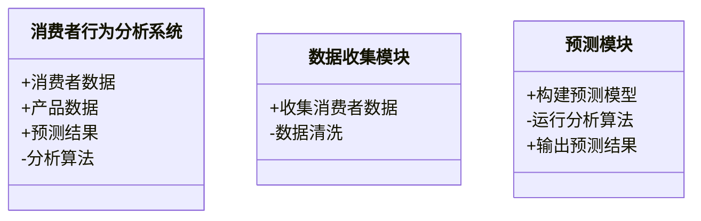
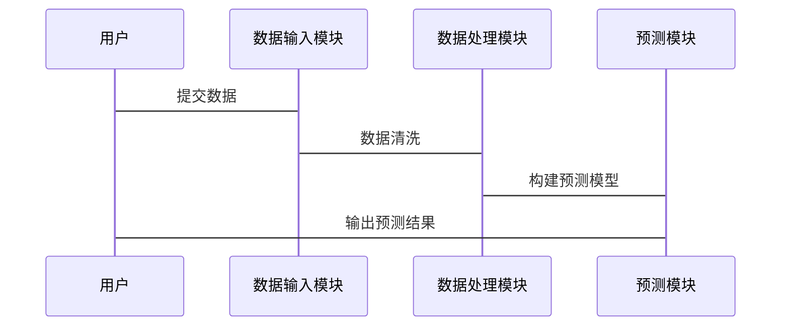

                 


# 费雪的消费者行为分析：预测产品成功

> 关键词：消费者行为分析，费雪模型，产品预测，需求弹性，回归分析

> 摘要：本文深入探讨费雪的消费者行为分析方法，通过理论、模型和实际案例，详细讲解如何利用这些分析预测产品成功。内容涵盖费雪模型的核心假设、数学公式、系统架构设计以及项目实战，帮助读者掌握消费者行为分析的精髓。

---

## 第1章：消费者行为分析概述

### 1.1 费雪的消费者行为理论基础

#### 1.1.1 消费者行为分析的定义与重要性
消费者行为分析是研究消费者在市场中的决策过程和行为模式，旨在帮助企业预测市场需求、优化产品设计和制定有效的市场策略。费雪在这一领域做出了重要贡献，提出了消费者行为的理论模型，为产品预测提供了科学依据。

#### 1.1.2 费雪的消费者行为理论的核心观点
费雪的理论基于以下核心观点：
1. 消费者行为受到价格、收入和替代品价格的影响。
2. 需求弹性是预测消费者反应的关键因素。
3. 消费者决策过程可以被建模和量化。

#### 1.1.3 消费者行为分析在商业中的应用
消费者行为分析广泛应用于市场预测、产品定位和营销策略制定。通过分析消费者的行为数据，企业可以更好地理解市场需求，优化产品设计和定价策略。

---

### 1.2 消费者行为分析的背景与问题背景

#### 1.2.1 问题背景介绍
随着市场竞争的加剧，企业需要更精准地预测消费者行为，以在市场中占据优势。费雪的消费者行为分析为企业提供了理论基础和方法论。

#### 1.2.2 问题描述与目标
本文旨在通过费雪的消费者行为分析，预测产品的市场表现，帮助企业制定科学的市场策略。

#### 1.2.3 问题解决的思路与方法
通过构建数学模型和数据分析，结合实际案例，本文将详细讲解如何利用费雪的理论预测产品成功。

---

## 第2章：费雪的消费者行为分析模型

### 2.1 费雪的消费者行为模型概述

#### 2.1.1 费雪模型的核心假设
费雪模型基于以下假设：
1. 消费者需求是价格的函数。
2. 需求弹性是衡量消费者反应的重要指标。
3. 消费者行为受到收入、价格和替代品价格的影响。

#### 2.1.2 模型的构成要素与关系
费雪模型由以下几个核心要素构成：
- 价格（P）
- 收入（I）
- 替代品价格（P_z）

模型关系如下：
$$ Q_d = a - bP + cI + dP_z $$

#### 2.1.3 模型的适用范围与边界
费雪模型适用于标准化产品和价格弹性较大的市场，但不适用于品牌忠诚度极高的市场。

---

### 2.2 费雪模型的核心概念与联系

#### 2.2.1 消费者行为的核心概念与属性对比
| 概念         | 定义                           | 影响因素       |
|--------------|--------------------------------|----------------|
| 需求函数     | 描述价格与需求量关系的函数   | 价格、收入     |
| 需求弹性     | 价格变动引起需求量变动的敏感性 | 价格变动百分比 |

#### 2.2.2 ER实体关系图架构（Mermaid）

```mermaid
erd
  消费者
    id: int
    收入: decimal
  产品
    id: int
    价格: decimal
  市场
    id: int
    需求量: int
  消费者-产品
    关系：购买
```

---

## 第3章：消费者行为分析的数学模型与公式

### 3.1 需求函数与弹性分析

#### 3.1.1 需求函数的数学表达式
$$ Q_d = a - bP + cI + dP_z $$

#### 3.1.2 弹性分析与公式
$$ E = \frac{\% \Delta Q_d}{\% \Delta P} $$

### 3.2 预测模型的构建与应用

#### 3.2.1 线性回归模型
$$ Y = \beta_0 + \beta_1X + \epsilon $$

#### 3.2.2 逻辑回归模型
$$ P(Y=1|X) = \frac{e^{\beta_0 + \beta_1X}}{1 + e^{\beta_0 + \beta_1X}} $$

---

## 第4章：消费者行为分析的系统架构与设计

### 4.1 系统分析与架构设计

#### 4.1.1 问题场景介绍
系统旨在通过费雪模型分析消费者行为，预测产品需求。系统将收集消费者数据，构建预测模型，并输出结果。

#### 4.1.2 系统功能设计（领域模型Mermaid类图）



#### 4.1.3 系统架构设计（Mermaid架构图）


### 4.2 系统接口与交互设计

#### 4.2.1 系统接口设计
- 数据输入接口：接受消费者数据和产品数据。
- 预测结果接口：输出预测结果。

#### 4.2.2 系统交互流程（Mermaid序列图）



---

## 第5章：消费者行为分析的项目实战

### 5.1 环境安装与工具准备

#### 5.1.1 数据分析工具安装
- 安装Python和Pandas库：
  ```bash
  pip install numpy pandas
  ```

#### 5.1.2 开发环境配置
- 安装Jupyter Notebook：
  ```bash
  pip install jupyter
  ```

### 5.2 核心算法实现

#### 5.2.1 回归分析的Python代码实现
```python
import numpy as np
import pandas as pd

# 数据加载
data = pd.read_csv('consumer_data.csv')

# 模型训练
X = data[['price', 'income', 'p_z']]
y = data['quantity']

from sklearn.linear_model import LinearRegression
model = LinearRegression()
model.fit(X, y)

# 模型预测
predictions = model.predict(X)
print(predictions)
```

---

## 第6章：总结与展望

### 6.1 总结
本文通过费雪的消费者行为分析，详细讲解了预测产品成功的方法。从理论模型到实际应用，系统地展示了如何利用数据分析预测市场需求。

### 6.2 展望
未来，随着大数据和人工智能的发展，消费者行为分析将更加精准和高效，为企业提供更强大的决策支持。

---

通过本文的学习，读者可以掌握费雪的消费者行为分析方法，并将其应用于实际的产品预测中，帮助企业制定科学的市场策略。

