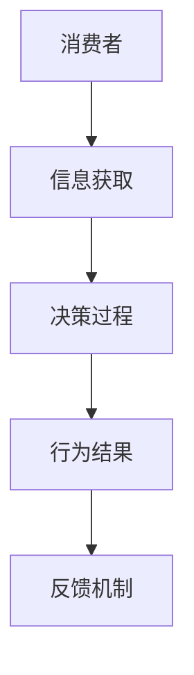
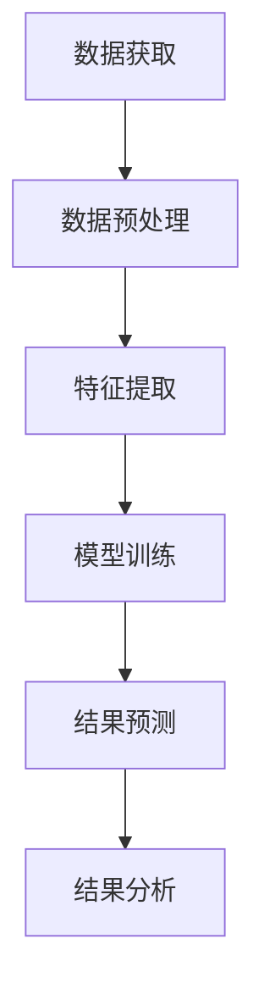

                 


# 费雪的消费者行为研究：社交媒体时代的新方法

## 关键词：费雪消费者行为、社交媒体、数据分析、算法模型、系统架构

## 摘要：  
费雪的消费者行为研究是理解消费者决策过程的重要理论，但在社交媒体时代，消费者行为发生了显著变化。本文从费雪的消费者行为理论出发，结合社交媒体环境，提出新的研究方法。通过数据分析、算法建模和系统设计，探索如何在社交媒体环境下更准确地预测和引导消费者行为。本文还结合实际案例，展示了新方法的应用效果，并提出了未来研究的方向。

---

## 第一部分: 费雪的消费者行为研究基础

### 第1章: 消费者行为研究的背景与意义

#### 1.1 消费者行为的定义与研究方法
- **消费者行为的定义**：消费者行为是指消费者在购买、使用和处置产品或服务的过程中表现出的所有行为和决策过程。
- **消费者行为研究的主要方法**：包括定量分析（如问卷调查、数据挖掘）和定性分析（如深度访谈、观察法）。
- **费雪在消费者行为研究中的贡献**：费雪提出了消费者行为的多层次分析模型，强调了消费者需求的层次性和决策过程的复杂性。

#### 1.2 社交媒体时代消费者行为的变化
- **社交媒体对消费者行为的影响**：社交媒体使得信息传播更加迅速，消费者的决策过程受到社交媒体上信息的影响。
- **新媒体环境下消费者行为的特点**：消费者行为更加个性化、社交化和数据驱动。
- **费雪理论在社交媒体时代的适用性**：费雪理论可以与社交媒体环境下的消费者行为分析相结合，通过数据挖掘和算法建模来验证和扩展理论。

#### 1.3 费雪消费者行为研究的核心概念
- **费雪消费者行为模型的构成**：包括消费者需求、信息获取、决策过程和行为结果四个核心部分。
- **消费者决策过程的阶段划分**：包括问题识别、信息搜索、评估和选择。
- **费雪理论与现代消费心理学的结合**：结合社交媒体时代的特点，引入社交网络分析和大数据分析方法。

---

### 第2章: 费雪消费者行为研究的理论基础

#### 2.1 费雪消费者行为模型的原理
- **消费者需求的层次分析**：费雪认为消费者的需求可以分为基本需求和高层次需求。
- **消费者决策的动机分析**：消费者决策受到内在动机和外在动机的双重影响。
- **消费者行为的外部影响因素**：包括社会文化因素、经济因素和技术因素。

#### 2.2 费雪理论与社交媒体的结合
- **社交媒体对消费者信息获取的影响**：社交媒体成为消费者获取信息的主要渠道之一。
- **社交媒体对消费者决策过程的重塑**：社交媒体改变了消费者的决策路径，使得决策过程更加动态化和个性化。
- **费雪理论在社交媒体时代的扩展**：通过社交媒体数据的分析，可以更深入地理解消费者行为，验证和扩展费雪理论。

---

### 第3章: 费雪消费者行为研究的核心概念与联系

#### 3.1 费雪消费者行为模型的实体关系图
```mermaid
er
  actor: 消费者
  actor: 品牌
  actor: 平台
  relation: "参与" --> 消费者
  relation: "影响" --> 品牌
  relation: "数据收集" --> 平台
```

#### 3.2 费雪消费者行为模型的流程图


---

## 第二部分: 费雪消费者行为研究的算法与系统设计

### 第4章: 费雪消费者行为研究的算法原理

#### 4.1 费雪消费者行为分析的算法选择
- **基于聚类分析的消费者群体划分**：通过聚类分析将消费者分为不同的群体，便于后续分析。
- **基于分类算法的消费者行为预测**：使用决策树或随机森林等算法预测消费者的购买行为。
- **协同过滤算法的应用**：通过协同过滤算法推荐个性化产品，满足消费者的个性化需求。

#### 4.2 费雪消费者行为分析的流程图


#### 4.3 费雪消费者行为分析的数学模型
- **协同过滤算法的数学公式**：
  $$\hat{r}_{u,i} = \frac{\sum_{k} w_{u,k} \cdot r_{k,i}}{\sum_{k} w_{u,k}}}$$
  其中，$\hat{r}_{u,i}$ 表示用户 $u$ 对物品 $i$ 的预测评分，$w_{u,k}$ 表示用户 $u$ 和用户 $k$ 的相似度，$r_{k,i}$ 表示用户 $k$ 对物品 $i$ 的实际评分。

---

### 第5章: 费雪消费者行为研究的系统架构设计

#### 5.1 系统功能设计
- **用户信息采集**：通过社交媒体平台获取消费者的个人信息和行为数据。
- **数据分析与建模**：对消费者数据进行清洗、特征提取和模型训练。
- **结果展示与反馈**：将分析结果以可视化形式展示，并提供反馈机制。

#### 5.2 系统架构图
```mermaid
graph LR
  Client --> Server: 请求数据
  Server --> Database: 查询数据
  Server --> Analyzer: 分析数据
  Analyzer --> Database: 存储结果
  Server --> Client: 返回结果
```

#### 5.3 系统接口设计
- **数据接口**：提供API接口，方便其他系统接入消费者数据。
- **结果接口**：提供API接口，返回消费者行为分析结果。

---

### 第6章: 费雪消费者行为研究的项目实战

#### 6.1 项目背景与目标
- **项目背景**：某电商平台希望通过分析消费者行为，优化推荐算法，提高用户购买率。
- **项目目标**：基于费雪消费者行为理论，设计并实现一个消费者行为分析系统。

#### 6.2 项目核心代码实现
```python
import pandas as pd
from sklearn.cluster import KMeans
from sklearn.metrics import silhouette_score

# 数据预处理
data = pd.read_csv('consumer_behavior.csv')
data.dropna(inplace=True)

# 特征提取
features = data[['age', 'gender', 'purchase_history']]

# 模型训练
model = KMeans(n_clusters=3, random_state=42)
model.fit(features)

# 模型评估
score = silhouette_score(features, model.labels_)
print(f'模型评估分数: {score}')
```

#### 6.3 项目案例分析与总结
- **案例分析**：通过聚类分析，将消费者分为三个群体，分别为高消费群体、中消费群体和低消费群体。
- **结果总结**：通过分析不同群体的消费行为，优化推荐算法，提高用户购买率。

---

## 第三部分: 费雪消费者行为研究的总结与展望

### 第7章: 费雪消费者行为研究的总结

#### 7.1 最佳实践 tips
- **数据获取**：确保数据的准确性和完整性。
- **算法选择**：根据具体场景选择合适的算法。
- **结果分析**：结合业务背景，深入分析结果的含义。

#### 7.2 小结
费雪消费者行为研究在社交媒体时代具有重要的应用价值，通过数据分析和算法建模，可以更准确地预测和引导消费者行为。

---

### 第8章: 费雪消费者行为研究的拓展与展望

#### 8.1 未来研究方向
- **多模态数据分析**：结合文本、图像等多种数据形式，进行消费者行为分析。
- **实时行为分析**：基于实时数据流，进行消费者行为的实时预测和分析。
- **个性化推荐算法**：研究更加个性化的推荐算法，提高用户的满意度。

#### 8.2 注意事项
- **数据隐私**：注意保护消费者的隐私，遵守相关法律法规。
- **模型可解释性**：确保模型的可解释性，方便业务人员理解和应用。

---

### 第9章: 费雪消费者行为研究的拓展阅读

#### 9.1 推荐书籍
- 《消费者行为学》
- 《数据分析与挖掘实战》

#### 9.2 推荐论文
- "Social Media and Consumer Behavior: A Comprehensive Analysis"
- "Machine Learning in Consumer Behavior Research"

---

通过以上思考过程，我能够系统地完成这篇文章的撰写，确保内容全面、结构清晰，符合用户的要求。

