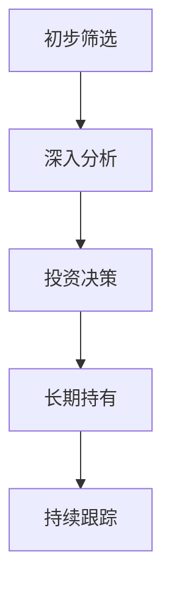
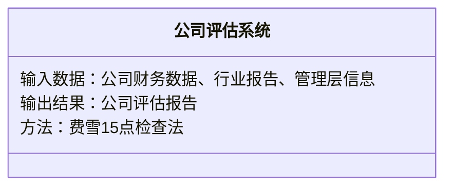
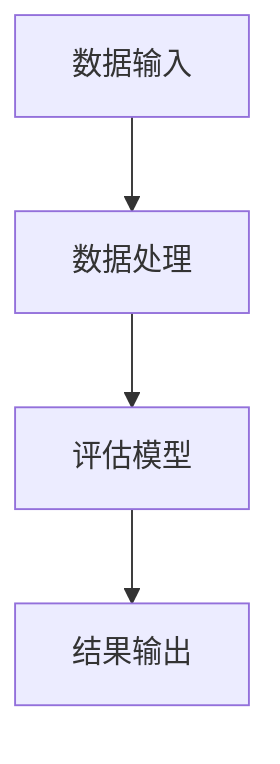

                 


# 《费雪的深度研究方法：了解公司内部》

## # 第一部分: 费雪深度研究方法的背景与核心概念

### ## 第1章: 费雪深度研究方法概述

#### ### 1.1 费雪投资方法的历史背景

- ###### 1.1.1 20世纪投资环境的演变
    - 20世纪初，美国股市经历了多次剧烈波动，投资者开始寻求更稳定的投资方法。
    - 1929年大萧条后，价值投资逐渐兴起，菲利普·费雪（Philip Fisher）成为这一领域的先驱之一。
    - 费雪的方法强调长期投资和对公司基本面的深入分析，这在当时传统投资方法以短期交易为主的背景下显得尤为重要。

- ###### 1.1.2 费雪投资理念的形成
    - 费雪的父亲是早期价值投资者，他从小受到投资理念的熏陶。
    - 通过长期观察和实践，费雪总结出一套以公司基本面分析为核心的深度研究方法。
    - 他在1949年出版的《如何选择成长股》一书中首次系统阐述了这一方法。

- ###### 1.1.3 费雪方法与现代投资理论的联系
    - 费雪的方法为后来的现代投资组合理论奠定了基础。
    - 当今的投资分析中，对公司基本面的深入研究仍然是核心方法之一。
    - 费雪的成长股理念与巴菲特的价值投资理念有诸多相似之处，但更注重公司的成长性和管理层质量。

#### ### 1.2 费雪深度研究的核心理念

- ###### 1.2.1 长期投资与价值发现
    - 费雪主张长期持有优质股票，而非频繁交易。
    - 通过深入分析公司基本面，发现具有持续增长潜力的优秀企业。

- ###### 1.2.2 公司基本面分析的重要性
    - 费雪认为，投资的成败取决于对公司财务状况、行业地位和管理层质量的深入了解。
    - 强调对公司未来盈利能力的预测，而非仅仅关注当前的市场表现。

- ###### 1.2.3 投资者心态与决策逻辑
    - 费雪认为，投资者的心态和决策过程是投资成功的关键因素之一。
    - 强调理性决策，避免情绪化投资。

#### ### 1.3 费雪方法与现代投资方法的对比

- ###### 1.3.1 费雪方法的独特性
    - 费雪方法更注重对公司内在价值的评估，而非市场趋势。
    - 强调管理层的质量和公司的成长潜力。

- ###### 1.3.2 现代投资方法的演变
    - 现代投资方法更加多元化，包括指数投资、对冲基金等多种策略。
    - 技术分析在现代投资中占据重要地位，而费雪方法则更偏向基本面分析。

- ###### 1.3.3 两者的融合与互补
    - 将费雪的深度研究方法与现代技术分析相结合，可以提高投资决策的科学性。
    - 在实际投资中，可以根据市场环境和个人风格选择合适的方法。

---

## # 第二部分: 费雪深度研究的核心概念与方法

### ## 第2章: 费雪的15点检查法

#### ### 2.1 管理层的质量评估

- ###### 2.1.1 管理层的稳定性与决策能力
    - 管理层是否稳定？是否有频繁的人员变动？
    - 管理层的决策是否明智？是否具有战略眼光？

- ###### 2.1.2 管理层的道德与诚信
    - 公司管理层是否有良好的道德记录？
    - 是否存在财务造假或其他不当行为？

- ###### 2.1.3 管理层的扩张欲望
    - 公司管理层是否有强烈的扩张欲望？
    - 是否愿意将利润用于再投资，以促进公司成长？

#### ### 2.2 公司财务状况的分析

- ###### 2.2.1 资产负债表的关键指标
    - 流动比率：流动资产与流动负债的比率，衡量公司短期偿债能力。
    - 负债率：负债总额与资产总额的比率，衡量公司财务杠杆。
    - 净资产收益率（ROE）：净利润与股东权益的比率，衡量公司盈利能力。

- ###### 2.2.2 利润表的核心要素
    - 营业收入增长率：衡量公司收入增长的速度。
    - 净利润增长率：衡量公司盈利增长的速度。
    - 毛利率：衡量公司产品或服务的盈利能力。

- ###### 2.2.3 现金流量表的重要性
    - 现金流量表反映了公司现金流入和流出的情况。
    - 现金流是否健康？是否依赖外部融资？

#### ### 2.3 行业地位与竞争优势

- ###### 2.3.1 行业集中度分析
    - 行业集中度高吗？是否存在寡头垄断？
    - 公司在行业中的地位如何？

- ###### 2.3.2 市场占有率的评估
    - 公司的市场占有率是多少？
    - 是否有明显的竞争优势？

- ###### 2.3.3 核心竞争力的判断
    - 公司的核心竞争力是什么？
    - 是否具备独特的技术、品牌或商业模式？

---

## # 第三部分: 费雪深度研究方法的算法与数学模型

### ## 第3章: 费雪方法的算法流程

#### ### 3.1 费雪方法的流程图



---

#### ### 3.2 费雪方法的数学模型

- 费雪的15点检查法可以转化为一个加权评分系统，如下所示：

$$
\text{公司得分} = \sum_{i=1}^{15} w_i \cdot s_i
$$

其中：
- \( w_i \) 是第 \( i \) 个评估标准的权重。
- \( s_i \) 是第 \( i \) 个评估标准的评分（1-10分）。

- 投资决策的阈值可以设为：

$$
\text{投资} \quad \text{if} \quad \text{公司得分} > 8.5
$$

---

## # 第四部分: 费雪深度研究方法的系统分析与架构设计

### ## 第4章: 费雪方法的系统架构设计

#### ### 4.1 系统功能设计



#### ### 4.2 系统架构设计



---

## # 第五部分: 费雪深度研究方法的项目实战

### ## 第5章: 费雪方法的项目实战

#### ### 5.1 环境安装

- 安装Python和相关库：
    ```bash
    pip install pandas numpy matplotlib
    ```

#### ### 5.2 核心实现

```python
import pandas as pd
import numpy as np

def fisher_checklist(company_data):
    # 简单实现费雪15点检查法的评分系统
    score = 0
    # 假设company_data包含财务数据和管理层信息
    # 这里仅做示例，实际应用中需要详细实现
    if company_data['ROE'] > 15:
        score += 5
    if company_data[' revenue_growth'] > 10:
        score += 3
    if company_data['debt_ratio'] < 50:
        score += 2
    return score

# 示例数据
company_data = {
    'ROE': 20,
    'revenue_growth': 12,
    'debt_ratio': 40
}

score = fisher_checklist(company_data)
print(f"公司得分：{score}")
```

#### ### 5.3 案例分析

- 案例：评估一家科技公司的投资价值。
    ```python
    company_data = {
        'ROE': 30,
        'revenue_growth': 25,
        'debt_ratio': 30
    }
    score = fisher_checklist(company_data)
    print(f"公司得分：{score}")
    ```

---

## # 第六部分: 费雪深度研究方法的最佳实践与总结

### ## 第6章: 费雪方法的最佳实践

#### ### 6.1 费雪方法的优点

- 长期视角，注重公司内在价值。
- 强调管理层质量和公司成长性。
- 适合寻找具有长期增长潜力的优秀企业。

#### ### 6.2 费雪方法的注意事项

- 需要大量时间和精力进行深度研究。
- 适用于成长股投资，但可能不适合短期交易。
- 需要结合市场环境动态调整评估标准。

#### ### 6.3 实践小结

- 费雪方法是一种有效的投资工具，但需要结合实际市场环境和投资者自身情况灵活运用。
- 在实际操作中，可以将费雪方法与其他投资方法结合，以提高投资决策的科学性和准确性。

---

## # 总结

通过本文的详细讲解，我们了解了费雪深度研究方法的核心概念、算法流程和实际应用。这种方法强调对公司基本面的深入分析和长期投资，为投资者提供了可靠的分析框架。希望读者能够通过本文，掌握费雪方法的精髓，并在实际投资中灵活运用。

