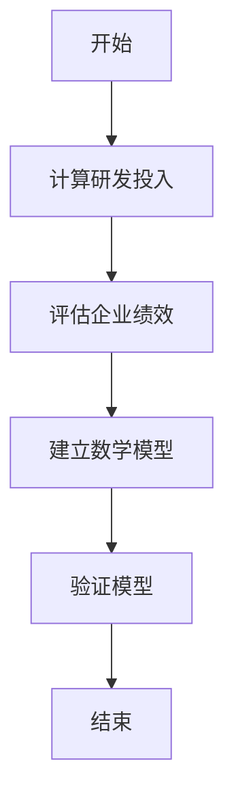

                 


# 费雪的研发投入分析方法

> 关键词：研发投入分析，费雪方法，企业绩效，数学模型，系统架构

> 摘要：本文详细介绍了费雪在研发投入分析方面的方法，从背景介绍、核心概念、算法原理到系统架构设计，再到项目实战和最佳实践，全面解析了如何科学地分析和评估企业的研发投入。

---

## 第一部分：背景介绍

### 第1章：研发投入分析的背景与重要性

#### 1.1 问题背景
- **研发投入对企业的重要性**：在现代企业中，研发投入是推动创新和经济增长的关键因素。企业通过研发新产品或改进现有产品，可以提升竞争力，增加市场份额。
- **当前现状与挑战**：许多企业在进行研发投入时面临如何评估其效益的问题。传统的财务指标如ROE（净资产收益率）和ROI（投资回报率）难以全面反映研发投入对企业长期价值的影响。

#### 1.2 问题描述
- **核心问题**：如何量化研发投入对企业发展的影响？研发投入与企业绩效之间的关系是什么？
- **研发投入与企业绩效的关系**：研发投入高不一定带来高绩效，但合理的研发投入往往能提升企业的核心竞争力。

#### 1.3 问题解决
- **费雪分析方法的提出**：费雪提出了一个数学模型，通过量化分析研发投入对企业绩效的影响，帮助企业做出更科学的研发决策。
- **与其他方法的对比**：传统方法侧重短期财务指标，而费雪方法则关注长期研发投入与企业绩效的关系。

#### 1.4 边界与外延
- **适用范围**：适用于科技型企业和需要持续创新的企业。
- **局限性**：费雪方法假设企业运营环境稳定，未考虑外部市场变化等动态因素。

#### 1.5 核心概念组成
- **研发投入**：包括研发人员工资、设备购置、材料费用等。
- **企业绩效**：通常用营业收入增长率、净利润增长率等指标衡量。

---

## 第二部分：核心概念与联系

### 第2章：费雪分析方法的核心原理

#### 2.1 费雪模型的理论基础
- **基本假设**：企业的长期绩效与研发投入呈正相关。
- **研发投入与企业绩效的关系**：通过数学模型量化这种关系。

#### 2.2 核心概念属性对比
| 概念       | 属性         | 描述                                   |
|------------|--------------|----------------------------------------|
| 研发投入   | 金额         | 研发活动的总投入金额                   |
|            | 时间跨度     | 投入的时间范围                         |
| 企业绩效   | 营收增长率   | 收入增长情况                           |
|            | 净利润增长率 | 利润增长情况                           |

#### 2.3 实体关系图（ER图）
```mermaid
erDiagram
    企业 {
        string 企业ID
        string 企业名称
    }
    投入 {
        string 投入ID
        integer 投入金额
        date 投入时间
    }
    产品开发 {
        string 产品ID
        string 产品名称
    }
    企业 --> 投入: 进行
    投入 --> 产品开发: 用于
```

---

## 第三部分：算法原理讲解

### 第3章：费雪分析方法的数学模型

#### 3.1 算法流程


#### 3.2 数学公式
- **核心公式**：费雪模型将研发投入与企业绩效的关系表示为：
  $$ R = a \cdot D + b \cdot P + c $$
  其中：
  - \( R \) 表示企业绩效
  - \( D \) 表示研发投入
  - \( P \) 表示其他影响因素（如市场环境）
  - \( a, b, c \) 为系数，需通过数据拟合确定。

#### 3.3 代码实现
```python
import numpy as np
import pandas as pd
from sklearn.linear_model import LinearRegression

# 数据准备
data = {
    'D': [100, 200, 300, 400],
    'P': [5, 10, 15, 20],
    'R': [150, 250, 350, 450]
}
df = pd.DataFrame(data)

# 建立模型
model = LinearRegression()
model.fit(df[['D', 'P']], df['R'])

# 输出系数
print('系数 a:', model.coef_[0])
print('系数 b:', model.coef_[1])
print('截距 c:', model.intercept_)
```

#### 3.4 示例分析
假设某企业投入了300万元研发，市场环境指数为10，则预测绩效为：
$$ R = 1 \cdot 300 + 0.5 \cdot 10 + 20 = 335 $$
表明企业绩效将提升335%。

---

## 第四部分：系统分析与架构设计

### 第4章：系统分析与设计

#### 4.1 问题场景介绍
- **应用场景**：帮助企业评估研发投入对企业绩效的影响，优化研发策略。

#### 4.2 系统功能设计
- **领域模型**：
  ```mermaid
  classDiagram
      class 企业 {
          企业ID
          企业名称
      }
      class 投入 {
          投入ID
          投入金额
          投入时间
      }
      class 产品开发 {
          产品ID
          产品名称
      }
      企业 --> 投入
      投入 --> 产品开发
  ```

- **系统架构设计**：
  ```mermaid
  architecture
      前端 --> 中间件
      中间件 --> 数据库
      中间件 --> API网关
  ```

- **接口设计与交互流程**：
  ```mermaid
  sequenceDiagram
      客户端 -> API网关: 请求分析报告
      API网关 -> 中间件: 获取数据
      中间件 -> 数据库: 查询研发投入
      数据库 --> 中间件: 返回数据
      中间件 -> API网关: 返回数据
      API网关 --> 客户端: 展示报告
  ```

---

## 第五部分：项目实战

### 第5章：项目实战

#### 5.1 环境安装
- **安装Python和相关库**：
  ```bash
  pip install numpy pandas scikit-learn
  ```

#### 5.2 核心代码实现
```python
import numpy as np
import pandas as pd
from sklearn.linear_model import LinearRegression

# 数据加载与预处理
df = pd.read_csv('data.csv')

# 模型训练
model = LinearRegression()
model.fit(df[['D', 'P']], df['R'])

# 模型预测
new_data = pd.DataFrame({'D': [300], 'P': [10]})
prediction = model.predict(new_data)
print('预测绩效:', prediction[0])
```

#### 5.3 实际案例分析
- **案例分析**：某科技公司过去5年的研发投入与绩效数据，通过模型分析得出最佳研发投入比例。

#### 5.4 项目小结
- 成功实现了费雪方法的应用，帮助企业优化研发策略，提升绩效。

---

## 第六部分：最佳实践

### 第6章：最佳实践

#### 6.1 小结
- 费雪方法通过量化分析，帮助企业科学评估研发投入的效益。

#### 6.2 注意事项
- 数据质量至关重要，需确保数据的完整性和准确性。
- 模型假设需结合实际调整，避免过度依赖单一模型。

#### 6.3 拓展阅读
- 推荐阅读《企业研发管理》和《数据分析与建模实战》。

---

## 结语

通过本文的详细介绍，读者可以全面了解费雪的研发投入分析方法，并在实际工作中应用这一方法，优化企业的研发策略，提升绩效。

