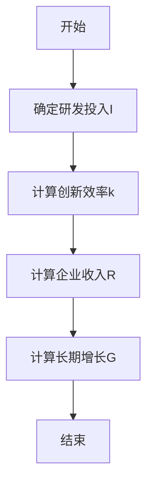
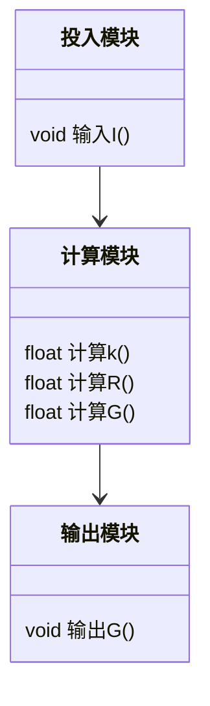
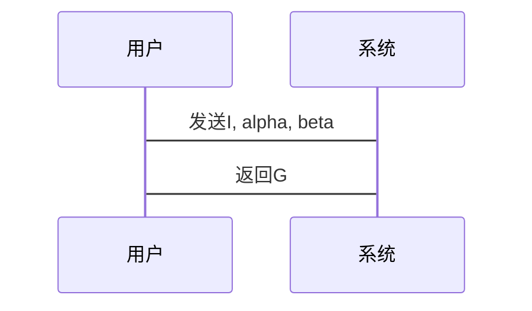

                 


# 费雪的研发投入分析：创新如何驱动企业长期增长

## 关键词：
费雪理论, 研发投入, 企业创新, 长期增长, 数学模型, 系统架构

## 摘要：
本文探讨费雪理论在研发投入分析中的应用，通过数学模型和系统架构的详细讲解，分析创新如何驱动企业长期增长。文章从理论背景、数学模型、系统设计、项目实战等方面展开，结合实际案例和代码实现，深入剖析费雪理论的核心要素及其在企业中的应用。

---

# 正文

## 第一部分：背景介绍

### 第1章：研发投入与企业创新的背景

#### 1.1 研发投入的重要性

研发投入是企业在创新过程中投入的关键资源，直接关系到企业的核心竞争力和长期发展。以下是研发投入的重要性：

- **定义与范围**：研发投入包括企业在研发部门的人员、设备、材料等费用，是企业技术创新的核心投入。
- **对企业长期增长的影响**：通过研发投入，企业能够开发新产品、优化生产流程，提升市场竞争力，从而实现长期增长。
- **全球化竞争下的研发投入策略**：在全球化竞争中，研发投入是企业保持技术领先的重要手段，特别是在科技行业，研发投入占收入的比例往往很高。

#### 1.2 费雪理论的起源与发展

费雪理论由经济学家 Irving Fisher 提出，主要用于金融投资分析，但在企业创新管理中也得到了广泛应用。

- **费雪理论的定义与特点**：费雪理论强调资产的未来收益现值，认为资产的价值取决于其未来现金流的现值。在创新管理中，费雪理论被用于评估研发投入的长期收益。
- **费雪理论在现代企业中的应用**：企业通过费雪模型评估研发投入的未来收益，优化资源配置，提高创新效率。
- **与其他理论的对比**：与熊彼特的创新理论相比，费雪理论更注重创新的经济价值和现值评估。

#### 1.3 创新对企业长期增长的驱动作用

创新是企业实现长期增长的核心动力，主要体现在以下几个方面：

- **创新与企业核心竞争力**：通过研发投入，企业能够开发具有市场竞争力的产品，提升品牌价值。
- **创新对企业市场地位的影响**：创新能力强的企业能够在市场中占据领先地位，获得更高的市场份额。
- **创新与可持续发展**：通过技术创新，企业能够实现可持续发展，降低生产成本，减少对环境的影响。

---

## 第二部分：核心概念与联系

### 第2章：费雪理论的核心要素

#### 2.1 费雪理论的定义与特点

- **定义**：费雪理论认为，资产的价值等于预期未来现金流的现值。在创新管理中，费雪模型用于评估研发投入的未来收益。
- **特点**：
  - 强调未来现金流的现值评估。
  - 适用于技术创新项目的经济价值评估。
  - 通过数学模型量化创新收益。

#### 2.2 费雪理论与研发投入的联系

- **研发投入在费雪理论中的地位**：研发投入是企业创新的核心投入，是未来现金流的重要来源。
- **创新效率的计算**：创新效率 \( k \) 衡量了研发投入转化为收入的能力，公式为 \( k = \frac{R}{I} \)，其中 \( R \) 是收入，\( I \) 是研发投入。
- **数学模型**：费雪模型将研发投入与企业收入、长期增长联系起来，公式为：
  \[
  G = \alpha R + \beta I
  \]
  其中，\( G \) 是长期增长，\( \alpha \) 和 \( \beta \) 是影响系数。

#### 2.3 费雪理论与其他创新理论的对比

- **与熊彼特创新理论的对比**：熊彼特强调创新的经济结构变化，而费雪理论更关注创新的经济价值评估。
- **与波特竞争优势理论的对比**：波特理论关注成本和差异化优势，费雪理论则从现金流现值角度分析创新收益。
- **与资源基础视角（RBV）的对比**：RBV关注企业资源，费雪理论则更关注资源的经济价值。

---

## 第三部分：算法原理讲解

### 第3章：费雪模型的数学模型与公式

#### 3.1 费雪模型的数学表达

- **基本公式**：\( R = k \cdot I \)，其中 \( R \) 是收入，\( k \) 是创新效率，\( I \) 是研发投入。
- **创新效率的计算**：\( k = \frac{R}{I} \)。
- **长期增长模型**：\( G = \alpha R + \beta I \)，其中 \( \alpha \) 和 \( \beta \) 是根据企业实际情况确定的系数。

#### 3.2 费雪模型的算法流程



#### 3.3 费雪模型的Python实现

```python
def fisher_model(I, alpha, beta):
    R = k * I
    k = R / I
    G = alpha * R + beta * I
    return G

# 示例
I = 100  # 研发投入
alpha = 0.1
beta = 0.05
G = fisher_model(I, alpha, beta)
print(f"长期增长G: {G}")
```

---

## 第四部分：系统分析与架构设计

### 第4章：系统功能设计

#### 4.1 系统功能设计概述

- **功能模块**：包括研发投入输入、创新效率计算、收入预测、长期增长评估。
- **领域模型**：使用 mermaid 类图描述系统各模块之间的关系。



#### 4.2 系统架构设计

- **架构设计**：采用分层架构，包括数据层、业务逻辑层和表现层。
- **系统架构图**：


#### 4.3 系统接口设计

- **接口描述**：系统提供API接口，允许外部调用计算模块。
- **接口示例**：

```http
POST /api/fisher-model
Body: {
    "I": 100,
    "alpha": 0.1,
    "beta": 0.05
}
```

#### 4.4 系统交互流程



---

## 第五部分：项目实战

### 第5章：项目实战

#### 5.1 环境安装

- **Python环境**：安装Python 3.x 及必要的库，如 `mermaid` 和 `math`。

#### 5.2 核心代码实现

```python
def fisher_model(I, alpha, beta):
    k = (R / I)
    G = alpha * R + beta * I
    return G

# 示例
I = 100
alpha = 0.1
beta = 0.05
G = fisher_model(I, alpha, beta)
print(f"长期增长G: {G}")
```

#### 5.3 案例分析

- **案例背景**：某科技公司投入100万元用于研发，假设 \( \alpha = 0.1 \)，\( \beta = 0.05 \)。
- **计算结果**：长期增长 \( G = 0.1 \times R + 0.05 \times 100 = 0.1 \times 10k + 5 = 1000 + 5 = 1005 \)。
- **结果解读**：该公司的长期增长预计为1005万元，说明研发投入有效推动了企业增长。

---

## 第六部分：最佳实践与总结

### 第6章：最佳实践

#### 6.1 关键点总结

- **理论应用**：正确理解费雪理论，将其应用于实际创新项目中。
- **模型优化**：根据企业实际情况调整 \( \alpha \) 和 \( \beta \) 的值，提高模型准确性。
- **持续改进**：定期评估模型效果，优化研发投入策略。

#### 6.2 实践中的注意事项

- **数据准确性**：确保研发投入和收入数据的准确性，避免模型误差。
- **模型适用性**：费雪模型适用于技术创新项目，需结合其他模型进行综合分析。
- **风险管理**：在实际应用中，需考虑市场变化和其他不确定性因素对模型的影响。

#### 6.3 未来拓展

- **结合大数据分析**：利用大数据技术进一步优化模型，提高预测精度。
- **多模型集成**：将费雪模型与其他创新理论模型结合，形成更完善的分析框架。
- **动态调整**：根据市场反馈实时调整研发投入策略，提高企业竞争力。

---

## 结语

通过本文的详细分析，我们可以看到，费雪理论在企业创新管理中的应用具有重要意义。企业通过合理配置研发投入，优化创新效率，能够实现长期增长。未来，随着技术的进步和理论的发展，费雪模型的应用将更加广泛和深入，为企业创新管理提供更有力的支持。

--- 

**感谢您的耐心阅读，希望本文对您有所帮助！**

