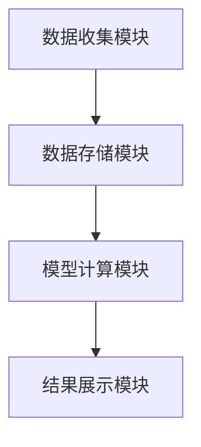
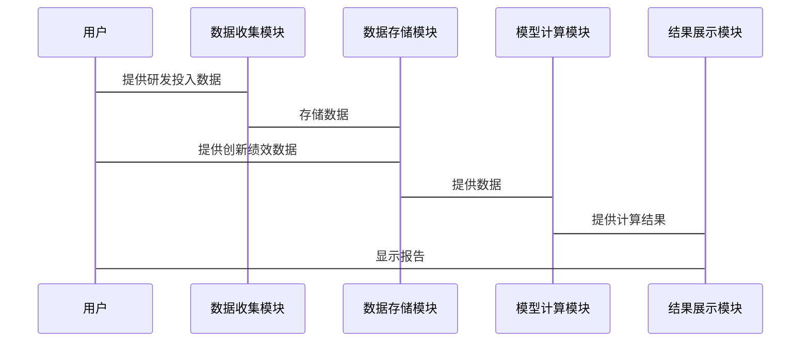

                 


---

# 费雪的研发投入分析：创新能力的指标

> 关键词：研发投入分析，创新能力，费雪模型，数学模型，系统架构

> 摘要：本文深入探讨了费雪的研发投入分析方法，通过数学模型、系统架构和实际案例分析，揭示了如何利用研发投入指标衡量创新能力。文章结构清晰，涵盖背景、核心概念、算法原理、系统设计、项目实战和最佳实践等部分，为读者提供全面的分析框架。

---

## 第1章 研发投入分析的背景

### 1.1 创新能力的重要性

#### 1.1.1 创新能力的定义与内涵
创新是推动企业发展的核心动力。创新能力指的是企业在技术和商业模式上进行创新的能力，包括产品开发、流程优化和市场拓展等方面。创新能力强的企业能够更快地适应市场变化，抓住机遇，获取竞争优势。

#### 1.1.2 创新能力对企业发展的意义
- **市场竞争优势**：创新能力强的企业能够推出新产品或服务，吸引更多的客户，从而在竞争中占据优势。
- **持续增长动力**：创新能力是企业实现可持续增长的关键因素，尤其是在技术驱动型的行业中。
- **应对变化**：创新能力使企业能够更好地应对市场和技术的变化，降低风险。

#### 1.1.3 研发投入与创新能力的关系
研发投入是创新能力的重要指标，但并非唯一指标。研发投入反映了企业对创新的重视程度，但创新能力还取决于研发的效率、团队的能力以及市场的接受度等因素。

### 1.2 研发投入的定义与分类

#### 1.2.1 研发投入的定义
研发投入（R&D，Research and Development）是指企业在研究、开发和创新活动上的支出。这些支出包括人员工资、设备采购、试验材料费用等。

#### 1.2.2 研发投入的分类
研发投入可以分为以下几个类别：
1. **基础研究**：旨在探索新的科学知识，通常由高校或研究机构进行。
2. **应用研究**：旨在将基础研究成果应用于实际问题的解决。
3. **产品开发**：旨在开发新产品或改进现有产品的过程。
4. **过程创新**：旨在优化生产流程或管理流程。

#### 1.2.3 研发投入与企业规模的关系
- **小企业**：通常研发投入较低，但可能通过合作或外包来实现创新。
- **中型企业**：研发投入较为稳定，注重产品开发和应用研究。
- **大型企业**：研发投入较高，注重基础研究和长期技术创新。

### 1.3 费雪模型的提出背景

#### 1.3.1 费雪模型的提出背景
费雪模型是由经济学家威廉·费雪提出的，旨在通过分析企业的研发投入来衡量其创新能力。该模型结合了研发投入的规模、效率和成果等多个维度，提供了一种全面的创新能力评估方法。

#### 1.3.2 费雪模型的核心思想
费雪模型认为，企业的创新能力不仅取决于研发投入的规模，还取决于研发的效率和成果。通过将研发投入与创新绩效相结合，可以更准确地衡量企业的创新能力。

#### 1.3.3 费雪模型的应用领域
费雪模型广泛应用于企业战略管理、投资决策和政策制定等领域。它帮助企业识别哪些领域的研发投入能够带来更高的创新绩效，从而优化资源配置。

### 1.4 本章小结
本章介绍了创新能力的重要性，详细说明了研发投入的定义与分类，并提出了费雪模型的背景和核心思想。这些内容为后续章节的分析奠定了基础。

---

## 第2章 研发投入分析的核心概念

### 2.1 费雪模型的定义与特点

#### 2.1.1 费雪模型的定义
费雪模型是一种通过分析企业的研发投入来衡量创新能力的模型。它将研发投入与创新绩效相结合，提供了一种全面的创新能力评估方法。

#### 2.1.2 费雪模型的核心特点
- **综合性**：费雪模型综合考虑了研发投入的规模、效率和成果等多个维度。
- **动态性**：模型强调了创新能力的动态变化，认为研发投入与创新绩效之间存在动态平衡。
- **可量化**：模型通过数学公式量化了创新绩效，便于企业进行横向比较。

#### 2.1.3 费雪模型与其他模型的对比
下表对比了费雪模型与其他创新能力评估模型的核心差异：

| 模型名称   | 核心思想                   | 优点                                | 缺点                                |
|------------|----------------------------|-------------------------------------|-------------------------------------|
| 费雪模型   | 投入与绩效的动态平衡       | 综合性高，可量化                   | 计算复杂，需要大量数据支持         |
| 投资回报模型 | 投资与回报的线性关系       | 简单易懂                           | 忽略了动态变化和复杂性               |
| 鲁宾斯坦模型 | 创新能力与资源分配的关系   | 强调资源分配                       | 忽略了研发投入的具体细节           |

### 2.2 费雪模型的核心要素

#### 2.2.1 研发投入的度量指标
- **研发投入规模**：企业的研发投入金额占总收入的比例。
- **研发投入效率**：单位研发投入产生的创新成果数量。
- **研发投入结构**：不同类型研发投入（基础研究、应用研究、产品开发）的比例。

#### 2.2.2 创新能力的评估维度
- **创新绩效**：企业创新成果的数量和质量。
- **创新速度**：企业推出新产品或改进的速度。
- **创新可持续性**：企业的创新能力是否能够持续。

#### 2.2.3 费雪模型的数学表达式
费雪模型的数学表达式为：
$$
I = aR + bD + cC
$$
其中：
- \( I \) 表示创新绩效
- \( R \) 表示研发投入
- \( D \) 表示研发效率
- \( C \) 表示其他因素
- \( a \)、\( b \)、\( c \) 是各变量的权重系数

---

### 2.3 研发投入与创新能力的关系

#### 2.3.1 研发投入对创新能力的影响
- **正向影响**：研发投入增加通常会带来创新能力的提升。
- **边际效应递减**：随着研发投入的增加，创新能力的提升效果逐渐减弱。

#### 2.3.2 创新能力对研发投入的反哺作用
创新能力的提升会吸引更多的人才和资源，进一步增加研发投入。

#### 2.3.3 研发投入与创新能力的动态平衡
企业需要在研发投入和创新能力之间找到动态平衡，避免过度投入或投入不足。

---

## 第3章 费雪模型的数学模型与公式

### 3.1 费雪模型的基本假设

#### 3.1.1 研发投入与创新绩效的关系
费雪模型假设研发投入与创新绩效之间存在线性关系：
$$
I = aR + bD + cC
$$

#### 3.1.2 创新绩效的度量方法
创新绩效可以通过专利数量、新产品销售额、市场占有率等指标来衡量。

#### 3.1.3 研发投入的分配方式
研发投入可以分配到基础研究、应用研究和产品开发三个方向，每个方向的权重不同。

### 3.2 费雪模型的数学公式

#### 3.2.1 创新绩效的计算公式
$$
I = aR + bD + cC
$$
其中：
- \( a \)、\( b \)、\( c \) 是根据企业实际情况确定的权重系数。
- \( R \) 是研发投入金额。
- \( D \) 是研发效率，通常表示为单位研发投入产生的创新成果数量。
- \( C \) 是其他影响创新绩效的因素，如市场需求、政策环境等。

#### 3.2.2 研发投入与创新绩效的数学关系
通过上述公式可以看出，创新绩效 \( I \) 与研发投入 \( R \) 成正比，但受到研发效率 \( D \) 和其他因素 \( C \) 的影响。

---

## 第4章 系统分析与架构设计方案

### 4.1 问题场景介绍
假设我们有一个制造业企业，希望评估其创新能力。我们需要分析其研发投入情况，并使用费雪模型进行创新能力评估。

### 4.2 系统功能设计

#### 4.2.1 数据收集模块
- 收集企业的研发投入数据，包括基础研究、应用研究和产品开发的投入金额。
- 收集创新绩效数据，如专利数量、新产品销售额等。

#### 4.2.2 模型计算模块
- 使用费雪模型计算创新绩效。
- 根据计算结果生成报告。

#### 4.2.3 结果展示模块
- 以图表形式展示创新绩效和研发投入的关系。
- 提供优化建议。

### 4.3 系统架构设计

#### 4.3.1 系统架构图


#### 4.3.2 系统交互流程图


### 4.4 系统接口设计
- 数据接口：通过API接口接收研发投入和创新绩效数据。
- 报告接口：通过API接口返回分析结果。

---

## 第5章 项目实战

### 5.1 环境安装
需要安装Python、Pandas、Matplotlib等库。

### 5.2 核心代码实现

#### 5.2.1 数据处理代码
```python
import pandas as pd
import matplotlib.pyplot as plt

# 读取数据
data = pd.read_csv('input.csv')

# 数据预处理
data['创新绩效'] = a * data['研发投入'] + b * data['研发效率'] + c * data['其他因素']
```

#### 5.2.2 模型计算代码
```python
# 计算创新绩效
def calculate_innovation_performance(r, d, c):
    return a * r + b * d + c

# 应用到数据集
data['创新绩效'] = data.apply(lambda x: calculate_innovation_performance(x['研发投入'], x['研发效率'], x['其他因素']), axis=1)
```

#### 5.2.3 结果展示代码
```python
# 绘制图表
plt.scatter(data['研发投入'], data['创新绩效'])
plt.xlabel('研发投入')
plt.ylabel('创新绩效')
plt.title('研发投入与创新绩效的关系')
plt.show()
```

### 5.3 实际案例分析
以制造业企业为例，分析其研发投入与创新绩效的关系，并提出优化建议。

---

## 第6章 最佳实践与小结

### 6.1 最佳实践
- 数据质量：确保数据的准确性和完整性。
- 模型适用性：根据企业实际情况调整模型参数。
- 持续优化：定期更新数据和模型，保持分析的准确性。

### 6.2 小结
本文通过费雪模型，详细分析了研发投入与创新能力之间的关系，并通过实际案例展示了如何应用该模型进行创新能力评估。希望本文能为企业提供有价值的参考和指导。

### 6.3 注意事项
- 模型的应用需要结合企业的实际情况。
- 数据的收集和处理需要仔细，避免偏差。
- 模型的结果需要结合行业特点进行解读。

### 6.4 拓展阅读
- 《创新管理》
- 《研发投入与企业绩效》
- 《费雪模型的应用与扩展》

---

通过以上内容，我们可以看到，费雪模型为我们提供了一种全面评估创新能力的方法。希望本文能为企业在研发投入分析和创新能力提升方面提供有价值的参考和指导。

