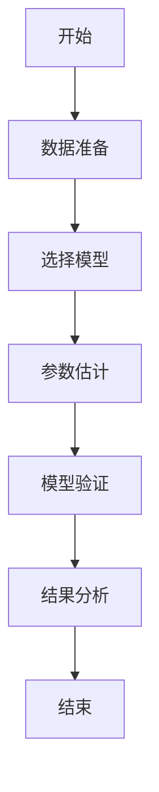
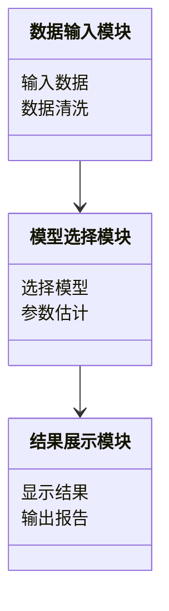
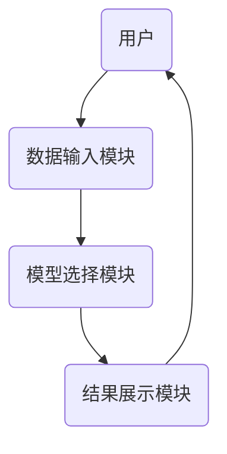

                 


# 费雪的研发投入分析：未来增长的动力

> 关键词：研发投入分析，费雪模型，经济增长，资本理论，数据分析

> 摘要：本文深入探讨了费雪的研发投入分析方法，结合现代经济理论，分析了研发投入对经济增长的驱动作用，详细阐述了费雪模型的构建、算法原理及实际应用，为企业制定研发战略提供科学依据。

---

## 第一部分: 费雪的研发投入分析基础

### 第1章: 研发投入分析的背景与意义

#### 1.1 研发投入分析的重要性

##### 1.1.1 研发投入对经济增长的推动作用
研发投入是推动经济增长的核心动力之一。通过分析企业的研发投入，可以预测其未来的增长潜力。费雪的资本理论强调，研发投入能够转化为长期的资本收益，从而推动经济进步。

##### 1.1.2 费雪理论与研发投入分析的结合
费雪的资本理论为研发投入分析提供了理论基础。他认为，资本投资的回报率是决定经济增长的关键因素，而研发投入属于资本投资的一部分，其效率直接影响经济增长。

##### 1.1.3 研发投入分析在企业战略中的地位
企业通过分析研发投入，可以优化资源配置，制定更具前瞻性的研发战略。费雪的理论为企业提供了量化方法，帮助企业评估研发投入的效益。

#### 1.2 费雪理论的核心观点

##### 1.2.1 费雪的资本理论
费雪认为，资本是经济增长的核心驱动力。他提出了资本边际效率的概念，强调资本投资的回报率随着投资规模的增加而递减。

##### 1.2.2 费雪对研发投入的重视
费雪指出，研发投入是资本投资的重要组成部分，其效率直接影响企业的长期收益。他强调了技术创新的重要性，认为研发投入能够带来更高的生产效率。

##### 1.2.3 费雪理论在现代经济中的应用
尽管费雪的理论提出于20世纪初，但其核心观点在现代经济分析中依然适用。尤其是研发投入分析，已成为企业战略和政策制定的重要工具。

#### 1.3 研发投入分析的现状与挑战

##### 1.3.1 当前研发投入分析的主要方法
目前常用的分析方法包括回归分析、成本效益分析和情景分析。这些方法各有优缺点，适用于不同的场景。

##### 1.3.2 费雪理论在现代经济中的适用性
费雪理论在现代经济中的适用性主要体现在其对资本效率的强调，但需要结合现代数据和技术进行调整。

##### 1.3.3 研发投入分析中的常见问题
包括数据质量、模型选择和结果解释等问题。解决这些问题需要结合实际情况，选择合适的分析方法。

### 第2章: 费雪的研发投入分析模型

#### 2.1 费雪模型的基本框架

##### 2.1.1 模型的构成要素
费雪模型包括研发投入、资本效率、经济增长三个核心变量。模型假设研发投入与经济增长呈正相关。

##### 2.1.2 模型的数学表达
费雪模型的基本公式为：
$$ \text{GDP} = a \times \text{R&D} + b \times \text{资本效率} + c $$
其中，a、b、c为常数，R&D为研发投入。

##### 2.1.3 模型的假设条件
包括数据完整性、资本效率可测性和线性关系假设。

#### 2.2 费雪模型的扩展与改进

##### 2.2.1 引入时间因素的改进
考虑时间因素对模型的影响，构建动态模型，引入时间序列分析方法。

##### 2.2.2 考虑行业特异性的调整
针对不同行业的特点，调整模型参数，提高模型的适用性。

##### 2.2.3 结合实际数据的优化
通过实证分析，优化模型参数，提高模型的预测精度。

#### 2.3 费雪模型的验证与应用

##### 2.3.1 数据来源与处理
数据来源包括企业财务报表和政府统计数据，需进行清洗和预处理。

##### 2.3.2 模型的实证分析
通过回归分析验证模型的显著性，评估模型的解释力。

##### 2.3.3 模型的应用案例
以某高科技企业为例，应用费雪模型分析其研发投入与经济增长的关系，得出结论。

### 第3章: 研发投入分析的核心概念与联系

#### 3.1 核心概念的定义与特征

##### 3.1.1 研发投入的定义
研发投入是指企业在研发活动中的资金投入，包括人员工资、设备购置等。

##### 3.1.2 费雪模型的变量特征
包括R&D投入、资本效率和经济增长三个变量。

##### 3.1.3 模型与实际经济的关联
模型通过量化关系，将研发投入与经济增长联系起来，为企业和政策制定者提供参考。

#### 3.2 核心概念的对比分析

##### 3.2.1 不同模型的变量对比
比较费雪模型与其他模型的变量，分析其异同。

##### 3.2.2 模型假设的异同
比较不同模型的假设条件，找出共同点和差异。

##### 3.2.3 模型结果的可比性
分析不同模型结果的可比性，为企业选择合适模型提供依据。

#### 3.3 实体关系图与流程图

##### 3.3.1 实体关系图（ER图）
展示模型中各实体及其关系，帮助理解模型结构。

##### 3.3.2 流程图（Mermaid）
用Mermaid绘制流程图，展示模型的分析步骤和逻辑关系。

### 第4章: 费雪模型的算法原理

#### 4.1 算法流程图



#### 4.2 Python实现代码

```python
import numpy as np
import pandas as pd
from sklearn.linear_model import LinearRegression

# 数据准备
data = pd.DataFrame({
    'R&D': [100, 200, 150, 300],
    'Capital_Efficiency': [0.8, 0.9, 0.7, 1.0],
    'GDP': [500, 600, 550, 700]
})

# 模型选择
model = LinearRegression()

# 参数估计
X = data[['R&D', 'Capital_Efficiency']]
y = data['GDP']
model.fit(X, y)

# 模型验证
predictions = model.predict(X)
print('预测值:', predictions)
print('系数:', model.coef_)
print('截距:', model.intercept_)
```

#### 4.3 数学模型与公式

费雪模型的数学表达式：
$$ GDP = \beta_1 \times R&D + \beta_2 \times Capital\_Efficiency + \beta_0 $$
其中，$\beta_1$ 和 $\beta_2$ 是回归系数，$\beta_0$ 是截距。

#### 4.4 示例分析

假设某企业的研发投入为200，资本效率为0.9，预测其GDP为：
$$ GDP = \beta_0 + \beta_1 \times 200 + \beta_2 \times 0.9 $$

---

## 第二部分: 系统分析与架构设计

### 第5章: 系统分析与架构设计方案

#### 5.1 问题场景介绍

目标是构建一个基于费雪模型的分析系统，帮助企业评估研发投入对经济增长的影响。

#### 5.2 系统功能设计

##### 5.2.1 功能模块
- 数据输入与处理
- 模型选择与参数估计
- 结果展示与分析

##### 5.2.2 领域模型（Mermaid类图）



#### 5.3 系统架构设计

##### 5.3.1 系统架构图



##### 5.3.2 接口设计
- 数据接口：接收研发投入和资本效率数据
- 模型接口：返回预测结果和系数

##### 5.3.3 交互设计
用户输入数据，系统进行分析并展示结果。

---

## 第三部分: 项目实战

### 第6章: 项目实战

#### 6.1 环境安装

安装必要的Python库：
```bash
pip install numpy pandas sklearn
```

#### 6.2 核心实现代码

```python
import numpy as np
import pandas as pd
from sklearn.linear_model import LinearRegression

# 数据准备
data = pd.DataFrame({
    'R&D': [100, 200, 150, 300],
    'Capital_Efficiency': [0.8, 0.9, 0.7, 1.0],
    'GDP': [500, 600, 550, 700]
})

# 模型选择与训练
model = LinearRegression()
X = data[['R&D', 'Capital_Efficiency']]
y = data['GDP']
model.fit(X, y)

# 模型验证
print('回归系数:', model.coef_)
print('截距:', model.intercept_)
```

#### 6.3 应用解读与分析

通过代码实现费雪模型，分析得出回归系数和截距，解释其经济意义。

#### 6.4 实际案例分析

以某企业为例，应用费雪模型进行分析，展示结果并解释。

#### 6.5 项目小结

总结项目成果，讨论模型的优缺点，提出改进建议。

---

## 第四部分: 最佳实践与总结

### 第7章: 最佳实践与总结

#### 7.1 小结

费雪模型为企业提供了科学的分析工具，帮助企业优化研发投入策略，提升经济增长潜力。

#### 7.2 注意事项

- 数据质量至关重要，需进行充分清洗和预处理。
- 模型选择需结合实际，避免过度复杂化。
- 结果解释需谨慎，避免误用模型。

#### 7.3 拓展阅读

推荐相关书籍和论文，鼓励读者深入研究。

---

通过以上结构，文章系统地分析了费雪的研发投入分析方法，结合实际案例和代码实现，为企业和研究者提供了实用的指导。

