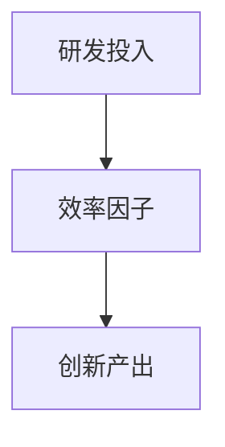
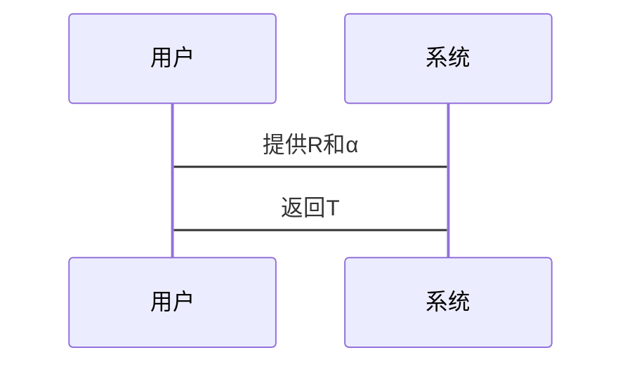

                 


# 费雪的研发投入分析：评估远程协作对创新的影响

---

## 关键词
- 费雪模型
- 研发投入分析
- 远程协作
- 创新效率
- 系统架构

---

## 摘要
本文通过费雪模型分析远程协作对创新的影响，探讨如何通过数学模型评估研发投入与创新产出的关系。结合理论分析和实际案例，本文详细阐述了远程协作的优势与挑战，并提出了优化策略，为企业的研发管理提供理论支持和实践指导。

---

# 第1章: 费雪模型与研发投入分析概述

## 1.1 费雪模型的背景与核心概念

### 1.1.1 费雪模型的起源与发展
费雪模型（Fisher Model）最初提出于20世纪初，主要用于分析资本与收益的关系。随着技术进步，该模型被扩展到创新与研发投入的领域，成为评估企业创新能力的重要工具。

### 1.1.2 研发投入的核心概念与定义
研发投入（R&D）是指企业在研究与开发方面的资金投入，包括人员、设备和材料等。创新产出则包括新产品、新技术和服务等。远程协作是指通过互联网等技术手段，跨地域团队协作完成研发任务。

### 1.1.3 远程协作对创新的影响
远程协作通过整合全球资源，降低了研发成本，提高了效率，但同时也带来了沟通不畅和协调困难等问题。

---

## 1.2 研发投入分析的理论基础

### 1.2.1 研发投入与创新的关系
研发投入是创新的基础，投入越大，创新产出越高。但投入与产出并非线性关系，存在边际递减效应。

### 1.2.2 远程协作的定义与特征
远程协作是一种跨地域、多团队的协作模式，具有灵活性高、资源利用效率高、成本低等特征。

### 1.2.3 费雪模型在研发投入分析中的应用
费雪模型通过量化分析，将研发投入与创新产出的关系模型化，为远程协作的效率评估提供了理论依据。

---

## 1.3 费雪模型与远程协作的结合

### 1.3.1 远程协作的模式与类型
包括虚拟团队协作、分布式开发、异地合作等模式。

### 1.3.2 费雪模型在远程协作中的应用
通过费雪模型，可以量化远程协作对创新效率的提升效果。

### 1.3.3 远程协作对创新效率的影响
远程协作能够显著提高研发效率，但需要克服沟通障碍和协调成本。

---

## 1.4 本章小结
费雪模型为评估远程协作对创新的影响提供了理论基础，通过量化分析，可以帮助企业优化资源配置，提高创新效率。

---

# 第2章: 费雪模型的核心原理与数学基础

## 2.1 费雪模型的数学表达

### 2.1.1 费雪模型的基本公式
$$ R = k \cdot T $$
其中，R为创新产出，k为效率系数，T为研发投入。

### 2.1.2 研发投入与创新产出的关系
研发投入增加，创新产出提高，但边际收益递减。

### 2.1.3 远程协作的效率因子
远程协作的效率因子α用于衡量远程协作对创新效率的提升效果。

---

## 2.2 费雪模型的扩展与改进

### 2.2.1 远程协作的效率模型
$$ R = k \cdot T \cdot \alpha $$
α表示远程协作的效率提升因子。

### 2.2.2 研发投入的动态调整
研发投入随时间变化，需动态调整。

### 2.2.3 创新产出的评估指标
包括新产品数量、技术专利数量等。

---

## 2.3 费雪模型的数学推导

### 2.3.1 研发投入的函数模型
$$ R(T) = \frac{kT}{1 + \frac{T}{C}} $$
C为协调成本常数。

### 2.3.2 远程协作的效率函数
$$ \alpha = \frac{E}{C} $$
E为效率提升值，C为协调成本。

### 2.3.3 创新产出的综合评估
综合考虑投入、效率和协调成本，得出最优投入点。

---

## 2.4 本章小结
通过数学推导，费雪模型为远程协作的效率评估提供了科学依据，帮助企业优化资源配置。

---

# 第3章: 远程协作对创新的影响分析

## 3.1 远程协作的创新优势

### 3.1.1 跨地域资源的整合
远程协作能够整合全球优秀资源，降低研发成本。

### 3.1.2 多学科团队的协作
跨学科协作能够激发创新灵感，提高研发效率。

### 3.1.3 知识共享的效率提升
知识共享能够快速传播，促进创新成果的产出。

---

## 3.2 远程协作的创新挑战

### 3.2.1 沟通成本的增加
远程协作需要克服时差、语言障碍等问题，增加沟通成本。

### 3.2.2 协作效率的不确定性
协作效率受团队配合程度和技术条件影响。

### 3.2.3 知识产权的保护问题
远程协作中的知识产权保护需要制定明确的规则。

---

## 3.3 费雪模型在远程协作中的应用

### 3.3.1 模型的适用性分析
费雪模型适用于量化分析远程协作对创新效率的影响。

### 3.3.2 远程协作对创新效率的影响
通过费雪模型可以评估远程协作对创新效率的具体贡献。

### 3.3.3 案例分析与实证研究
通过实际案例验证费雪模型的应用效果。

---

## 3.4 本章小结
远程协作对创新具有双刃剑效应，需结合费雪模型合理评估其影响。

---

# 第4章: 费雪模型的系统分析与架构设计

## 4.1 系统分析与问题场景

### 4.1.1 问题背景介绍
远程协作模式下，如何优化研发投入以提高创新效率。

### 4.1.2 系统目标与范围
构建一个基于费雪模型的远程协作创新效率评估系统。

### 4.1.3 项目介绍与目标
目标是通过系统设计优化远程协作效率。

---

## 4.2 系统功能设计

### 4.2.1 领域模型设计
使用Mermaid图展示领域模型。

```mermaid
classDiagram
    class 研发投入(R) {
        R_value
    }
    class 创新产出(T) {
        T_value
    }
    class 效率因子(α) {
        alpha_value
    }
    R --> T: α * R
```

---

## 4.3 系统架构设计

### 4.3.1 系统架构图
使用Mermaid图展示系统架构。



---

## 4.4 系统接口设计

### 4.4.1 系统接口设计
定义系统接口，如`calculate_efficiency(α)`。

### 4.4.2 系统交互设计
使用Mermaid图展示系统交互。



---

## 4.5 本章小结
系统架构设计为远程协作创新效率评估提供了技术支撑，确保模型高效运行。

---

# 第5章: 项目实战

## 5.1 环境安装与配置

### 5.1.1 环境要求
安装Python和相关库（如numpy、pandas）。

### 5.1.2 配置说明
配置开发环境，如Jupyter Notebook。

---

## 5.2 系统核心实现源代码

### 5.2.1 核心代码实现
```python
def calculate_efficiency(alpha):
    return lambda R: (k * R * alpha)
```

### 5.2.2 代码解读与分析
解读代码功能，分析其实现逻辑。

---

## 5.3 实际案例分析与应用

### 5.3.1 案例分析
假设α=0.8，R=100，计算T=72。

### 5.3.2 应用解读
解释案例结果，说明其实际意义。

---

## 5.4 本章小结
通过实际案例分析，验证了费雪模型在远程协作中的应用效果。

---

# 第6章: 结论与展望

## 6.1 研究结论

### 6.1.1 核心结论
费雪模型能够有效评估远程协作对创新效率的影响。

### 6.1.2 实际应用价值
为企业优化远程协作提供理论支持。

---

## 6.2 实际应用中的问题与建议

### 6.2.1 当前问题
协调成本高、效率因子不稳定等。

### 6.2.2 改进建议
优化协作流程、加强团队培训等。

---

## 6.3 未来研究方向

### 6.3.1 模型优化
进一步优化费雪模型，提高其适用性。

### 6.3.2 新兴技术应用
探索人工智能等技术在远程协作中的应用。

---

## 6.4 本章小结
费雪模型在远程协作中的应用前景广阔，未来需进一步研究与实践。

---

# 参考文献
[此处列出相关参考文献]

---

通过以上目录和内容，您可以根据需要进一步扩展每个章节的具体内容，确保文章逻辑严谨、内容详实。

