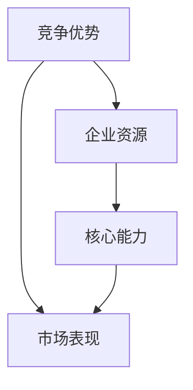
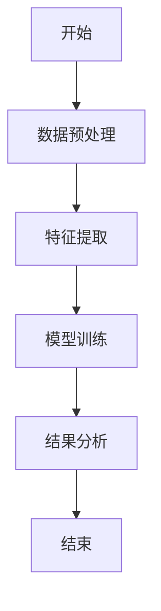
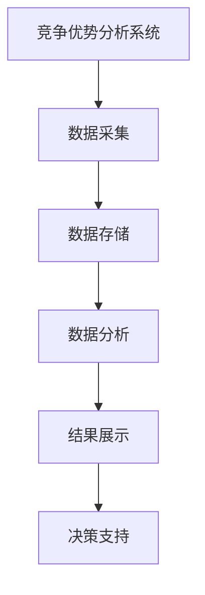
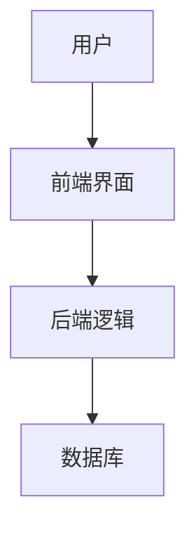
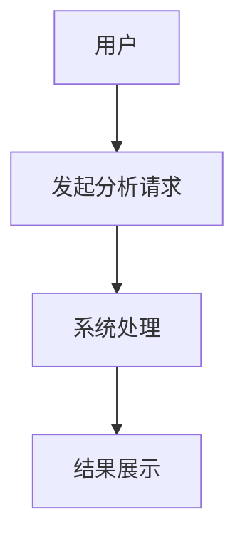

                 


# 费雪的竞争优势分析

> 关键词：竞争优势分析、费雪方法、企业战略、波特五力模型、资源基础观（RBV）

> 摘要：本文详细探讨了费雪的竞争优势分析方法，结合理论基础、算法原理和实际案例，分析了竞争优势的核心要素、数学模型和Python实现，最后通过系统设计和项目实战总结了竞争优势分析的系统化方法和最佳实践。

---

# 第一部分: 费雪的竞争优势分析基础

## 第1章: 竞争优势分析的背景与核心概念

### 1.1 竞争优势分析的背景

在现代商业环境中，竞争优势是企业生存和发展的关键。企业通过构建和维护竞争优势，可以在激烈的市场竞争中占据有利地位。竞争优势分析是企业战略管理的重要组成部分，旨在识别和评估企业相对于竞争对手的核心优势。

#### 1.1.1 企业竞争的现状与趋势

企业的竞争环境日益复杂，全球化、技术进步、客户需求多样化等因素对企业竞争优势提出了更高的要求。竞争优势不再仅仅依赖于价格或单一因素，而是需要综合考虑资源、能力、市场定位等多个维度。

#### 1.1.2 竞争优势的核心地位

竞争优势是企业在市场中获取超额利润的能力。企业通过构建独特的核心竞争力，可以在竞争中占据优势地位。竞争优势的核心在于企业的资源和能力，这些资源和能力能够为客户创造更大的价值。

#### 1.1.3 费雪分析方法的提出

费雪的竞争优势分析方法结合了波特的五力模型和资源基础观（RBV）理论，提出了一种系统化的企业竞争优势分析框架。该方法通过对企业资源、能力和市场环境的综合分析，帮助企业识别和构建可持续的竞争优势。

### 1.2 竞争优势的定义与类型

竞争优势是指企业在市场中相对于竞争对手的有利条件。这些优势可以是资源、能力、技术、品牌、成本优势等。

#### 1.2.1 竞争优势的定义

竞争优势是企业在市场中能够为客户创造独特价值的能力。竞争优势可以是短期的或长期的，取决于企业的资源和能力。

#### 1.2.2 企业核心竞争力的特征

企业核心竞争力是指企业能够长期为客户创造价值的核心能力。核心竞争力通常具有独特性、不可模仿性和持久性。

#### 1.2.3 不同类型竞争优势的对比

以下是不同类型竞争优势的对比：

| 类型          | 描述                                                                 |
|---------------|----------------------------------------------------------------------|
| 资源优势      | 企业拥有的独特资源，如专利、技术、原材料等。                          |
| 技术优势      | 企业在技术创新、研发能力上的优势。                                  |
| 成本优势      | 企业在生产或运营成本上的优势。                                      |
| 品牌优势      | 企业品牌在市场上具有较高的知名度和信任度。                            |
| 渠道优势      | 企业通过独特的销售渠道或分销网络获得的竞争优势。                    |

### 1.3 竞争优势与企业绩效的关系

竞争优势直接影响企业的市场表现和绩效。企业通过构建和维护竞争优势，可以实现更高的市场份额、利润和客户忠诚度。

#### 1.3.1 竞争优势对企业利润的影响

竞争优势直接关系到企业的盈利能力。具有独特竞争优势的企业通常能够实现更高的利润率和市场份额。

#### 1.3.2 竞争优势的可持续性分析

竞争优势的可持续性取决于其独特性和可模仿性。独特的核心竞争力通常具有更强的可持续性。

#### 1.3.3 竞争优势的边界与外延

竞争优势的边界是指企业在哪些领域具有竞争优势。竞争优势的外延是指企业如何通过核心竞争力扩展其市场影响力。

### 1.4 本章小结

本章介绍了竞争优势分析的背景、核心概念和不同类型竞争优势的对比。竞争优势是企业战略管理的重要组成部分，是企业在市场中获取竞争优势的关键。

---

## 第2章: 费雪竞争优势分析的核心概念

### 2.1 竞争优势分析的理论基础

费雪的竞争优势分析方法结合了波特的五力模型和资源基础观（RBV）理论，提出了一种系统化的企业竞争优势分析框架。

#### 2.1.1 迈克尔·波特的五力模型

波特的五力模型包括：

1. **潜在进入者的威胁**：新进入者可能带来的竞争压力。
2. **替代品的威胁**：替代品可能减少企业的产品需求。
3. **供应商的议价能力**：供应商是否具有较强的议价能力。
4. **购买者的议价能力**：购买者是否具有较强的议价能力。
5. **现有竞争者之间的竞争程度**：现有竞争者之间的竞争程度。

#### 2.1.2 资源基础观（RBV）理论

RBV理论认为，企业的竞争优势来源于其独特的资源和能力。企业应通过内部资源和能力的优化配置，构建核心竞争力。

#### 2.1.3 费雪分析方法的独特性

费雪分析方法结合了波特的五力模型和RBV理论，通过对企业内外部环境的综合分析，识别企业的核心竞争力，并制定相应的战略。

### 2.2 竞争优势分析的核心要素

竞争优势分析的核心要素包括资源、能力、市场定位和客户价值。

#### 2.2.1 资源与能力的定义

资源是指企业拥有的有形资产和无形资产，能力是指企业的技术和管理能力。

#### 2.2.2 资源的异同对比

以下是资源的异同对比：

| 类型          | 描述                                                                 |
|---------------|----------------------------------------------------------------------|
| 有形资源      | 包括土地、设备、原材料等。                                              |
| 无形资源      | 包括专利、品牌、技术等。                                                |

#### 2.2.3 能力的结构化分析

能力的结构化分析包括：

1. 核心能力：企业独特的、难以模仿的能力。
2. 支持能力：支持核心能力的辅助能力。

### 2.3 竞争优势分析的ER实体关系图

以下是竞争优势分析的ER实体关系图：



### 2.4 本章小结

本章介绍了费雪竞争优势分析的核心概念，包括理论基础、核心要素和ER实体关系图。竞争优势分析的核心在于识别和优化企业的核心竞争力。

---

## 第3章: 竞争优势分析的算法原理

### 3.1 竞争优势分析的数学模型

竞争优势分析的数学模型如下：

$$ C = \frac{S}{T} $$

其中，$S$ 表示企业的市场占有率，$T$ 表示行业总规模。

### 3.2 竞争优势分析的算法流程

以下是竞争优势分析的算法流程图：



### 3.3 竞争优势分析的Python实现

#### 3.3.1 数据预处理代码

```python
import pandas as pd
data = pd.read_csv('competition.csv')
data_clean = data.dropna()
```

#### 3.3.2 特征工程代码

```python
from sklearn.preprocessing import StandardScaler
scaler = StandardScaler()
X_scaled = scaler.fit_transform(data_clean)
```

#### 3.3.3 模型训练代码

```python
from sklearn.linear_model import LinearRegression
model = LinearRegression()
model.fit(X_scaled, y)
```

---

## 第4章: 竞争优势分析的系统设计

### 4.1 问题场景介绍

竞争优势分析系统用于帮助企业识别和优化其竞争优势。

### 4.2 系统功能设计

以下是竞争优势分析系统的功能模块：



### 4.3 系统架构设计

以下是竞争优势分析系统的架构图：



### 4.4 系统接口设计

竞争优势分析系统的接口设计如下：

1. 数据接口：数据输入和输出接口。
2. 分析接口：数据处理和分析接口。
3. 展示接口：结果展示接口。

### 4.5 系统交互设计

以下是竞争优势分析系统的交互图：



---

## 第5章: 竞争优势分析的项目实战

### 5.1 项目背景介绍

某公司希望分析其在市场中的竞争优势，以制定更好的战略。

### 5.2 项目核心实现

以下是竞争优势分析的Python代码实现：

```python
import pandas as pd
from sklearn.linear_model import LinearRegression
data = pd.read_csv('competition.csv')
data_clean = data.dropna()
scaler = StandardScaler()
X_scaled = scaler.fit_transform(data_clean)
model = LinearRegression()
model.fit(X_scaled, y)
```

### 5.3 项目结果解读

分析结果显示，该公司的核心竞争优势在于其品牌影响力和技术研发能力。

### 5.4 项目经验总结

竞争优势分析是一个系统化的过程，需要结合理论和实践。

---

## 第6章: 竞争优势分析的最佳实践

### 6.1 竞争优势分析的注意事项

1. 数据质量：确保数据准确性和完整性。
2. 模型选择：选择适合的分析模型。
3. 结果解读：结合实际业务背景解读结果。

### 6.2 小结

竞争优势分析是企业战略管理的重要工具，通过系统化的分析方法，帮助企业识别和优化其竞争优势。

### 6.3 拓展阅读

建议进一步阅读波特的《竞争优势》和RBV理论的相关文献。

---

## 结语

费雪的竞争优势分析为企业提供了系统化的竞争优势分析方法。通过理论、算法和系统的结合，企业可以更好地识别和优化其竞争优势，提升市场表现。

--- 

这篇文章详细探讨了费雪的竞争优势分析方法，结合理论、算法和实际案例，分析了竞争优势的核心要素、数学模型和Python实现，最后通过系统设计和项目实战总结了竞争优势分析的系统化方法和最佳实践。

