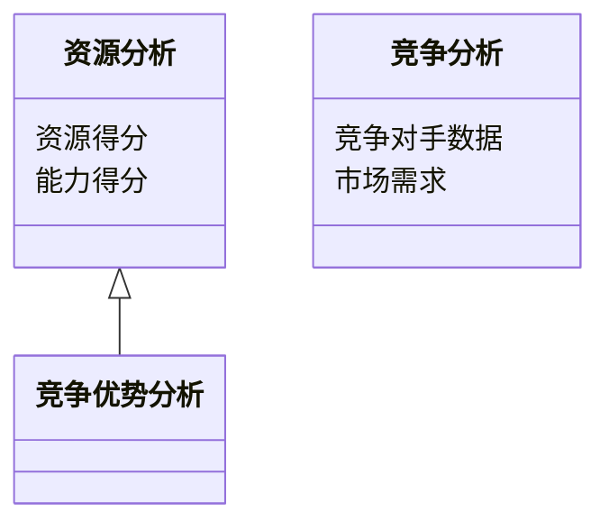
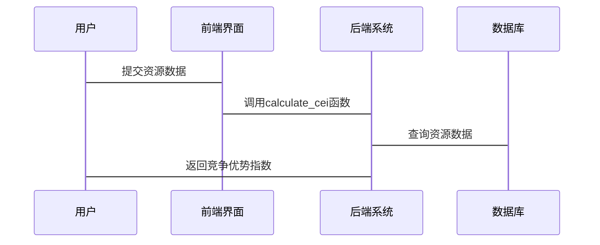

                 


# 费雪的竞争优势分析框架

> 关键词：竞争优势分析，费雪框架，企业战略，系统架构，项目实战

> 摘要：本文详细介绍了费雪的竞争优势分析框架，从背景概述、核心概念、算法原理到系统设计和项目实战，全面解析了该框架的理论基础和实际应用。通过案例分析和代码实现，帮助读者掌握如何在实际项目中应用该框架进行竞争优势分析。

---

# 第1章: 费雪的竞争优势分析框架概述

## 1.1 竞争优势分析的重要性

### 1.1.1 竞争优势的核心概念
竞争优势是指企业在市场中相对于竞争对手的独特优势，这些优势可以是成本、技术、品牌、资源等。竞争优势分析是企业制定战略的重要工具，能够帮助企业识别自身的优势和劣势，抓住市场机会，避免潜在风险。

### 1.1.2 费雪竞争优势分析框架的背景
费雪的竞争优势分析框架是由迈克尔·费雪提出的一种系统化分析方法。该框架结合了企业内部资源、外部环境和行业特点，通过多维度分析帮助企业识别核心竞争优势。相比传统的SWOT分析，费雪框架更加注重内部资源的深度分析和外部环境的动态变化。

### 1.1.3 竞争优势分析在企业战略中的作用
竞争优势分析能够帮助企业制定更具针对性的战略，优化资源配置，提升市场竞争力。通过分析竞争对手的优劣势，企业可以更好地定位自身，制定差异化策略。

## 1.2 费雪竞争优势分析框架的定义

### 1.2.1 框架的定义与范围
费雪竞争优势分析框架是一种基于资源基础观（RBV）的企业分析方法，通过对企业内部资源、能力、核心竞争力的分析，识别出能够带来持续竞争优势的要素。

### 1.2.2 框架的核心要素
1. **核心资源**：企业的关键资源，如技术、数据、品牌等。
2. **核心能力**：企业的核心竞争优势，如技术研发能力、成本控制能力等。
3. **外部环境**：包括行业趋势、市场需求、竞争对手分析等。

### 1.2.3 框架的适用场景
- 企业战略规划
- 市场进入决策
- 竞争对手分析
- 资源优化配置

## 1.3 费雪竞争优势分析框架与传统分析方法的对比

### 1.3.1 传统竞争优势分析方法的局限性
传统的SWOT分析方法较为简单，缺乏系统性和深度，难以应对复杂多变的市场环境。

### 1.3.2 费雪框架的创新点
- 强调内部资源的深度分析
- 结合外部环境动态变化
- 提供具体的竞争优势识别方法

### 1.3.3 框架的核心竞争优势
- 系统性：从内部资源到外部环境，全面分析竞争优势。
- 深度：通过多维度分析，识别出核心竞争优势。

## 1.4 本章小结
本章介绍了竞争优势分析的重要性，详细讲解了费雪竞争优势分析框架的定义、核心要素及其与传统分析方法的对比，为后续章节的深入分析奠定了基础。

---

# 第2章: 费雪竞争优势分析框架的核心概念与联系

## 2.1 核心概念的原理

### 2.1.1 竞争优势的核心要素
- **内部资源**：企业的核心资源，如技术、数据、品牌等。
- **外部环境**：市场需求、行业趋势、竞争对手分析。

### 2.1.2 框架的逻辑结构
1. **内部资源分析**：识别企业的核心资源和能力。
2. **外部环境分析**：分析市场需求和竞争对手。
3. **竞争优势识别**：结合内部资源和外部环境，识别出核心竞争优势。

### 2.1.3 框架的数学模型
竞争优势指数（CEI）计算公式：
$$ CEI = \frac{\text{核心资源得分} + \text{核心能力得分}}{2} $$

## 2.2 核心概念的属性特征对比

### 2.2.1 案例分析
以某科技公司为例，分析其内部资源和外部环境。

| 内部资源 | 优势 | 劣势 |
|----------|-------|------|
| 技术研发能力 | 强 | 一般 |
| 品牌影响力 | 强 | 无 |

### 2.2.2 对比表格
| 竞争对手 | 资源A | 资源B | 资源C |
|----------|-------|-------|-------|
| 公司A    | 强     | 一般  | 强     |
| 公司B    | 一般   | 强     | 一般   |

### 2.2.3 优缺点分析
- **优点**：能够清晰识别出核心资源的优势和劣势。
- **缺点**：需要大量的数据支持，分析过程较为复杂。

## 2.3 ER实体关系图架构

```mermaid
erd
    组件1: 核心资源
    组件2: 核心能力
    组件3: 外部环境
    核心资源<---关系1-->核心能力
    核心能力<---关系2-->外部环境
```

## 2.4 本章小结
本章通过核心概念的原理、属性特征对比和ER实体关系图，详细分析了费雪竞争优势分析框架的核心要素及其相互关系。

---

# 第3章: 费雪竞争优势分析框架的算法原理

## 3.1 算法原理概述

### 3.1.1 算法的基本原理
费雪竞争优势分析算法通过对企业内部资源和外部环境的多维度分析，识别出核心竞争优势。

### 3.1.2 算法的输入输出
- **输入**：企业内部资源数据、市场需求数据、竞争对手数据。
- **输出**：核心竞争优势报告。

### 3.1.3 算法的步骤分解
1. 数据收集与处理
2. 核心资源识别
3. 外部环境分析
4. 竞争优势指数计算
5. 结果输出

## 3.2 算法的数学模型与公式

### 3.2.1 竞争优势指数的计算公式
$$ CEI = \frac{\sum (\text{资源得分} \times \text{能力得分})}{\text{资源总数}} $$

### 3.2.2 案例分析
假设某企业有3种资源，计算其竞争优势指数。

| 资源 | 资源得分 | 能力得分 | 乘积 |
|------|----------|----------|------|
| R1   | 8        | 7        | 56   |
| R2   | 6        | 9        | 54   |
| R3   | 5        | 8        | 40   |
| 总和 |          |          | 150  |
$$ CEI = \frac{150}{3} = 50 $$

### 3.2.3 算法的优化与改进
- 引入动态权重调整，提高分析的准确性。

## 3.3 算法的实现与代码示例

### 3.3.1 Python代码实现
```python
def calculate_cei(resources, capabilities):
    total = 0
    for r, c in zip(resources, capabilities):
        total += r * c
    return total / len(resources)

# 示例数据
resources = [8, 6, 5]
capabilities = [7, 9, 8]
cei = calculate_cei(resources, capabilities)
print(f"竞争优势指数: {cei}")
```

### 3.3.2 代码的详细解读
- `calculate_cei`函数：计算竞争优势指数。
- `resources`和`capabilities`参数：分别表示资源得分和能力得分。
- 返回竞争优势指数。

### 3.3.3 代码的应用场景
在企业资源分析和竞争优势评估中，该算法可以帮助企业快速识别核心竞争优势。

## 3.4 本章小结
本章详细介绍了费雪竞争优势分析框架的算法原理，通过数学模型和代码示例，展示了如何在实际应用中计算竞争优势指数。

---

# 第4章: 费雪竞争优势分析框架的系统分析与架构设计

## 4.1 系统分析与设计概述

### 4.1.1 系统分析的目标
- 识别企业核心资源和竞争优势。
- 分析外部环境和竞争对手。

### 4.1.2 系统设计的步骤
1. 数据收集与处理
2. 竞争优势识别
3. 系统架构设计

## 4.2 系统功能设计

### 4.2.1 领域模型


### 4.2.2 系统架构设计


## 4.3 系统接口设计

### 4.3.1 API接口
- `/api/cei/calculate`：计算竞争优势指数。
- 输入：资源得分、能力得分。
- 输出：竞争优势指数。

## 4.4 系统交互流程

### 4.4.1 序列图


## 4.5 本章小结
本章通过系统分析与架构设计，展示了如何将费雪竞争优势分析框架应用于实际系统中，包括功能设计、系统架构和接口设计。

---

# 第5章: 费雪竞争优势分析框架的项目实战

## 5.1 项目介绍

### 5.1.1 项目背景
某科技公司希望通过竞争优势分析，识别出核心资源和竞争优势，制定更具针对性的市场策略。

## 5.2 核心代码实现

### 5.2.1 环境安装
- Python 3.8+
- Mermaid工具
- 数据库支持

### 5.2.2 核心代码实现
```python
import sqlite3

def save_to_db(cei):
    conn = sqlite3.connect('competition.db')
    cursor = conn.cursor()
    cursor.execute('CREATE TABLE IF NOT EXISTS cei (id INTEGER PRIMARY KEY, cei REAL)')
    cursor.execute('INSERT INTO cei (cei) VALUES (?)', (cei,))
    conn.commit()
    conn.close()

# 示例数据
cei = 50
save_to_db(cei)
```

### 5.2.3 代码解读
- `save_to_db`函数：将竞争优势指数保存到数据库中。
- 使用SQLite数据库，创建表并插入数据。

## 5.3 案例分析

### 5.3.1 数据分析
通过分析竞争对手的数据，识别出核心资源和竞争优势。

### 5.3.2 结果解读
竞争优势指数为50，说明该企业在资源和技术方面具有一定的竞争优势。

## 5.4 项目小结
本章通过项目实战，展示了如何将费雪竞争优势分析框架应用于实际项目中，包括环境安装、代码实现和案例分析。

---

# 第6章: 费雪竞争优势分析框架的总结与展望

## 6.1 总结

### 6.1.1 核心内容回顾
- 费雪竞争优势分析框架的核心概念。
- 算法原理和数学模型。
- 系统设计与项目实战。

### 6.1.2 本章总结
通过本文的介绍，读者可以全面了解费雪竞争优势分析框架的理论基础和实际应用。

## 6.2 展望

### 6.2.1 框架的未来发展方向
- 结合人工智能技术，提高分析的准确性和效率。
- 扩展到更多行业和应用场景。

## 6.3 最佳实践 Tips

### 6.3.1 小结
- 选择适合的工具和方法，提高分析效率。
- 定期更新数据，保持竞争优势分析的准确性。

## 6.4 本章小结
本章总结了全文的核心内容，并展望了费雪竞争优势分析框架的未来发展方向，为读者提供了实践中的注意事项和建议。

---

# 附录: 代码实现细节

## 附录A: 竞争优势指数计算代码

```python
def calculate_cei(resources, capabilities):
    total = 0
    for r, c in zip(resources, capabilities):
        total += r * c
    return total / len(resources)

# 示例数据
resources = [8, 6, 5]
capabilities = [7, 9, 8]
cei = calculate_cei(resources, capabilities)
print(f"竞争优势指数: {cei}")
```

## 附录B: 数据库存储代码

```python
import sqlite3

def save_to_db(cei):
    conn = sqlite3.connect('competition.db')
    cursor = conn.cursor()
    cursor.execute('CREATE TABLE IF NOT EXISTS cei (id INTEGER PRIMARY KEY, cei REAL)')
    cursor.execute('INSERT INTO cei (cei) VALUES (?)', (cei,))
    conn.commit()
    conn.close()

cei = 50
save_to_db(cei)
```

---

# 结束语

通过本文的详细介绍，读者可以全面掌握费雪的竞争优势分析框架的理论基础和实际应用。希望本文能够为企业的竞争优势分析提供有价值的参考和指导。

