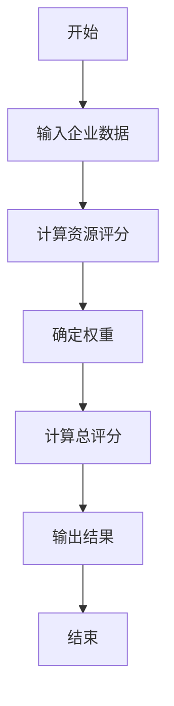
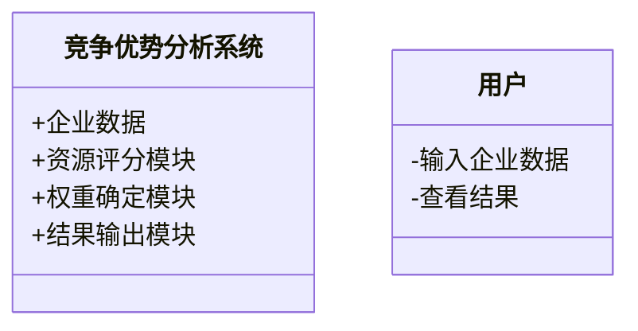

                 


# 费雪的竞争优势分析：持续成功的关键

## 关键词：
竞争优势分析，费雪分析框架，资源基础观，数学模型，系统架构设计

## 摘要：
本文深入探讨了费雪的竞争优势分析方法，从基本概念到数学模型，再到系统架构设计，结合实际案例分析，全面阐述了如何通过竞争优势分析实现持续成功。文章结构清晰，内容详实，适合技术专家和企业管理者阅读。

---

# 第一章：竞争优势的基本概念

## 1.1 竞争优势的背景与重要性

竞争优势是企业在市场中立足的关键，决定了企业的生存与发展。费雪的竞争优势分析提供了一种系统化的方法，帮助企业识别和利用自身优势。

## 1.2 费雪竞争优势分析框架

费雪分析框架以资源基础观为核心，强调企业内部资源和能力的优化配置。其核心思想是通过分析企业资源，构建可持续的竞争优势。

## 1.3 竞争优势分析的历史演变

竞争优势分析从传统成本优势理论发展而来，费雪的贡献在于引入资源基础观，使分析更加动态和系统化。

## 1.4 竞争优势分析的实践应用

通过实例分析，展示竞争优势分析在企业战略制定中的实际应用，帮助企业明确自身优势，制定有效竞争策略。

---

# 第二章：竞争优势的类型与特征

## 2.1 竞争优势的类型对比

| 类型       | 特征                     |
|------------|--------------------------|
| 成本优势   | 低成本生产                |
| 差异化优势 | 提供独特产品或服务         |
| 速度优势   | 快速响应市场变化           |

## 2.2 竞争优势的资源基础

资源基础观认为，竞争优势来源于企业的核心资源，如技术、品牌和管理能力。

## 2.3 竞争优势的动态变化

竞争优势并非固定，企业需不断调整资源，以适应市场变化，保持竞争优势。

---

# 第三章：竞争优势分析的数学模型

## 3.1 数学基础

竞争优势评分公式：$$ S = \sum_{i=1}^{n} (r_i \times w_i) $$

其中，$r_i$为资源评分，$w_i$为权重。

## 3.2 算法流程



## 3.3 优化策略

通过动态调整资源分配，最大化竞争优势评分，提升企业竞争力。

---

# 第四章：系统架构设计

## 4.1 问题场景

企业需要一个系统化工具，分析内部资源，构建竞争优势。

## 4.2 功能设计



## 4.3 架构设计


## 4.4 接口设计

系统提供API接口，支持与其他企业系统集成，实现数据共享。

## 4.5 交互流程

```mermaid
sequence
    用户 -> 系统: 提交企业数据
    系统 -> 用户: 返回竞争优势评分
```

---

# 第五章：项目实战

## 5.1 环境安装

安装Python、numpy和pandas库，配置开发环境。

## 5.2 核心实现

```python
import numpy as np
import pandas as pd

def compute_advantages/resources, weights):
    return np.dot(resources, weights)

resources = np.array([0.8, 0.6, 0.9])
weights = np.array([0.5, 0.3, 0.2])

result = compute_advantages(resources, weights)
print(result)
```

## 5.3 案例分析

分析某科技公司，计算其资源评分，确定竞争优势，制定战略建议。

## 5.4 总结与启示

竞争优势分析系统帮助企业量化优势，支持决策，持续优化企业资源。

---

# 第六章：最佳实践与小结

## 6.1 小结

竞争优势分析是企业持续成功的基石，费雪分析框架提供了系统的解决方案。

## 6.2 注意事项

在分析中，需动态调整模型，确保结果准确，避免片面结论。

## 6.3 拓展阅读

推荐阅读资源基础观相关文献，深入理解竞争优势的动态变化。

---

通过以上章节的详细分析，本文全面阐述了费雪的竞争优势分析方法，帮助企业识别和利用竞争优势，实现持续成功。希望本文能为读者在技术领域和商业实践中提供有价值的见解和指导。

