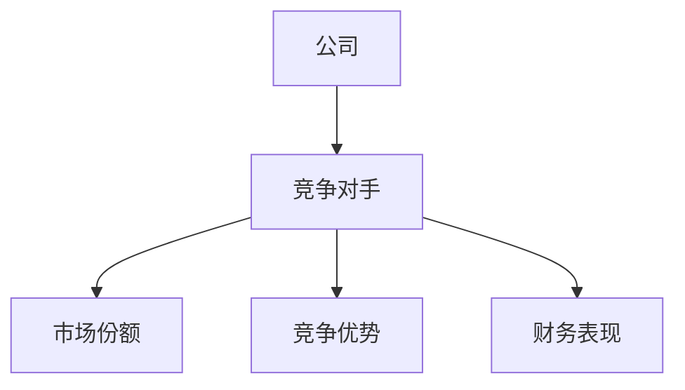
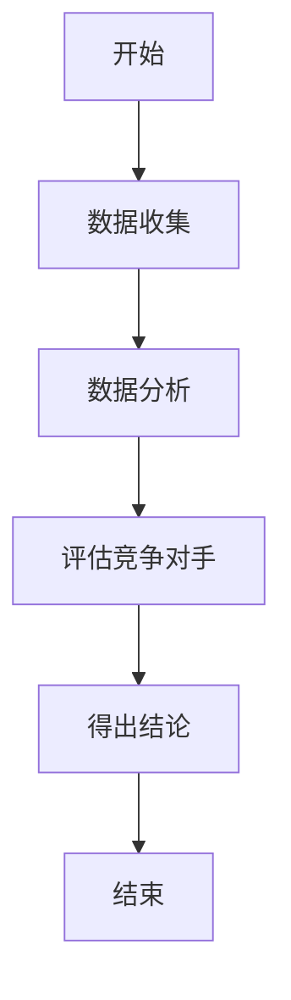
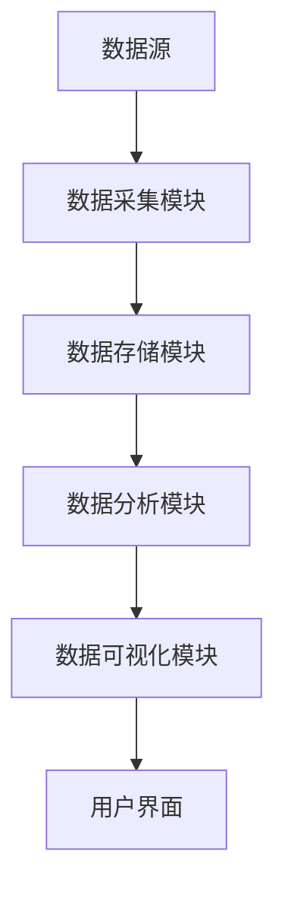

                 


# 费雪的竞争对手分析方法

## 关键词：竞争对手分析、费雪分析法、竞争优势、市场份额、投资策略

## 摘要：  
费雪的竞争对手分析方法是一种基于竞争优势分析的投资策略，通过深入分析竞争对手的市场地位、财务表现和竞争优势，帮助投资者识别具有长期增长潜力的企业。本文将详细阐述费雪分析法的核心原理、算法流程、系统架构和实战应用，帮助读者掌握这一经典的投资分析方法。

---

## 第一章：竞争对手分析的背景与基础

### 1.1 竞争对手分析的定义与重要性

#### 1.1.1 竞争对手分析的定义  
竞争对手分析是指通过对行业内主要竞争对手的市场地位、财务表现、竞争优势和战略方向等关键因素的分析，评估企业在行业中的竞争力和潜在的成长空间。  

#### 1.1.2 竞争对手分析的重要性  
- **投资决策支持**：通过分析竞争对手，投资者可以识别行业内的龙头企业，避免投资于竞争力较弱的企业。  
- **竞争优势识别**：竞争对手分析帮助投资者找到具有独特竞争优势的企业，这些企业通常能够长期保持较高的市场份额和盈利能力。  
- **风险控制**：通过分析竞争对手的财务状况和战略动向，投资者可以更好地评估投资风险。  

#### 1.1.3 费雪分析法的特点  
费雪分析法是一种专注于成长股投资的方法，强调通过分析竞争对手的市场地位和竞争优势，识别出具有长期增长潜力的企业。与传统的估值分析不同，费雪分析法更关注企业的成长性和竞争优势。  

---

### 1.2 竞争对手分析的核心要素

#### 1.2.1 市场地位与市场份额  
- 市场地位：企业在行业内的影响力和话语权。  
- 市场份额：企业在行业内的销售占比，反映企业的市场竞争力。  

#### 1.2.2 竞争优势与核心竞争力  
- 竞争优势：企业在产品、技术、成本或品牌等方面的优势。  
- 核心竞争力：企业在行业中的独特价值主张，使其能够在竞争中脱颖而出。  

#### 1.2.3 财务表现与盈利能力  
- 财务表现：企业的收入、利润和现金流等财务指标。  
- 盈利能力：企业的净利润率、ROE（净资产收益率）和ROA（资产净利率）等指标，反映企业的盈利能力。  

---

## 第二章：费雪分析法的核心概念与联系

### 2.1 费雪分析法的原理

#### 2.1.1 费雪分析法的核心假设  
费雪分析法基于以下假设：  
1. 企业的竞争优势是其长期盈利能力的决定性因素。  
2. 具有竞争优势的企业能够在行业中保持较高的市场份额和盈利能力。  
3. 投资者应关注企业的竞争优势，而非短期的市场波动。  

#### 2.1.2 费雪分析法的逻辑框架  
1. **识别行业内的龙头企业**：选择具有强大市场地位和竞争优势的企业。  
2. **分析竞争对手的财务表现**：通过财务指标（如ROE、ROA）评估企业的盈利能力。  
3. **评估竞争对手的竞争优势**：分析企业在产品、技术或品牌方面的独特优势。  
4. **长期跟踪与动态调整**：定期评估竞争对手的动态，调整投资策略。  

---

### 2.2 费雪分析法的属性特征对比

#### 2.2.1 费雪分析法与其他竞争对手分析方法的对比  

| **对比维度** | **费雪分析法** | **传统财务分析法** | **SWOT分析法** |
|--------------|----------------|---------------------|----------------|
| **核心关注点** | 竞争优势与长期成长性 | 财务指标与估值 | 优势与劣势分析 |
| **适用场景** | 投资决策 | 企业财务健康评估 | 战略规划与决策 |
| **分析深度** | 深入分析竞争对手的长期潜力 | 侧重财务数据 | 综合分析内外部因素 |

---

### 2.3 费雪分析法的ER实体关系图  



---

## 第三章：费雪分析法的算法原理与数学模型

### 3.1 费雪分析法的算法流程

#### 3.1.1 算法流程图  



#### 3.1.2 算法实现步骤  
1. **数据收集**：收集竞争对手的财务数据、市场份额和竞争优势信息。  
2. **数据分析**：计算关键财务指标（如ROE、ROA），评估企业的盈利能力。  
3. **评估竞争对手**：分析竞争对手的竞争优势和市场地位，识别具有长期增长潜力的企业。  

#### 3.1.3 竞争对手分析的Python实现  

```python
import pandas as pd

def fisher_analysis(financial_data):
    # 计算ROE（净资产收益率）
    roe = financial_data['净利润'] / financial_data['净资产']
    # 计算ROA（资产净利率）
    roa = financial_data['净利润'] / financial_data['总资产']
    return {'ROE': roe, 'ROA': roa}

# 示例数据
data = {
    '公司': ['A公司', 'B公司', 'C公司'],
    '净利润': [100, 150, 200],
    '净资产': [500, 600, 700],
    '总资产': [1000, 1200, 1400]
}
df = pd.DataFrame(data)

# 调用函数
result = fisher_analysis(df)
print(result)
```

---

### 3.2 竞争对手分析的数学模型

#### 3.2.1 核心财务指标公式  

- **ROE（净资产收益率）**：  
  $$ ROE = \frac{\text{净利润}}{\text{净资产}} $$  

- **ROA（资产净利率）**：  
  $$ ROA = \frac{\text{净利润}}{\text{总资产}} $$  

#### 3.2.2 示例计算  
假设某公司2022年的净利润为200万元，净资产为1000万元，总资产为2000万元。  
- ROE = 200 / 1000 = 0.2（即20%）  
- ROA = 200 / 2000 = 0.1（即10%）  

---

## 第四章：系统分析与架构设计方案

### 4.1 问题场景介绍

#### 4.1.1 项目介绍  
本项目旨在构建一个基于费雪分析法的竞争对手分析系统，帮助投资者快速评估竞争对手的市场地位和竞争优势。  

#### 4.1.2 系统功能设计  
- **数据采集模块**：收集竞争对手的财务数据和市场信息。  
- **数据分析模块**：计算关键财务指标并评估竞争优势。  
- **可视化模块**：生成竞争对手分析报告和可视化图表。  

### 4.2 系统架构设计

#### 4.2.1 系统架构图  



---

## 第五章：项目实战

### 5.1 竞争对手分析系统实现

#### 5.1.1 环境安装  
- 安装Python和相关库（如Pandas、Matplotlib）。  

#### 5.1.2 核心代码实现  

```python
import pandas as pd
import matplotlib.pyplot as plt

def analyze_competitors(data):
    # 计算ROE和ROA
    roe = data['净利润'] / data['净资产']
    roa = data['净利润'] / data['总资产']
    
    # 可视化ROE和ROA
    plt.figure(figsize=(10, 6))
    plt.plot(data['公司'], roe, 'b-', label='ROE')
    plt.plot(data['公司'], roa, 'r-', label='ROA')
    plt.title('竞争对手分析')
    plt.xlabel('公司')
    plt.ylabel('比率')
    plt.legend()
    plt.show()

# 示例数据
data = {
    '公司': ['A公司', 'B公司', 'C公司'],
    '净利润': [100, 150, 200],
    '净资产': [500, 600, 700],
    '总资产': [1000, 1200, 1400]
}
df = pd.DataFrame(data)

# 调用函数
analyze_competitors(df)
```

---

## 第六章：最佳实践与总结

### 6.1 最佳实践

#### 6.1.1 投资建议  
- **长期跟踪**：定期评估竞争对手的动态，及时调整投资策略。  
- **关注竞争优势**：选择具有独特竞争优势的企业进行投资。  

#### 6.1.2 注意事项  
- 竞争对手分析仅作为投资决策的参考，需结合其他分析方法综合判断。  

---

## 总结  

费雪的竞争对手分析方法是一种基于竞争优势的投资策略，通过深入分析竞争对手的市场地位和财务表现，识别出具有长期增长潜力的企业。本文从理论到实践，详细阐述了费雪分析法的核心原理、算法流程和系统架构，并通过实战案例帮助读者掌握这一经典的投资分析方法。希望本文能为投资者提供有价值的参考，帮助他们在竞争激烈的市场中找到具有长期增长潜力的企业。

