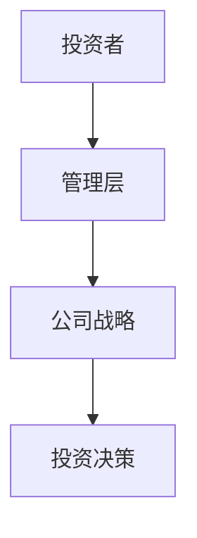
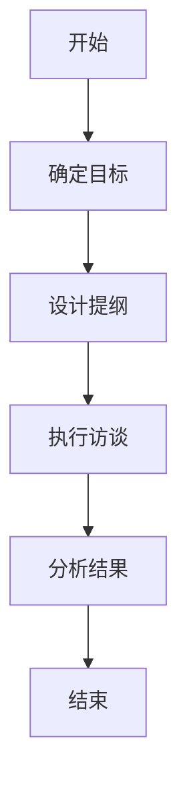
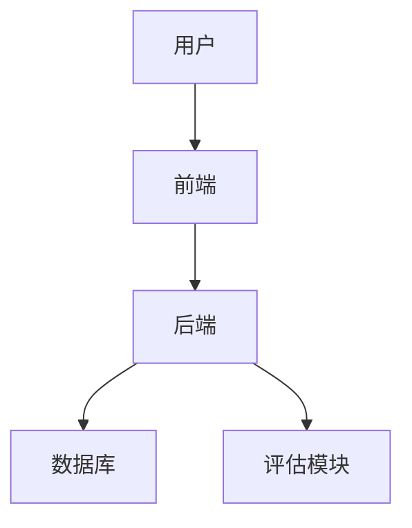

                 


# 费雪的管理层访谈技巧

## 关键词：管理层访谈，费雪，投资决策，信息收集，评估模型

## 摘要：本文深入探讨了费雪的管理层访谈技巧，分析其核心原理、应用场景，并结合实际案例，详细讲解如何设计访谈流程、评估访谈结果，以及构建支持性系统架构，为有效投资决策提供理论和实践指导。

---

## 第1章: 费雪的管理层访谈法概述

### 1.1 访谈的定义与特点
管理层访谈是一种通过与公司高层直接交流，获取关键信息的技巧。其特点是直接性、深度性和互动性。

### 1.2 费雪访谈法的背景与价值
费雪访谈法由投资专家杰里米·费雪提出，旨在通过与管理层的对话，评估公司价值和投资潜力。

### 1.3 访谈的核心要素
包括访谈目标、场景设置、提问策略和非语言沟通。

---

## 第2章: 核心概念与联系

### 2.1 费雪访谈法的核心原理
信息对称性分析，通过提问和倾听，识别管理层的真实动机和公司潜在问题。

### 2.2 关键概念对比表
| 访谈对象 | 投资者 | 管理层 |
|----------|--------|--------|
| 目标     | 评估公司 | 沟通战略 |

### 2.3 实体关系图


---

## 第3章: 费雪访谈法的算法原理

### 3.1 访谈流程的算法模型


### 3.2 评估模型的Python代码
```python
def assess_company(value, growth, risk):
    score = (value * 0.4) + (growth * 0.3) + (risk * 0.3)
    return "高" if score > 0.7 else "中" if score > 0.4 else "低"
```

### 3.3 数学模型
评估公式：
$$
\text{公司价值} = \text{净利润} \times (1 + \text{增长率})^n
$$

---

## 第4章: 系统分析与架构设计

### 4.1 系统功能设计
- 用户界面：设计访谈提纲和记录结果。
- 数据存储：存储访谈记录和评估结果。
- 评估模块：计算公司价值。

### 4.2 系统架构图


### 4.3 接口设计
- 前端接口：接收用户输入。
- 后端接口：处理数据并返回结果。

---

## 第5章: 项目实战

### 5.1 模拟访谈案例
设计一个访谈提纲，涵盖公司战略、财务状况和竞争优势。

### 5.2 访谈记录与分析
记录管理层的回答，并分析其对投资决策的影响。

### 5.3 系统实现
使用Python编写评估模块，展示如何应用费雪方法进行分析。

---

## 第6章: 最佳实践

### 6.1 小结
费雪的管理层访谈法通过系统化的流程和评估模型，帮助投资者做出明智决策。

### 6.2 注意事项
- 准备充分，避免遗漏关键问题。
- 保持中立，避免引导性提问。

### 6.3 拓展阅读
推荐相关书籍和文献，进一步深入学习。

---

## 总结
本文详细介绍了费雪的管理层访谈技巧，从核心概念到系统设计，再到实际应用，为投资者提供了全面的指导。通过本文的学习，读者能够掌握如何有效进行管理层访谈，提升投资决策的质量。

