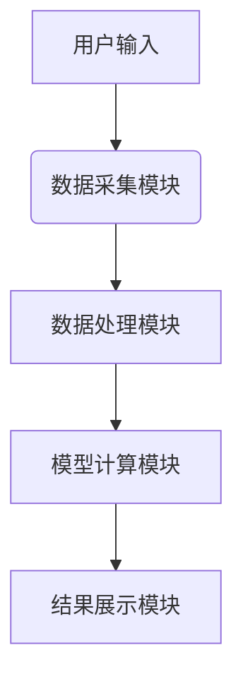
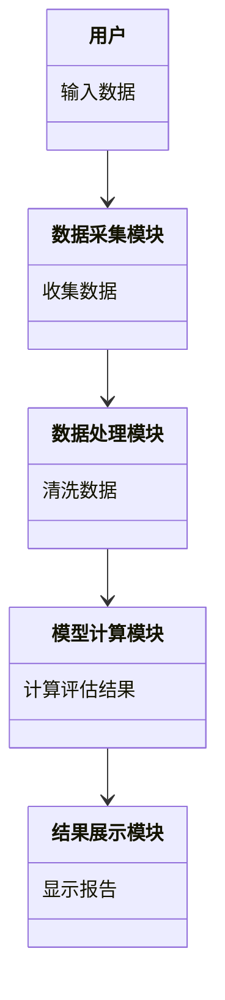
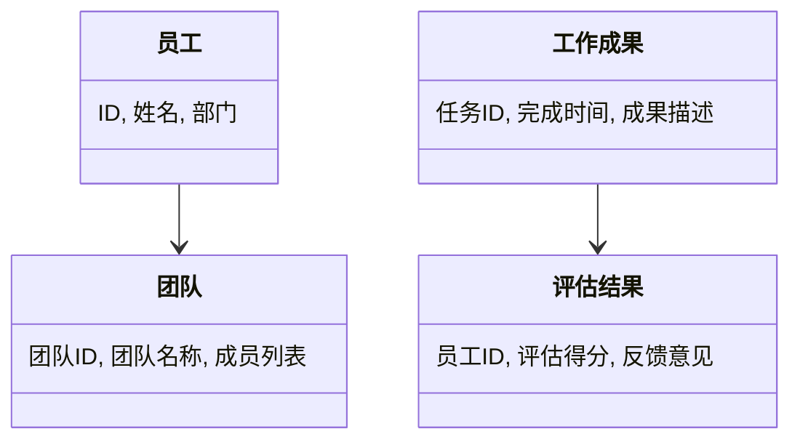
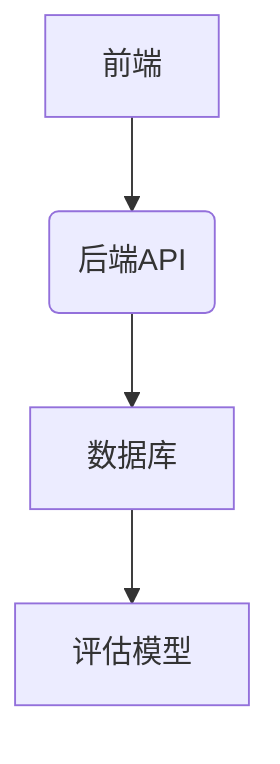
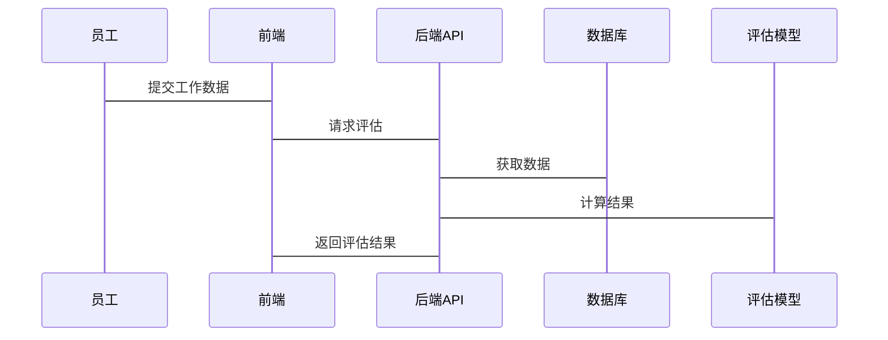

                 


# 费雪的管理层评估：远程办公时代的新挑战

> 关键词：费雪管理层评估、远程办公、管理挑战、评估模型、技术实现、系统架构

> 摘要：本文探讨了在远程办公时代，费雪的管理层评估方法面临的新挑战。通过分析远程办公环境的特点，结合费雪评估模型的理论基础，提出了适应远程办公的评估方法和系统实现方案。文章详细讲解了模型的数学原理、系统架构设计以及项目实战案例，为管理层在远程环境下优化评估流程提供了参考。

---

# 第一部分: 费雪的管理层评估背景与核心概念

## # 第1章: 远程办公时代的管理挑战

### ## 1.1 远程办公的兴起与发展

#### ### 1.1.1 远程办公的历史演变
远程办公的概念可以追溯到20世纪90年代，随着互联网技术的发展，远程办公逐渐从辅助工具变为主流工作模式。特别是在COVID-19疫情之后，远程办公成为许多企业的常态。这种转变对企业管理提出了新的要求，传统的面对面管理方式已难以适应远程环境下的团队协作。

#### ### 1.1.2 远程办公的现状与趋势
根据统计，全球超过50%的企业在疫情后采用了远程办公模式。这种模式不仅改变了工作方式，还影响了企业的组织结构和管理模式。远程办公的普及使得管理层需要更加关注员工的绩效评估、团队协作和心理健康。

#### ### 1.1.3 远程办公对企业管理的影响
远程办公环境下，企业管理面临诸多挑战，包括如何有效评估员工绩效、如何保持团队凝聚力以及如何确保信息的及时传递。传统的面对面管理方式难以直接应用，需要引入新的管理工具和方法。

---

### ## 1.2 费雪的管理层评估理论概述

#### ### 1.2.1 费雪评估理论的起源
费雪评估理论是由著名管理学家费雪提出的，旨在通过科学的方法评估管理层的绩效。该理论强调数据驱动的评估方法，注重员工的工作成果和团队协作能力。

#### ### 1.2.2 费雪评估理论的核心思想
费雪评估理论的核心思想是：通过收集和分析员工的工作数据，评估其绩效表现，并根据评估结果进行反馈和改进。这种评估方法注重量化指标，能够为管理层提供客观的评估依据。

#### ### 1.2.3 费雪评估理论在现代管理中的应用
在现代管理中，费雪评估理论被广泛应用于企业绩效管理、团队协作评估等领域。特别是在远程办公环境下，费雪评估模型可以帮助企业有效评估员工的远程工作表现。

---

## # 第2章: 管理层评估的核心概念与框架

### ## 2.1 管理层评估的基本原理

#### ### 2.1.1 管理层评估的定义与目的
管理层评估是指通过一定的方法和工具，对管理层的工作表现进行评估的过程。其目的是为了优化管理效率，提升团队绩效，同时为管理层提供反馈和改进的方向。

#### ### 2.1.2 管理层评估的关键维度
在费雪评估模型中，管理层评估的关键维度包括工作成果、团队协作能力、决策能力和创新意识。这些维度能够全面反映管理层的工作表现。

#### ### 2.1.3 管理层评估的实施步骤
费雪评估模型的实施步骤包括：数据收集、数据分析、评估结果输出和反馈改进。每个步骤都需要结合企业的实际情况进行调整。

---

### ## 2.2 费雪评估模型的结构与特点

#### ### 2.2.1 费雪评估模型的构成要素
费雪评估模型由数据输入、模型计算、结果输出三个部分组成。数据输入包括员工的工作数据和团队协作数据；模型计算基于费雪评估公式；结果输出包括员工的评估结果和改进建议。

#### ### 2.2.2 费雪评估模型的数学表达式
费雪评估模型的数学公式为：
$$
E = a \times P + b \times Q + c \times R
$$
其中，E为评估结果，P为工作成果，Q为团队协作能力，R为创新意识，a、b、c为权重系数。

#### ### 2.2.3 费雪评估模型的优缺点
费雪评估模型的优点是能够量化评估结果，具有较高的客观性。缺点是需要大量数据支持，实施成本较高。

---

### ## 2.3 远程办公时代评估的特殊性

#### ### 2.3.1 远程环境下评估的主要挑战
远程环境下，数据收集的难度增加，员工的工作成果难以量化，团队协作的评估也更加复杂。

#### ### 2.3.2 远程环境下评估的关键因素
在远程环境下，评估的关键因素包括员工的自律性、工作成果的可视化和团队协作的数字化。

#### ### 2.3.3 远程环境下评估的创新方法
为了适应远程办公环境，可以引入自动化评估工具，利用大数据分析技术进行实时评估，同时加强员工的自我评估能力。

---

# 第二部分: 费雪评估模型的算法原理与实现

## # 第3章: 费雪评估模型的数学基础

### ## 3.1 费雪评估模型的数学公式

#### ### 3.1.1 基本公式推导
费雪评估公式基于线性回归模型，通过数据拟合得到各个维度的权重系数。

#### ### 3.1.2 公式参数的定义与解释
- P：工作成果，权重系数为a
- Q：团队协作能力，权重系数为b
- R：创新意识，权重系数为c

#### ### 3.1.3 公式的应用场景
费雪评估公式适用于团队规模较小、数据量适中的企业。

---

### ## 3.2 费雪评估模型的算法流程

#### ### 3.2.1 算法输入与输出
- 输入：员工的工作数据和团队协作数据
- 输出：员工的评估结果和改进建议

#### ### 3.2.2 算法步骤分解
1. 数据预处理：清洗数据，去除异常值
2. 数据建模：构建线性回归模型
3. 模型训练：通过数据拟合得到权重系数
4. 结果输出：计算评估结果并生成报告

#### ### 3.2.3 算法复杂度分析
费雪评估模型的复杂度较低，适用于中小规模数据集。

---

## # 第4章: 费雪评估模型的系统实现

### ## 4.1 系统架构设计

#### ### 4.1.1 系统功能模块划分
- 数据采集模块：收集员工的工作数据和团队协作数据
- 数据处理模块：清洗和预处理数据
- 模型计算模块：运行费雪评估公式
- 结果展示模块：生成评估报告

#### ### 4.1.2 系统数据流图


#### ### 4.1.3 系统组件之间的交互关系


---

### ## 4.2 算法实现与代码解读

#### ### 4.2.1 算法实现的Python代码
```python
import numpy as np
from sklearn.linear_model import LinearRegression

# 示例数据
X = np.array([[1, 2, 3], [4, 5, 6], [7, 8, 9]])
y = np.array([10, 11, 12])

# 训练模型
model = LinearRegression()
model.fit(X, y)

# 获取权重系数
a = model.coef_[0]
b = model.coef_[1]
c = model.coef_[2]

print(f"权重系数 a = {a}, b = {b}, c = {c}")
```

#### ### 4.2.2 代码的运行环境与依赖
- Python 3.8+
- NumPy
- scikit-learn

#### ### 4.2.3 代码的功能模块解析
- 数据预处理：使用NumPy对数据进行清洗
- 模型训练：使用scikit-learn的线性回归模型
- 结果输出：打印权重系数

---

### ## 4.3 系统测试与验证

#### ### 4.3.1 测试用例的设计
- 正常情况测试：输入正常数据，验证评估结果
- 异常情况测试：输入无效数据，验证系统的容错能力

#### ### 4.3.2 测试结果分析
通过测试用例验证模型的准确性和稳定性，确保系统在不同场景下的表现符合预期。

---

# 第三部分: 系统分析与架构设计方案

## # 第5章: 系统分析与架构设计

### ## 5.1 问题场景介绍

#### ### 5.1.1 问题背景
远程办公环境下，团队协作和员工绩效评估变得更加复杂，传统的管理方法难以适应新的工作模式。

#### ### 5.1.2 问题描述
企业在远程办公中面临以下挑战：
- 员工的工作成果难以量化
- 团队协作的效率难以评估
- 管理层的反馈机制不完善

---

### ## 5.2 项目介绍

#### ### 5.2.1 项目目标
构建一个基于费雪评估模型的远程办公管理平台，实现员工绩效的自动评估和团队协作的实时监控。

#### ### 5.2.2 项目范围
- 系统功能：员工绩效评估、团队协作监控、评估报告生成
- 用户角色：企业管理者、团队 leader、普通员工

---

### ## 5.3 系统功能设计

#### ### 5.3.1 领域模型设计


#### ### 5.3.2 系统架构设计


#### ### 5.3.3 系统接口设计
- 前端接口：员工提交数据，获取评估结果
- 后端接口：接收数据，调用评估模型，返回结果

#### ### 5.3.4 系统交互流程


---

## # 第6章: 项目实战

### ## 6.1 环境安装与配置

#### ### 6.1.1 安装Python环境
- 下载并安装Python 3.8+
- 安装必要的库：pip install numpy scikit-learn

#### ### 6.1.2 安装数据库
- 使用MySQL或MongoDB存储数据

---

### ## 6.2 系统核心实现

#### ### 6.2.1 核心代码实现
```python
import numpy as np
from sklearn.linear_model import LinearRegression

# 数据预处理
def preprocess_data(data):
    # 假设数据格式为 DataFrame
    data.dropna(inplace=True)
    return data

# 模型训练
def train_model(X, y):
    model = LinearRegression()
    model.fit(X, y)
    return model

# 评估结果生成
def generate_report(model, X_test, y_test):
    predictions = model.predict(X_test)
    report = {}
    for i in range(len(X_test)):
        report[i] = {
            '预测值': predictions[i],
            '实际值': y_test[i]
        }
    return report
```

#### ### 6.2.2 代码应用解读
- 数据预处理：去除缺失值，确保数据完整性
- 模型训练：使用线性回归模型，训练费雪评估公式
- 评估结果生成：对比预测值和实际值，生成评估报告

---

### ## 6.3 实际案例分析

#### ### 6.3.1 案例背景
某科技公司采用远程办公模式，希望优化员工绩效评估流程。

#### ### 6.3.2 数据收集
收集员工的工作数据，包括任务完成时间、团队协作评分等。

#### ### 6.3.3 数据分析
使用费雪评估模型进行数据分析，计算每个员工的评估得分。

#### ### 6.3.4 结果解读
根据评估结果，识别表现优异的员工和需要改进的员工，制定相应的管理策略。

---

## # 第7章: 小结与最佳实践

### ## 7.1 小结

#### ### 7.1.1 项目总结
通过本项目，我们实现了基于费雪评估模型的远程办公管理平台，验证了模型在实际应用中的有效性。

#### ### 7.1.2 经验总结
- 数据预处理是关键，确保数据质量
- 模型调参可以进一步优化评估结果
- 系统设计要充分考虑用户体验

---

### ## 7.2 注意事项

#### ### 7.2.1 数据安全
确保员工数据的安全性，防止数据泄露。

#### ### 7.2.2 系统稳定性
优化系统架构，确保在高并发情况下的稳定性。

#### ### 7.2.3 人员培训
对管理层进行培训，确保他们能够正确使用评估结果。

---

### ## 7.3 拓展阅读

#### ### 7.3.1 相关书籍
- 《远程办公：重新定义成功的未来工作方式》
- 《数据驱动的管理决策：理论与实践》

#### ### 7.3.2 在线资源
- 费雪评估模型的官方文档
- 远程办公管理平台的开源项目

---

通过本文的详细讲解，我们希望能够为读者提供一个全面的视角，了解费雪管理层评估在远程办公环境下的应用，并为企业的管理实践提供有益的参考。

