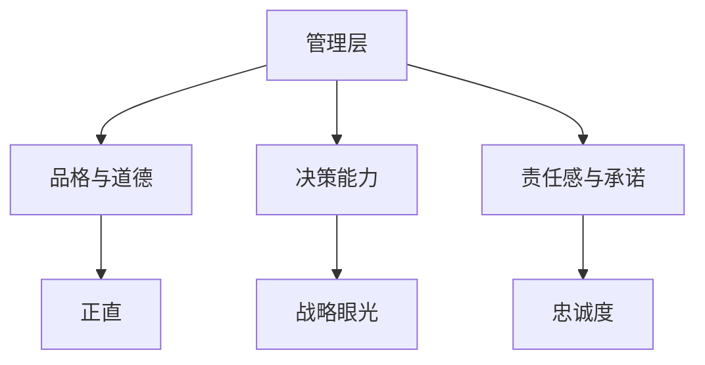
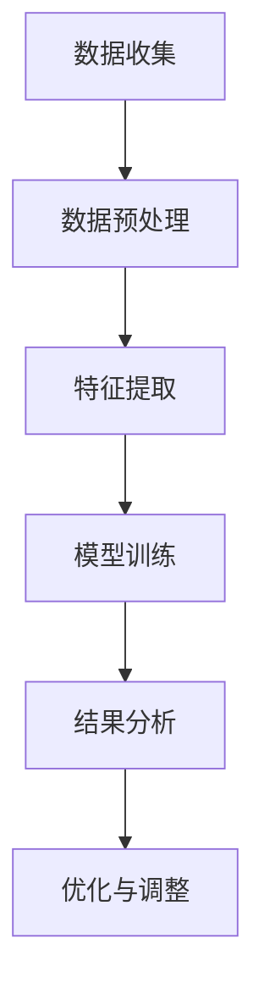
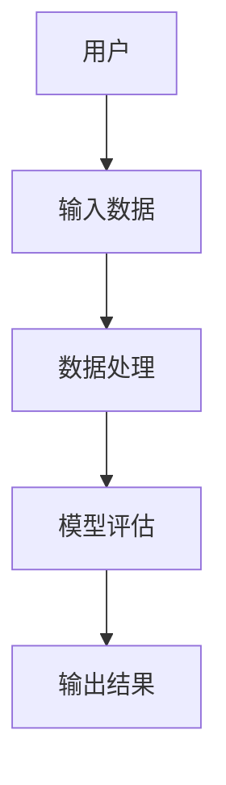

                 


# 费雪的管理层诚信评估

## 关键词：
- 费雪
- 管理层诚信评估
- 投资决策
- 数学模型
- 算法设计
- 企业价值

## 摘要：
本文深入探讨了费雪提出的管理层诚信评估方法，分析其在投资决策中的重要性。通过详细讲解评估的核心概念、算法原理、系统架构以及实际案例，展示了如何将管理层诚信评估应用于实际投资分析中，为投资者提供了科学的决策依据。

---

# 第一部分: 费雪的管理层诚信评估背景与概述

## 第1章: 费雪与管理层诚信评估概述

### 1.1 费雪的生平与投资理念
#### 1.1.1 费雪的生平简介
菲利普·费雪（Philip Fisher）是20世纪著名的投资专家，被誉为“成长型投资之父”。他于1907年出生于美国纽约，毕业于哈佛大学，1930年代开始投资生涯，因其卓越的投资业绩和深入的企业研究闻名。费雪的投资理念强调长期成长，注重企业的内在价值和管理层的质量。

#### 1.1.2 费雪的投资哲学与方法
费雪的投资哲学核心在于寻找那些具有强大竞争优势、良好管理团队和持续增长潜力的企业。他认为，投资成功与否，很大程度上取决于企业管理层的诚信和能力。他提出，投资者应该深入研究企业的基本面，尤其是管理层的决策能力和道德水平。

#### 1.1.3 费雪与管理层诚信的关系
费雪认为，管理层的诚信是企业成功的关键因素之一。他通过长期观察发现，具有高尚道德和责任感的管理层能够带领企业实现持续增长，而缺乏诚信的管理层往往会导致企业价值的流失。

---

## 第2章: 管理层诚信评估的重要性

### 2.1 诚信在企业投资中的作用
管理层的诚信直接影响企业的决策质量和执行效果。诚信的管理层能够做出符合企业长远利益的决策，而缺乏诚信的管理层可能会为了短期利益损害企业价值。

### 2.2 管理层诚信与企业价值的关系
企业的价值不仅仅取决于财务数据，还取决于管理层的道德水平和决策能力。诚信的管理层能够有效提升企业价值，而道德败坏的管理层可能导致企业价值下降甚至消失。

### 2.3 诚信评估在投资决策中的意义
在投资决策中，对管理层诚信的评估能够帮助投资者筛选出那些具有长期增长潜力的企业。通过评估管理层的诚信，投资者可以更准确地预测企业的未来表现，从而做出更明智的投资决策。

---

# 第二部分: 管理层诚信评估的核心概念与联系

## 第3章: 管理层诚信评估的核心维度

### 3.1 管理层诚信的评估维度
#### 3.1.1 管理层的品格与道德
品格与道德是管理层诚信的核心要素。包括正直、诚实、责任感等。这些品质决定了管理层在面对挑战时是否能够坚持正确的行为准则。

#### 3.1.2 管理层的决策能力
决策能力是管理层诚信的重要表现。包括战略眼光、决策效率和风险控制能力。具备优秀决策能力的管理层能够带领企业在复杂环境中实现可持续发展。

#### 3.1.3 管理层的责任感与承诺
责任感与承诺体现了管理层对企业和股东的忠诚度。包括对企业价值的保护、对股东利益的维护以及对员工和社会的责任感。

---

### 3.2 核心概念的属性特征对比
| 核心概念 | 属性特征 |
|----------|-----------|
| 品格与道德 | 正直、诚实、责任感 |
| 决策能力 | 战略眼光、决策效率、风险控制 |
| 责任感与承诺 | 对企业与股东的忠诚度 |

---

### 3.3 实体关系图（ER图）



---

# 第三部分: 费雪管理层诚信评估的算法与数学模型

## 第4章: 费雪诚信评估算法原理

### 4.1 费雪诚信评估模型概述
#### 4.1.1 模型的输入与输出
- **输入**：企业的财务数据、管理层的公开记录、行业评价等。
- **输出**：管理层诚信评分，分为A、B、C、D、E五个等级。

#### 4.1.2 模型的训练与优化
通过历史数据训练模型，优化算法参数，提高评估的准确性和可靠性。

#### 4.1.3 模型的适用场景与限制
适用于成长型企业，尤其适合那些依赖管理层决策能力的企业。

---

### 4.2 算法步骤

#### 4.2.1 数据收集与预处理
- 收集企业的财务数据、管理层的公开记录、行业评价等。
- 清洗数据，去除异常值和缺失值。

#### 4.2.2 数据特征提取
从数据中提取与管理层诚信相关的特征，如盈利能力、成长能力、偿债能力等。

#### 4.2.3 模型训练与评估
使用训练数据训练模型，评估模型的准确性和稳定性。

#### 4.2.4 结果分析与优化
根据评估结果优化模型，提高评估的准确性和可靠性。

---

### 4.3 算法流程图



---

### 4.4 数学模型与公式

#### 4.4.1 管理层诚信评分公式
$$
\text{诚信评分} = \sum (\text{权重}_i \times \text{评分}_i)
$$

其中，$\text{权重}_i$ 是各评估维度的权重，$\text{评分}_i$ 是各维度的评分。

---

## 第5章: 数学模型的实现与解读

### 5.1 数学模型的实现
通过权重分配和评分计算，得出管理层诚信的最终评分。

### 5.2 数学模型的解读
- **权重分配**：根据各维度的重要性分配权重，如品格与道德占40%，决策能力占30%，责任感与承诺占30%。
- **评分计算**：根据各维度的具体表现，进行评分，并结合权重计算总评分。

---

# 第四部分: 费雪管理层诚信评估的系统架构设计

## 第6章: 系统架构设计

### 6.1 系统功能设计
- **数据收集模块**：收集企业的财务数据、管理层的公开记录等。
- **数据处理模块**：对数据进行清洗和特征提取。
- **模型训练模块**：训练诚信评估模型。
- **结果分析模块**：分析评估结果并优化模型。

### 6.2 系统架构图


---

## 第7章: 系统接口与交互设计

### 7.1 系统接口设计
- **输入接口**：接收企业的财务数据和管理层信息。
- **输出接口**：输出管理层诚信评分和评估报告。

### 7.2 系统交互设计



---

# 第五部分: 费雪管理层诚信评估的项目实战

## 第8章: 项目实战

### 8.1 项目环境安装
- 安装Python、Pandas、Scikit-learn等工具。

### 8.2 核心代码实现

#### 8.2.1 数据收集与预处理
```python
import pandas as pd
data = pd.read_csv('manager_data.csv')
data.dropna(inplace=True)
```

#### 8.2.2 特征提取与模型训练
```python
from sklearn.model_selection import train_test_split
from sklearn.ensemble import RandomForestClassifier

X = data.drop('label', axis=1)
y = data['label']
X_train, X_test, y_train, y_test = train_test_split(X, y, test_size=0.2)
model = RandomForestClassifier()
model.fit(X_train, y_train)
```

#### 8.2.3 模型评估
```python
from sklearn.metrics import accuracy_score

y_pred = model.predict(X_test)
print(accuracy_score(y_test, y_pred))
```

---

## 第9章: 案例分析与结果解读

### 9.1 案例分析
以某企业为例，分析其管理层诚信评分。

### 9.2 结果解读
解释评分结果，提出改进建议。

---

# 第六部分: 费雪管理层诚信评估的最佳实践与总结

## 第10章: 最佳实践与总结

### 10.1 评估的关键点
- 重视管理层的品格与道德。
- 关注管理层的决策能力和责任感。

### 10.2 注意事项
- 数据的准确性和完整性。
- 模型的优化与调整。

### 10.3 未来展望
- 结合人工智能技术，提升评估的准确性和效率。

---

# 结语

通过本文的深入探讨，我们了解了费雪的管理层诚信评估方法，并通过实际案例展示了其在投资决策中的应用。希望本文能够为投资者提供科学的决策依据，帮助他们在复杂的投资环境中做出更明智的选择。

