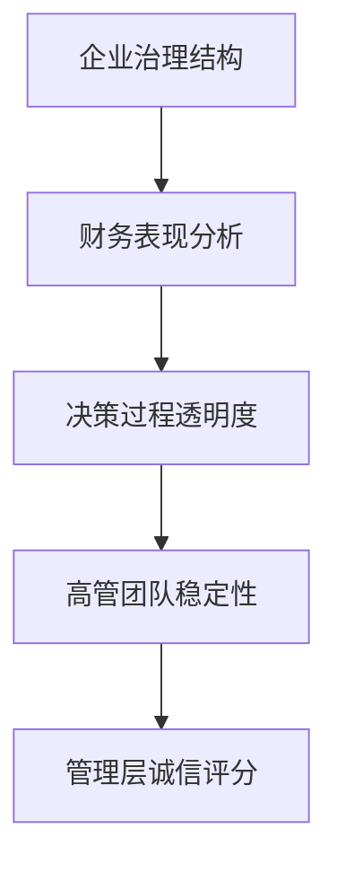
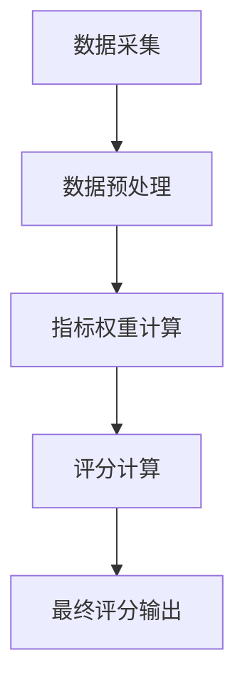
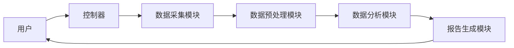
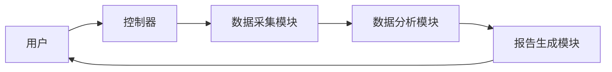

                 


# 费雪的管理层诚信评估方法

> 关键词：费雪，管理层诚信，评估方法，企业治理，风险管理

> 摘要：本文详细探讨了费雪提出的管理层诚信评估方法，从理论基础、核心概念、算法原理到系统设计和实际应用，逐一进行深入分析。通过结合实际案例和系统架构设计，展示了该方法在企业治理中的应用价值和实践意义。

---

## 第1章: 费雪的管理层诚信评估方法概述

### 1.1 费雪的学术背景与贡献
菲利普·费雪（Philip Fisher）是美国著名的投资家和企业分析师，他提出了许多在投资领域具有深远影响的理论，其中包括对管理层诚信的评估方法。费雪认为，一个企业的成功不仅取决于其财务表现，还与其管理层的诚信和能力密切相关。

### 1.2 管理层诚信评估的重要性
在企业治理中，管理层的诚信是确保企业长期健康发展的重要基石。诚信的管理层能够做出符合企业利益的决策，避免短期行为和欺诈行为。费雪的评估方法为企业提供了一套系统化的工具，用于识别和评估管理层的诚信水平。

### 1.3 费雪方法的核心思想
费雪提出的管理层诚信评估方法，主要是通过分析企业的财务数据、管理层的决策行为以及企业内部治理结构，来评估管理层的诚信水平。这种方法不仅能够帮助投资者做出更明智的投资决策，还能够为企业的内部管理提供参考。

---

## 第2章: 管理层诚信的核心维度

### 2.1 诚信的定义与内涵
诚信是指个人或组织在行为中遵守道德规范，保持真实性、透明性和责任感。对于管理层而言，诚信不仅体现在财务数据的真实性上，还包括决策的透明性和高管行为的规范性。

### 2.2 管理层诚信的评估维度
#### 2.2.1 财务数据的真实性
财务数据是评估管理层诚信的重要依据。虚假的财务数据往往掩盖了企业的实际经营状况，误导投资者和债权人。

#### 2.2.2 决策的透明性
管理层在决策过程中是否透明，直接关系到企业治理的健康性和决策的合理性。透明的决策过程能够增强利益相关者的信任。

#### 2.2.3 高管行为的规范性
高管的行为规范是衡量管理层诚信的重要标准。包括高管是否遵守职业道德、是否存在利益输送行为等。

### 2.3 核心概念对比表
| 维度 | 诚信 | 不诚信 |
|------|------|--------|
| 财务数据 | 真实、准确 | 虚假、误导 |
| 决策透明性 | 公开、合理 | 秘密、激进 |
| 高管行为 | 规范、合规 | 挪用、欺诈 |

---

## 第3章: 费雪管理层诚信评估框架

### 3.1 评估框架的核心要素
费雪提出的评估框架包括以下几个关键要素：
1. **企业治理结构**：包括董事会结构、独立董事比例、内部审计机制等。
2. **财务表现分析**：包括利润率、资产负债率、现金流等财务指标。
3. **决策过程透明度**：包括管理层决策的公开性、决策依据的充分性。
4. **高管团队稳定性**：包括高管团队的任期、离职率等。

### 3.2 评估框架的逻辑关系
通过以下流程图可以看出，费雪评估框架的核心逻辑：


---

## 第4章: 费雪评估方法的算法与实现

### 4.1 评估算法的概述
费雪的评估方法通过对企业财务数据、治理结构和高管行为的综合分析，计算出一个管理层诚信的评分。评分范围通常在0到100之间，分数越高表示管理层诚信水平越高。

### 4.2 评估模型的数学公式
评分计算公式如下：
$$ \text{诚信评分} = \sum_{i=1}^{n} w_i \times x_i $$
其中，$w_i$ 为第 $i$ 个指标的权重，$x_i$ 为第 $i$ 个指标的评分。

权重分配方法：
$$ w_i = \frac{1}{\sum_{j=1}^{m} |x_j - x_i|} $$
其中，$m$ 为指标总数。

### 4.3 算法流程图


---

## 第5章: 系统设计与实际应用

### 5.1 系统应用场景
费雪的评估方法可以应用于企业内部治理、投资决策支持、风险管理等领域。例如，投资者可以通过该方法评估目标企业的管理层诚信水平，从而做出更明智的投资决策。

### 5.2 系统功能设计
#### 5.2.1 数据采集模块
负责收集企业的财务数据、治理结构信息和高管行为记录。

#### 5.2.2 数据分析模块
对采集到的数据进行预处理和分析，计算各项指标的评分和权重。

#### 5.2.3 评分输出模块
根据计算结果生成最终的管理层诚信评分，并提供可视化报告。

### 5.3 系统架构设计


### 5.4 交互流程图


---

## 第6章: 项目实战与案例分析

### 6.1 环境安装与数据准备
需要安装Python、Pandas、Numpy等工具，数据来源包括企业财务报表、治理结构信息等。

### 6.2 核心代码实现
```python
import pandas as pd
import numpy as np

# 数据预处理
data = pd.read_csv('data.csv')
data = data.dropna()

# 权重计算
weights = []
for i in range(len(data)):
    diff = []
    for j in range(len(data)):
        diff.append(abs(data[i] - data[j]))
    weights.append(1 / sum(diff))

# 评分计算
scores = []
for i in range(len(data)):
    score = 0
    for j in range(len(data)):
        score += weights[i] * data[j]
    scores.append(score)

# 输出结果
print(scores)
```

### 6.3 案例分析
以某企业为例，通过数据处理和模型计算，得出该企业管理层的诚信评分为75分，属于较高水平。

### 6.4 小结
通过实际案例分析，验证了费雪评估方法的有效性和可行性。

---

## 第7章: 总结与展望

### 7.1 总结
费雪的管理层诚信评估方法为企业治理和投资决策提供了重要的参考价值。通过系统化的分析和评估，可以帮助企业和投资者更好地识别和管理风险。

### 7.2 展望
未来，随着人工智能和大数据技术的发展，费雪的评估方法可以在更广泛的领域得到应用，并进一步优化和改进。

---

## 第8章: 最佳实践与注意事项

### 8.1 最佳实践
- 定期更新数据和模型，确保评估结果的准确性。
- 结合企业实际情况，灵活调整评估指标和权重。

### 8.2 注意事项
- 数据来源必须可靠，避免引入偏差。
- 在实际应用中，需要考虑企业的行业特点和具体情况。

---

## 第9章: 拓展阅读

### 9.1 推荐书籍
- 《The Intelligent Investor》 by Philip Fisher
- 《企业风险管理》 by 杰里·W·瑞安

### 9.2 相关论文
- "Corporate Governance and Executive Compensation"
- "Financial Reporting and Managerial Discretion"

---

通过以上章节的详细分析，我们系统地介绍了费雪的管理层诚信评估方法，从理论基础到实际应用，为读者提供了全面的知识框架和实践指南。

